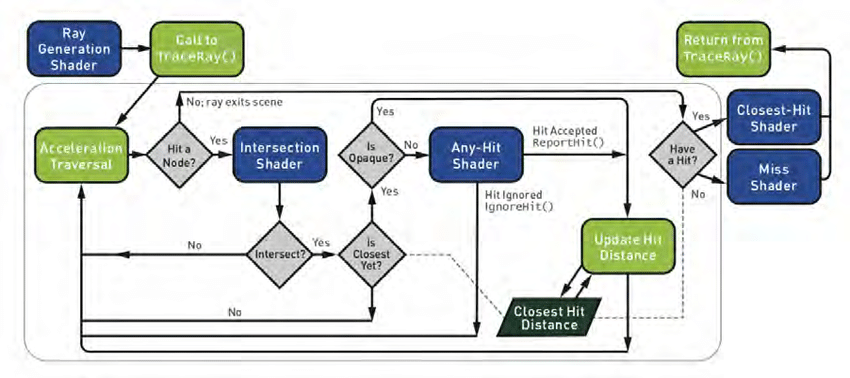
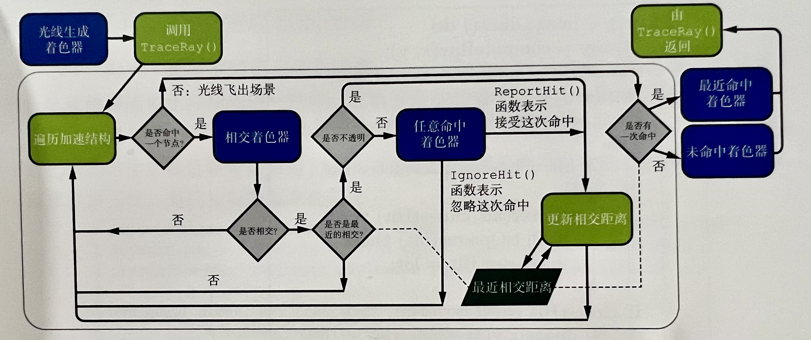

# DirectX_Raytracing

`ref: https://github.com/Apress/ray-tracing-gems.git`

## 介绍：
### GPU编程与API无关但重要的三大要素：
1. GPU设备端代码
2. CPU主机端初始化代码
3. GPU与CPU之间的数据共享
### 环境：
1. CUDA 10.1
2. Visual Studio 2017
3. Windows 10 RS5+ (2018年10月更新)
4. Windows 10 SDK 10.0.17763.0+
5. 支持DX12的GPU 
### DXR光追管线
`ref：https://github.com/acmarrs/IntroToDXR`
#### EN:
 
#### CH:
 
1. 光线生成着色器：  
`启动新的渲染管线，指定启动哪些光线，与ComputeShader类似`
2. 相交着色器  
`计算图元与三角形的相交`
3. 任意命中着色器  
`可选择的命中，或者说丢弃无效的命中`
4. 最近命中着色器  
`光线途中最近的一个交点处执行。通常在交点处计算颜色，类似于光栅化管线中的像素着色器`
5. 未命中着色器
`光线没有命中任何几何体时被执行，允许对天空盒或者动态天光进行采样`