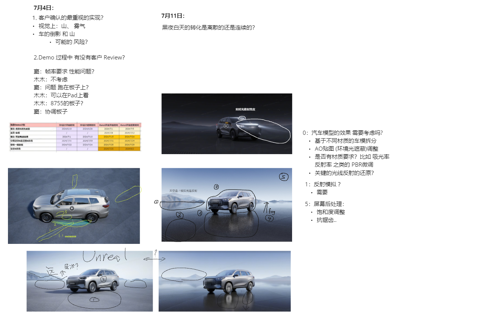
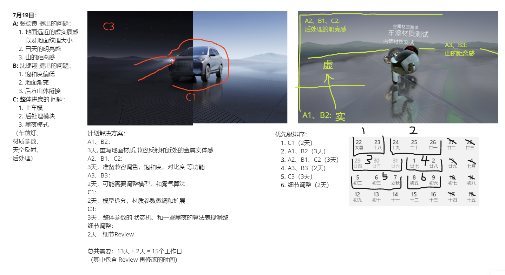

# 奇瑞项目日志

## 项目计划记录


---


## Git提交内容记录
### Commit 格式

```
类型：
      特性（feat） - 这是对项目的新功能添加。
范围：
      （渲染） - 更改与渲染子系统相关。
主题：
      实现初始的颜色分级和调色效果 - 对更改的简明总结。
正文：
      提供了更详细的更改说明，包括关键实现细节和背后的理由。
页脚：
      包含与该提交相关的解决的问题的引用。
```

### 第一次提交 Commit 内容：
```
特性（渲染）：实现初始的车模和背景渲染效果

该提交 架设了车模界面需要的初始渲染管线 
对 PhysicallyBasedClearCoat_Textured.kzmat 着色器进行定制 
分别是 反射、地面、车漆 
定制了两个个后处理 分别是 反射、调色。

主要更改包括：

设计 提出的问题：
1. 地面远近的虚实质感，地面渐变
      - 重写地面材质
      - 兼容反射和近处的金属实体感    
      - 地面纹理大小
2. 白天的明亮感，饱和度偏低，后处理模块缺失
      - 准备兼容调色，
      - 饱和度，
      - 对比度 
      - 和其他后处理功能
3. 山的距离感，后方山体衔接
      - 调整了模型，
      - 优化了雾气算法

解决了：
初始渲染功能风险
```

## 设计合作记录
