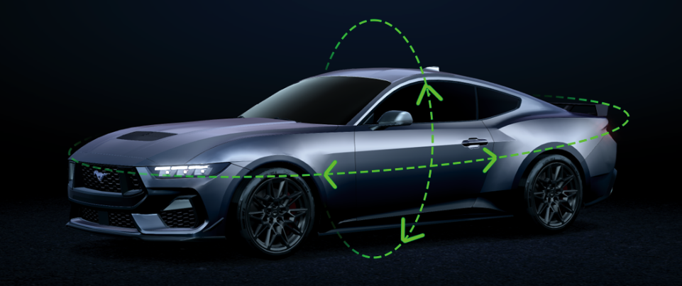
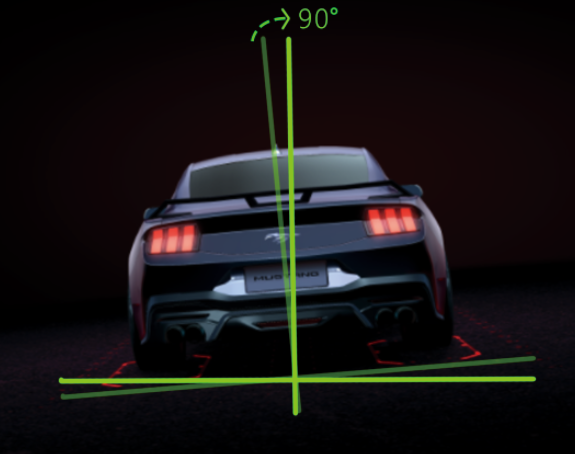
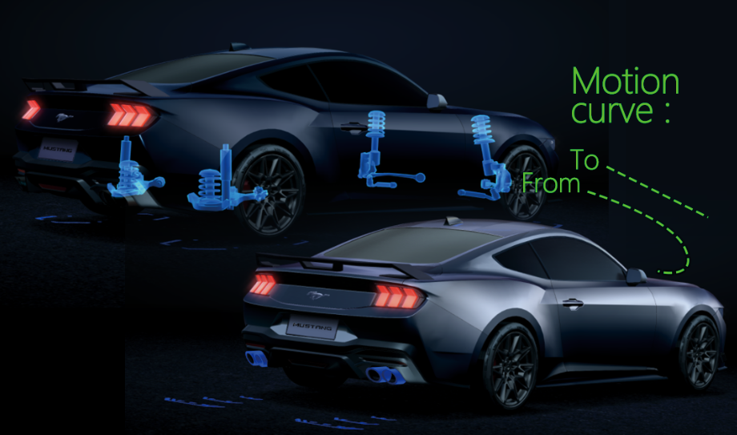
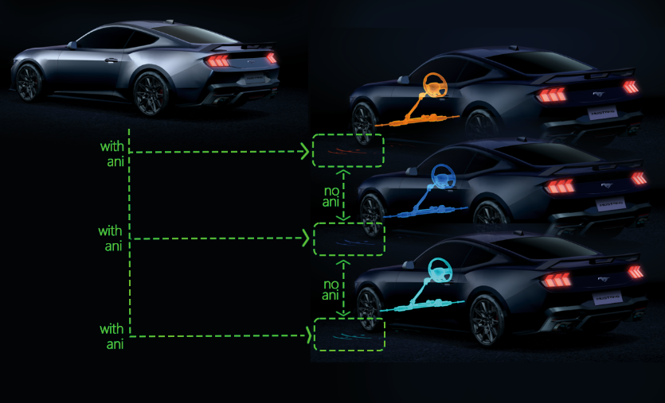

#  相机动画调整：
`Camera adjustment & animation` 
1. 允许相机与头像交互   
`The cameras have been modified to allow for user interaction with the avatar.`  
   - 明确需求 / Clear comments    
`‘头像’交互指得是否如下图所示吗？`  
`Was 'avatar interaction'represent below sketch map?`  

2. 相机需要拉平并且持续，某些角度的倾斜轴旋转起来看起来奇怪  
`The camera needs to be leveled out and consistent on views.Looks odd when rotating around certain angles on tilted axis.`
   - 明确需求 / Clear comments   
`‘倾斜轴’指的是下图所示吗？基础模式(不进入任何模式)的‘倾斜轴’是否满意？`  
`Was 'fix tilted axis' represent below sketch map? Do we satisfy the base mode 'tilted axis'?`  

1. 基础模式到部件彩色高光“车身反射”部分动画需要快50%。  
`The colorized highlight on the Sheetmetal during Base Drive Modes needs to animate on quicker.  It is timed with the ground textures appearing, just needs to be quicker. 50% quicker. `   
   - 明确需求 / Clear comments  
`We clear`
1. 一些过度存在相机抖动，需要修改为平滑过度，特别是从排气模式过渡到悬架模式，从自动模式到牵引模式。     
`Some cameras jolt into place, all transitions need to be smooth. Noticed it transition from exhaust to suspension, auto to traction. `  
   - 明确需求 / Clear comments  
`是否同意使用如下图所示的：运动曲线 和 时间方程？`  
`Do we agree with motion curve which is straight and timing function be like Ease_in_out just as following sketch map?`  
  
  
5. 所有模式相机 2.5秒 后自动复位  
`All cameras need to return to their default state after 2.5 seconds once the user stops rotating.`
   - 明确需求 / Clear comments  
`We clear`
6. 切换某一模式下的属性，地面动画不应当重新加载，重新加载地面动画只出现在基础模式进入某一模式时。(适用于：Steering, Exhaust, Magne Ride, Autostart, Traction)  
`Currently, it appears as when any attribute is toggled the ground texture is animating on. Let's keep this isolated to the Base Drive Modes.  The textures feel like they are turning off and on when they should appear to be switching. (Steering, Exhaust, Magne Ride, Autostart, Traction)`  
   - 明确需求 / Clear comments  
`逻辑是否如下图所示？`  
`for example as the steering module ground animation. Was the following sketch map logic correct?`  

7. 制作 开机进场动画 与 其他面板动画  
`The intro camera animation and transition from cluster themes back to the MyMustang landing screen are very similar. `   
`The difference between the two is the direction in which the transition starts.`   
`Intro animation has a slight turn and movement from the background, the cluster themes has a transition from behind the camera when in cluster themes.`
    - 明确需求 / Clear comments  
`面板切换动画 是否只针对 ClusterTheme 到 MyMustang landing screen？`  
`Does 'panel switching animation' only apply with ClusterTheme to MyMustang landing screen or for any 'panel switching situations'?`
8. 相机运动曲线都采用1.5秒的缓入缓出  
`Animation curve for camera movement. Ease in and Ease Out over 1.5 second.`  
    - 明确需求 / Clear comments  
`We clear`
9. 没有准确的过渡时间，但为防止驾驶员分心所有移动动画持续时间小于2秒。参考视觉参考  
`Currently, How the camera system is implemented, its difficult to give you exact timing on the transitions.  Matching it closely will have to suffice. What you currently have is very close for transition time.  Just to note, Driver distraction limits any movement to under 2 seconds.  Please match to visual reference.`
    - 明确需求 / Clear comments  
`We clear`