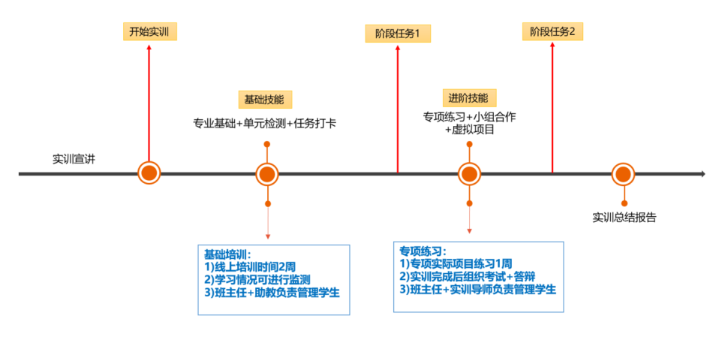
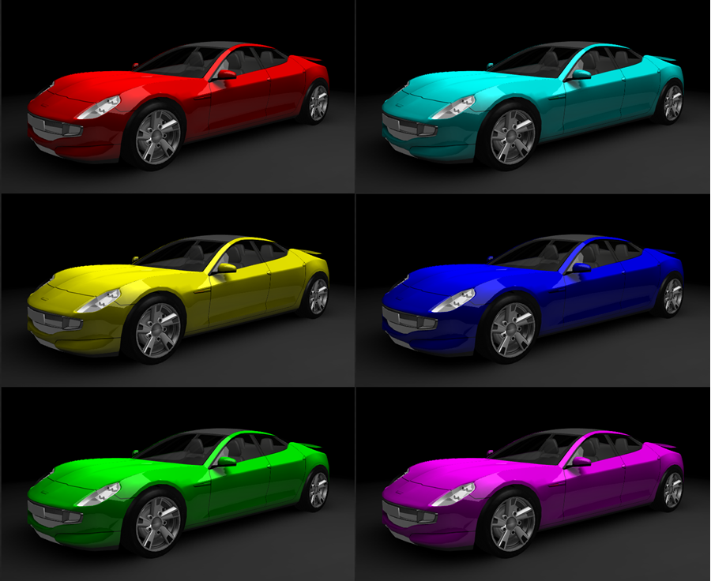
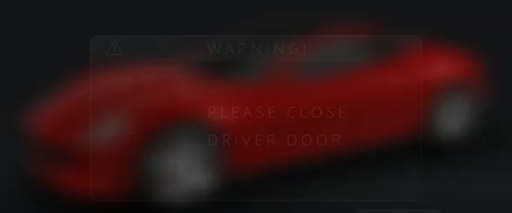
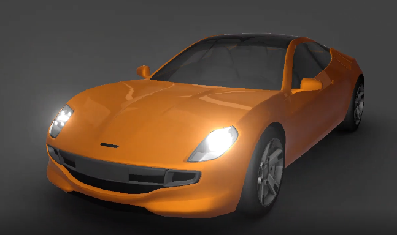
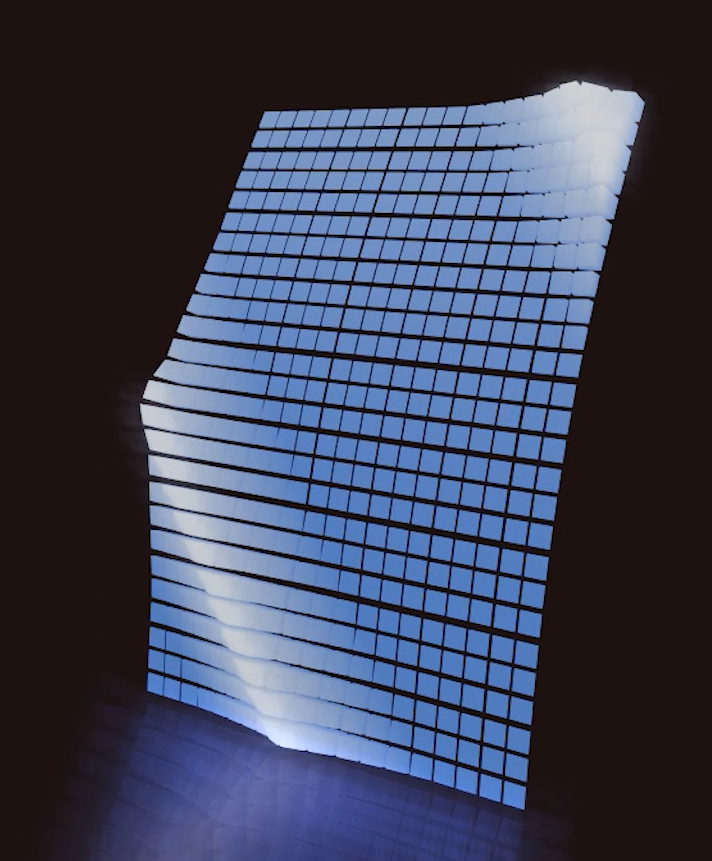
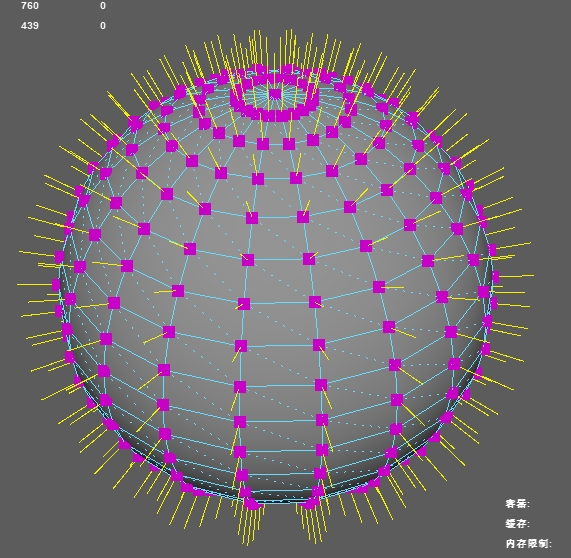
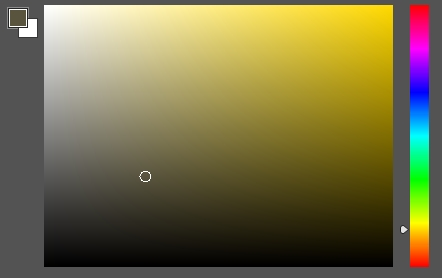

# 目录

1. 学习目标
2. 实训收益
3. 总体计划
5. 课程安排
   - 入门阶段
   - 进阶阶段
6. 交付作业

---
## 1.学习目标  

`Kanzi Studio 中的材质和纹理获得您所需渲染效果的基础知识。`

`您将了解不同的材质类型、纹理以及如何创建和使用这些材质和纹理。`

`您还将了解如何调整材质设置，让您的渲染对象呈现不同的外观和感觉。`

`Kanzi Studio 插件扩展 Kanzi Studio 的功能并在 Kanzi Studio 中运行`

`定义您的 Kanzi 应用程序的数据录入点，并形成 Kanzi 应用程序设计师和开发者之间的约定`

---

## 2.实训收益

1. 沉浸在通过数字操控视觉的快感中  
2. 或者找一份工作，关键词：实时渲染，技术美术，三维重建...

---

## 3. 总体计划

---

## 4. 课程安排

### 入门阶段

#### 实时渲染

- 材质和纹理（工具）(0.5天)
  - 第 1 步 - 导入内容并创建背景
  - 第 2 步 - 创建车身的材质类型和纹理
  - 第 3 步 - 设置轮胎、轮毂和镀铬零部件的材质
  - 第 4 步 - 定义车窗和大灯玻璃的材质属性
  - 第 5 步 - 调整材质

#### Kanzi Engine Plugin

- 插件的制作与使用
  - 使用kanzi engine插件
  - 创建kanzi engine插件
  - 调试kanzi engine插件
  - 扩展kanzi engine功能

### 进阶阶段

#### 实时渲染

- 高斯模糊（后处理）(0.5天)
  - 第 1 步 - 创建提供模糊效果的材质
  - 第 2 步 - 应用模糊效果
  - 第 3 步 - 切换模糊效果

- 全屏泛光（后处理）(0.5天)
  - 第 1 步 - 渲染汽车和大灯
  - 第 2 步 - 显示全屏泛光效果
  - 第 3 步 - 微调全屏泛光效果
- “二选一” 尝试后 进入渲染管线理论课程 (0.5天)
  - 
  - 顶点法线（片元）
  - 
  - 顶点偏移动画（顶点）
- 渲染管线（理论）(0.5天)
- 抗色原理（视觉）(0.5天)
- 三维空间（视觉）(0.5天)

#### Kanzi Engine Plugin

- ColorPicker取色器插件制作

---

## 5. 交付作业

- `每个入门主题的练习文件`  
- `小组合作作业`

---