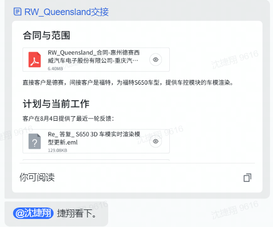
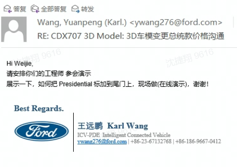
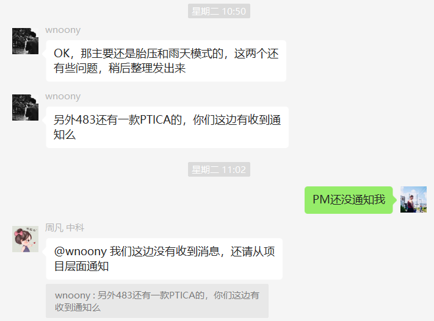
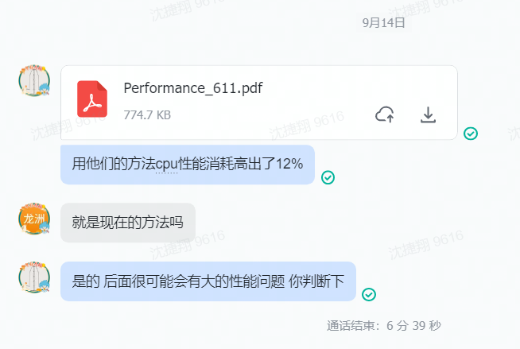
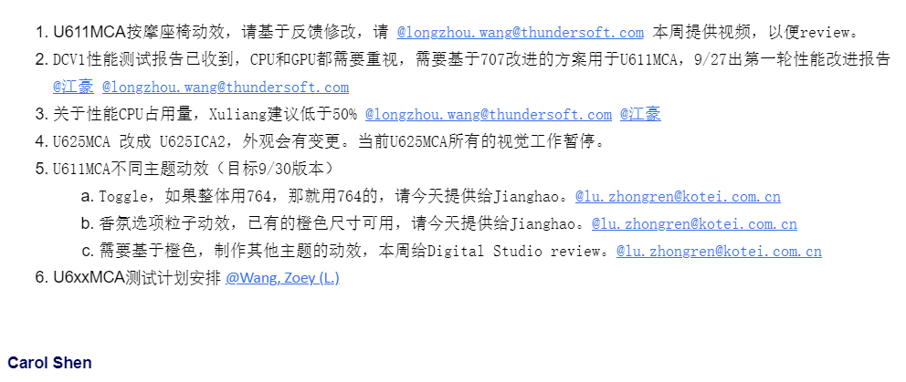
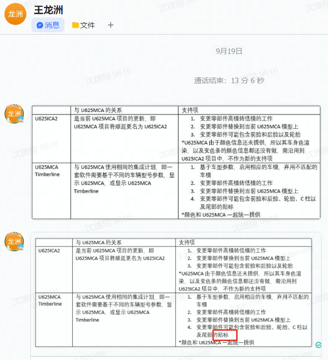
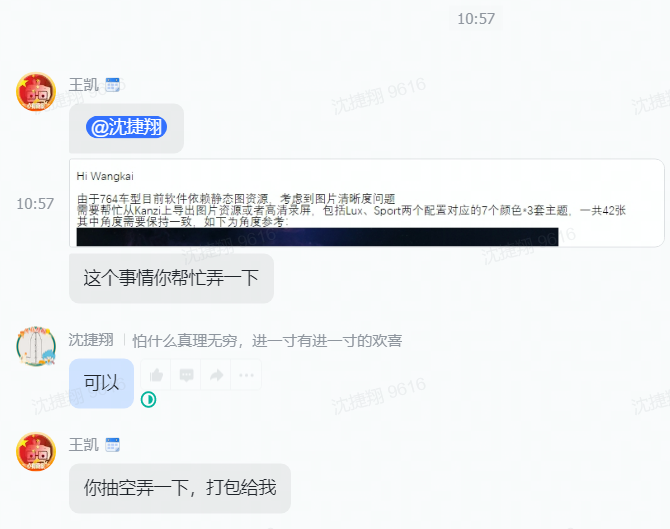
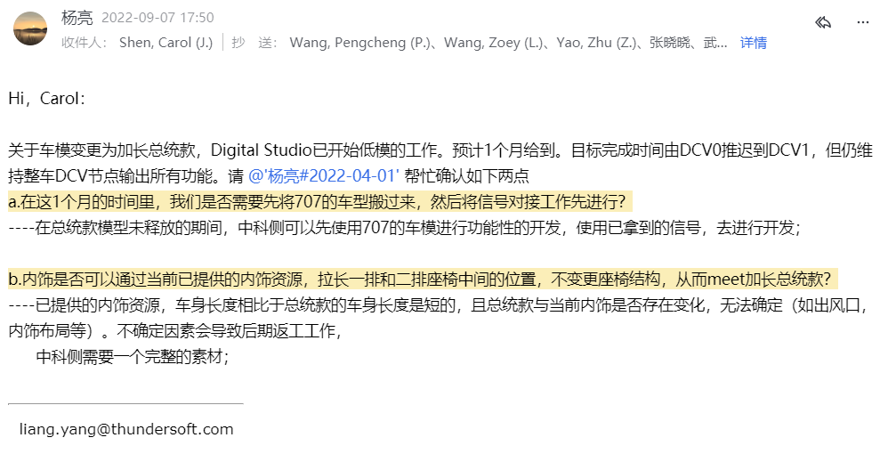

# 项目池：  
## S650项目：  
`1.接手：`  
`具体工作内容：参见飞书文档`   

## 707项目：
`1.总统款换脸：`  
`工作性质：兜底`  

## 483项目：
`1.效果视频录制：胎压异常+雨天效果`  
`2.性能优化`  
`3.PTICA款_CR`   

## 611项目：
`1.座椅按摩集成`  
  
`2.性能优化`  

## 625项目：
`1.双车模样式支持`  
`项目性质兜底`  

## 764项目：
`1.2款车型的UI适配`
`详细：7个颜色*3套主题*2款车型 共 42张 UI图片`    

## 718项目：
`车模动效渲染架构：等待3D依赖项目输入`   

