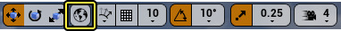
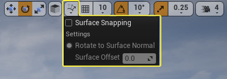
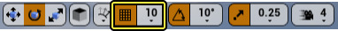

# Actor
## Actor使用
- Actor概念  
C++中：AActor是所有Actor的`基类`。  
[ref](https://docs.unrealengine.com/4.27/zh-CN/Basics/Actors/)
- 放置方式
  - 放置角色面板（Window > Place Actors）
  - 内容浏览器拖拽放置
  - 类查看器放置（Window > DeveloperTools）
- 移动性 Mobility
  - 静态
    - [Lightmass](./Lightmass.md)会计算光照贴图
    - 游戏进程中无需重新迁移。但可以对其材质设置动画。
    - 结构或装饰网格体的理想选择
  - 固定
    - [Lightmass](./Lightmass.md)不使用计算光照贴图
    - 可以投射移动物体的动态阴影。
    - 不接受移动光照
  - 可移动
    - 完全动态阴影
    - 非阴影开销小
    - 动态阴影开销大
- 选择
  - 可以通过 LMB>选择>选择所有静态网格
  - 可以反向选择
  - 可以选择影响您的Actor的光源
- 变换
    - Alt + LMB = 复制物体
    - MMB + 移动工具 = 临时改变轴枢
    - LMB + V = 顶点对齐
    - 可以锁定相对缩放
    - 世界和本地变换  
- 分组
  - Ctrl + G = 打组 
  - Shift + G = 解组
  - Shift + Ctrl + G = 暂时解组所有（设置：允许组选择）
  - 邮件 > 组 > 锁定/不锁定
    - 选择和变换属于该组的单个Actor。
    - 从该组中删除Actor。
- 对齐
  - 表面对齐  
沿着`法线`进行表面对其

  - 网格对齐(取整对其)  
取设置的`整数位`移动 旋转 缩放

  - 顶点对齐  
V + LMB
- 合并  
将多个`静态网格体`组合为`单个网格体`。  
  - 操作：  
窗口（Window） > 开发者工具（Developer Tools） > 合并Actor（Merge Actors）
- [坐标术语](https://docs.unrealengine.com/4.27/zh-CN/Basics/Actors/CoordinateSpace/)

## Actor类型
### 常见类型
- 静态网格体（StaticMeshActor）  
一般用作`世界场景`几何体或者`装饰性网格体`，用于`搭建关卡场景`。
- 画刷（Brush）  
常用于`快速设置场景原型`，`粗略构建`出场景，以便测试游戏功能。
- 骨架网格体（SkeletalMeshActor）
人物角色、活物、复杂的机器设备、以及任何需要变形或显示复杂运动的物体。
### Gameplay Actor类型
- 玩家起点（Player Start）
- 触发器（Triggers）  
它们负责响应关卡对象的动作并触发事件。
- MatineeActor  
动画工具可随时间对Actor属性设置动画，以创建动态游戏进程或游戏中的过场动画序列。类似视频编辑器

### 光源Actor类型
- 点光源/聚光源/定向光源
  - 静态（Static）  
不能在游戏中更改光源。这是`最快`的渲染方法，并且允许`烘焙的光照`。
  - 静止（Stationary）  
该设置还允许光源在游戏中更改`颜色和强度`，但它不会移动且允许`局部烘焙光照`。
  - 可移动（Moveable）
完全动态,动态阴影，从渲染的角度看这是`最慢`的。

### 特效Actor类型
- 粒子系统（Particle Emitter）
  - 例如烟雾、火焰、火花
  
### 音效Actor类型
- 环境音效（AmbientSound）

## 文本3D（Text 3D）
插件 用于 直播和虚拟场景。

## 几何体笔刷Actor
关卡搭建早期使用
## 