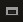
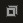
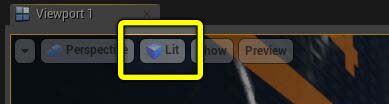
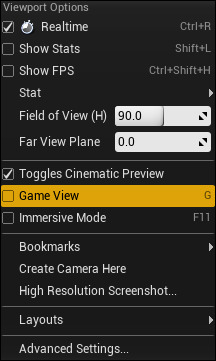
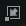
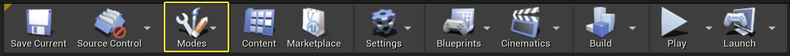
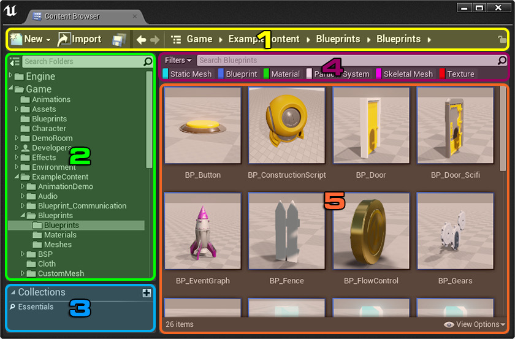
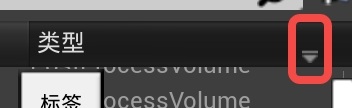
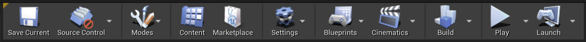

[icon_size]: 30

# ue4界面基础：
## 编辑器视口：
[ref](https://docs.unrealengine.com/4.27/zh-CN/BuildingWorlds/LevelEditor/Viewports/)  
### 视口基础知识：
可视化器
- 视口类型：
  - 3D，2D_XYZ轴
  - tip：按 Alt 和 G、H、J 或 K 循环查看视口的类型
- 视口布局
  -  和  按钮 将视口最小化和最大化。
- 视图模式
  - .  
各种可视化 debug
  - [ref](https://docs.unrealengine.com/4.27/zh-CN/BuildingWorlds/LevelEditor/Viewports/ViewModes/)

- 游戏视图
  - 使视口像在游戏中一样显示场景。
  - 设置：  
.
- 沉浸模式
  - 全屏
  - 设置：
  - F11/ viewportOpions > ImmersiveMode
  - 最小化 

### 视口功能按钮：
- 透视
  - 上下移动摄像机：`LMB + RMB + 拖动`
  - 前后移动摄像机：`LMB + 拖动`
  - 旋转摄像机：`RMB + 拖动`
  - 聚焦：`F`
  - 围绕一个枢轴或目标点翻转：`Alt + LMB + 拖动`
  - 沿着屏幕到世界的射线移动摄像机：`Alt + RMB + 拖动`
  - 摄像机在沿当前平面 跟随鼠标移动摄像机：`Alt + MMB + 拖动`
- 正交
  - 放大和缩小视口摄像机：`LMB + RMB + 拖动`
  - 创建一个区域选择框：`LMB + 拖动`
  - 平移视口摄像机：`RMB + 拖动`
  - 聚焦：`F`
- [ref](https://docs.unrealengine.com/4.27/zh-CN/BuildingWorlds/LevelEditor/Viewports/ViewportControls/) 

## 关卡编辑器模式
介绍可用于控制关卡编辑器模式的工具集。
  
[包含](https://docs.unrealengine.com/4.27/zh-CN/BuildingWorlds/LevelEditor/Modes/)：选择、地形、植被、笔刷编辑、网格体绘制、破碎

## 内容浏览器UI
[ref](https://docs.unrealengine.com/4.27/zh-CN/Basics/ContentBrowser/UI/)
 
- 编组功能：位于3,可以从2的 Search Folders 右侧切换 2 与 3.

## 细节面板
[ref](https://docs.unrealengine.com/4.27/zh-CN/BuildingWorlds/LevelEditor/Details/)
- 收藏夹置顶功能：
  - 在 编辑（Edit） 菜单中，选择 编辑器偏好设置（Editor Preferences），在 试验性（Experimental） 下，选中 启用细节面板偏好（Enable Details Panel Favorites） 选项。
## 世界大纲视图
[ref](https://docs.unrealengine.com/4.27/zh-CN/BuildingWorlds/LevelEditor/SceneOutliner/)
- 显示类型  
 

- 搜索场景
  - 直接搜索：显示与搜索词完全和部分匹配的所有Actor
  - "-"来排除
  - "+"来添加
  - ""双引号 完整词汇完全匹配

## 关卡编辑工具栏
[ref](https://docs.unrealengine.com/4.27/zh-CN/BuildingWorlds/LevelEditor/Toolbar/)  
 

## 主菜单栏
[ref](https://docs.unrealengine.com/4.27/zh-CN/BuildingWorlds/LevelEditor/MenuBar/)  
涉及代码刷新 代码创建逻辑