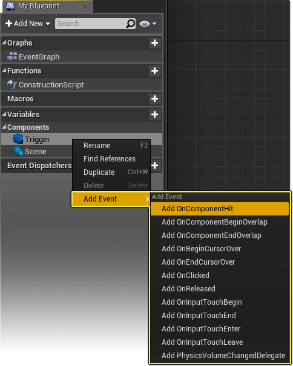

# 组件
是可以添加到Actor上的一项功能。
作为Actor内部的子对象，组件都是实例化的。
## [组件类型](https://docs.unrealengine.com/4.27/zh-CN/Basics/Components/)
## 添加/移除组件
- 可以通过`添加组件`添加
- 可以通过`内容浏览器（Content Browser）`拖放
- 右键删除
## 组件事件和功能
- 我的蓝图（My Blueprint） 窗口中 右键单击 组件，以访问 添加事件（Add Event）  
