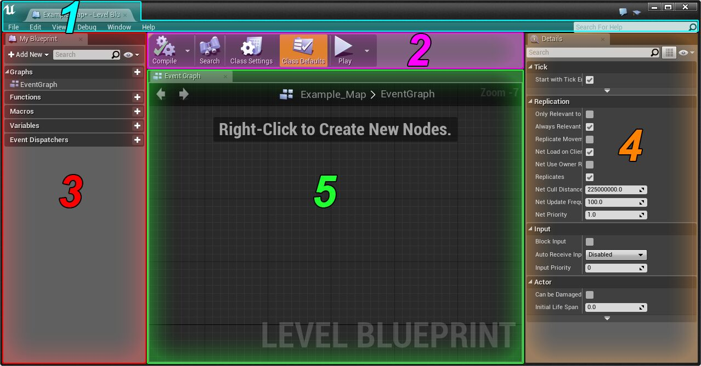

# 蓝图
## [关卡蓝图](https://docs.unrealengine.com/4.27/zh-CN/ProgrammingAndScripting/Blueprints/Editor/UIBreakdowns/LevelBPUI/)
用作关卡范围的全局事件图。
### 接口
  

1. 菜单  
用于执行多个操作的菜单，如保存、加载和打开窗口。

2. 工具栏  
该栏位于编辑器顶部，拥有控制多个函数的按钮。

3. 我的蓝图  
使用者更加便捷地查看蓝图现有元素或创建新元素。

4. 细节  
关于蓝图编辑器中的细节面板的概述。

5. 图表编辑器
面板是蓝图系统的核心。
- 可从 内容浏览器（Content Browser） 拖放到 图表编辑器（Graph Editor） 选项卡上.以使用自动分配的资源创建新的AddComponent函数调用。

## [蓝图最佳实践](https://docs.unrealengine.com/4.27/zh-CN/ProgrammingAndScripting/Blueprints/)
## 快捷键
- 删除连线：ALT + LMB
- 移动已连接的节点：CTRL + LMB
- 创建IF节点：B + LMB
- 创建协程：S + LMB
- 创建循环：F + LMB
- 注释：C + LMB
- 鼠标双击连线：添加整理节点
