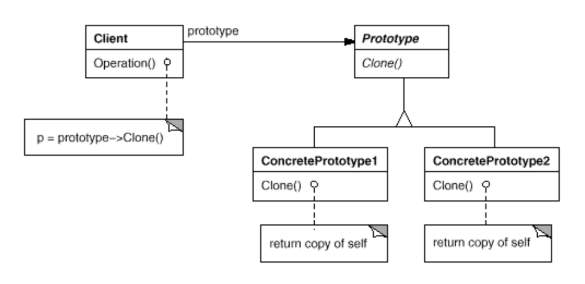

# “原型”（PROTOTYPE）模式——面向对象创建型

## 图示

## 意图
`用原型实例指定创建对象的种类，并且通过拷贝这些原型创建新对象`
## 动机
`对象复合要比子类更加灵活,为了产生大量子类。解决办法时 克隆 一个实例来创建新的graphic 我们称这个实例为原型。`   
## 适用性
0. 当一个系统应该`独立于它的产品`创建、构成和表示时。
1. 需要实例化的类是在`运行时`指定的。
2. 为了避免创建一个`与产品类`层次平行的`工厂类`层次时。
3. 当一个类的实例`只有几种`不同状态时。创建原型克隆他们，替代手工实例化更方便。
## 参与者
1. `Prototype`（接口）
    * 声明一个`克隆自身的接口`。
2. `ConcretePrototype`（具体实现）
    * 实现一个`克隆自身的操作`。
3. `Client`（客户端）
    * 客户请求一个原型`克隆自身`，从而创建一个新的对象。