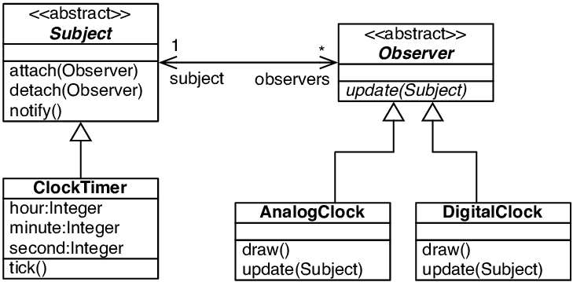

# “观察者”Observer_对象行为型模式
## 图示
  
`也叫 Dependent，Publish/Subscribe，Model/View，Source/Sink，或者 Listener 模式。`

## 意图
`定义对象间的一种一对多的依赖关系，当一个对象的状态发生改变时，所有依赖于它的对象都得到通知并被自动更新。`

## 动机
`为了维护相关对象之间的一致性。通知的发布者不需要知道谁是观察者，可以有任意数量的观察者订阅。`

## 适用性
1. `当一个抽象模型有两种实现，而且其中一个实现依赖于另一个实现时。`
2. `当对一个对象的改变需要同时改变其它对象，而不知道具体有多少对象有待改变。`
3. `当一个对象必须通知其它对象，而它又不能假定其它对象是谁。`

## 参与者
1. `Subject（目标）`
    * `知道它的观察者。`
    * `提供注册和删除观察者对象的接口。`
2. `Observer（观察者）`
    * `为那些在目标发生改变时需获得通知的对象定义一个更新接口。`
3. `ConcreteSubject（具体目标）`
    * `将有关状态存入各ConcreteObserver对象。`
    * `当它的状态发生改变时，向它的各个观察者发出通知。`
4. `ConcreteObserver（具体观察者）`
    * `维护一个指向ConcreteSubject对象的引用。`
    * `存储有关状态，这些状态应与目标的状态保持一致。`
    * `实现Observer的更新接口以使自身状态与目标的状态保持一致。`