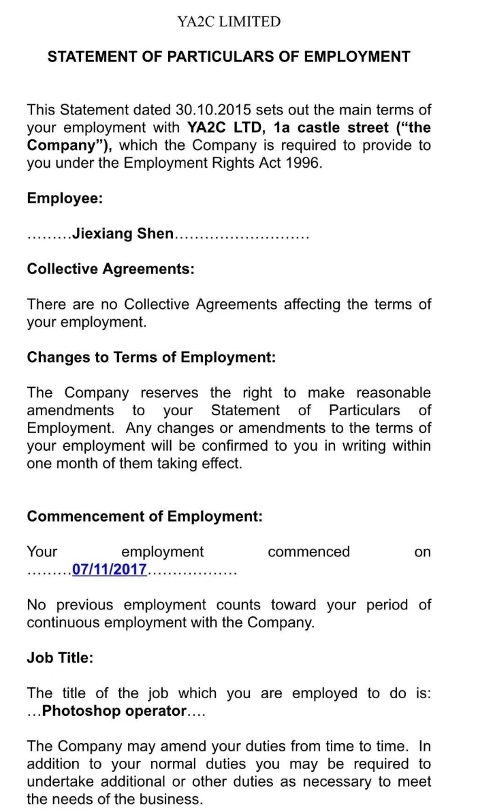

- 公司名 : "东台旭松智能科技服务中心"
- 时间 : "2023-4-1 — 2024-7-1"
- 地址 : "南京江宁融信泊岸中心2号楼"
- 职称 : "法人"
- 部门 : "股东"
- 工作 : "主导两款 休闲策略类游戏的研发。注册《终极细胞》商标"
---
- 公司名 : "无锡炎梦网络科技有限公司"
- 时间 : "2022-11-7 — 2023-3-31"
- 地址 : "无锡市锡山区云林芙蓉西路30号"
- 职称 : "3A 游戏⼯作室制作⼈ 兼 南京⽅⾯负责⼈"
- 部门 : "游戏部门"
- 工作 : "主导一款 3AMMORPG游戏的设计研发工作。"
--- 
- 公司名 : 南京中科创达软件科技有限公司 Thunder Soft
- 时间 : 2021-6-21  —  2022-11-04
- 职称 : Kanzi/OpenGL工程师
- 地址 : 江苏省南京市安德⻔⼤街50号怡化中⼼A座11- 楼
- 电话 : 025-83291677
- 部门 : 研发三组
- 工作 : 主导北美福特旗下2023年车机（福特、林- 肯、野马）渲染研发；制定渲染工作- 流程；研究应用- 图形学技术与算法
--- 
- 公司名 : 艾迪亚数字娱乐有限公司 ADIA DIGITAL ART 
- 时间 : 2020-10-09  —  2021-5-31
- 职称 : 游戏引擎工程师
- 地址 : 南京市⾬花区花神⼤道21号德迅科技4楼
- 电话 : 025-86330855
- 部门 : 游戏引擎工程师
- 工作 : 主导搭建公司数据库前端的渲染；制作工作流- 程中的自动化软件；完成客户需- 求（Konami，- Capcom，Ubisoft）
--- 
- 公司名 : 南京网觉软件有限公司 WebEye
- 时间 : 2019-04-02 — 2020-9-15
- 职称 : U3D 开发工程师
- 地址 : 南京市雨花台区花神大道 86 号东软大厦 - 311 室
- 电话 : 025-86980686
- 部门 : Vega Studio
- 工作 : U3D 游戏编程、资产制作
- 
---
- 公司名 : YA2C LTD 
- 时间 : 2017-11-07 — 2018-8-01
- 职称 : PhotoShop Operator
- 地址 : 1A Castle Street.
- 电话 : --
- 部门 : Sale
- 工作 : PhotoShop Operator
- 
- 