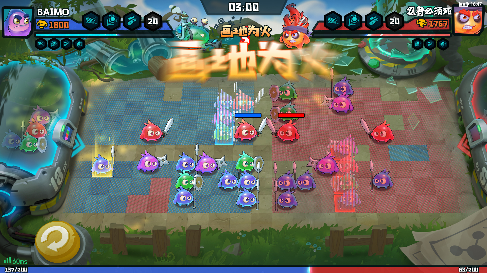
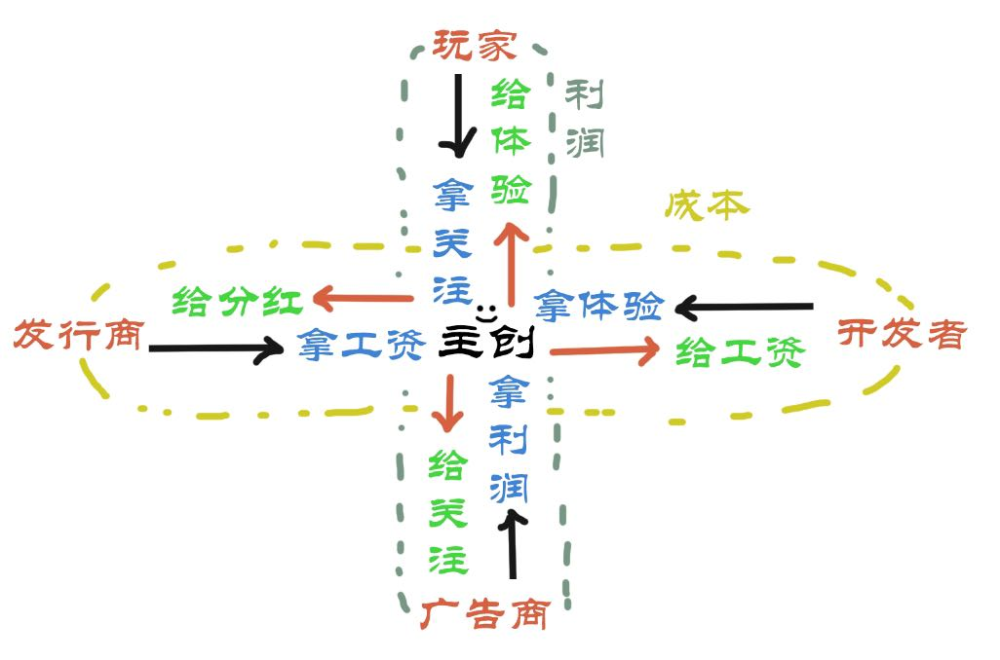
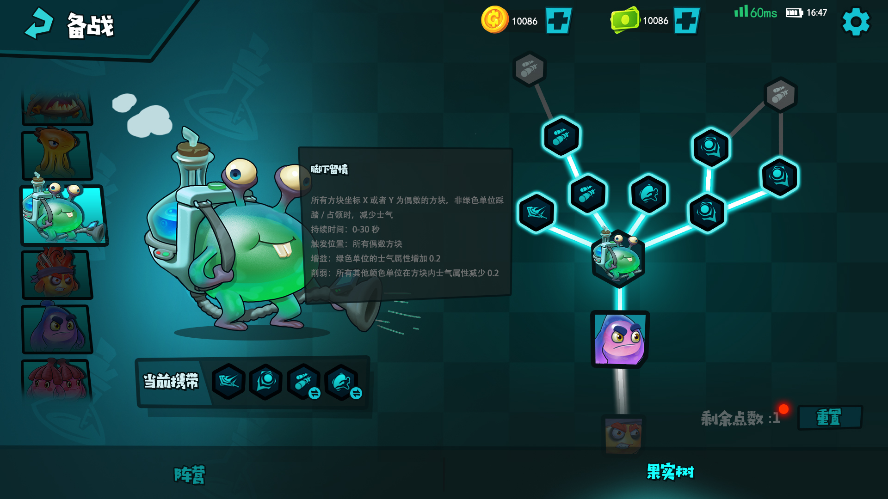
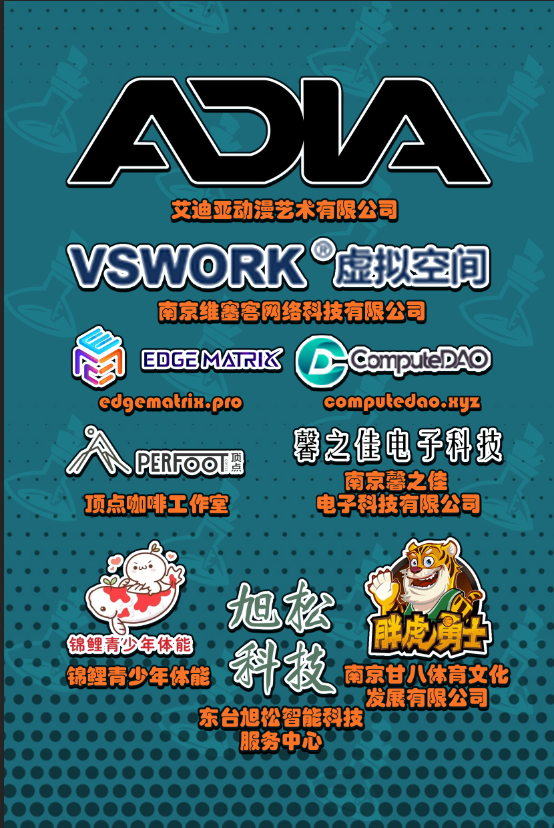

# （这些是我被问的最多的问题，所以放进宣传页比较能解答问题，宣传页可以以开发者和玩家对话的形式表现）
 
- “你们是什么游戏啊？”
  - 顺藤摸瓜，追本溯源。
  - 这个游戏的地基是：价值500万成本的表达。
        
  - “少卖关子”
    - 那先让我解释下为什么成本是500万？
    - 我们团队的前身是一家40人的MMO游戏工作室, 40人的吃喝拉撒，一年的成本是500万。
          
  - “那和你现在的游戏有什么关系啊？”
    - 我作为公司的二把手（认真脸），已经从上帝视角薅到了这价值500万的体验全部，
    - 我作为游戏设计师该死的分享欲发作了，我不允许 你 不知道如此深刻令人难忘的经历。
          
  - “那你具体准备怎么做？”
      - 我的目标是把这500万的体验 以 HD+骑兵 的方式传达给玩家。
      - 当今世界上最强的表达媒介就是游戏，所以有了这款游戏。
      - 众所周知，团队合作，必须要有主题。
      - 结合体验我们的主题十分哲学： 团结弱势群体可以产生力量的讨论。
      - 经过研究和探讨，我们觉得RTT类型最适合 这一主题。
      - 所以我们借鉴了 全面战争：中世紀II 英雄连3

  - “哈！又是缝合怪是吧？那我走？”
      - 是这样的骚年。
      - 我认为想要一个 惊为天人的表达，前提是能把话说清楚。
      - 我们发现被推上神坛的RTT具有一些共性：
      - 文明冲突的故事，
      - 搭载特征明确的艺术，
      - 实时性、战术、单位管理、环境 四位一体的互动。
      - 如此一来我们对话的基本环境就有了，有助于把话说清楚。

  - “那惊为天人的表达在哪里？”
      - 就像你一样，都在我心里。
      - 开玩笑的。
      - 基于马列主义中个体与群体心理学的理论，结合我们的经验，提炼出以下精华：
      - 质疑个人主义、群体意识与个人意识、阶级斗争与个体心理、个体在群体中的作用。
      - 相对应于我们的游戏就是：
      - 认同一致性、互助与合作、自我赋能感、社会支持/共情。

  - “说人话，听不懂”
          
      - 且听我娓娓道来。
      -  
      - 当个体或群体面临共同的弱势或压力时，他们通常会以建立一个共同的身份和价值观为基础来形成认同一致性，进而凝聚团结和合作的力量。
      - 结合我的体验和感悟，所以在作品中，会给同色的，弱势方一个强力加成。
      - AKA 认同一致性

      - 弱小的个体往往通过互相支持、协作和分享资源来增加自身力量和抵抗力。这种合作可以是在面对共同敌人时的集体行动，也可以是在共享知识、技能和资源方面的互助合作。
      - 结合我的体验和感悟，所以在作品中，相邻单位之间可以互相支援。越弱势，这种关联性越强。
      - AKA 互助与合作

      - 团结弱小的心理学鼓励个体或群体相信自己可以影响和改变现状，并提升自身的能力和自我效能感。
      - 结合我的体验和感悟，所以在作品中，为单位加入一个代表心理状态的士气值 和 情绪系统。
      - 影响士气值的因素有作战时长，周围的单位，和周围单位离开/死亡。
      - AKA 自我赋能感

      - 弱小个体或群体能够通过寻求他人的理解、支持和共情来加强对困境的应对能力。
      - 这种社会支持可以来自亲近的人际关系、支持性的社群和组织，或者更广泛的社会网络。
      - 结合我的体验和感悟，所以在作品中，有一种战斗时生长的果实，采摘到后会激励该单位，来影响其他单位。
      - 激励是一种链式技能，对一个单位使用后，这个单位会以链式传递给下一个同色单位，这种传递的力量再每次传递的过程中都会增强。
      - AKA 社会支持/共情

      - 不止如此，
      - 包括例如：单位的产出，也 提炼 抽象 夸装了 迭代产品，设计产品，落地产品的过程。
      - 任务目标，环境道具，艺术设定，故事设定 甚至商业部分 ... 都是我们对主题的 的艺术加工 和 表达媒介。
    
- “我能不能玩你们的游戏啊？”
    - 我们游戏面向的一部分受众是有碎片时间的人类。
    - 我是一个比较忙碌，空闲时间会上B站刷I坤的人，来获得廉价的快乐。
    - 但我想在碎片时间做一些 比上B站刷I坤 更社交 更有意义的事情。
    - 所以我们的受众就是我这类人。
    
- “你们的游戏是什么类型的？”
    - 基于我们要表达的主题，和受众定位，最适合的游戏类型是 RTT。
    - 有别于RTS，RTT是一种更加注重操作的游戏类型。
    - 更具象一些就是：联机版的植物大战僵尸 不加 植物 不加 僵尸。
    
- “你们游戏上什么平台啊？”
    - 基于现实，和碎片时间的特性，最适合的平台是手机。
    - 如果有 脑机接口 或者 意识上传 平台，会发生的事情是：
    - 主创们回家收拾行李，然后跪在平台老板门口，哭喊着：“愿意拜为义父”

- “你们游戏赚钱吗？”

    - 赚。
    - 我们发现的痛点：
        - 通常情况下，我会上一年班，溜出来当一年老板，如此往复，完全不留积蓄。
        - 作为小微企业主：
            - 资金需要周转，打算卖房子，支付8000元一周的电梯广告费，让我获得一个租房中介的问候。
            - 精心准备的产品，发了朋友圈第一时间点赞的永远只是父母，之后是一些贷款公司的嘘寒问暖。
            - 在匠心和成本之间，选择了成本，就像在理想和活下去之间，先选择“活下去”，“活下去”之后再选择“继续活下去”。
            ...
        - 作为上班族：
            - 当刚入职的新鲜劲过去，工作陷入了重复的循环，不如上B站刷I坤。
            - 上班上厕只够来一把 SupperCell 的荒野大乱斗，午休可以来几把皇室战争，输了很上头，不如上B站刷I坤。
            - 下班不敢打开steam打折时屯的3A大作，再来一把天就亮了，不如上B站刷I坤。
            - 玩玩小游戏弹广告，就可以开始发呆 或者 去拿外卖了，不如上B站刷I坤。
            - 和身边同事聊游戏：“游戏性很强” “画面很好” “很爽” 永远就是那几个标签，不如上B站刷I坤。
            ...
-  
- 我们正在打破什么：
  - 传统游戏广告盈利模式：
    - 最快的速度做(抄)一个小游戏，然后接入GoogleAD 或者 其他广告平台的SDK，上架买量。
    - 薅广告商的羊毛。
    - 正如埃隆马斯克所说，这个时代最聪明的头脑 都在想着怎么让人们点击广告。
    - 这样做有什么问题？
    - 玩家 玩到屎一样二手创意。
    - 广告商 被薅羊毛是小事，还打断别人做爱做的事。
    - 发行商 找到好游戏的成本直线增加。
    - 开发者 除了拿一份工资以外，完全在浪费自己的时间，和别人的时间。

- 不破坏产品本身体验的互动式文化传播已经到来。

    - 数据来源：国家统计局2019年第四次全国普查结果
        - 中小型企业有1807万家，占全部企业的97.3%。
        - 贡献国民税收：50%。
        - 贡献GDP：60%
        - 技术创新：70%
        - 城市劳动就业：80%
        - 市场企业占比：90%

    - 数据来源：我的Boss直聘 和 NikoPartner2020年度报告
        - 2023年6月，我在南京开放了兼职游戏测试岗位，
        - 仅仅开放了3小时就收到了67份简历。
        - 67人中有17人是存量市场的重度玩家。
        - 这些玩家被我们纳入了游戏封测玩家。
        - 中国的主机玩家人数达到1320万，类比这17位被我们选中的封测玩家。
        - 我挨个和剩下的50人聊过，
        - 他们的游玩时间都非常碎片，
        - 看起来光是活着就已经耗尽了他们大部分力气，
        - 但依然对游戏存留着憧憬，
        - 受时间，金钱的制约，对于好游戏，他们心里的答案非常牵强。
        - 所以我的游戏需要，打破时间，金钱，精力的壁垒，向这类人群展示第九艺术的魅力。
    -  
    - So:
        - 如果按照每个小型企业支付8000元的广告费，那么这个市场的规模是：144560亿元。
        - 在我们的游戏中，
        - 玩家将化身 斗技者。
        - 组织自己看起来弱小的细胞军团，
        - 披上所爱的意识形态，去大胆的表达自我。
        - 小微企业将化身 雇佣者。
        - 和我们一起探讨、讲述，深挖自己企业的独特文化，
        - 我们团队会提炼、融合、讨论、迭代，
        - 制作成独一无二的游戏体验融入游戏。
    -  
    - 目前我们已经拥有：
        - 4家大型企业成为了我们的供应商：
            - 南京艾迪亚动漫艺术有限公司
            - 南京维塞客网络科技有限公司
            - edgematrix.pro
            - computedao.xyz
        - 5家优质中小企业成为了我们首批赞助商：
            - 顶点咖啡工作室
            - 锦鲤青少年体能
            - 南京甘八体育文化发展有限公司
            - 南京馨之佳电子科技有限公司
            - 东台旭松智能科技服务中心

    - 结语：
        - 就在我参展的前一周，
        - 电脑落在了一家美团上找不到的餐厅（南京太阳城C区停车场对面），
        - 时间已经是晚上10点了，我快速折返，心里做着最坏的打算，电脑被人拿走，老板要讹钱，项目资料丢失。
        - 我车停在路边，甚至还没完全停到车位，车都没熄火就跑过去。
        - “老板你有没有看到一个黑包？”
        - 他拿着黑包过来说：
        - “你是不是已经回家了又跑回来。”
        - “可不是吗？吓死我了。”
        - 我从黑包夹层里摸到一张纸票就要塞给老板。
        - 老板说：“我不会收的，赶紧回去吧。”
        - 我上车前，回头看看餐厅，回想起我的就餐体验。
        - 这是我第一次来这家餐厅吃饭，这家餐厅在用餐时间人非常的少，我点的是15块的鸡腿饭。
        - 水煮的土豆和白菜配着巨量的饭，盖在有ipad那么大的盘子上，旁边配着 齁咸的腌制鸡腿 和 干子。
        - 味道比较普通，不过能吃饱，性价比不输 旁边的星巴克和肯德基，老板为人也很有特色，看起来像有故事的人。
        - 如果经过和老板的沟通，和我们的艺术加工、提炼在游戏中会是怎样的意识形态呢？
        - 这样的意识形态会有玩家支持吗？
        - 又会不会在细胞的世界称霸一方呢？
        - 几年甚至几十年后，人们对他的故事和意识形态又会产生什么样的反应呢？
        - 想到这，我觉得我是司马迁，在记录着这个时代的意识形态的大战。
