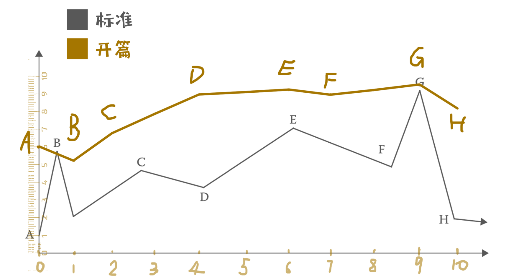
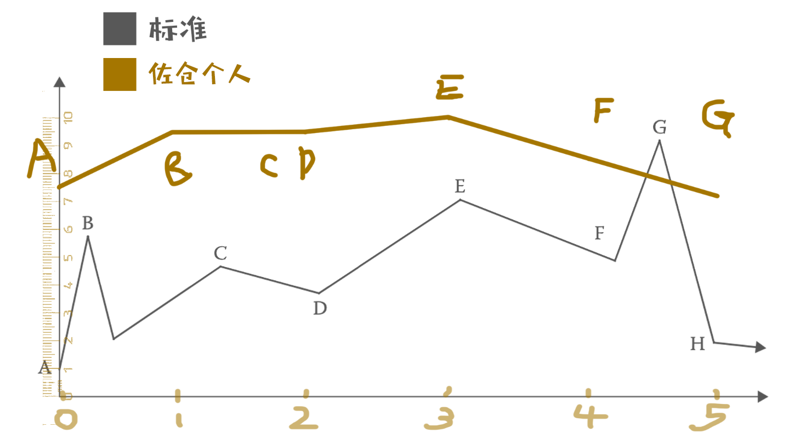
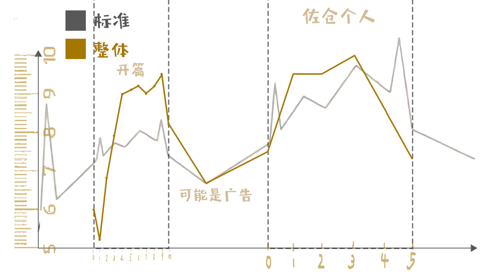

# 评价：

基本符合兴趣曲线。<br>
期待一些张弛会更好。<br>
通篇易于脑补，情感细腻。<br>
开篇的高潮设置位置很棒。<br>

# 分段标记：

**依据**：<br>
每个 逆转 或 变化。<br>

---


1. 初始之境：世界逆转 架空世界<br>
```
咕噜……一片黑暗的混沌中仿佛飘过几个气泡，佐仓美野里感觉自己好像正在一片很深的海洋中不断的下沉
“我这是在……做梦？”她没有入睡前的记忆，只觉得自己好像睡了很久很久。
“我……是怎么睡着的？”睡意惺忪的她缓缓睁开双眼，逐渐映入眼帘的是一片浩瀚的星空。
但随着意识的完全恢复，佐仓美野里只觉得自己的身体失去了依托，被一股力量不断地往后拉去……不对，应该说她是在下坠。
```
2. 逆转：世界逆转 物理规律<br>
```
“唉？唉！啊啊啊啊啊！！！！！！”还完全没反应过来的佐仓美野里就这样重重的摔在了地上。
“疼疼疼……”支起身体后揉了揉自己最先着地的屁股，却又惊讶的发现自己刚才好像从认知中能摔死的高度落下，结果除了自己的屁股吃了点苦头以外却并没有受到什么致命的伤害。
```
3. 变化：情绪变化恐慌<br>
```
“这是哪里？”正惊讶于自己平安无事的美野里注意到了周围的情况。环顾了四周，自己似乎正处于一片荒芜的沙漠中，但与普通的沙漠不同，地面的沙土更加的细腻，而且呈现出银白色，黑色的夜空如同清澈的湖水，上面的每一颗星星都清晰可见…… （可以考虑插公模 CG）
“……”从地上爬起来的佐仓美野里望着这一片自己从未见过的美景愣了一下，她的脑子还无法理解现在是什么情况。突然她狠狠地掐了自己的脸一下。
“疼！真的假的？不是在做梦吗？”揉了揉被自己恰红的脸颊，虽然眼前的星空足矣成为一幅世界名画。但无法理解这一切的美野里无暇顾及，她只觉得脊背发凉脑袋里不断的发出一系列灵魂问题“我是谁？我在哪？！这是什么情况？！”
```
4. 逆转：敌人出现<br>
```
“嘶……”突然一阵刺耳的声音传来，还没弄清楚状况的佐仓美野里循声望去。在茫茫星空中仿佛有一团奇怪的黑雾正不断地向她靠近。
“那是？”想要努力看清的佐仓美野里把眼睛眯成了一条缝。
黑雾不断地扩大，仿佛眨眼间瞬间覆盖了整个星空，而随着黑雾的扩散，佐仓美野里也逐渐看到几个迷糊的黑色轮廓正不断的变得清晰。她虽然还无法理解眼前的一切，但当她看清那几个黑影逐渐变成让她胆寒的模样。
“虫子？！”面对着巨大的甲虫，一种本能的恐惧让佐仓美野里立刻拔腿逃跑。但奈何虫群的飞行速度实在太快，甚至有的虫子已经掠过了她的头顶。
“好恶心！别过来啊啊啊！！！”一边抱着头一边跑着的佐仓美野里毫不意外的踩到了凹陷的沙坑里，一个踉跄倒在了地上。来不及犹豫的她想着继续爬起来，却看到一只巨大的甲虫正朝着她的脸扑了过来。
```
5. 变化：初次相遇<br>
```
“噗……砰！”一声闷响，预想中锋利的虫爪并没有抓在佐仓美野里的脸上。反而是几滴奇怪的液体溅射在了她的衣服上。
“弄花了美少女的脸我可就饶不了你们了啊！”随着一个陌生的少女声传来，一个和人一样巨大的黑色箱子落在了佐仓美野里的身前。
“什么啊？！”已经脑子超载的佐仓美野里看着被黑箱压成碎屑的虫子崩溃的大叫了起来。
“啊啊啊？怎么了怎么了？哪里伤到了吗？”看着那坐在地上已经崩溃的快要哭出来的美少女，伊吕波赶忙向前想要将其扶起。
“这些是什么呀？不对！你是谁啊？不对！这是哪里啊？”语无伦次的佐仓美野里双手环抱主自己，不断地往后缩了缩。
“唉？一次性问那么多问题我要怎么回答你嘛？总之请冷静……先冷静好吧？”
“不！不要过来！我要回家！让我回去！”
“喂！不要跑到结界外去啊……没办法了！”已经顾不上是否得体的追上佐仓美野里，然后拽住了对方的衣领往后一拉。失去重心的佐仓美野里就这么向后倒在了地上，没给她任何喘息的机会，伊吕波一个翻身压在了佐仓美野里的身上。
```
6. 变化：情绪升温<br>
```
“冷静点！佐仓美野里！！！”双手手掌死死的夹住了对方的脸颊让她与自己四目相对。
“唉……”过度的惊吓已经彻底宕机的佐仓美野里被动的看着那头顶上挑染着红蓝色长发的少女，待理智逐渐恢复的她才发现两人的距离近道甚至能感受到对方的呼吸。
“冷静下来了吗？总之先别乱跑好吗？被虫子抓到可是很危险的！”
“为什么……你会知道我的名字？”
“呃……这个之后再解释吧，总之是出了点小状况，让你受罪了。接下来我会放开你，你记住可千万别跑到结界外面去。”
“结界？”获得自由的佐仓美野里重新环顾了一下四周，不知何时她们已经被一层透明的半球型光墙给保护在了里面，外面的虫群正前赴后继的用自己的身体冲撞着光墙，而光墙的中心正是刚才把甲虫砸成碎屑的那个黑色箱子。
“对！在这里面呆着他们就伤害不到我们了……虽然撑不了多久就是。”伊吕波拍了拍手叉着腰自信的站了起来说道。
“你是？”
“啊？哦……失礼了，我叫星之伊吕波，这个想象力世界的大使，现在来负责你的安全！”
“等等……什么？想象力世界？”
“更多的细节之后再说吧，得快点把这些不请自来的家伙给处理掉才行！”
```
7. 逆转：少女展示力量<br>
```
“等等……什么？想象力世界？”
“更多的细节之后再说吧，得快点把这些不请自来的家伙给处理掉才行！”没等佐仓美野里
继续追问，伊吕波转身挥手指向星空。蓝色的双眼泛出微微红光。“解构！”紧接着，天上的
星星就像是被无形的力量拉扯着变细变长，星空开始出现一个巨大的漩涡，是空间在扭曲变
形。
“以星尘为画笔！以寰宇为画布！呈现吧我的作品！”伊吕波高喊着自己也不明白为啥要突
然喊出来的口号。天上的黑洞逐渐扩大，顿时空间被撕扯，无数的力量没有章法的快速四处
流动，撕碎了附近所有的虫群。霎时间虫子的甲壳、节肢、翅膀伴随着大量粘液从天上落下。
随后黑洞的消失，星空瞬间恢复了之前的宁静与清澈。（插入伊吕波释放技能时的专属 CG）
“好厉害！”看着眼前景象佐仓美野里不由自主惊叹了一声。
“咳咳……是……是吧？很帅吧？”
“但是……还有虫子啊。”没给伊吕波得意的时间，佐仓美野里又指了指远处的天空，黑压
压的云雾再次来袭，与刚才一模一样的场面。不用想那肯定又是一波虫群。
```
8. 逆转：少女伊吕波能量耗尽，开始教学<br>
```
“唉？什……咳咳，哦嗯！我当然知道。”掩饰着尴尬的伊吕波悄悄转过身。“啧！不太妙啊，
刚才耍帅快把能量用完了，现在开始全速充能的话结界就要没了……”
“那个……真的没问题吗？”佐仓美野里自然是察觉到了眼前少女的不安。
“呃……”思索了一番后，伊吕波突然转过身指向佐仓美野里：“佐仓美野里，你会画画的吧？”
“唉？！为什么现在说这个？”
“听着，眼下是一个很好的锻炼机会。适应这个世界，用你的想象力作画！用创作对抗眼前的危机。”
“为什么开始说出莫名其妙的话来了啊？！画画怎么想都应付不了眼前的情况吧？”
“你以为我是怎么放出刚才的那个黑洞的？”没等佐仓美野里反驳，伊吕波上前抓住了佐仓美野里的双手。
“闭上眼，回想一下你心中的绘画场景。你的画笔，你的画布，你作画用的一切道具，让它们来到你的身边！”
“一上来就……这是？”才注意到自己手中被伊吕波塞入了某种奇怪的装置。
“实验型量产纳米控制器（类似于一种量产型的 S-2811，一次性用品，功能没定制的强）。
总之快跟着我做！！”有些急不可耐的伊吕波催促着佐仓，抓着对方的双手又紧了几分。
“哦……哦！”虽然不是很明白的佐仓美野里见反驳无效也只能跟着伊吕波闭上了双眼，开始冥想，构思……然后一阵白光从在她手中闪烁，一支油画笔出现在了她的手上。“这是？！”
惊讶的佐仓美野里看着手中这只精致的油画笔，她无法理解眼前发生的一切。
“成功了！但……只是这种程度吗？”伊吕波刚要高兴又见呈现出来的东西似乎没有达到她所预想的程度。
```
9. 变化:进入战斗<br>
```
DEMO 战斗构想，以休闲战斗为主，因为剧情里伊吕波用完了能量需要一定的时间给大招进行充能，所以回合开始的时候不能采取攻击或释放技能等行为。场上有一个由伊吕波武器匣子制造出来的结界为安全区，开局两名角色均处于安全区内，安全区内敌人无法进入且一切攻击无效（该安全区在正式版的剧情战斗中会移除）。角色离开安全区后将会受到敌人的攻击，场上安排 2-3 名简单的虫子敌人，均为地面近战。
玩家控制佐仓美野里进行新手教程行动。
因为佐仓美野里的变身为不完全变身，且使用的是量产纳米机器人控制器，所以只能使用几个比较弱的简单技能进行攻击，攻击期望为刚好能把规定数量的敌人击退。完成操作教程之后即可让伊吕波充能完成大招释放，结束战斗轮。
战斗语音（佐仓）：这东西要怎么用呢？
战斗语音（伊吕波）：总之先想像一下你平时作画的过程，然后把你最得意后的作品具现化出来。
战斗语音（佐仓）：最得意的作品？
战斗语音（伊吕波）：虫子来了，小心！
（开始展开教程，例如行动点，能量，攻击，移动等等的一系列介绍。）
战斗语音（佐仓）满足一次成功攻击敌人后触发：居然能打出这样的伤害嘛？
战斗语音（伊吕波）：虽然效果不佳，但至少能一定程度的击退它们了。继续！
战斗语音（佐仓）满足击退最后一名敌人后触发：不……不行了，感觉使不上劲。这些家伙太多了吧。
战斗语音（伊吕波）：充能完成了，到此结束吧。退后！让我来！
伊吕波释放空间黑洞结束战斗。
………………
…………
……
```
10. 变化：战斗结束<br>
```
“唉哈呵哈……（喘息）”消耗过度的佐仓美野里脱力趴在了地上。丢在地面的哪只油画笔也想粉末一样随风消散。
“果然实作型的东西就是不靠谱，而且发挥的作用也完全不达预期啊。”看着地面的那团粉末伊吕波摸了摸下巴说道。
“我……我说！你不会是……拿我做了什么奇怪的实验吧？（喘息）”
“怎……怎么会呢？总之，事情结束了我们先离开这里吧。”心虚的伊吕波转过身看着天空。
```
---
**佐仓个人线：**<br>
1. 初始之境：之前的身世 和 现在处境<br>
```
数月后……
随着时间的推移，佐仓美野里也已经开始适应这个世界的生活，并且也搞清楚了自己为什么出现在这里。
“概念体……吗？”躺在沙发上，伸手向天花板。虽然适应了这里的生活，但一想到来到这个世界前的往事佐仓美野里不由升起一阵心酸，思绪开始变得杂乱无章。
在先前的世界中自己也算是一名有所成就的艺术家。但是来到这个世界后，身边的一切都那么的陌生。曾经的自己好歹也算是时代潮流的人物，国家第一次引进蒸汽机的时候自己也是有幸参观并且了解过的。
但现在，终端、电脑、全自动化服务机器人，甚至还有一些自己到现在都记不住名字的新奇玩意。
虽然身边的新奇玩意让佐仓美野里颠覆认知，一开始佐仓美野里也总是抱着极高的学习和兴趣去了解和接受身边的一切。但当她被伊吕波邀请参加想象力战斗训练后，她开始焦虑了。
因为这个世界的战斗要靠着每个人对艺术创作的想象力来驱动，所以被邀请到这个世界的佐仓美野里自然也是不可多得的战斗人才。虽然自己曾经也是一名有所成就的艺术家。但当她接触到这个世界的文化和艺术时他又陷入了迷茫。曾经的自己经历无数次的挣扎能抓住那份幸运让自己的印象派风格得到大众的认可（我觉得这样写不太好，暂时没想到好的语言来形容佐仓曾经的艺术人生）。一直以为瓶颈早已离自己远去，但……
“我，终将还是要被淘汰了嘛？”这句话不仅仅是在述说着她的创作方式，也是在说她的战斗训练成果。因为见到了这个世界中的多种艺术创作方式，以及科技的加持，导致佐仓美野里对自己的艺术作品缺乏创作的自信。因而导致她无法进入想象力解放状态。
```
2. 变化：伊吕波 激发 佐仓斗志<br>
```
“中午好啊！美野里~”聒噪的声音从门口传来，推门而入的少女仿佛总是那么的充满活力，
至少她在自己的面前总是这样。
“我要休息了，别打扰我……”佐仓美野里抓过一旁的枕头捂住自己的脸蜷缩着转向了一边。
“干嘛啊？好不容易来找你玩的。”伊吕波看到佐仓美野里的样子有些扫兴。又有些担心的走到她身旁伸手摸了摸她的额头。“没发烧啊，吃坏东西了？”
“别烦我！”
“什么呀？”伊吕波站起来，叉着腰看着在沙发上锁着的佐仓美野里，眼角瞥见了一旁桌上散落着的画本以及满屋的凌乱的画纸和到处乱丢的纸团。
“训练进行的顺利吗？”扫视了一圈屋子后的伊吕波收起了方才的开朗，表情略显严肃的问到。
“……”没有回答的佐仓美野里只是更紧的抱住怀里的枕头，又往沙发里缩了缩。
“再缩下去你可就要陷进沙发缝里了！”伊吕波叹了口气，拿起了佐仓美野里的画本翻看了起来。“……”看着画本的伊吕波表情变得愈发凝重。她知道发生了什么事，眼前的这位少女在焦虑，而原因就是在这被她发泄过的画本上。
“呐……你真的不打算起来吗？”伊吕波又瞥了一眼佐仓美野里。
“……”依旧是无言的回应。
“唉！对不起，企图把你拉进战斗训练是我不对，你确实不适合干这行……或许，我们可以考虑用一台相机来代替你的位置。”冷冷的抛下一段话后伊吕波转身准备离去。
“嘭”柔软的枕头狠狠的打在了伊吕波的脑袋上，虽然并不能造成什么杀伤力，但从力度上看丢这个枕头的人内心一定充满了一股怒意。
“怎么了？不打算继续在沙发上发霉当个凡人了？”
“道歉！”
“嗯？”
“快给我道歉！”
“哈？难道我说错了吗？就你这个样子还怎么上战场？缩在角落里用散发出来的霉菌呛死敌人吗？”
“不是！……相机！”
“哦？嗯……确实，你是那个什么来着？印象派？对不起现在我们的科技很发达，根本不需要你这样的画师，一台相机拍的照片营造出来的创作氛围都比你要……”
没等伊吕波说完，佐仓美野里发了疯似地扑向了她，将其压在身下。
“我确实落伍了，但是这不代表你们可以侮辱印象派的风格，在这个世界上的一切虽然都很先进，科技确实可以比我更快更好的完成一幅作品，这让我无法理解。但是就算如此……就算如此……”仿佛被踩到了某根敏感神经的佐仓美野里一边说着一边用枕头不断地砸向伊吕波。
“就算如此？”伊吕波没法闪躲只能甘愿被砸，但嘴上仍然要继续讥讽对方。
“就算如此……我也同样能用自己的风格创作出属于自己的作品！”
“嘭”突然枕头被另一只手抓住，“那你在焦虑什么呢？”
“我……”突然意识到什么的佐仓美野里一时语塞，停下手里的动作。
“把鞋子穿上，我们出去走走！”不顾佐仓美野里的拒绝，伊吕波强行拉住了对方的手往门外跑去。
```
3. 逆转：伊吕波 与 佐仓美野里 对艺术的感悟 (有点卢德份子的嫌疑 可以考虑下如何可以撇清)<br>
```
然后他们来到了一片荒芜的沙漠，又是那里，是他们两人第一次相遇的地方。
“你把我带到这里来干嘛？”
“看看天空吧，怎么样？”
“……”
“你来到这个世界之前有见过这么漂亮的星空吗？”
跟随着伊吕波的引导，佐仓抬头开始欣赏起这片自己曾经没来得及全心欣赏的星空美景。她想起了自己的家乡，曾经那个开满樱花但却被工业蒸汽遮蔽了天空的街道。好像确实，家乡的樱花很美，但如此清澈漂亮的天空却从未见过。更何况那片星空的海洋里，每一颗繁星的闪烁都仿佛在叙述这一段自己的故事。
“好漂亮。”佐仓美野里不由发出一声感叹。
“嗯……”此时的伊吕波在身上不知四处摸索着什么。“坏了，忘了带相机了！”
“你要干嘛？”
“记录此时的瞬间美好啊！”
“……”
“唉……真可惜，没带相机。下次休假不知道又要到猴年马月才能来了……”伊吕波说着双手真在自己后脑勺上肆无忌惮的躺在了沙地上。
“那个，其实……”佐仓美野里嘴唇动了动，但话说了一半又给咽了回去了。
“你说，这片漂亮的星空，下面却是一片荒芜的沙漠，要是能有什么改变就好了。或许可以让这里的景象变得更加漂亮”
“……”
“其实在网络上和智库里，这片区域的星空美照或者创作者画的图片比比皆是。但是……每次看完那些照片或作品后经常转过身就给忘了。那些照片中所记录下来的并不是属于我们的记忆，也不是我们的那一瞬间美好。”
“呃……”佐仓美野里有些震惊，她看向躺在一旁的伊吕波，好像想到了什么。
“我认为呢，无论哪种创作风格，艺术从来都不是只为了博取大众的赞美而存在的，相机也只能从现在记录按下快门的那一瞬，却不能让我们去拍摄已经错过的过去……”
“……”
“啊啊！可恶啊……所以今天没有把相机带来真是太可惜了！”伊吕波说着说着情绪突然又激动了起来。
“唉！”佐仓美野里叹了口气站了起来。“真是的！下次在这么丢三落四我可不会再管你了！”
“哦？”
“谢谢你，伊吕波！你说的没错。艺术从来都不是只为了博取大众的赞美而存在的，所以创作的风格也不需要去在意时代的变化！至少现在，我的‘画’将为你而展开！”佐仓美野里挺直了胸膛自信的走向远处的空地……
```
4. 变化：CG演示（建议加入战斗展示,CG部分只要能画出来就可以制作，具体周期 需要排除风险）
```
（CG 演示）佐仓美野里揭开了心中的焦虑，她不在担心自己的创作会被科技取代。 （如果经费和时间充裕我们可以考虑做成一段 CG 动画）
CG 文本（佐仓）：我的故乡曾是一座开满了樱花的国度，那里碧水青山、风土人情，每到春季街道上粉色、白色、红色的樱花都争相开放。每到那时我总会与父母、兄长们一起出门踏青，走街串巷。
走在青石砖铺满的街道上，我总是跑在最前面一手拿着团子一手拿着玩具吆喝着父母们走快点。
可不知过了多久……蒸汽机进入了我们的城镇，它虽为人民们的生活带来了便利。但是工厂里的烟雾遮蔽了天空，街上的花瓣也不再纯洁……科技为我们带来了便捷，却无法让我们回到过去，它们带来的革命夺走了我心中的圣地。
但这并不代表遗忘了家乡！在这美丽浩瀚的星空之下，在这一望无际的沙漠中，我将为你，为了我们创作出属于我们的作品！这便是我的印象之作《樱观星海》！
CG 构想（低成本）构图要求较高的 CG，分有两张差分。差分一是以佐仓美野里为中心沙漠+星空为背景，差分二是将沙漠换成樱花和街道场景。
（高成本请参考原神中的神女劈观……不太可能实现就是）
```
5. 变化：伊吕波的欣赏 和 伏笔<br>
```
“……”伊吕波嘴巴微张，说不出话。她从未见过如此震撼的场景，虽然只是转瞬即逝。但那一片粉红色的花海以及与花瓣完全融合在一起的街道。这就是佐仓美野里曾经的故乡吗？
居然如此美丽，能欣赏到如此美景她甚至觉得那些网络和智库中的图片和作品都显得平平无奇。
“喂！你说句话啊……”还没等伊吕波反应过来，佐仓美野里已经来到了她身边，看着伊吕波那嘴巴微张的表情尴尬的说道。
“呃……你刚刚是进入解放状态了？”
“啊……怎么说呢，不知不觉中，好像是的。”
“唉……等等！刚刚那条街是……”
“时候不早了，我们该回去了……”
“喂……你刚刚没跟我说啊，那么突然。我相机都没拿出来呢！”
“你不是没带相机吗？”
“啊……啊？我带了，啊不……”
两人边拌嘴边离开了原地沙漠。
```
# 兴趣曲线
**评价标准：**<br>
- 因为 **受众类型**：<br>
一般向，可以接受百合部分（情感细腻的体验），擅长脑补。
- 所以 **评分标准**：<br>
共100分，其中情感细腻占40分，易于脑补占20分，故事兴趣占40分。
- **兴趣评分**：<br>

---

**开篇：** <br>

0. 读之前的期待：60分<br>
易于脑补： 15/20 <br>
情感细腻： 30/40 <br>
故事兴趣： 15/40 <br>

1. 初始之境：世界逆转 架空世界：52分<br>
易于脑补： 17/20 <br>
情感细腻： 10/40 <br>
故事兴趣： 25/40 <br>

2. 逆转：世界逆转 物理规律：68分<br>
易于脑补： 18/20 <br>
情感细腻： 15/40 <br>
故事兴趣： 35/40 <br>

3. 变化：情绪变化恐慌：79分<br>
易于脑补： 19/20 <br>
情感细腻： 30/40 <br>
故事兴趣： 30/40 <br>

4. 逆转：敌人出现：90分<br>
易于脑补： 20/20 <br>
情感细腻： 35/40 <br>
故事兴趣： 35/40 <br>

5. 变化：初次相遇：91分<br>
易于脑补： 20/20 <br>
情感细腻： 31/40 <br>
故事兴趣： 40/40 <br>

6. 变化：情绪升温：92分<br>
易于脑补： 20/20 <br>
情感细腻： 35/40 <br>
故事兴趣： 37/40 <br>

7. 逆转：少女展示力量：90分<br>
易于脑补： 20/20 <br>
情感细腻： 32/40 <br>
故事兴趣： 38/40 <br>

8. 逆转：少女伊吕波能量耗尽，开始教学：92分<br>
易于脑补： 18/20 <br>
情感细腻： 35/40 <br>
故事兴趣： 39/40 <br>

9. 变化:进入战斗：95分<br>
易于脑补： 20/20 <br>
情感细腻： 35/40 <br>
故事兴趣： 40/40 <br>

10.  变化：战斗结束：83分<br>
易于脑补： 20/20 <br>
情感细腻： 33/40 <br>
故事兴趣： 30/40 <br>

---
**佐仓个人线：**<br>

0. 读之前的期待：75分<br>
1. 初始之境：之前的身世 和 现在处境：95分<br>
易于脑补： 18/20 <br>
情感细腻： 40/40 <br>
故事兴趣： 37/40 <br>
2. 变化：伊吕波 激发 佐仓斗志：95分<br>
易于脑补： 20/20 <br>
情感细腻： 40/40 <br>
故事兴趣： 35/40 <br>
3. 逆转：伊吕波 与 佐仓美野里 对艺术的感悟：100分<br>
易于脑补： 20/20 <br>
情感细腻： 40/40 <br>
故事兴趣： 40/40 <br>
4. 变化：CG演示：85分<br>
易于脑补： 20/20 <br>
情感细腻： 35/40 <br>
故事兴趣： 30/40 <br>
5. 变化：伊吕波的欣赏 和 伏笔：73分<br>
易于脑补： 20/20 <br>
情感细腻： 33/40 <br>
故事兴趣： 20/40 <br>

---

**兴趣曲线**:<br>
**开篇**：<br>
<br>
建议：<br>
1. **8放在B点**: <br>
可以是一个闪回，这样形成一个强 Hook。<br>
2. **C-E点之间增加一些起伏**: <br>
为了让观众情绪有缓有急。<br><br>

**佐仓个人线：**<br>
<br>
建议：<br>
1. **可以再多些 转折 或者 逆转**: <br>
如此可以让曲线更加丰富，操作空间更大。<br>
2. **建议让3成为G点**: <br>
很精彩的感悟适合留到最后作为高潮。<br>

**整体**:<br>

建议： <br>
1. **建议 转折 或者 逆转 随着章节增多**: <br>
目前第一段比第二段 转折 或者 逆转 密度大，期待转折 或者 逆转 随着章节增多，如此会让人观众愈发期待，也不会有虎头蛇尾的感觉。
2. **建议 有一个超大 Hook 在开头**: <br>
假设本作内容仅此两篇，那么开篇的第九段可以在开头闪回。