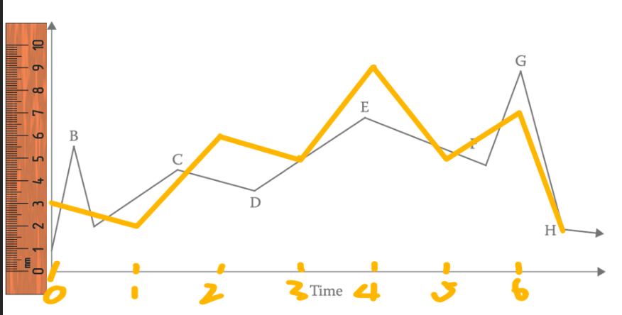
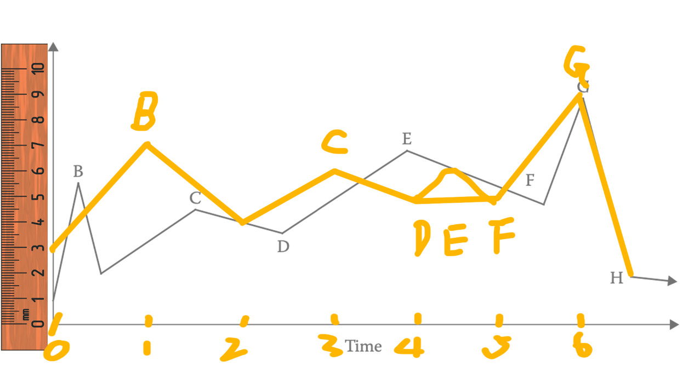

# 评价：
需要一个敌人。
旁观者是会员，主角是教练，敌人是“不佳状态”。
根据人际关系环状图：

会员 看待 教练：温柔 愉悦
“不佳状态” 看待教练：不受待见。

教练 看待 会员：帮助
“不佳状态” 看待会员：嘲讽

教练 看待 “不佳状态”：支配 发号施令
会员 看待 “不佳状态”：无助 想要退出

评分标准：健身教练 4 个性彰显 6
分段依据： 逆转 或 变化。
# 分段标记：
## 原文
1. Hi,我是 快乐温柔 健身教练 你可以叫我“骨头”。
2. 是 一枚管不住嘴但能迈开腿的 快乐 搞笑女。
3. 是 温柔浪漫 的 自由追随者。
4. 是 专注于 帮助女性对抗 不佳状态 的 健身教练。
5. 轻轻松松 减脂塑性 收获 翘臀美腿。
6. 不需感到无助 让我帮助你一起 对抗 喧闹的“不佳状态”吧！ 
## 评分
0. 2/4 1/6 = 3（照片印象分）
1. 1/4 3/6 = 4 -
2. 2/4 4/6 = 6 -
3. 0/4 5/6 = 5 -
4. 4/4 5/6 = 9 -
5. 4/4 1/6 = 5 -
6. 3/4 4/6 = 7 -
# 兴趣曲线:
修改前： 

修改后：

6 1 2 3 5 4
新增：是 曾经对 “不佳状态” 唯唯诺诺 的过来人。
2/4 4/6 = 6
润色：
1. Hi,对抗 吵闹的“不佳状态” 感到无助吗？ 让我来帮助你吧！
2. 我是 “骨头”, 你也可以叫我 “快乐温柔” 的 “骨头”。
3. 是 一枚管不住嘴但能迈开腿的 快乐 搞笑女。
4. 是 温柔浪漫 的 自由追随者。
5. 是 曾经对 “不佳状态” 唯唯诺诺 的过来人。
6. 是 现在 轻轻松松 减脂塑性 收获 翘臀美腿 的忠实伙伴。
7. 是 永远专注于 帮助女性(你)对抗 不佳状态 的 健身教练！
# 修改结果：
Hi,对抗 吵闹的 “不佳状态” 感到无助和逃避吗？让我来帮助你吧！
我是 “骨头”, 你也可以叫我 “快乐温柔” 的 “骨头”。
是 一枚管不住嘴但能迈开腿的 快乐 搞笑女。
是 温柔浪漫 的 自由追随者。
是 曾经 面对 “不佳状态” 唯唯诺诺 的过来人。
是 现在 可以 轻轻松松减脂塑性 收获 翘臀美腿 的忠实伙伴。
是 永远专注于 帮助女性(你)消灭 “不佳状态” 的 健身教练！