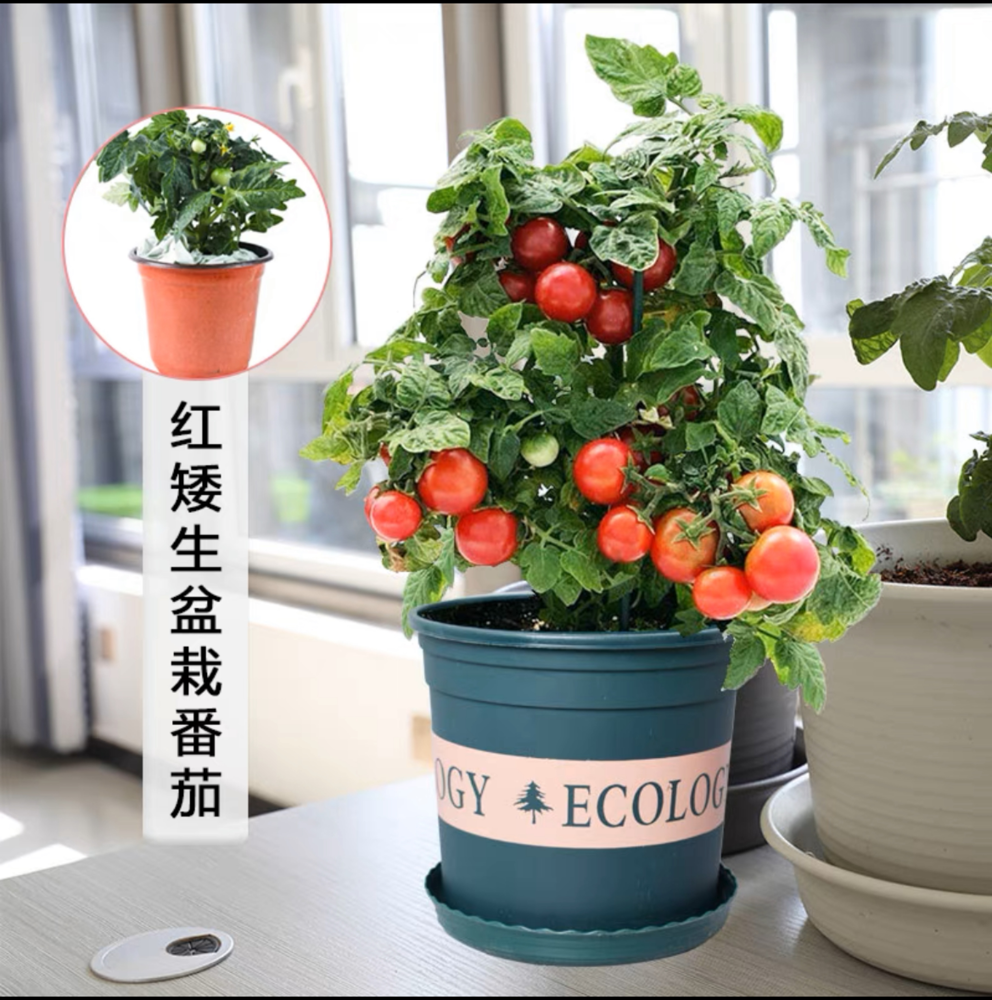

# 农业种植
- ref:https://www.picturethisai.com/zh-tw/care
## 番茄种植
- [picturethisai](https://www.picturethisai.com/zh-tw/care/Solanum_lycopersicum.html#Cultivation:PottingSuggestions)
### 矮生红番茄
- 期待结果：  
  
- 肥料：
  - 一个月后施肥，通用复合肥，一次15-20粒，埋入土壤表面1-2厘米  
  
- 营养土：
  - 一颗番茄苗 10斤营养土  
  
- 盆：
  - 1 加仑 一颗番茄苗  