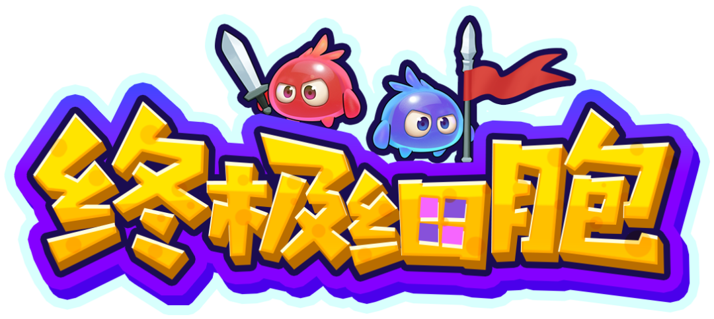
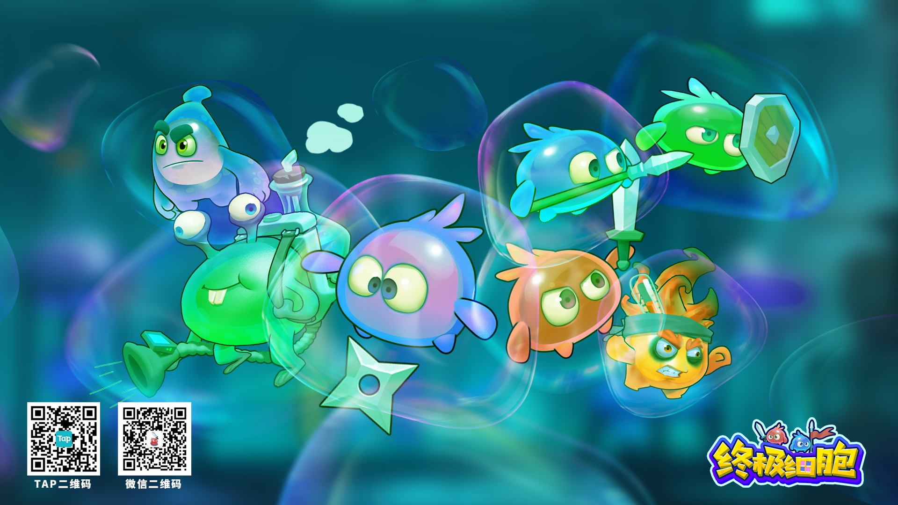
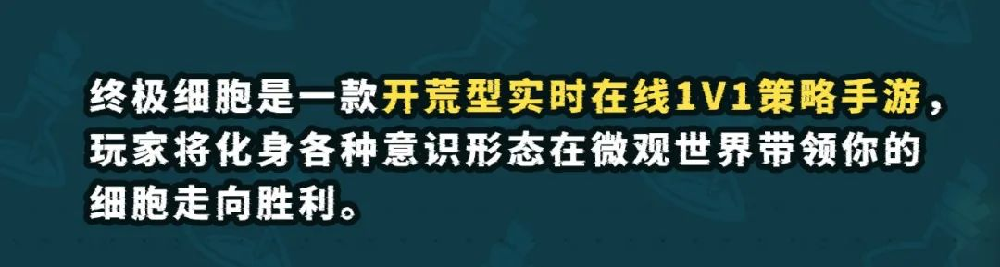
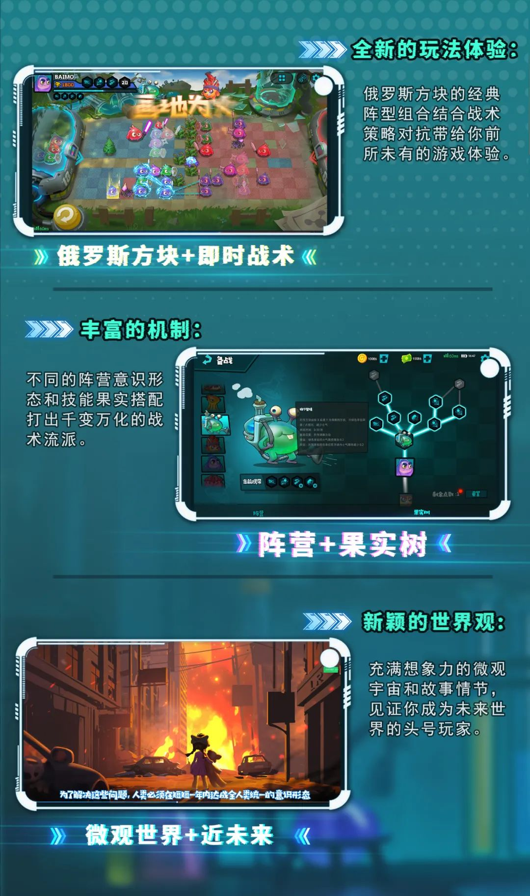
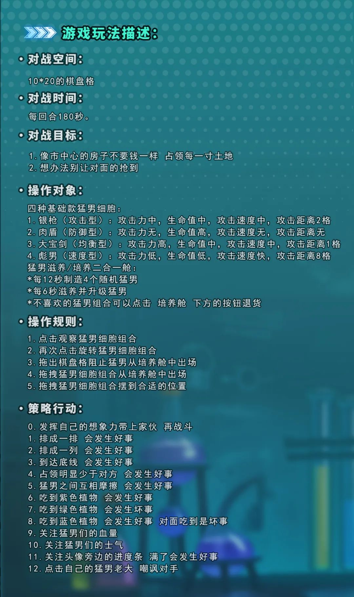
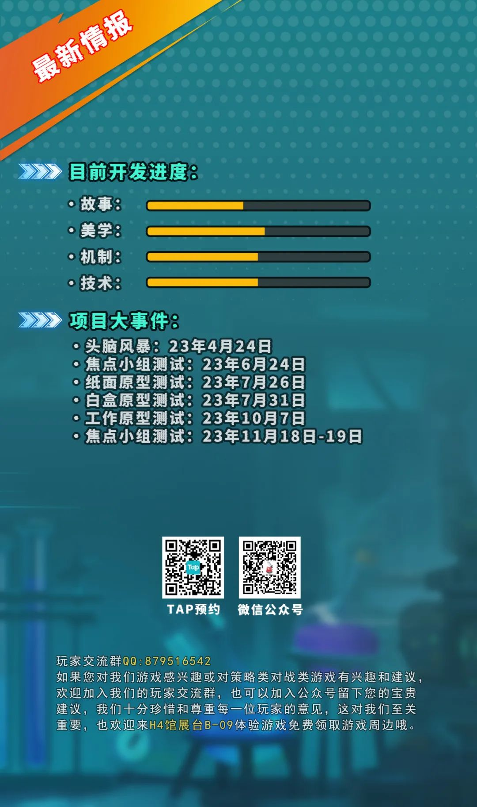
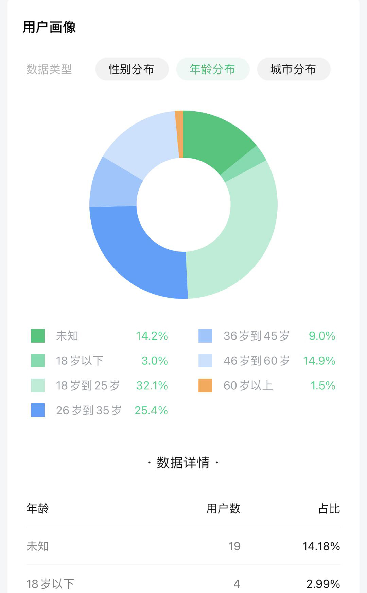
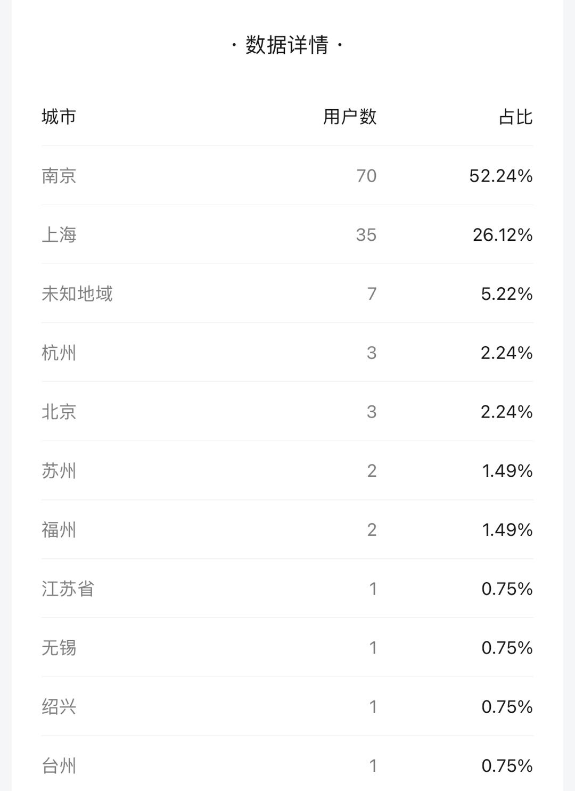
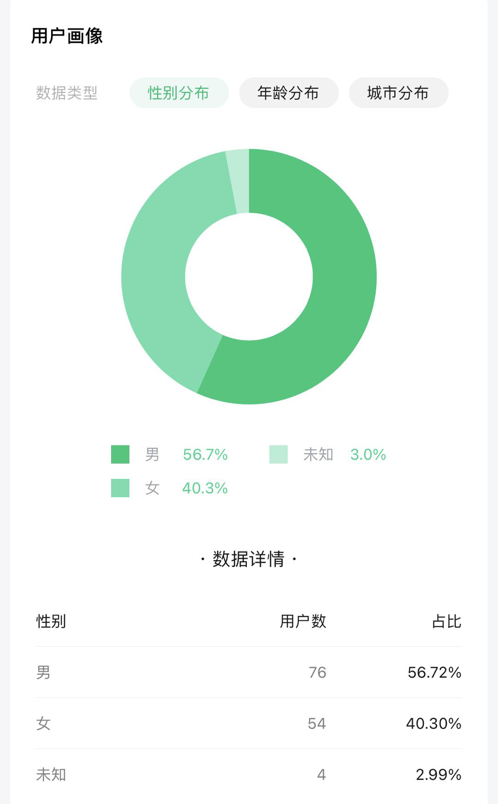

# 终极细胞 投资招募书
[]() 
## 概述
### 游戏简介
- 终极细胞 是一款
- 在线即时战术 科幻背景 游戏
- 玩法已经得到市场验证
- 产品具有三点特征：轻量 清奇 可病毒式传播
- 现阶段Demo展示：
- https://www.bilibili.com/video/BV13u4y1j7GK/
### 投资目的和意义
- 以独特创新的产品特征，以小成本，迅速有效的占据即时战术游戏的市场
- 产品已经完成了初步的开发和市场验证，拥有一定规模的玩家群体，需要投入资金进行后续的开发和推广

[]()
### 项目背景
- 在后疫情时代，和AI技术快速发展的时代背景下，中国游戏市场已经浮现出了一些新的趋势。
- 玩家对大公司普遍出现信任危机，优质的独立游戏团队如雨后春笋般涌现，煞有欧洲文艺复兴的态势，但整个行业甚至头部公司尚未形成可以保证产出质量的方法论，多以抄袭和借鉴为主，所以新时代已经到来，且市场格局尚未定型。
- 自从2015年之后，游戏市场份额得到验证，资本大量涌入游戏市场，这使得游戏全民化，彼时游戏多以本能冲动进入玩家视野，一直持续到今天。
- 在观察游戏市场发展时间较早的日本和欧美，不难得出玩家对游戏喜好的趋势是由：本能冲动层 转向 自我实现层。以日本为例，这一转折点出现在1990年日本经济衰退之后，而超级IP的崛起，如 超级玛丽、大金刚、柏青哥游戏机... 也是在这一时期前后。也许是在经济低迷时期人们的生存意义缺失导致的这一现象。
- 那些跟上玩家喜好趋势变化的公司，如任天堂，世嘉，索尼，科乐美，卡普空，南梦宫...获得了巨大的成功。
- 又如欧洲的工业革命，因继承了文艺复兴的精神，如约而至。这也映射着中国的现状，游戏行业的多元化会促成一次思想革命，继而影响到实体经济，所以当今的游戏行业应当承担更多的社会责任，以多元和创新造成一次有效的思想启蒙。

## 投资项目介绍
[]() 
[]() 
[]() 
[]() 
[]() 

## 投资需求
### 收益预期
- 将游戏市场目标定义为爆款产品。（月流水3000万以上）
- 手机端即时战术类，以SupperCell旗下的皇室战争为例，生命周期在5-6年。
- 以爆款产品配置团队，需要资金15万/月，预计开发周期为6个月，总计90万。

### 具体分配和预算
#### 产品开发成本
- 高级艺术家 2.5万
- 高级游戏设计师，高级前端工程师 2.5万
- 高级算法工程师 2.5万
- 高级架构师 3万
- 高级全栈程序 4.5万
- 高级执行策划 2万
- 商务 1万
- 初级程序 0.8万

- 研发外包项目：2万
  -  美术外包：2万
  -  音乐外包：0.12万
  -  程序外包：单次 0.5万
  -  发行外包
- 杂项费用：1万
  -  场地租金
  -  行业交流
  -  团建
- 总共：15.5万/月

## 团队介绍
### 当前全职
- 高级艺术家：
  - 张亚飞 
  - 11年工作经验
  - 有爆款项目经验
- 游戏设计师，高级前端工程师：
  - 沈捷翔
  - 10年从业经验 
  - 伦敦金斯顿游戏设计硕士
- 投资人，商务：
  - 缪明辉
  
### 待招募人员
- 高级后端算法工程师：
  - 张威 
  - 10年+从业经验
  - 曾经任职国家航空航天局
- 高级计算机科学架构师：
  - 裴国威
  - 10年+从业经验
  - 现任南京艾迪亚技术总监
- 高级主策划：
  - 多位人选待定

## 市场验证
### 市场定位
- 拥有碎片时间的18-35岁都市泛用户
### 用户画像
[]() 
[]() 
[]() 
### 营销策略
- 通过极致的游戏品质和创新的玩法获得种子用户
- 通过在线游戏的方式，造成病毒式传播，迅速扩大用户规模
- 前期在版号申请期间，以用户日常消费获得游戏内奖励的模式
- 和线下第三方支付平台合作，收取用户引流费用
- 后期在版号申请通过后，获得除引流费用外的游戏内购获得的收入

## 风险控制
### 可能面临的风险：
- 服务器风险：
  - 一台服务器可能只够数千个玩家同时在线，一台服务器的成本在三到五万元之间。
  - 很多网游的服务器都是一组好几十台上百台，这个成本就非常高了。
  - 腾讯云的一台4核8GB服务器为例，如果需要200M的带宽，价格是16043.50元一个月。
- 前期投入产出比风险：
  - 在获得版号之前，游戏无法获得收入。
- 人员流动风险：
  - 关键/高级岗位人员产生流动。
### 风险控制措施和预案：
- 服务器风险：
  - 按照最好的情况判断，我们可以把游戏优化到极小的带宽以缩减开支。
  - 最差的情况，在盈利之前，游戏需要离线模式，或者局域网连接对战，形式的客厅游戏，以减少服务器开支。
- 前期投入产出比风险：
  - 因为团队规模比较小，且产品创新而精美，符合独立游戏参赛资格。可以尽可能的参加比赛以抵充前期的成本。
  - 或者在获得版号之前，先在海外平台上线离线版本，或者将体量缩小到微信小游戏的规模，获取广告收益。
- 人员流动风险：
  - 保证匠心的核心团队的品质，打造一支值得互相信赖的精英团队。
  - 需要有更远大的目标，以激励人员的长期投入。
  - 除了金钱激励，还可以给予期权激励，以减少人员流动。
## 预期成果
### 产品目标：
- 就如我们Weplay的首次参展，将产品影响力，在2天内从20人扩大到200人，在内地市场尚未成熟之前，我们需要以最快速有效的手段扩展到亿级用户。
### 发展规划：
- 在获得足量的影响力后
  - 可以参考 SupperCell 旗下产品
  - 公司成立于 2010 年 5 月 14 日
  - Kodisoja 、 Paananen 向该公司投资了25万欧元。
  - 芬兰技术创新融资机构Tekes向他们提供了40万欧元的贷款。
  - 次年10月，Supercell通过种子轮融资筹集了75万欧元，其中包括来自London Venture Partners和Initial Capital的资金。
  - Supercell 开始开发的第一款游戏 Gunshine，可以在Facebook上使用浏览器或移动平台玩。游戏原型在八个月内就准备好了。 
  - Gunshine完成后，Accel Partners也于2011年5月向该公司投资了800万欧元。
  - 2011 年 11 月，Supercell 放弃了 Gunshine。
  - 原因有三个：
  - 玩家兴趣不够长、玩起来太难了、移动版效果不如浏览器版。
  - 充其量，该游戏有大约五十万玩家。
  - 2012 年 5 月，Hay Day 成为 Supercell 的第一款国际发行游戏。
  - 在 2013 年每天产生 200 万欧元的收入。
  - 在两年半的时间里成为世界上最赚钱的游戏之一。
  - 该游戏会定期更新，并由一个由14人组成的团队进行维护。
  - 2016年，该公司腾讯控股以84亿欧元的价格收购了该公司81.4%的股份。
  - 旗下五款手机游戏：Hay Day、Clash of Clans、Boom Beach、Clash Royale、Brawl Stars
  - 这些游戏都是免费游玩的快节奏游戏

- 我们需要改变市场对游戏行业的刻板印象
- 让游戏可以承担更多社会责任
- 我们需要反哺实体经济
  - 2023年，伽马数据在用户调研中发现
  - http://www.stcn.com/article/detail/989882.html
  - https://m.civiw.com/report/20220928094207202
  - https://36kr.com/p/1932732031797891
  - 有近六成IP用户,会优先选择IP产品。
  - 例如：
  - 原神 国内外联动/联名活动高达13次
  - 其中包括：必胜客、肯德基、凯迪拉克、罗森...
  - 荒野大乱斗 和 Taco Bell
  - 但鲜有下沉市场的IP产品
  - 所以各类第三方支付小程序将成为我们的突破口。
- 以达到社会级别的共赢
- 在财力和社会影响力达到一定程度后
- 我们需要进入科技领域，打造一种闭眼就可以上传意识的传输设备
  - 可以参考 伊隆·马斯克 和八名其他联合创办者创办的 Neuralink
  - Neuralink 于2016年成立
  - 2019年7月，它已收到1.58亿美元的资金（其中1亿美元来自马斯克）
## 投资计划
### 时间表
- 封闭测试：24年2月 - 15万
- 内部测试：24年3月 - 15万
- 终极测试：24年4月 - 15万
- 正式上线：24年6月 - 30万
- 运营维护：24年7月 - 15万
### 详细计划
```
计划由市场反馈和游戏主题驱动
```
#### 战斗界面
- 前期优先级：
  - 拖动放置的操作算法优化，目前反馈手感卡顿。
  - 战场对象的 “详细信息” 二级弹窗。
  - 双方士兵的区分度增强。
  - “棋盘格” 过于密集导致操作困难，需要优化。
  - 需要比占领格子为目标，更疯狂的体验。
  - 改变战斗时飘字的表现形式，目前过于突兀。
  - 作战士兵的状态系统，方便玩家清晰了解士兵的状态。
  - 需要多一些可对战场造成直接影响的“操作”设计。
  - 增强俄罗斯方块的玩法反馈。
  - 增强士兵行为的反馈，让士兵之间的战斗更加有趣。例如互相推搡。
  - 士兵的血量系统需要优化，目前反馈较弱，且不明确。
  - 单边兵种之间的区分需要增强，目前差异较弱。
  - 整体画面再做减法，部分玩家反馈观感过于复杂。
  - 以强上手反馈为目的，需要形状特征产生的合成 系统/机制，例如: 2x2 合成一个大单位。
  - 以强上手反馈为目的，可以增强一些单位之间的协同和互动。
  - 需要合并一些复杂的机制，做到“小而集中”。
  - 为了强调表达的流畅度，需要区分离散和连续空间。目前完全是离散的空间。
  - 为了增强上手度，玩家的每一步操作需要增加对战场的影响。
  - 为了增强上手度，需要一种方式让玩家更容易的选中自己想要的单位。
- 中期优先级：
  - 为了强调战术，需要有很明确的优势劣势示意。
  - 为了增强战术，兵种之间需要存在一种强克制关系。
  - 刷新功能的 “时间成本高” 的收益过小，导致玩家不愿意使用，需要优化。
  - 如何打出类似“屯牌”的操作，以增加玩家的战术感。
  - 需要为 “假动作”保留一定战术空间，而非完全明牌。
  - 需要增强一些可以翻盘的机制。
  - 以新手引导为目的，需要单机PVE引导部分。
  - 为了让过程体验更加流畅，需要对前期和后期的“垃圾时间”做一定的处理 和 设计。
- 后期优先级：
  - 以强机制反馈为目的，配合砖块形状，设计英雄单位产出机制。
  - 继续强化 道具 技能 被动 此类属性 以增强战术感。
  
#### UI界面
- 前期优先级：
  - 为了增加玩家的粘性，和单局战术的变化，需要增加卡牌的构筑系统。
- 中期优先级：
  - 设计有效的经济循环系统，以增加玩家的粘性。
  - 增加英雄的选择，以增加玩家的粘性。
- 后期优先级：
  - 信息的“红点提示”系统搭建（可选择关闭提示）。
  
#### 其他
- 前期优先级：
  - 整体体验设计：
    - 需要“消消乐”般的强上手反馈，
    - 中期强调战术化深度，
    - 后期强调知识产权运作 和 大世界观的建立。
- 中期优先级：
  - 以增加 战术点 和 战术差异化 和 博弈空间 为目的，接入“果实”系统。
  - 以心流曲线设计 和 付费点 为目的 进行 数据埋点。
- 后期优先级：
  - 音乐/音效 部分被部分 玩家反馈过于“沙哑”，需要优化。

## 合作意向
- 国内发行商
  - 游族网络
  - 北京海中游科技
  - 上海游陆信息科技
  - NeoGamer
  - 663Games
  - Pixmain
  - 狗狗社
- 海外发行商
  - GameConnection
  - Sofish
  - 101XP
  - crpk.pl
- 媒体曝光
  - ChinaJoy
  - Weplay
  - Noctua Games
  - 游戏陀螺
  - 游益
  - 机核网
  - 好游快爆
## 联系方式
- 沈捷翔
- 邮箱：752523247@qq.com
- 电话/微信：15365119616 