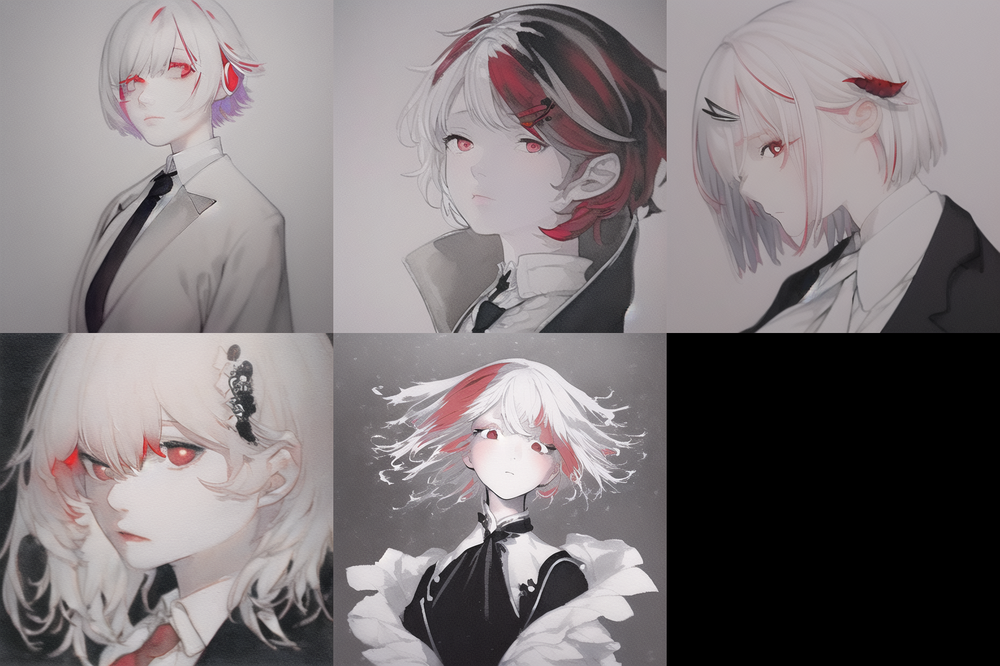
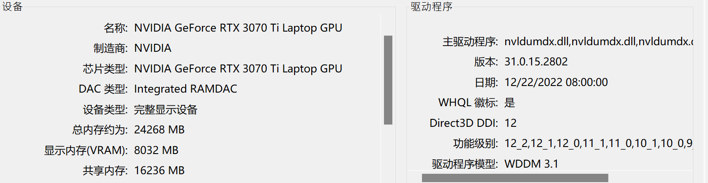
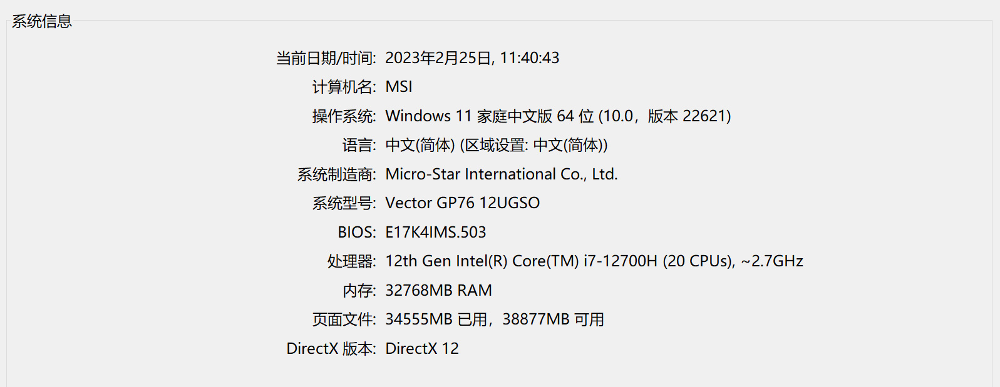
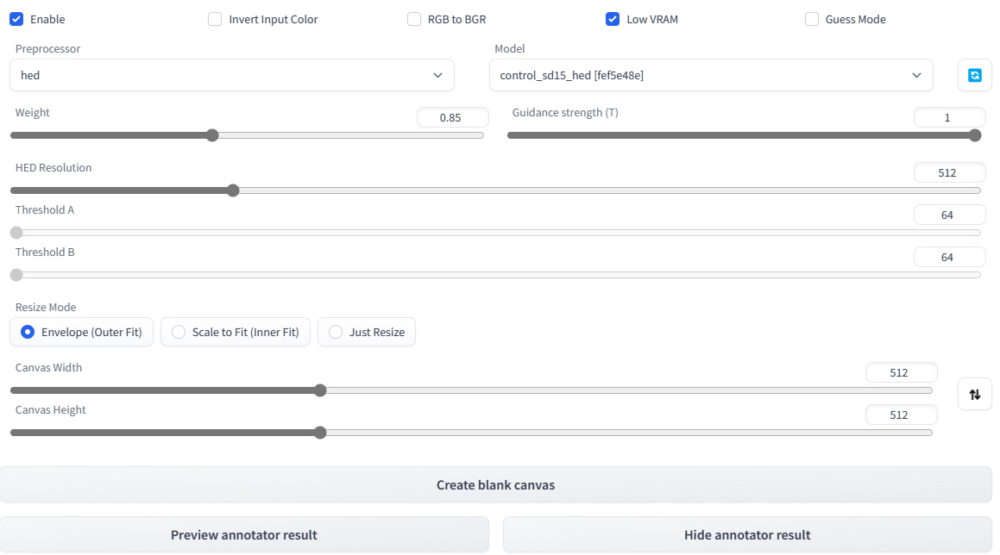

# 研究报告：
## 2023/2/25：
- 输入prompt：极度清秀的女孩，视野开阔，态度冷淡，红瞳短发，白发五彩，黑色西装领带，发饰发夹，看起来很清爽，侧脸，白皙大气，单个女孩，{{{ 水墨画}}}，白色背景，干净的黑白衣服
- 输入图片：（来源：sjzj\参考资料\《绣春刀》）  
   

- 文本自由输出：  
    

- ControlNet输出：    
    

- 神经网络架构：ControlNet(0feca46f (Fri Feb 24 23:45:07 2023)) + stable diffusion   
 
- 选择模型：NovalAI (52.1G版本)  

- 前端框架：基于 webUI 的 AUTOMATIC1111   

- 计算机配置：  
  - 显卡：  
 

  - 系统CPU：  
 

- 参数设置：
  - Sampling steps：20  
  - Batch count：5 / 10  
  - Seed：-1  
  - CFG Scale：8.5  
  - ControlNet：  
  -  
  - 平均输出时间：30s