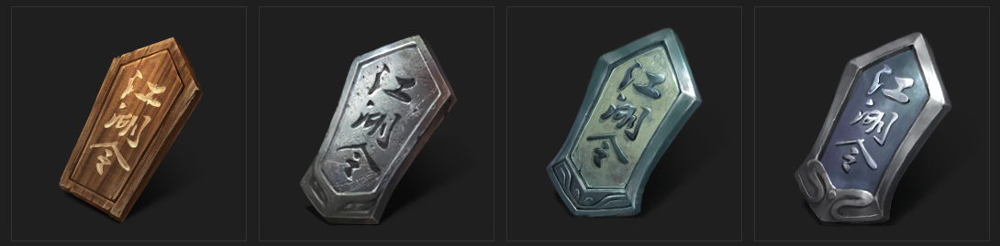
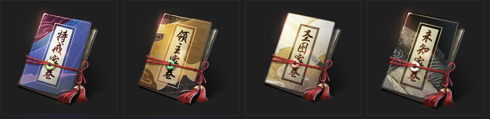
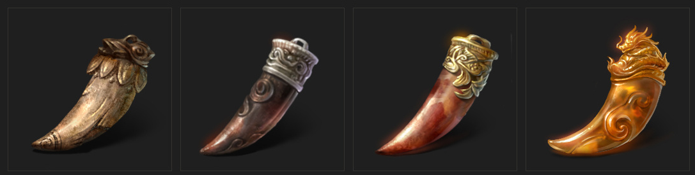
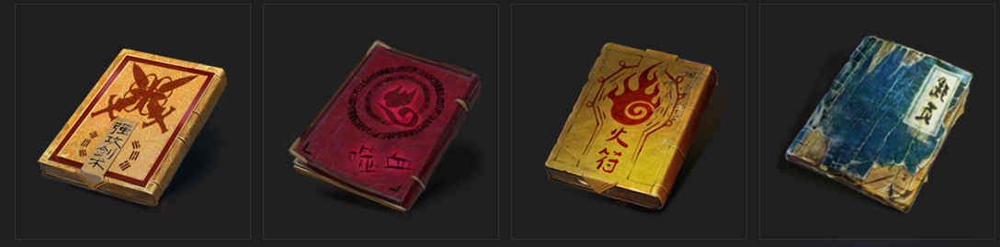
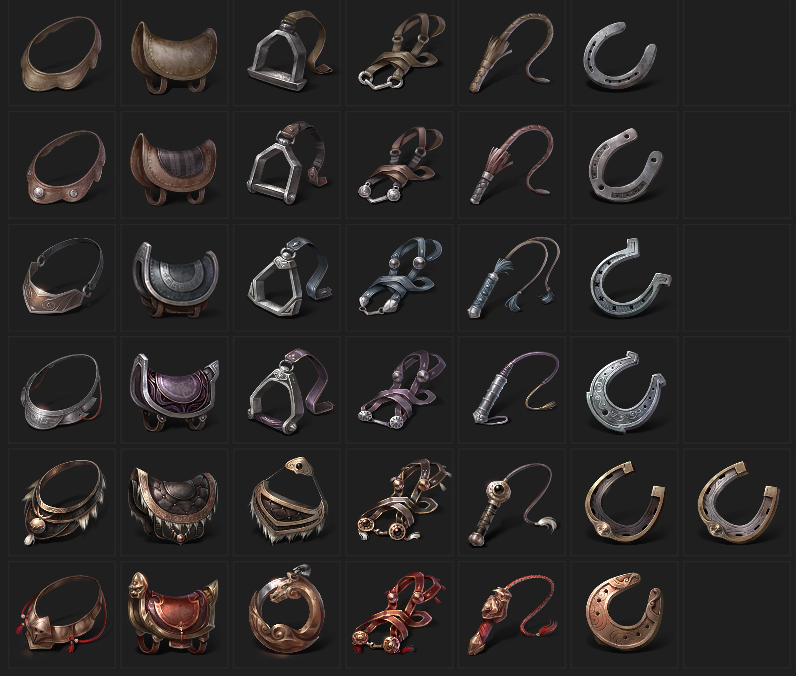

# UI 操作文档
## 架构
- Dlg面板
  - 描述：用于创建新面板窗口
  - 案例：Assets/Bundles/UI/Dlg/DlgNPCShop.prefab
- ES组件
  - 描述：封装的可复用（超过一处使用）元素集合
  - 案例：Assets/Bundles/UI/Common/Bag/ES_BagEquipCell.prefab
- item元素封装的可复用元素集合
  - 描述：为代码访问需求最小的元素
  - 案例：Assets/Bundles/UI/Item/MainUI/Item_Main_Chat.prefab
## 命名规范
- `E`（Entity）开头：程序需要访问
- `Item_`：为代码访问需求最小的元素
- `ES_`：封装的可复用元素集合
- `Dlg`：面板窗口（最大的集合）
## 依赖组件API
- [UGUI](https://docs.unity3d.com/Packages/com.unity.ugui@1.0/manual/index.html)
- [EUI](https://www.bilibili.com/video/BV12F411e7bP/?spm_id_from=333.337.search-card.all.click&vd_source=462273e904a605ba75ed3099598ed865)
- tips：无遮挡不勾选 Image 组件的 Raycast Target
- tips：记得为AssetBundle打包命名
## 资源文件
- 分类存放依据：
  - 为了运行时最有性能，按照功能一个文件夹代表一个图集。
  - 大图为了减少图集的无效像素，存放在文件夹根目录，不进入图集。
- UI引擎路径：
  - Bundles/UI(所有预制体存放处)
    - Common(公共UI:`ES_`的存放处)
  - Res/UI(所有2D精灵存放处)
    - UIIcon
    - UITex
- tips：如果已有类似结构的UI文件目录，复制 大于 创建。
- [UI设计资源](https://app.mockplus.cn/app/7DyQnIglMW/design/design?hmsr=share1)
- [UI切图资源](sjzj\Resources)
## 添加新字体（textMeshPro）
### 新增内容添加到多文本
1. 如果字不多创建动态字体，如果字多创建静态字体 
   - 创建方法：https://zhuanlan.zhihu.com/p/375889482
   - .TTF放在： Assets/TextMesh Pro/Fonts/
   - 生成的unityAsset放在： Assets/TextMesh Pro/Resources/Fonts & Materials
1. 添加 UIConfigStringReader 脚本到 文本组件
2. 修改/添加 Excel表：Assets/Config/Excel/ConstStringConfig.xlsx
3. 同步表：ET-BuildTool-ExcelExporter
4. 运行时读表检查：修改UIConfigStringReader 看对应值是否显示
## 操作：
1. 自动以栈排版
  - 父级添加组件：HorizontalLayoutGroup + ContentSizeFitter(每个子集都会带有)
  - 添加子物体
## 插件
- unity自动排版（预研）
  - ref：https://github.com/kyubuns/Baum2
  - 脚本存放路径:D:\Apps\PhotoShop\App\Adobe Photoshop 2021\Presets\Scripts
  - 入口：文件->脚本->Baum
  - 脚本语言：javaScript
  - 其他：目前不支持中文命名,命名通过图层组+图层名称（目前最多两级）
# AI 生成Icon工作流
## icon参数
- 参考风格：
  -   
  - 
  - 
  - 
  - 
- 参考：
  - https://www.reddit.com/r/StableDiffusion/comments/104tav4/one_of_my_favorite_prompts_dreamlike_photoreal_20/
  - https://ai.dawnmark.cn/
## dreamLike
- 必须加入prompt
  -  (Rays of Shimmering Light:1.2),Dripping Paint,
  -  外观描述 + 材质描述 + 细节刻画
  -  Artstation,detailed and intricate,Post Processing,Rays of Shimmering Light,Hard Lighting,Ultra-HD,2.5D,Light Mode,Cinematic,illustration
  - Negative prompt：
    - lowres, bad anatomy, bad hands, text, error, missing fingers, extra digit, fewer digits, cropped, worst quality, low quality, normal quality, jpeg artifacts, signature, watermark, username, blurry

## artPaint
### v1
- A money bag, ancient jewelry, cotton linen, a little Chinese pattern, linen gray, a little glossy, red knot, bowknot, martial arts, elegant, realistic, delicate,white background,
- fantasy, intricate, elegant, highly detailed, anime, artstation, concept art, smooth, sharp focus, illustration, art by artgerm and greg rutkowski and alphonse mucha
- Negative prompt: 3d, render, doll, plastic, blur, haze, monochrome, b&w, text, (ugly:1.2), unclear eyes, no arms, bad anatomy, cropped, censoring, asymmetric eyes, bad anatomy, bad proportions, cropped, cross-eyed, deformed, extra arms, extra fingers, extra limbs, fused fingers, jpeg artifacts, malformed, mangled hands, misshapen body, missing arms, missing fingers, missing hands, missing legs, poorly drawn, tentacle finger, too many arms, too many fingers, watermark, logo, text, letters, signature, username, words, blurry, cropped, jpeg artifacts, low quality, lowres
- Steps: 25, Sampler: DPM++ SDE, CFG scale: 11.5, Seed: 715233396, Size: 512x512, Model hash: 0aecbcfa2c, Model: dreamlike-diffusion-1.0, ControlNet Enabled: True, ControlNet Module: hed, ControlNet Model: control_sd15_hed [fef5e48e], ControlNet Weight: 1, ControlNet Guidance Strength: 1 

### v2
- A grey cotton money bag , tied with rope , scattered golden coins,
- fantasy, intricate, elegant, (highly detailed:1.2), anime, artstation, concept art, smooth, sharp focus, illustration, art by artgerm and greg rutkowski and alphonse mucha,
- (Shadows:0.01),Screen Space Global Illumination,(front upper right Soft lighting:1.2),Light Mode--no blur
- Negative prompt: 3d, render, doll, plastic, blur, haze, monochrome, b&w, text, (ugly:1.2), unclear eyes, no arms, bad anatomy, cropped, censoring, asymmetric eyes, bad anatomy, bad proportions, cropped, cross-eyed, deformed, extra arms, extra fingers, extra limbs, fused fingers, jpeg artifacts, malformed, mangled hands, misshapen body, missing arms, missing fingers, missing hands, missing legs, poorly drawn, tentacle finger, too many arms, too many fingers, watermark, logo, text, letters, signature, username, words, blurry, cropped, jpeg artifacts, low quality, lowres,(colored background:1.6)
- Steps: 25, Sampler: DPM++ SDE, CFG scale: 11.5, Seed: 715233396, Size: 512x512, Model hash: 0aecbcfa2c, Model: dreamlike-diffusion-1.0, ControlNet Enabled: True, ControlNet Module: hed, ControlNet Model: control_sd15_hed [fef5e48e], ControlNet Weight: 1, ControlNet Guidance Start: 0, ControlNet Guidance End: 1