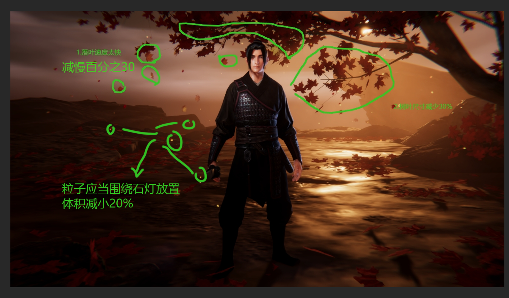
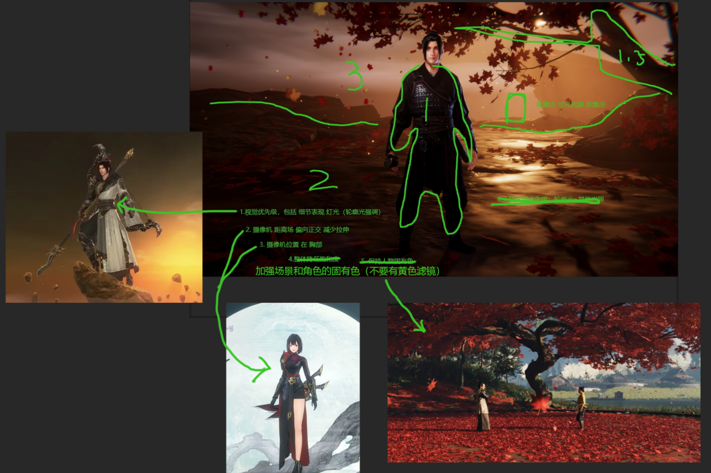
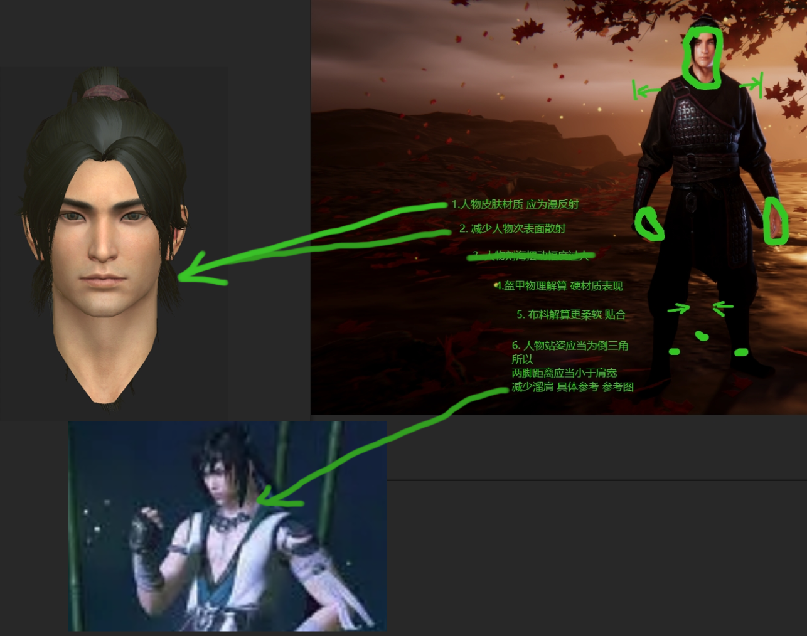

# 2023/1/31 预计完成时间：2023/2/7
1. 落叶速度减慢30%
2. 树叶尺寸减少30%
3. 粒子应当围绕石灯放置且体积减小20%  
 

4. 视觉优先级划分如下图所示；划分依据：
   - 硬边轮廓光
   - 细节表现
5. 摄像机的FOV调整 偏向正交，减少人物拉伸
6. 摄像机位置调整：高度为胸部
7. 不要有黄色滤镜，且加强场景内所有物件的固有色  
  

8. 人物材质为漫反射 且减少此表面散射 具体效果如图所示
9. 盔甲的物理解算 硬表面材质
10.  布料解算应更加贴合实际物理材质
11.  人物站姿应当为倒三角所以：    
    - 两脚距离应当小于肩宽  
    - 减少溜肩 具体效果见效果图   

