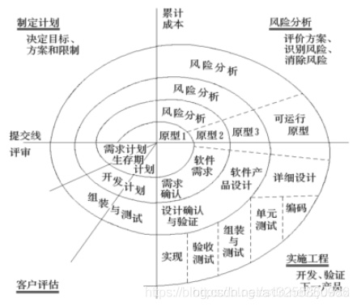

# 上线需求
- 剧情：9章故事
- 机制：核心至少新增5项：
  - 商城系统如何融入？
  - 游戏如何体现内容？
  - 游戏体现良心？
  - 游戏体现公平？
  - 游戏体现爽感？
- 技术：新增 hitbox 和 漫画叙事系统 和 Animacer
- 艺术：剧情漫画9章
- 综上：至少还要新增两版策划案

# 人才需求
- 用户体验设计
- 宣发
- 导演
- 文案专业
- 经济学专业
- 技术艺术家
- 计算机科学专业
- 计算机图形学专业
- 数学专业
- 音乐专业
- 心理学专业
- 声音设计师
- 技术性作家（写文档）

# 时间需求
- 按照巴里.伯姆模型 两版策划案 以4次原型迭代 每次持续3周 
- 
- 总共时长 24周
  
