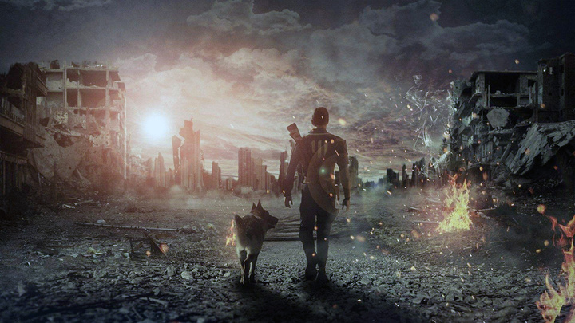
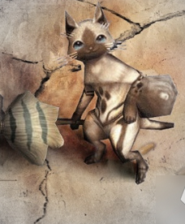
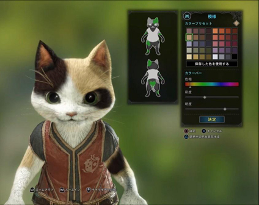
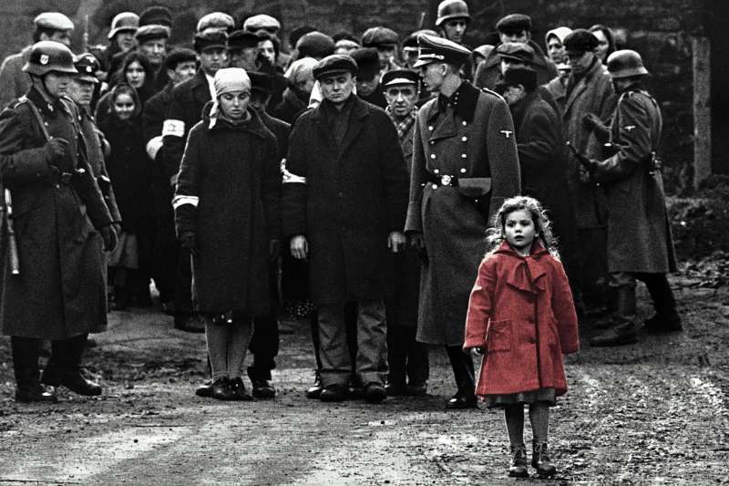
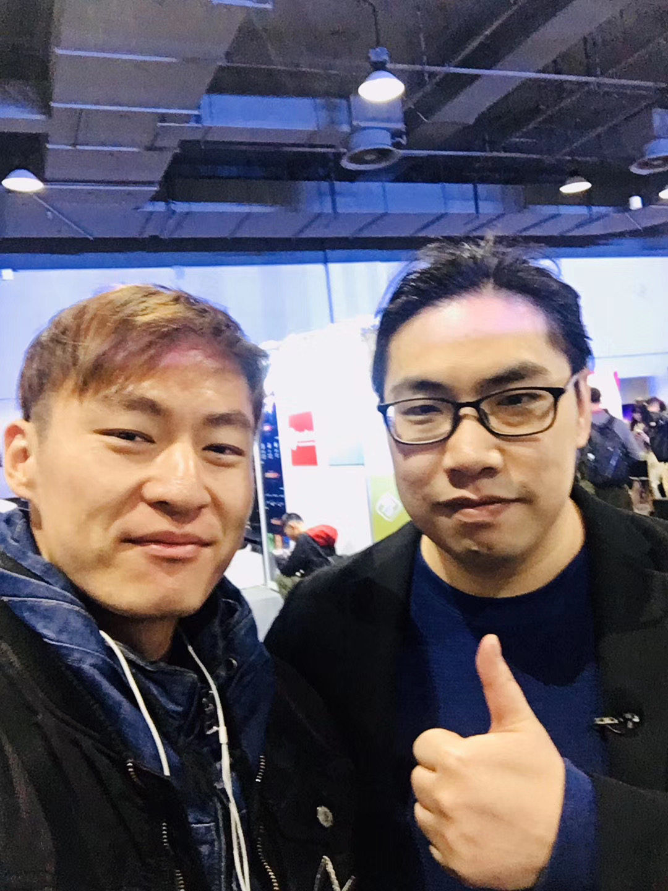
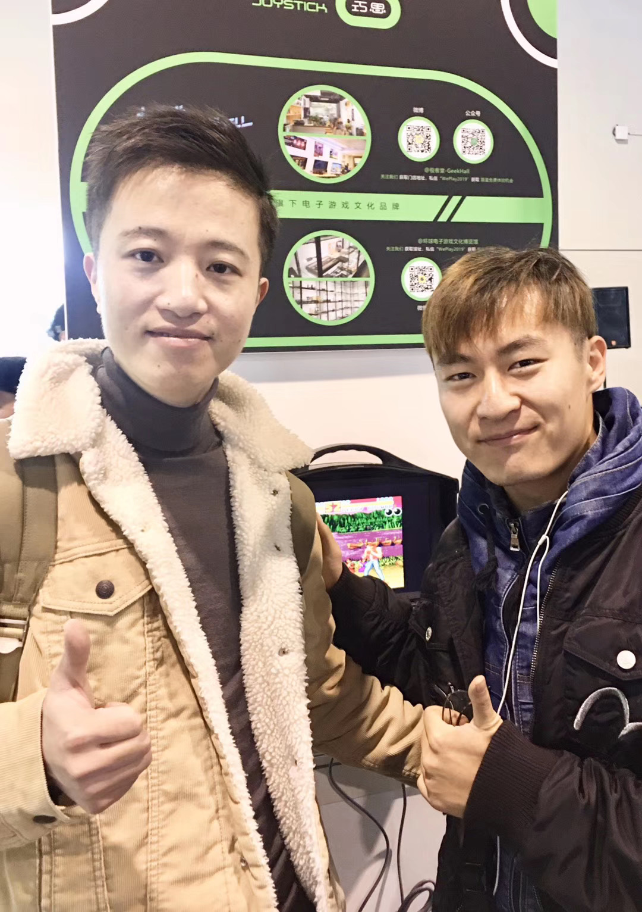

# 客户话语的思考
## 话语 中需求是什么？
1. 具有深度的游戏
   - 内容：完善的剧情和美术，完整的美术性和没有BUG的功能。
   - 良心：平等交换的权力。
   - 公平：分场景享受。
   - 爽感：丰富的操作。
2. 商业目的
   - 市场影响
     - 吸引传统MMO玩家（时间收费/内容收费），期待好玩且舒适的游戏，引起口碑质变，让我们部分受众群体信赖我们的产品，以及愿意付费，让我们的商业模式引起市场震动。
   - 盈利方式
     - 框住核心玩家，重视留存（次留），辐射玩家生活圈（商城），多种渠道商业变现，联合运营，达成巨量交易。
## 想法 中想要什么？
1. 自己需要爱玩这款游戏 推荐给身边同样玩MMO的玩家
2. 赚钱 的同时 让自己以少胜多的战役载入史册
## 内心 愿望是什么？
1. 可以达到病毒式营销，可以让游戏的生命周期达到10年以上
2. 营收可以比肩 甚至战胜 BTA 网易 字节
## 我们提出的主题：
   - 基于 客户提出的以上目的结合 制作人提出的 核心体验：宁有种乎 睚眦必报 花前月下 率土之滨 国仇家恨
   - 结合我们已有的美学风格，首先想到的 是 死亡。
### 以 死亡 为主题是不是好的idea？
   - 关于死亡分为死前和死后
   - 这里有一些关于死前的心理学数据（我们可以客观参考的数据也只有死前数据了）：我找到了3条可能有用的数据：
     - 1.在白人中，想到死亡甚至会使他们更青睐鼓吹自己群体优越性的种族主义分子。（Greenberg）
       - 我本人并不支持种族主义，但听起来很适合让给我们借助这点，带玩家体会国仇家恨。
     - 2.心中想到死亡时，人们就会采用"恐惧管理"（terrormanagement）.即藐视那些不断挑战他们的世界观、使他们感到焦虑的人。当人们已经感觉到他们有可能死亡，偏见会支撑起一个奇怪的信念系统。不过，有关死亡也并非一无是处，想到死亡，可能导致人们努力追求公平的情感，如团结精神和利他主义。（McGregor）
       - 这点心理学数据有助于我们让玩家有自己建立公平的欲望，从而让支持盛国朝廷的更有意义。
       - 同时加深对对敌人的藐视。
     - 3.死亡会提醒我们重视归属需要，重视与他人的关系并与我们所爱的人保持亲密。（Mikulincer 2003）面对9.11恐怖事件，面对疫情肺炎，数以百万的人们都与自己心爱的人通了电话。同样道理，同学，同事 或 家庭成员的突然死亡也会使人们之间的关系得到加强，无论他们曾经有过什么分歧。
       - 综上，死亡的概念 有助于建立 “花前月下” 系统，也可以利用这点让玩家之间的联系更加紧密。
   - 关于死亡研究的人类学方法论：
     - 关于 奈吉尔巴利 对非洲进行的人类学考察，得出一下与死亡有关的记录：
     - 天气越发炎热，偶尔会大雨倾盆，我开始午后游泳。多瓦悠兰地区的水十分危险，蕴藏多种地方特性 特有的吸血虫，最恐怖的是住血吸虫。不少多瓦悠人都染有此种疾病，它会造成内出血，导致恶心、虚弱，最后死亡。此地人平均寿命很短，很多人都熬不到寄生虫病的最后阶段便死亡了。...
       - 这个是很精彩的关于疾病死亡的描述，我认为可以从中提取体验加入我们的游戏。
     - 多瓦人在11月初小米收成到第二年11月为一年，不少人趁着小米丰收，为祖灵筹办 头颅祭。多瓦悠人死了后，尸体以尸布、牛皮包裹。尸体以屈膝抱缩的坐姿下葬。裹尸时特意会露出脖子脆弱处，两周后，死者的头颅便自此处砍下。详细检查头颅未被诅咒，便可以放置在树内的瓦罐中。男性的头颅放在茅屋后面的丛林中，那是头颅最终安息的地方。女性的头颅则会被送回她出生村落的一栋茅屋后，寓意着死后落叶归根。在某一时刻，亡灵可能会骚扰亲人，出现在他们的梦中，让他们生病，拒绝进入子宫转世。这就是该准备头颅祭的征兆了。通常会举办两场啤酒宴，如果无人有异议，便可举办头颅祭。
       - 听起来十分野蛮粗暴，迷信落后，但又符合情理，因为它廉价却符合对平安的期许，经过成功提炼，可以为我们的游戏增加 破败和肃杀 的氛围感。
   - 关于死亡的设计学经验：
     - 奇普.希思 的 行为设计学 一书中有如下和死亡相关的描述：
     - 歌颂情谊，珍惜情谊。
       - 一位儿子去世的母亲说：“当他去世的时候，朋友们不知从哪一股脑的涌出来” 并 伸手相助。身处患难中的人们还发现，他们能以更深厚的同情心和同理心去对待其他身处痛苦或悲哀中的人。许多痛失儿女的父母都发现，朋友因为害怕触及他们伤心的事而渐渐不再提起他们去世的孩子。但是，失去过孩子的父母都明白，孩子的影子永远挥之不去的。因此像这样的发话 “ 马克 如果在的话，该会多享受这场球赛呀。” 这样的话语，更容易被人们当作体贴而温暖的问候，而不是重揭伤疤。
         - 这一点很重要，因为我们的游戏中 会因为剧情出现身边 好友/同伴/亲人...死亡的场景，如果玩家真的带入进角色，重新提到那些亲近的死去的人们，会被当做温暖而有人情味。
     - 认识自己的力量。
       - 一位刚刚痛失孩子的家长说：“我在面对事情时变得更加从容了。之前看上去天大的事情，也显得不那么重要了。” 人们会把创伤作为一把尺子，测试自己 突破自我、忍受艰难 以及 百折不挠的能力。 许多人都会说：“如果我能应付得了这件事，那么其他任何事都不成问题”。
         - 所以我们游戏的面对死亡的残酷主题，会让人们在现实中变得更有自信突破自我。
     - 寻找新的可能性。
       - 经历过创伤的人有时会发现自己能在生活中挖掘新的可能性：比如 新的工作，新的爱好，以及新的道路。一些人会在一扇门关闭的时候，发现另一扇门的开启。
         - 这同样是我们的游戏在玩家游戏过后回归现实能给玩家带来精神层面的益处。
     - 寻找灵性上的认知。
       - 即便时没有信仰的人，也能对 “ 关乎人类存在的基本问题上产生浓厚的兴趣，而这种兴趣本身便有可能成为一种成长的体验”。
         - 或许我们的游戏选择这个主题，能成为一个建立信仰的平台，或者是一个让人们重新认识自己的平台。
### 为什么不把视角更加聚焦一些？
- 客户的要求是要承载多种形态的玩家的，框架过于狭窄会难以承载如此多类型的玩家。
   - 基于综合考量我们核心主题定为：向死而生  
（回到PPT）
# 关于设计方案的问题

## 为什么推建这套设计方案？
- 当下的游戏要成为一款好游戏，缺什么？
  - 缺少主题，导致团队没有发力点
  - 缺少流畅而密集的体验
  - 缺少类似于盛国政府的角色，来保证游戏的公平性
  - 缺少照顾不同类型玩家的，不同体验
  - 缺少丰富的操作
  
- 为什么玩家会想把这款游戏推荐给我的朋友？
  - 如何做好深度社交？
    - 让现有玩家愿意且有渠道主动邀请。
  - 其他还有待思考
  
- 我可以在这个游戏中沉浸多久？
  - 每一次的死亡都会让玩家审视自己的选择，并思考重新来过会怎样，这样就可以利用好奇心增加沉浸时长。
  - 利用玩家的好奇心，直到玩家把所有的死亡排列组合体验完，这个游戏才算结束。所以只要拓展足够精彩的死亡体验，理论上可以产出无数种排列组合，就可以持续引发玩家的好奇心。
  - 其他还有待思考
  
- 这套设计是什么会让玩家消费？
  - 死亡是一种体验，而不是一种惩罚。死亡是为了让玩家体验这个世界的残酷。
  - 因为 圆梦猫 是这个冰冷而残酷的世界中，唯一会一直善意的陪伴玩家的设计。（即使后面出现情缘，也不是不可以剪断的）所以 圆梦猫 对玩家而言是具有唯一性。
  - 圆梦猫 还代替了邮箱。
  - 圆梦猫 会时不时的给玩家带来一些小惊喜。
  - 圆梦猫 可以和玩家说俏皮话，可以被装扮，可以见证玩家的成长，并且与玩家共同成长。
  - 综上所述 圆梦猫 是这款游戏最合适的充值入口，因为他给予了玩家最深度的陪伴。
  - 
  - 
  - 

## 为什么这个设计会是一场成功的营销？
- 暗处中的光总是最耀眼。
- 
- 举个例子：三口白开水加水一口糖水，会比四口糖水感觉上更甜。
## 作为游戏设计师，我能够实现哪些目标或者给这个项目带来哪些好处？
- 我会持续关注且深度参与制作过程，并且利用一下手段给出最专业的技术性建议
  - 首先是三大科学支柱：
    - 心理学的数据 人类学的方法论 和 设计学的经验
  - 其次是提升游戏体验的四大元素：
    - 技术 机制 故事 美学
  - 然后从专业的角度以一下14个领域给团队持续支持：
    - 动画
    - 人类学
    - 建筑学
    - 头脑风暴
    - 商业设计
    - 电影制作
    - 沟通能力
    - 创意写作
    - 工程学
    - 计算机图形学 与 计算机科学
    - 心理学
    - 公众演讲
    - 技术性写作
    - 视觉艺术
- 最后 团队管理角度 推行 共同设计 概念
  - 这个概念是Supper Cell在只有15人时 却做到每款游戏人均产出 7400万 的设计方案。
  - 我为团队制定了完善的培训流程，经过一天的培训后，团队将训练有素的提出高质量建议。
  - 共同设计 会为团队带来6点的好处：
    - 有更多的设计想法的选择
    - 可以快速排除有缺陷的想法
    - 可以被迫从不同的角度看待我们的游戏
    - 让团队中的每个成员都感到他们 拥有游戏的设计权。
    - 让团队和游戏会变得更有生命力，因为每个人在完成自己的任务时会更有信心。
    - 整个项目会更有健全感和紧密感。
- 这套 共同设计 的管理方案 需要与团队成员保持密切沟通，持续更新创作流程，以求更适合我们的团队
- 最终打出炎梦游戏工作室自己的风格。
- 其他还有：
- 可以与江南大学院校保持合作
- 可以与游戏行业的同行保持密切的联系，让我们的团队接收到最前沿的游戏技术和资讯。

## 我们的游戏需要什么？
- 推行共同设计方案（已经准备了 有大几千字 诊断与处方PPT ）
  - 核心体验：想提升一个人的抗击打能力就需要让他接受各种方向的毫无保留的击打，而这套体系是教会团队中的每个成员，如何出重拳。
- 主题是：向死而生（这样才能压暗整体基调，以顺利推出 圆梦猫 的充值入口）
- 专业的MMO发行运营团队。
# 如何赚钱？
- <u>挣钱是一门艺术，工作也是一门艺术，而良好的商业模式是最好的艺术。 - 安迪.沃霍尔（波普艺术创始人）</u>
- 目前我们已经有了很好的商业模式，那游戏产品可以给这个商业模式带来什么？
  - 在 x 月内 达到 Breakeven (收支平衡点)
  - 提升 DAU (每日活跃用户)
  - 以及 强有力的 壁垒
- 我们的竞争对手是谁？
  - 我们的面向的是硬核玩家市场，相比休闲游戏，这个群体是更愿意为优质内容付费的。
  - 中国的硬核游戏市场并不饱和，我们的 6大壁垒 更加固了我们的市场地位，6大壁垒分别是：
    - 技术壁垒：5月份 江豪 和 丁叶青 将专注于研究属于我们的特殊的算法，沈培林会持续更进最高阶的渲染技术，我会尝试用最低的性能将这些渲染技术吸纳如我们的游戏，张亚飞自己以及他认识的行业最前沿的艺术家会给我们的产品进行艺术指导 和 内容输出。综上所述，以达到别的团队无法复制的成功。
    - 硬件壁垒：我们会有 GameLink 的服务器和专利加持。
    - 专业壁垒：关于MMO我们产品的专业壁垒是缺失的，我们需要一个专业的MMO 发行运营团队/公司 来帮助我们建立壁垒，推广我们的产品。
    - 销售和市场壁垒：在数据量达到 Breakeven  (收支平衡点)后，我们可以接入更多的行业名人，如 Gamker的创始人 聂俊 ，国家任命的无锡、南京元宇宙与数字产业负责人：黄杨之，徐晨翔，以及很多业内大咖，来帮助我们推广我们的产品。  
      
    
  
    - 想象力壁垒：我们将采用全球领先的团队管理模式进行团队管理，这将最大程度的激发我们游戏成员的想象力，从而创造出同行无法复制的游戏体验。

    - 不确定新壁垒：我们是GameLink的第一款游戏，高品质的美术，频繁而密集的体验，会让玩家爱上我们的游戏，作为第一款游戏与平台互相成就。
    
- 我们的 Breakeven (收支平衡点)在哪？
  
  - 目前施行这一套设计案，需要 至少 两版 子策划案 以4次原型迭代（巴里.伯姆模型） 每次迭代时间持续3周 才可以达到上线标准，面向玩家，那么我们的生产成本就是 24周 按照 每月 55万 的支出 那么需要额外 330万作为成本。
  
  - 在上线后，如果我们的ARPU（从每用户每月平均获取的收入）是 10元，如果我们预期 10 个月达到我们的收支平衡点，按照额外花费的成本 那么我们需要 3万3千个 个每月活跃用户量。
  
- 为什么我们觉得会产生这么多用户量？
  - 在回答这个问题之前，我们先思考如何提升我们的 DAU(每日活跃用户)?
  
  - 第一版我们 依靠让我们的玩家直面死亡，脱离现实，获得新的视角看待自己的生活，当他们重新回归生活的时候，会更加客观冷静的处理现实生活中的问题。这种优质的体验 会帮助我们的游戏 在玩家之间建立起 社交桥梁，成为第一批玩家的谈资，或者让玩家之间创造共同回忆的时刻，或者让玩家推荐新玩家来体验我们的游戏。以达成病毒式传播的效果。
  
  - 所以在早期的推广只要能为我们获取到2万个用户，按照每个用户在2小时内达到峰值体验，且在未来的1天内需要团队合作才能达成目标，那么假设用户会在我们计划的两天内带来1个朋友，那么用户就可以在2天内超过我们的预期目标，再加上我们的沉浸体验邀请机制，基于这4万用户可以在两周内达到爆发式增长。
  - 我们怎么保持3万3的用户数 以 持续增长？
  - 第一个版本，例如：神州之境：向死而生 这个版本的体验也为我们稳定后续推行新功能带来了基础，当我们推新的功能，或者副本时，玩家会因为之前良好的体验，立刻加入我们的更新内容。以保证用户基数的稳定，以迎上我们的收支平衡点。
  - 有什么风险？
  - 风险1：营销团队不能为我们带来2万个基础用户。
  - 风险2：我们的产品不能达到我们预期。
  - 风险3：我们在某一个版本翻车，破坏了用户基数的稳定增长。
  - 排除风险：
  - 风险1：？
  - 风险2：通过 共同设计 的团队管理理念 和 巴里 伯姆 迭代模型的4次迭代，和 专业的8项 自我检查，我们可以保证我们的产品质量。
  - 风险3：每次迭代都必须 吸纳 和 总结 上一个版本的经验，优化 风险2 提出的所有方法论。
  