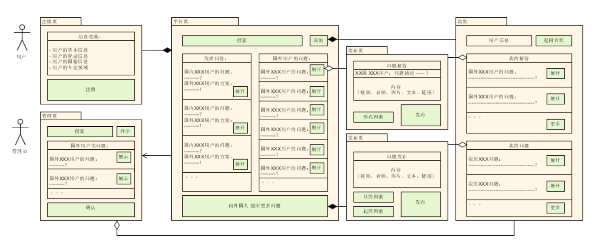
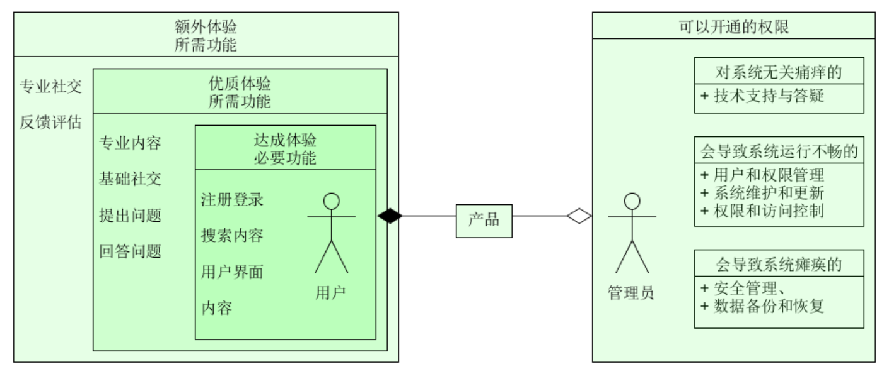

# 这个项目需要哪些模块？
# 分析：
## 对于创作者 在本国媒体环境内，本国人提出问题，外国人解决问题
- 平台页：
  - 需要有国家的区分。
- 注册页：
  - 根据 创作者 填报的国籍，将注册者分配到 对应国籍的平台。
- 平台页：
  - 提出问题模块：在对应国家平台内，创作者只能提出问题，为了让问题更加清晰，可以上传视频和图片。
- 平台页：
  - 解决问题模块：在对应国家平台内，创作者只能给 其他国家的用户提出的问题 提供解决方案 或者观点，可以上传视频和图片。
- 技术层：
  - 对应国家的平台内需要有 AI翻译功能。
## 感染力 共情
- 后台管理页：
  - 对于新用户，需要可以 置顶/推送 与 感染力 相关的内容。
  - 包括但不限于：快乐，爱，勇气，希望... 相关的内容。（一种相对浅层 容易被人们接受的感受。）
  - 对于老用户，需要可以 置顶/推送 与 共情 相关的内容。
  - 包括但不限于：幸福，悲伤，愤怒，恐惧，无助，绝望...（一种相对深层 但一旦触发不容易被人们遗忘的感受。）
- 发布页：
  - 发布问题者/提出方案者 需要选择"目的因素": 一些情感导向的目的标签，方便我们进行推送。
## 不同阵营 敌意消除
- 后台管理页：
  - 需要置顶一些人类共同面临的问题。
  - 比如：新型冠状病毒疫情、气候变化、经济不平等、数字化和人工智能新型冠状病毒疫情、种族问题、情感问题...
- 发布页：
  - 发布问题者 需要选择"起因因素":提出问题的动机和原因标签，方便我们进行类别管理和推送。
  - 提出方案者 需要选择"形式因素":这个方案意义或目的导向标签，方便我们进行类别管理和推送。
## 树立权威
- 注册页：
  - 创作者需要填写自己的专业领域。
  - 树立权威印象，可以帮助 提出问题者 快速相信 解决方案的质量。
- 平台页：
  - 需要回复管理模块。维护权威印象，让用户长期相信我们的观点。
  - 解决方案的点赞数越高，我们会相应的给予用户更多的奖励。
# 归纳
- 观察上述分析。
- 所有的需要的功能都集中在这几个模块中：
  - 注册页
  - 平台页
  - 发布页
  - 后台管理页
- 模块间的规律
  - 注册页 用于收集（个人）用户的信息。
  - 平台页 用于展示用户（发布的内容）。
  - 发布页 用于用户（发布/编辑）信息。
  - 后台管理页 用于管理用户产出的信息。
- 具体模块的结论
  - 注册页 需要收集的内容：
    - 用户的基本信息
    - 用户的登录信息
    - 用户的国籍信息
    - 用户的专业领域
  - 平台页 需要展示的内容：
    - 搜索栏：
      - 排序标准： （根据 后台管理的标签） + 用户搜索的关键字 进行排序。
    - 首页：
      - 本国用户提出的问题 以及 外国用户的解答（由AI翻译成本国语言）。
        - 可以进入发布页，提出更多问题。
      - 自己的解答，以及其他国家用户的问题（由AI翻译成本国语言）。
        - 可以进入发布页，编辑/发布解决方案。
      - 首页推送标准：根据 后台管理 推送。
  - 发布页 需要用户编辑的内容：
    - 问题发布：
      - 问题内容编辑：
        - 可以上传 视频、音频、图片、文本、链接 
      - 必填选框：
        - 目的因素
          - 可选标签：一些情感导向的标签。
          - 例如：快乐，爱，勇气，希望，幸福，悲伤，愤怒，恐惧，无助，绝望
        - 起因因素
          - 可选标签：提出问题的动机和原因标签
          - 例如：新型冠状病毒疫情、气候变化、经济不平等、数字化和人工智能新型冠状病毒疫情、种族问题、情感问题...
        
    - 问题解答：
      - 解答内容编辑：
        - 可以上传 视频、音频、图片、文本、链接
      - 必填选框：
        - 形式因素：
          - 可选标签：这个方案意义或目的导向标签。
          - 例如：快乐，爱，勇气，希望，幸福，悲伤，愤怒，恐惧，无助，绝望
  - 后台管理页 用于管理用户产出的信息。
    - 增 删 改 查。
    - 不同国家平台的区分。
    - 分类：
      - 根据 “目的因素标签 + 起因因素 + 点赞数” 将 对应国家的 “本国问题” 进行分类，得出 “本国优质问题”。
      - 根据 “形式因素标签 + 点赞数” 将 对应国家的 “外国解决方案” 进行分类，得出 “外国优质解决方案”。 
      - 根据“专业背景”筛选，得出“权威用户”。
    - 展示：
      - 将上述分类中的 优质内容 加入 平台页 进行展示。

- 制作顺序的判断：
  - 技术：
    - 因为：发布页 依赖 平台页 ，平台页 依赖 后台管理页，后台管理页 依赖 注册页。
    - 所以：技术制作顺序应当为：1.注册页 2.后台管理页 3.平台页 4.发布页
  - 美学：
    - 因为：内容权重最多的是：发布页 > 平台页 > 后台管理页 > 注册页
    - 所以：美学制作顺序应当为：1.发布页 2.平台页 3.后台管理页 4.注册页
# 用户流程图：
 

# 这个项目管理员和用户分别需要做什么？如何分类？
# 分析：
- 用户是什么？
  - 用户具有多元的需求，包括但不限于：
    - 自主性（Autonomy）：用户作为一个独立的个体拥有自主的决策能力，能够根据自身的需求和价值观选择是否使用某个产品。
    - 意愿性（Volition）：用户选择使用某个产品是出于自愿，而不是被迫。他们有权利决定他们使用什么样的产品。
    - 主动性（Agency）：用户是主动参与和使用产品的，拥有行动和选择的能力。他们可以根据自己的需求主动决定如何使用产品，以满足特定的目标。
    - 需求和欲望（Needs and Desires）：用户使用产品是为了满足自己的需求和欲望，无论是实际需求（如满足基本生活需求）还是情感和心理需求（如社交、娱乐等）。
    - 偏好与价值观（Preferences and Values）：用户在选择和使用产品时可能受到个人的偏好和价值观的影响。不同的用户可能因为个人偏好和价值观的差异而做出不同的选择。
    - 知识和信息（Knowledge and Information）：用户在选择和使用产品时会依赖于他们所拥有的知识和信息。他们可能通过研究、咨询他人或者试用来获取产品相关的知识和信息。
    - 反馈和评估（Feedback and Evaluation）：用户使用产品后可能会提供反馈和评估，从而对产品的质量、功能或用户体验进行评价。他们的反馈可以对产品的改进和发展起到重要的作用。
    - 体验（Experience）：用户使用产品时会有独特的体验和感受，这可能包括感官上的体验、情感上的体验以及认知上的体验。用户的体验可以影响他们对产品的评价和决策。
    
- 管理员是什么？
  - 管理员的职责：
    - 权限和访问控制：管理员具有特定的权限和访问控制，可以管理和控制系统中的各种功能、数据和资源。他们有权对系统进行配置、维护和监控，以确保系统的正常运行和安全性。
    - 用户和权限管理：管理员负责管理系统中的用户账户和权限分配。他们处理用户注册、验证身份、授权访问和回收权限等操作。
    - 系统维护和更新：管理员负责系统的维护和更新，包括安装补丁、更新软件、解决故障和处理错误等。他们需要监控系统的性能和稳定性，并及时采取措施处理问题。
    - 安全管理：管理员负责系统的安全管理，包括风险评估、漏洞管理、安全策略制定、监测恶意行为和应对安全事件等。他们需要保护系统和数据的机密性、完整性和可用性。
    - 技术支持与答疑：管理员提供技术支持，回答用户的问题，解决技术难题，并提供培训和指导，以帮助用户充分利用系统。
    - 数据备份和恢复：管理员负责制定和执行数据备份和恢复策略，确保关键数据的安全性和可恢复性。
    
- 用户和管理员之间的关系是怎样的？
  - 依赖关系：用户依赖管理员来提供技术支持、解决问题和保证系统的正常运行。用户可能会向管理员寻求帮助，提出疑问或报告问题。
  - 协作关系：在某些情况下，用户和管理员可能需要进行协作，以实现共同的目标。用户可能向管理员提供反馈、建议或需求，而管理员会根据这些反馈和需求来改进系统、解决问题或提供更好的用户体验。
  - 授权关系：管理员通常会授予用户特定的权限和访问权限，以便用户可以访问和使用系统中的特定功能和资源。管理员会根据用户的角色和职责来分配适当的权限。
  - 监管关系：管理员负责对系统进行监督和管理，以确保系统的安全性、性能和稳定性。用户可能被要求遵守管理员设定的规则和政策，以维护系统的正常运行。
  - 反馈关系：用户可以向管理员提供反馈和建议，以改进系统的功能和性能。管理员可以根据用户的反馈来做出调整、解决问题和优化用户体验。

# 用户分类 演绎推理
- 针对上述分析中用户多元的需求，代入我们的产品分别是什么？ 
  - 自主性：早期用户 为什么决定使用我们的产品？
    - 用户使用我们产品的动机是窥探不同文化环境下对问题的看法的差异。
  - 意愿性：早期用户 为什么会自愿使用我们的产品？
    - 因为一个简单且有“感染力”的用户界面。
    - 因为进入网站后映入眼帘的有“感染力”的内容。
    - 因为和别的用户可以进行有“感染力”的社交。
  - 主动性：产品哪些部分可以根据用户自己的需求主动决定如何使用？
    - 全流程都可以：
      - 1.注册登录（可以主动决定，填写一些自己的兴趣爱好）
      - 2.观看有感染力的问题和答案（可以主动决定观看哪些内容）
      - 3.提出自己的问题（可以主动决定如何提出问题）
      - 4.回答其他国家用户的问题（可以主动决定回答哪些以及如何回答）
  - 需求和欲望：产品满足了用户什么样的需求和欲望？
    - 文化差异与体验
      - 有机会了解和体验不同的文化、美食、服装、音乐和艺术形式。
    - 交流与文化理解
      - 与异国朋友交流可以加深对不同文化、传统和价值观的理解，拓宽自己的视野。
    - 知识与学习
      - 通过与异国朋友的交往，人们可以学习到新的知识、语言技能、历史和地理等。
    - 友谊与社交
      - 与异国朋友建立友谊可以满足社交欲望，并享受到新的人际关系和社交圈子。
    - 商务和合作机会
      - 跨国合作和跨文化的交往有助于促进经济合作、商务交流和创新合作，为个人和企业带来新的商机和发展机会。
  - 偏好与价值观：用户可以根据自己的价值观和偏好来使用我们的产品吗？
    - 可以，用户可以根据自己的喜好搜索问题，找到答案，如果不满意也可以自己回答。
  - 知识和信息：用户会用到哪些知识和信息使用我们的产品？
    - 所有的关于自己认知和生存环境的知识和信息。
  - 反馈和评估：用户可以和开发人员一起改进产品吗？
    - 可以，我们可以专门开放一个关于我们产品的分类，来进行意见和问题的收集，然后来回答。
  - 体验：我们的产品给用户带来什么样的体验？
    - 一种放松的体验，一种简单的领悟感。
    - 通过别人对同一个问题的不同观点，多一些看世界的视角。
    
- 所以根据用户对我们产品的需求，我们总共可以提供给用户以下功能：
  - 用户界面
  - 基础内容（异国的文化、美食、服装、音乐和艺术，文化、传统、价值观、新的知识、语言技能、历史和地理）
  - 专业内容（社交圈子、商务交流）
  - 基础社交（与内容的发布者进行社交）
  - 专业社交（跨国合作、跨文化的交往）
  - 注册登录
  - 提出问题
  - 回答问题
  - 搜索内容
  - 反馈评估

## 结论1：（用户使用功能分类）
- 根据 体验品质 来分类：同一个问题的不同观点，多一些看世界的视角。
  - 达成体验的必要功能：注册登录、搜索内容、用户界面、内容
  - 优质体验的所需功能：（包含上述功能）+ 专业内容、基础社交、提出问题、回答问题
  - 额外体验的所需功能：（包含上述两项功能）+ 专业社交、反馈评估

# 管理员分类 演绎推理
- 针对上述分析中管理员的职责，带入我们的产品分别是什么？
  - 权限和访问控制：功能、数据和资源 需要 进行配置、维护和监控 有哪些？
    - 用户回答的问题
    - 用户提出的问题
    - 用户的社交信息
    - 用户的专业社交信息
    - 用户的反馈和评估
    - 用户的权限分类信息
    - 用户的注册信息
  - 用户和权限管理：用户权限 有哪些需要管理？
    - 用户注册
    - 验证身份
    - 授权访问
    - 回收权限
  - 系统维护和更新：系统 有哪些维护和更新的？
    - 新增功能模块
    - 解决已有模块Bug
    - 更新网页方式
    - 系统的性能和稳定性
  - 安全管理：系统 有哪些内容需要安全管理的？
    - 监测恶意行为
    - 用户社交信息的安全
    - 用户产出内容的安全
    - 用户的注册信息的安全
    - 系统的保护
  - 技术支持与答疑：如何回答用户的问题，提供培训和指导？
    - 专门开放产品相关内容讨论标签，来进行意见和问题的收集，整理 和解答。
  - 数据备份和恢复：哪些数据 需要 备份和恢复的？
    - 用户的注册信息
    - 用户社交信息
    - 用户产出内容
    - 系统的源码（需要版本控制）
  
## 结论2：（管理员使用功能分类）
- 根据 对产品系统的 影响来分类：
  - 无关痛痒的：技术支持与答疑
  - 会导致系统运行不畅的：用户和权限管理、系统维护和更新、权限和访问控制
  - 会导致系统瘫痪的：安全管理、数据备份和恢复

# 功能分类图：
 