## 前言
### 效用？
- 这本书是为那些从事计算机图形学工作的人准备的，
- 他们知道他们必须在日常工作中使用数学，
- 并且不想过多地卷入
- 公理、真理和柏拉图式的现实中。
- 冲着顿悟感来的。

## 数字 Numbers
- 集合论? Set Notation
  - 提供了一个用于 操作和 询问集合的逻辑框架
  - 是 xxx 的成员
  - ∈
- 进制系统? Positional Number System
  - 人类已经进化出十位数字，我们用它来计数。
  - 1234 = 1 × 1000 + 2 × 100 + 3 × 10 + 4 × 1
  - 十进制数字系统对于计算机技术来说并不是很方便，
  - 在计算机技术中，数字电路每秒使用二进制数（以 2 为基数的数字）
  - 打开和关闭数万亿次非常容易。
- 自然数? Natural Numbers
  - 用于计数、排序和标记。
  - 负数不包括在内。
  - N
- 质数? Prime Numbers
  - 是一个自然数，
  - 只能被 1 和它自己整除，
  - 而不留下余数。
  - 任何正整数（1 除外）
  - 都可以以一种且只有一种方式写成两个或多个素数的乘积。
  - 例如：
  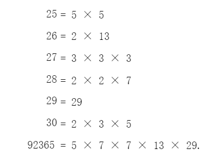
  - 在计算机图形学中没有发挥作用！- -。
- 整数? Integer Numbers
  - 整数包括正自然数和负自然数
  - Z
- 有理数? Rational Numbers
  - 有理数或 小数是可以表示为 分数
  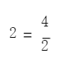
  - 有理数可以准确地存储在计算机中，
  - 但许多其他有理数只能近似存储。
  - 例如，4/3 = 1.333333 . . .
  - 产生一个无限的 3 序列
  - 当存储为二进制数时必须被截断。
  - Q
- 无理数? Irrational Numbers
  - 无理数不能表示为分数。
  
  - 这些数字永远不会终止，
  - 并且在存储在计算机中时总是会出现小错误。
- 实数? Real Numbers
  - 有理数和无理数共同组成了 实数
  - R
- 数字线? The Number Line
  
  - 数字线的形式可视化数字很有用，
  - 这有助于我们理解复数。
- 复数? Complex Numbers
  - 瑞士数学家莱昂哈德·欧拉（Leonhard Euler，1707-1783 年）发明。
  - 起因：尝试求解某些类型的方程时出现的一些尴尬的无解问题
  
  
  
  - 数字线为一种新型数字提供了 图形解释：复数。
  - 他的想法可以在 计算机图形学 中用于旋转。
  - 以定位空间中的物体和虚拟摄像机。
  - **意象展开！**
  - 数字线上的任何数字都通过**逆时针旋转 180** 
  
  - −2 = −1 × 2，或 3 = −1 × −3
  - 其中 −1 实际上是 旋转 180。
  - 但是 180 的旋转可以解释为连续两次 90 的旋转，现在出现了一个问题：
  - 什么代表 90 的旋转？
  - 旋转 90 叫 i （虚数）
  - 字母 i 表示逆时针旋转 90
  - 比如：
    - 2 转两个 90 就表示为 2ii = -2
    - 因为 2ii = -2 所以 i^2 = -1
    - 所以 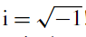
    - 由此可见 i 不是一个数字 而是一个运算符
  - 例如：
    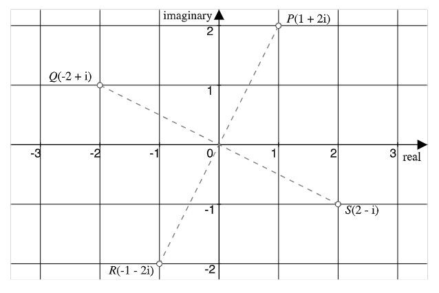
    - 从P旋转90度到Q，
    
    - 再旋转90度到R，
    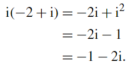
    - 再旋转90度到S，
    
    - 再旋转90度回到Q
    
  - 复数在计算机图形学中并没有直接发挥重要作用。
  - **但** 虚数在四元数和几何代数中非常重要。
  - 复数与笛卡尔坐标密切相关，
  - 并且导致了向量和四元数的发现。
  - 最美等式之一：
  
  - e（自然对数的底）、i（虚数单位）、π（圆周率）、1和0。
  - 看似不相关的数学概念之间出人意料的联系。
  - C & i

## 代数 Algebra
### 概念?
  - 代数的一个基本概念是给 未知量命名的想法。
  - 借助 +, −, ×, ÷ 可以开发描述物理过程或逻辑计算行为的表达式。
  - 代数表达式还包含多种 函数。
  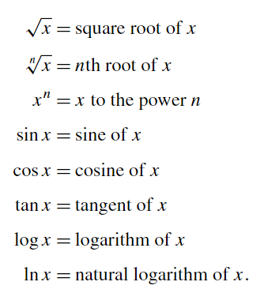
### 代数定律 Algebraic Laws
- 代数定律？
  - 数学表现得很好，因为它受制于定律或公理系统。
  - （游戏学中的构成规则）
- 负数 和 0?
  - 负负得正
  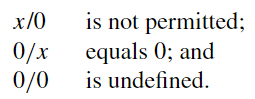
- 二元运算？Binary Operation
  
- 结合律? Associative Law
  - 当三个或多个元素通过 二元运算连接在一起时，
  - 结果与每对元素的分组方式无关。
  - 加法结合律：（分组是无关紧要的）
  
  - 乘法结合律：（分组也是无关紧要的）
  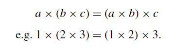
  - 减法结合律 不是关联的！
  
- 交换律? Commutative Law
  - 两个元素通过一些 二元运算运算连接时，
  - 结果与元素的顺序无关。
  - 加法交换律：
  
  - 乘法交换律：
  
  - 减法没有交换律！
  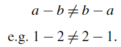
- 分配律? Distributive Law
  - 一种运算，当对 元素组合执行时，与对 单个元素执行运算相同。
  - 乘法置于一组加法之上？成立！
  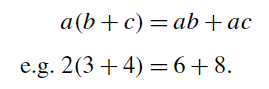
  - 加法置于一组乘法之上？不成立！
  
- 局限?
  - 尽管这些定律中的大多数对于数字来说似乎是自然的，
  - 但它们并不一定适用于所有数学结构。
  - 例如，将两个向量相乘的向量积不是可交换的。
### 解二次方程的根？ Solving the Roots of a Quadratic Equation
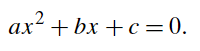
- 目标：把X放到等号左边。
- 由于X涉及次方。
- 因此，策略是创造一种容易取平方根的情况。
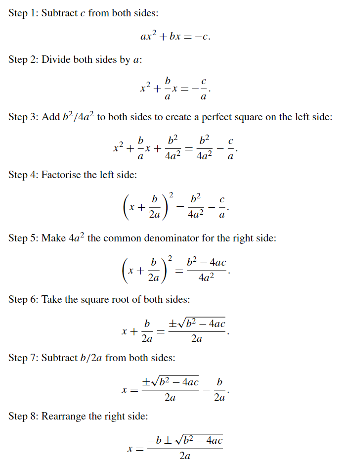
### 指数? Indices
- 指数的规律
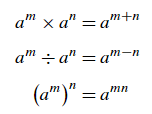

### 对数? Logarithms
- 两个发明对数的人：
- 苏格兰神学家数学家 约翰·纳皮尔（John Napier，1550-1617）
- 和瑞士钟表匠和数学家 约斯特·布尔吉（Joost Bürgi，1552-1632）
- 数字相乘上花费的时间 感到沮丧。
- 他们发现：
  对数 利用了上面所示的索引的加法和减法，
  并且总是与基数相关联。

- 这被解释为“10必须被提升到 指数2 才能等于100”。
对数运算找到给定数的基数幂。
因此，使用对数将乘法转换为加法。

- log x 的图表，直到 x = 100，我们可以看到log 20 ≈ 1.3和 log 50 ≈ 1.7。
- **20*50** 可以按照如下表示：
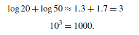
- 超越数 e ： transcendental number. 
- 用于作为计算基础的 是 10 和 e（2.718281846...）
- 超越数 e 不是任何代数方程的根
- 就像 圆的周长与其直径的比 π
- 以 10 为底的对数记为 log
以 e 为底的自然对数记为 ln。

-  ln x 的图表，直到 x = 100，我们看到 ln 20 ≈ 3 和 ln 50 ≈ 3.9
- **20*50** 可以按照如下表示：
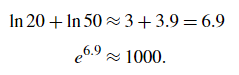
- 综上 对数运算定律：
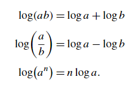
### 更多符号? Further Notation
- 符号如何代替自然语言？
- 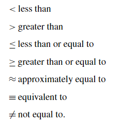
- 例如：0 ≤ t ≤ 1。
- 这意味着 t 在 0 和 1 之间变化。
### 函数? Functions
- 莱布尼茨的定义：根据图表的斜率对函数进行了早期定义
- 欧拉的定义：函数是一个变量，其值取决于一个或多个自变量
#### 显式和隐式方程? Explicit and Implicit Equations