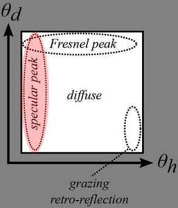

# 3D:
      计算着色器:
            以unity为例：
                  允许用户申请GPU线程进行开发。
      几何着色器：
            以图元（通常是三角形）为单位进行操作
      顶点
            输入项：
                  物体位置(Position)
                  法线位置(Normal)
                  切线位置(Tangent)
                  权重(weight)
                  矩阵索引(matrix indices)
                  贴图坐标(texture coordinates)
                  顶点色(vertex color)
                  融合 位置 法线 切线 (MorphTarget)
            公共项：
                  贴图采样(sampler texture)
                  不透明度(Opacity)
                  世界矩阵(worldMatrix)
                  相机矩阵(cameraMatrix)
                  相机转世界矩阵(worldCameraMatrix)
                  投影到相机矩阵(ProjectionCameraWorldMatrix)
                  投影矩阵(ProjectionMatrix)
                  法线矩阵(NormalMatrix)
                  相机法线矩阵(CameraNormalMatrix)
                  相机位置(CameraPosition)
                  时间(Time)
                  贴图大小(TextureSize)
                  矩阵调色板(matrix Paletter)?
                  相机距离(cameraNearFarPlane)
                  融合权重(MorphWeight)
                  视口坐标(viewPort)v4
                  窗口坐标(window)v2
            传递属性：
                  varying
      片元:
            所有公共项
            传递属性：
                  varying

      后处理：
      缓存：
      抗锯齿：
            图像锐化：
                  https://www.cnblogs.com/shuopython/p/16275887.html
                  https://github.com/BradLarson/GPUImage/blob/master/framework/Source/GPUImageSharpenFilter.m
                  https://segmentfault.com/a/1190000037749983
# 2D:
      图形绘制：
            在片元中以UV为xy为坐标象限进行绘制
      RGB颜色空间转换HSV：
            ref：
                 https://blog.csdn.net/liuyizhou95/article/details/83501756 
                 https://stackoverflow.com/questions/15095909/from-rgb-to-hsv-in-opengl-glsl
      图片格式：
            通用格式:
                  PNG: Portable Network Graphics 便携式网络图形
                        首选格式，将产生最高质量的全彩色图形图像。
                  PNG8:
                        这是一个每像素 8 位的 PNG，支持单色透明度。这些文件通常比全彩色 PNG 小，但颜色会更少（最多 256 种）。SiteSpinner™ 在预览或发布项目时为每个 PNG 8 对象选择最佳颜色集，因此它通常看起来与全彩色 PNG 一样好，但并非总是如此。例如，渐变或照片可能看起来是带状的。
                  GIF:
                        GIF 应该和 PNG8 一样工作。不过透明算法有所不同。所以大小会有别于 PNG8 的序列图片大小。
                  JPG:
                        最适合摄影图像。 将使用全彩色但不透明导出。可以控制图片输出质量（与大小正相关）。
                  JPEG：Joint Photography Experts Group 
                        于1992年首次推出，
                        在压缩过程中，像素与周围的其他像素以 2:1 到 100:1 的比例进行比较。因此，所有与原始像素相同的像素都被删除。
                        早期为了节省一个字节所以采用JPG的缩写。
                  BMP：
                        未压缩的位图格式。 将生成矢量几何的全彩 BMP 图像。 不建议在网页上使用 BMP，因为它的文件非常大，而且许多浏览器不支持它。 如果您希望使用第三方图像程序将图像转换为另一种格式，则导出为 BMP 格式可能会很有用

            compressed format 格式 （关键词：压缩 压缩格式）：
                  ASTC: Adaptive scalable texture compression 自适应可缩放纹理压缩
                       是由 Jørn Nystad 等人开发的一种有损基于块的纹理压缩 算法。会增加体积大小但是减少显存大小，最大的优势可以自定义压缩块。
                       ASTC 于2012 年 8 月 6 日被Khronos Group采用为OpenGL和OpenGL ES的官方扩展。
                       支持算法的硬件：
                        apple GPU (LDR only),Arm Mali,Imagination PowerVR,Intel GPUs,Nvidia Tegra,Qualcomm Adreno (LDR only)
                        多样性：
                              ASTC 的主要设计目标是使内容开发人员能够更好地控制任何有损压缩方案中固有的空间/质量权衡。使用 ASTC，相邻比特率之间的比率约为 25%，从而降低了为给定纹理提高质量的成本。编码不同的资产通常需要不同的颜色格式。ASTC 允许多种输入格式选择，包括仅亮度、亮度 alpha、RGB、RGBA 和针对表面法线优化的模式。因此，设计人员可以选择最佳格式，而无需支持多种不同的压缩方案。比特率和颜色格式的选择不会相互制约，因此可以从大量的组合中进行选择。
                              以unity为例：https://developer.arm.com/documentation/102162/0002/Unity-and-ASTC
                        天空盒：
                              Opengl用的释放加载的图像：
                                    stbi_load(“name.png”, &width, &height, &nrChannels, 0);
                              压缩算法：
                                    压缩块越大，压缩率约高
                                    ref：
                                          https://community.arm.com/arm-community-blogs/b/graphics-gaming-and-vr-blog/posts/high-quality-rgbm-texture-compression-with-astc
                  ATC: 
                        WebGL API的一部分，并公开了 3 种 ATC 压缩纹理格式。ATC 是一种专有的压缩算法，用于在手持设备上压缩纹理。压缩纹理减少了在 GPU 上存储纹理所需的内存量，从而允许更高分辨率的纹理或更多相同分辨率的纹理。
                  ETC编码: Ericsson Texture Compression 
                        WebGL API的一部分， ETC 是一种基于块的纹理压缩格式。图像被分成 4x4 块，每个块使用固定数量的比特进行编码。在 ETC1 格式（用于压缩 RGB 图像）的情况下，每个块使用 64 位编码。前 32 位包含有关 4x4 块中使用的颜色的信息。每个 4x4 块被垂直或水平分成两个 2x4 或 4x2 子块（每个块的方向由“翻转”位控制）。每个子块都分配有自己的基色和自己的修饰符表索引。需要保存三张图来合成一张图,基色+块方向+修改表索引+选择器 = 解码后的图
                        ETC1代是不支持alpha的，ETC2是支持alpha的。
                  Native(Uncompressed):
                        本机图片未经过压缩。
                  PVRTC(PowerVR Texture Compression):
                        压缩图像由两个较低分辨率的图像表示，这些图像被双线性放大，然后根据低精度、每像素权重进行混合。所以不适合像素风格的图片
                  Raw:
                        原图片未经过压缩。
                  

            ref:
                  https://www.sitespinner.com/support/sswebhelp/imagetargetformats.htm
      黑屏技术：
            DRM

# 渲染管线：
      大型状态机：
            Blit Render Pass:
                  位块传送渲染通道
                  使用某种特定材质在屏幕上位块传送一个或多个渲染通道或纹理。
            Clear Render Pass:
                  清除当前渲染上下文的部分或全部缓冲。您可以设置 Kanzi 清除颜色、深度和模具缓冲区的值。
            Composition Target Render Pass:
                  将自身及其子渲染通道渲染成合成目标。
            Draw Objects Render Pass:
                  允许您设置摄像机 (Camera) 节点来渲染特定对象源并控制视锥体剔除。
            Draw Objects With Material Render Pass:
            Group Render Pass:
            Lagacy Render Pass (deprecated):
                  一个封装好的渲染管线
            Material Setup Render Pass:
            Pipline State Render Pass:

# 性能优化：
## 遮挡剔除：
- 光栅化之前的 OverDraw，减少绘制次数。注意半透明物体没有办法进入OverDraw的优化，慎用尤其是半透明的粒子系统，可能会造成性能爆炸。
- 相交的几何会发生另一个问题。在这里，透支变得不可预测，因为不能在同一次绘制调用中保证像素渲染顺序。
- 对于自相交的几何，还可以以合理的方式将其拆分为不同的几何块。在上一个屏幕截图的情况下，您可以将其完全分成四个平面，因此基于距离的排序将正确地完成其工作（请注意，这个操作将支付更多的Draw Call，以减少OverDraw，这个需要再实际项目中做平衡，看是CPU有余量还是GPU有余量，这里只作为例子介绍减少OverDraw的策略）。
            
- ref：
      - https://thegamedev.guru/unity-gpu-performance/overdraw-optimization/#5-the-unity-overdraw-cheatsheet-for-2020
      - https://www.guerrilla-games.com/read/practical-occlusion-culling-in-killzone-3
      - https://www.youtube.com/watch?v=m0AQBWAbjpo
      - https://docs.kanzi.com/3.9.9/en/best-practices/rendering/preventing-overdraw-with-sorting-filters.html?highlight=overdraw
      - https://docs.kanzi.com/3.6.21/zh-cn/Default.htm#Best%20practices/Measuring%20performance%20of%20your%20application.htm?Highlight=overdraw
## 浮点数精度：
- 根据实际渲染要求，按照最低标准限制每一个浮点数的精度。
## 减少纹理采样次数：
- 通过纹理划分(例如2*2，3*3，4*4)减少纹理采样次数。不采用UV重新排布以减少采样次数的原因：1 ：重新排布更耗时（3维软件中操作的时间，以及着色器中之前做好的纹理遮罩需要重新映射）2:北美输入的UV排布已经没有很多的面积浪费，基本是最优排布了。
## 算法时间复杂度优化：
- 利用renderDoc在PC环境测算每帧的以及渲染的每个步骤（从硬盘加载-矩阵转换-深度测试-顶点-片元-渲染管线-光栅化-后处理）的时间复杂度，我会针对时间复杂度高的部件，排查出相应的算法，以及渲染管线的渲染步骤，用“便宜”的方式取代“贵”的方式。
## 减少渲染像素
- 我会减少光栅化后渲染的像素数量（如2048/2倍=1024）同样的思路或者采用离屏渲染的手段，这个我们测试过，一定是可以把对应机型的帧率跑满的（但这得看客户对锯齿的包容度）。
## 减少batchCount
- 我会利用顶点色区分部件的手段，合并渲染批次，但保留目前的渲染效果，这个方法对整个渲染来说相当于重构是最伤经动骨，但也是最有效的可以明显减少batch count的（这个方法的风险点在于：第一：OpenGLES的着色器代码字数限制，第二：耗时会比较长）。
## 减少循环次数：
- 1.把着色器中片元的代码往顶点迁移，减少循环次数，从而降低时间复杂度，弊端：硬件环境下可能会出现因为循环次数过少，导致渲染精度或者效果不正确。
- 2.从3D软件中对模型减面，降低顶点的时间，空间复杂度（微量）。
## 算法+重构渲染管线/渲染方式：
- 类似于unity和unreal2022年推出的nanite算法，用算法进行动态曲面细分，动态纹理烘培，目标是1个batch count（这个实现周期会非常长，但十分有效）。
## 着色器代码优化：
- 优化思路：
  - 删除所有分支(if else) 
  - 计算往顶点迁移
  - 复杂遮罩用纹理替代
  - 尽量合并等式
  - 多使用#defines 来声明常量
  - 尽可能使用最低精度
    - 世界空间位置和纹理坐标使用高精度
    - 其他（向量颜色）优先使用中精度
    - 对于非常简单的计算用低精度
  - 先乘维度小的变量最后乘维度大的变量
  - 超数学函数（例如pow, exp, log, cos, sin, tan）非常耗费资源，因此避免在低端硬件上使用它们。
- ref：
  - https://www.bitshiftprogrammer.com/2018/11/shader-optimization-part-1.html
  - https://docs.nvidia.com/gameworks/content/technologies/mobile/gles2_perf_fragment.htm
## 像素映射/离屏渲染：
- 这种方法的目的是通过减少3D场景光栅化后像素的数量，达到减少计算复杂度的目的，从而降低GPU占用率。基于纹理映射，将原像素填充到车机屏幕，将完成如下操作：
- 1.原像素 映射 到 放大图像的对应像素位置
- 2.以原像素在放大图像上的相对位置，对剩余未填充像素的部分进行填充
- 3.如果用liner模式，就会与剩余像素做差值，如果选择nearst模式，就会选择临近的像素进行取值。
- 具体实现：
- 制作人员将3D场景渲染到中间内存缓冲区，然后针对上述目的与描述对这个缓冲区进行编辑。
# 算法：
- 色彩空间 Gamma Linear 伽玛和线性空间：
      - https://www.kinematicsoup.com/news/2016/6/15/gamma-and-linear-space-what-they-are-how-they-differ
- toneMap：（减少过曝）
      - https://zhuanlan.zhihu.com/p/21983679
- 模糊算法、景深：（变焦）
      - https://zhuanlan.zhihu.com/p/125744132
- PS操作：
      - https://zhuanlan.zhihu.com/p/108820522
- BRDF(Bidirectional Reflectance Distribution Function) 双向反射率分布函数:
      - 表示材料的基本光学特性，表示入射波在表面半球空间中某一方向的反射能量分布。
      - REF:
      - https://sciencedirect.com/topics/engineering/bidirectional-reflectance-distribution-function
      - https://wiki.nuaj.net/index.php?title=BRDF
      - 
      - 
      - kanzi 生成 LUT：https://github.com/derkreature/IBLBaker
# 讨论：
- 关于3D实时渲染GPU基元的分类讨论：
  - 现代3D实时渲染光线追踪部分关于GPU的基元是：
    - 着色器表：关于着色器命中和行为的记录，gpu内存中按64位对齐的连续块
    - 
    - ref：光线追踪精粹3.10 埃里克 & 托马斯 2021版
  - 传统3D实时渲染关于GPU几何计算的基元是：
    - 坐标系，向量，点，法线，射线，三维包围盒，转换操作，动画转换，微分几何。
    - 
    - ref：物理渲染从理论到实现（第二版）第二章 Matt 2016版
  - 传统3D实时渲染关于GPU标准高清渲染管线的基元是：
    - 渲染准备阶段，不透明物体已经天空的处理，半透明的处理，后处理
    - 详细内容可自定义入下图所示。
    - 
    - ref：Unity HDRP
# 动画：
      面部表情：
            避免表情僵硬 或者 作为UE参考用户心理的测量工具：FACS方案（Facial Action Coding System）

# 工作岗位要求：
      Remedy Entertainment 高级图形（长期招聘）：
            from：https://jobs.lever.co/remedyentertainment/c168a1d6-4fed-4f22-94f3-f4e9aabffbd6
            你要做什么：
                  开发、设计、修改、优化和调试渲染管线和引擎系统
                  在 Xbox Series X 和 S/PS5/Windows 平台上部署、评估性能和测试软件
                  与工程、设计和艺术团队交流功能并进行协作
                  参与设计、性能和代码审查过程
                  为行业领先的 AAA 引擎的设计和路线图做出贡献
            你给这个岗位带来了什么:
                  具有使用计算机图形学和/或其他游戏相关技术的经验
                  工作教育背景与代码和数据优化相关    
                  强大的数学能力
                  了解 CPU、GPU 和内存架构
                  有使用 HLSL、Cg 或 GLSL 编写着色器的经验
                  流利地使用现代 3D 图形 API
                  熟悉使用现代 GPU/CPU 性能分析工具
                  强大的 C/C++ 基础
                  扎实的调试技能，包括必要时在汇编级别进行调试的能力
                  你是一个善于沟通的人，喜欢与其他程序员、艺术家和设计师合作
                  计算机科学、工程或数学相关领域的学士学位
                  对该职位有益的其他技能包括并行编程和多线程渲染器方面的知识，以及使用 PS5 GNM、Direct3D 12 和/或 Vulkan API 的经验

# funnyShit：
      屌图：
            https://onemanadreaming.blogspot.com/2014/08/mathematical-equation-of-love-heart.html
# ref:
      FORTICHE 法国
      https://paroj.github.io/gltut/
      https://github.com/RayTracing/raytracing.github.io
      https://www.pbr-book.org/