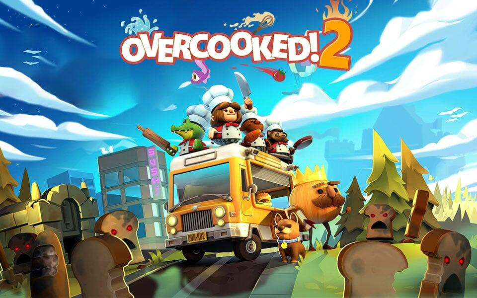
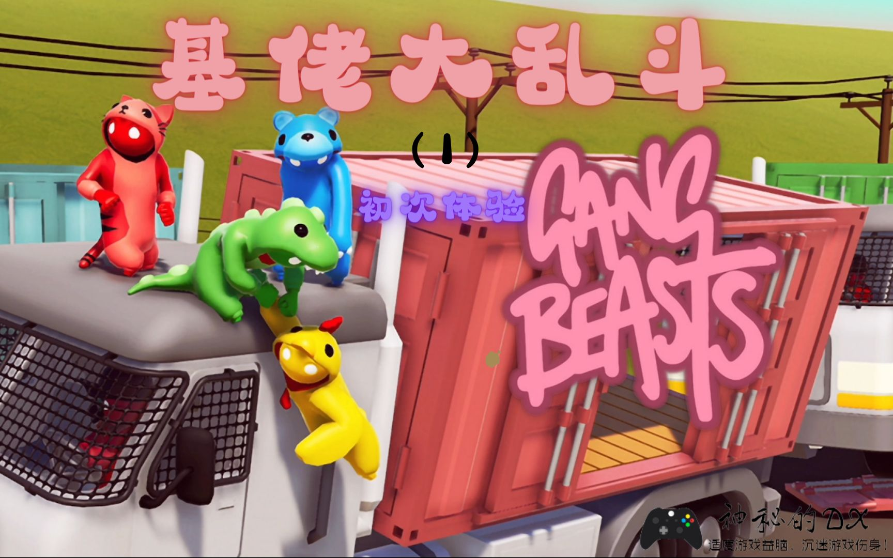
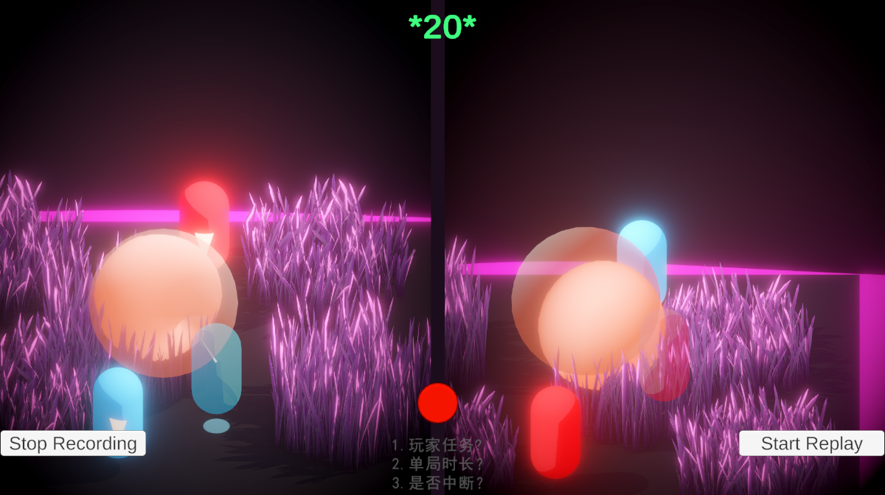
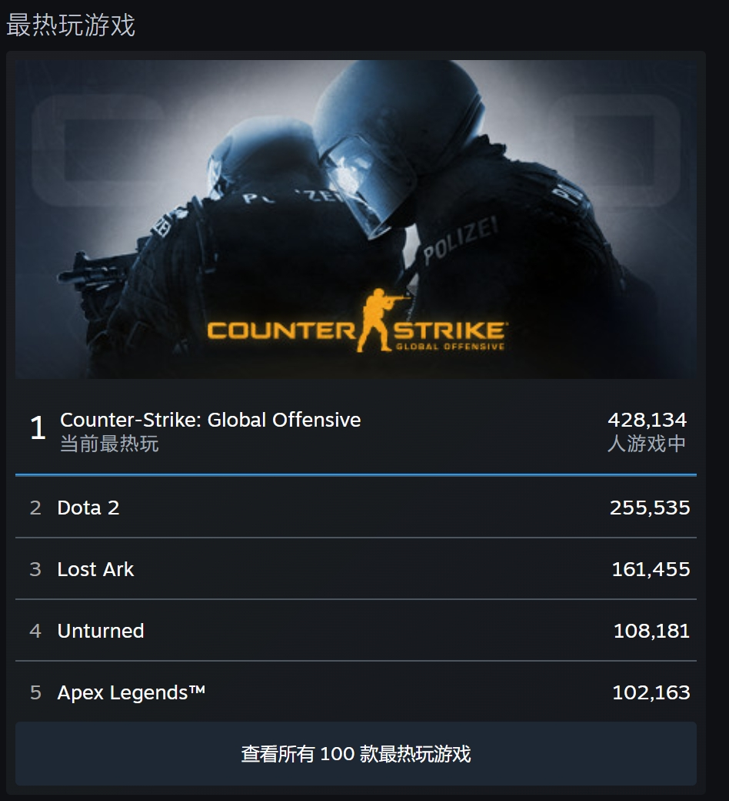
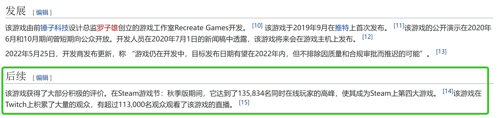
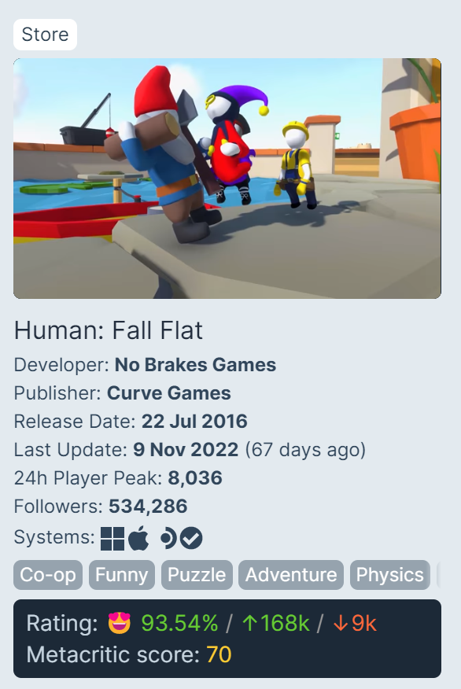
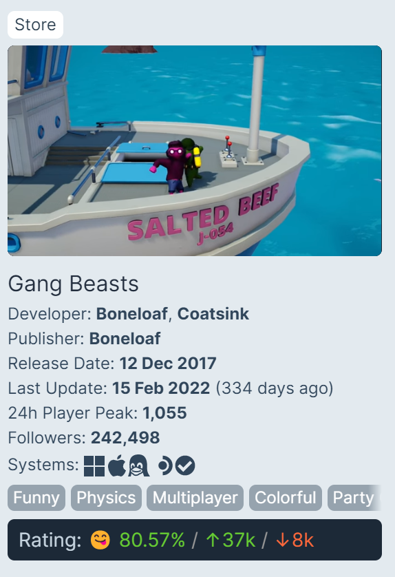
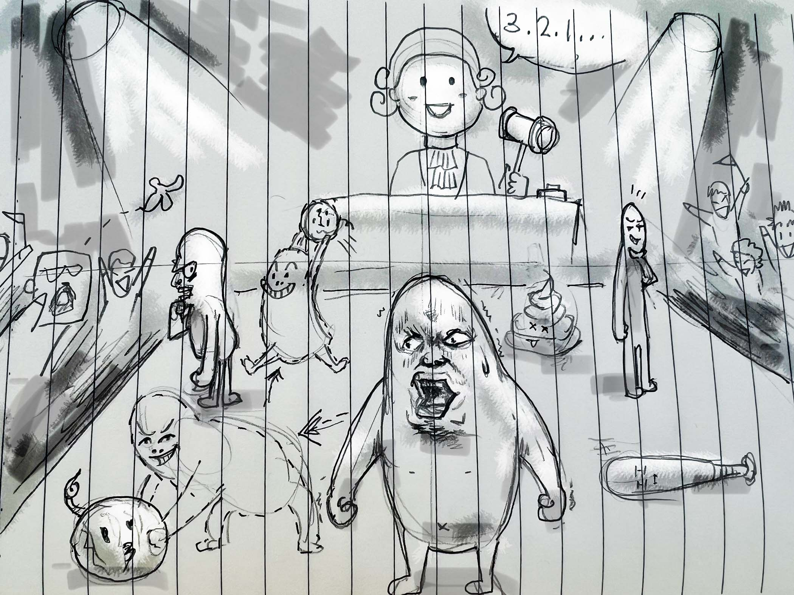

# 概念设计
- 项目头衔：云力态清零？沙雕律法
- 概念申明：  
  - 这是一个容易出圈 的 沙雕搞笑游戏。 观赏性极强 适合直播的 战斗游戏。V50 支持开发团队完成游戏。
  - 整个游戏的节奏有点类似于小时候玩的“123木头人”。
  - 在一个小房间内，每位玩家领取一个自己的任务，且玩家之间互相并不知道对方领取的任务的情况下，在沙雕法庭的指挥节奏下“123木头人”的游戏，并完成自己的任务。
- 流派：游戏是4-6人策略回合制游戏
- 目标玩家：压力群体，初高中生，大学生，上班族
- 独特卖点/引爆点：适合直播，容易出圈，不确定性，解压
# 产品打磨
## 玩家体验和游戏视角：
  - 以真实的物理简单的画面游戏满足玩家对搞笑战斗的幻想。让玩家哭笑不得的游戏体验。多方考虑的过程，以及自己行动时对游戏的进行造成结果的劲爆搞笑，把玩家带入心流。
  - 玩家之间的对战是整个游戏的关键，所有的子系统都围绕对战展开。
    1. 想象阶段不超过8秒，否则难以预估接下来的行动。
    2. 场景需要可控的其他玩家行动提示。
    3. 任务系统服务于促成玩家之间战斗。
## 视觉听觉风格：
  - 可爱沙雕风格，比“人类一败涂地”更沙雕的物理。比“胡闹厨房”更容易分手。比“基佬大乱斗”更深度的策略。
  - 
  - 
  - 
## 世界描述：
  - 游戏世界很简单，这个世界只有 沙雕法庭 和 各式各样的舞台 和 观众席组成。来这里的人只有两个目的：成为沙雕 与 欣赏沙雕，沙雕法庭决定这个世界的一切：这个世界拒绝严肃 沙雕值是这里评判优劣的唯一的标准与律法。
## 货币系统：
  - 沙币，沙币可以购买或者交易自己的器官。购买各式各样奇怪的初始道具，以获取更高的沙雕值。
## 平台/技术范畴
  - 游戏目标平台为PC,团队规模为4-5人。预计2-3个月可以完成Demo。3-6个月可以完成上线。游戏目前存在的风险点为：高精度物理系统，可破坏的玩家身体，以及多人联机的实现，逼近最好的性能表现。
# 游戏系统细节：
## 核心闭环：
### 子回合闭环：
  - 游戏将会为每个子回合形成闭环，分别是：思考阶段、行动阶段、结算阶段。并依次执行。
    - 在思考阶段：每位玩家将针对自己的目标，以及对其他玩家即将采取的动作进行预判来预定义行为，思考期间玩家不能看到其他玩家思考的行为。如果不是第一回合，玩家将以上一回合最后的动作下进行下一轮的思考。
    - 行动阶段：所有玩家将思考阶段的行为同一时间付诸实践。
    - 结算阶段：游戏将对该子回合高分行为进行回放，并结算记录本轮分数。
  - Demo_0.1：
    - 
    
### 大回合闭环：
  - 子回合囊括在游戏的大回合的闭环内。每个大回合为一轮游戏，依次执行：任务领取阶段，清零阶段，最终结算阶段。
    - 任务领取阶段：游戏会提示玩家领取任务。任务榜单上，任务数对应人数，每个玩家领取一个任务，先被领取的任务就会从任务榜单移除，如果玩家并未领取任务，则会依次分配给每位玩家。
    - 清零阶段：循环执行子回合的闭环，游戏允许台下观众与台上玩家互动，以及互相之间互动，直到所有玩家都被清零，循环中止。清零过程中玩家会受伤，但不同部位受伤会对其他部位带来加成，比如：眼睛受伤影响视力，但会增强对环境的感知力，从而可以隐约看到其他玩家在思考结算的思考行动的过程。
    - 结算阶段：所有玩家会依照大回合的分数进行排名站上领奖台，排名越靠前的玩家，获得的奖励越多。领奖台上依然可以战斗。最终沙雕法庭将对这场比赛的过程进行“无聊值”评判。满分10分。如果为0分，则所有玩家全额获得奖励。如果为5分，则所有玩家只能获得百分之50的奖励。
### 多人同步方式：
  - 视觉化git分支合并的同步方式
    - 每位玩家都必须经历：本地提交-拉取远端-推送远端 区别在于必须同步进行 以及无视冲突
    - 
    
### 玩家游戏中的目标：
  - 完成自己的任务
  - 和别的玩家一起尽量拿到更高的沙雕法庭评分
### 最优解：
  - 全部玩家把场子闹腾起来。造成动静结合类似“123木头人”的局面。
  - 赢利点：以网红参与策划为卖点。吸引大量观众，甚至游戏玩家之外的群体。再以植入道具式的广告盈利。
#### 参考资料：
  - 最高同时在线玩家参考：
    - 
    
  
  - 同类游戏销量参考：
    - 动物派对
      - Steam链接：https://store.steampowered.com/app/1260320/Party_Animals/?l=schinese
      - 
    - HumanFullFlat：
      - 
    - GangBeast：
      - 
### UX:

