# 游戏设计艺术(Jesse Schell)
## 游戏设计师 的 基本素养：
  - 自信的相信自己就是“游戏设计师”。
  - 失败是通往成功的唯一途径。
## 游戏设计师 的 技能：
### 全部：
  - 动画、人类学、建筑学、头脑风暴、商业、电影制作、沟通、创意写作、经济学、工程学、玩游戏、历史、管理、数学、音乐、心理学、公开演讲、声音设计、技术写作、视觉艺术。
### 最重要的：
- 倾听*5
  - 倾听团队（26 27章）
    - **26章：团队**
      - **必备的爱：**
      - 对“游戏”的爱面临的四个问题：
        - Q: 团队成员不喜欢任何游戏 怎么办？
          - A: 这样的成员是团队的重负，应该尽快解雇。
        - Q: 团队成员有比手头在做的游戏更喜欢的游戏 怎么办？
          - A：通过沟通找到手头游戏能吸引他们的点。
        - Q: 团队成员喜欢同一个游戏的不同版本 怎么办？
          - A: 尽早明确并告知所有人设计方向。在任何阶段出现分歧，都要停下解决。否则会导致团队分裂，失去对手上项目的热情。
        - Q: 如何面对不得不做但不是很想做的设计？
          - A：当作为“受众”准备的礼物。设计师不能欺骗自己，必须尽力准备。（强行换位思考，不得已的策略，因为不做“内观”比较容易做出肤浅的作品，但好歹是个成功的商业设计）
      - 共同设计的好处：
        - 有更多设计想法可供选择
        - 快速排除有缺陷的想法
        - 被迫从不同角度看待游戏
        - 因为设计权而提升每个人的动力
      - 典型设计过程：
        - 头脑风暴 - 独立设计 - 设计讨论 - 设计报告 - 从头脑风暴开始 重复这个一过程
      - 团队交流的十个要点：
        1. 客观
           - 客观的好处：
             - 客观的态度可以缓解 紧张的气氛。
             - 即使最害羞的人也敢于自由发表看法。
           - 方法：把游戏当成解决问题的方案。
             - 我要解决什么问题？
             - 是否做过一些与目标无关的游戏设定？
             - “游戏” 是不是这个问题的最佳解决方案？
             - 我如何判断问题已经被解决？
        2. 清晰
           - 方法：确保别人理解你，以及你理解别人。
           - 方法：一直问到你理解为止。
           - 方法：用图解释。
           - 方法：具体细致的描述，减少误解。
        3. 持续
           - 避免误解和忘记。
           - 记录并共享。
        4. 舒适
           - 舒适的好处：
             - 不容易分心，更自由的表达。
           - 方法：安静、温度适宜、足够的椅子、足够的空间。
           - 方法：身体 和 情感的舒适。
           - 舒适 依赖 尊重。
        5. 尊重
           - 尊重的好处：
             - 更诚实 话更多
           - 方法：不要打断别人。不要目光游离。礼貌且有耐心。
           - 尊重 依赖 信任。
        6. 信任
           - 方法：
             - 高频率沟通 > 低频率沟通
             - 面对面沟通 > 线上沟通
             - 群体开放空间 > 单人封闭空间 （有助于面对面交流）
           - 信任 依赖 诚实。
        7. 诚实
           - 诚实的好处：
             - 让人愿意 坦诚 交流。避免政治化。
        8. 保留隐私：
           - 分开公开场合和私人场合。
           - 一对一交谈有助于信任的建立。
           - 信任带来诚实，诚实又带来更多信任。
        9. 团结：
           - 不能忽视意见。
           - 我要怎么做你才能同意？
           - 一名成员不赞同的设计，就会导致团队分裂。
        10. 爱：
           - 上述9点都是为了 爱 所搭建的环境。
           - 爱 是通向佳作的唯一途径。
           - 皮克斯的温德卡特摩尔：好的想法给了一组平庸的人，他们会毁了这个想法。如果把平庸的想法给了一组优秀的人，他们就会改善这个想法。
      - 团队顺利运行的反思：
        - 这个团队适合这个项目吗？
        - 团队成员有没有客观的交流？
        - 团队成员有没有清晰的交流？
        - 团队成员在一起互相适应吗？
        - 团队成员是否互相信任尊重？
        - 团队成员最终是否团结在决定的周围？
      - 拓展阅读：
        - 半条命团队创作历程：
          - https://www.gamedeveloper.com/design/the-cabal-valve-s-design-process-for-creating-i-half-life-i-
          - ken birdwell
        - 帕特里克 兰西奥尼：优势
          - https://zhuanlan.zhihu.com/p/100615856
    - **27章：文档**
      - **团队文档：**
      - 文档的唯一目的：备忘 和 沟通。
      - 需要 沟通 备忘 的六个环节：
        - 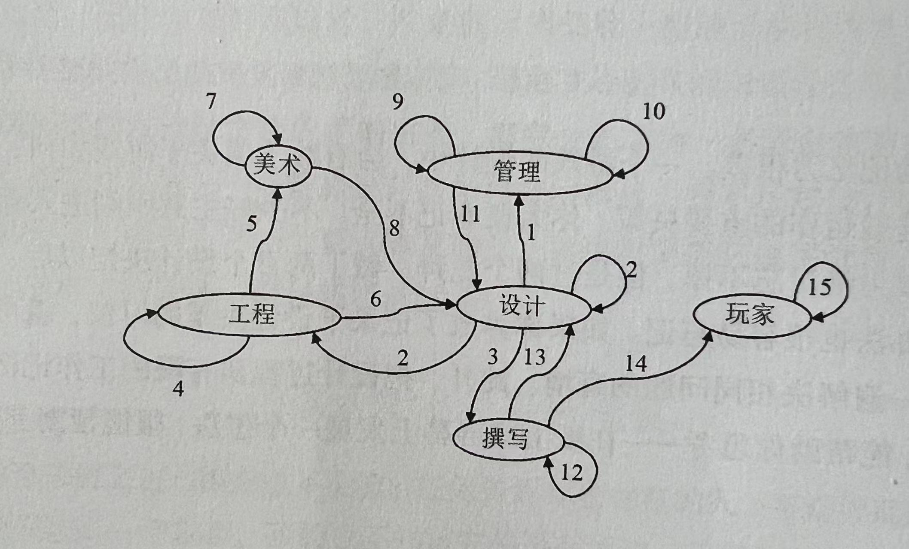
        - 设计
          - 1. 游戏设计概述：
            - 为了团队管理
            - 目的：让每个人都知道游戏的目标。
          - 2. 详细设计文档：
            - 为了设计团队内部
            - 为共事团队和自己量身定做的。
            - 常常是最厚的文档。
          - 3. 故事概要文档：
            - 为了故事团队的文档
            - 一份简短的游戏描述，包含:场景、角色、动机
            - 让“文案”可以通过文档沟通提出建议。
        - 工程
          - 4. 技术设计文档：
            - 架构重要的系统，让代码工作顺利展开，让 “工程师之间”展开沟通和备忘。
          - 5. 流程概述：
            - 工程师为美术人员撰写的文档，目的在于资源整合。
          - 6. 系统限制：
            - 为了设计师撰写的文档，目的在于了解技术限制。
        - 美术
          - 7. 美术圣经：
            - 为了美术风格的一致性。
          - 8. 概念美术纵览：
            - 让设计师预览游戏完成时的样子。
        - 制作/管理
          - 9. 游戏预算
            - 为了完成游戏所有需要的资源（包括时间）。
          - 10. 资源跟踪文档
            - 目的是为了验收。
          - 11. 项目进度表
            - 最常更新的文档。
            - 为了让设计团队更好的计划时间。
        - 文案/撰写
          - 12. 故事圣经
            - 记录故事中能发生的以及不能发生的事。
            - 故事引导团队，团队完善故事。
          - 13. 剧本
            - 记录所有NPC的对话
            - 设计师需要保证与玩法不冲突
          - 14. 游戏教程与手册
            - 向玩家确切反应游戏最终内容。
        - 玩家
          - 15. 游戏攻略
            - 由玩家撰写的文档
            - `下次设计游戏会注意的地方。`
      - 文档撰写的反思：
        - 这个文档的出现是否是必要的？
        - 在制作这个游戏的时候需要牢记什么？
        - 在制作这个游戏的时候需要沟通什么？
      - 拓展阅读：
      - https://lostgarden.home.blog/
      - https://www.gdcvault.com/play/1012356/One-Page
  - 倾听受众（9-11 + 24 25 33章）
    - **9章：玩家**
      - **人群年龄特征**
        - 0-3岁
          - 喜好：简单的直接交互
        - 4-6岁
          - 喜好：和父母一起玩简单的游戏（因为父母知道怎样调整游戏规则让游戏保持乐趣）
        - 7-9岁
          - 喜好：开始决定自己喜欢的游戏。
        - 10-13岁
          - 喜好：发生生理变化，开始着迷于自己的兴趣爱好。
        - 13-18岁
          - 喜好：尝试新的体验，男孩女孩的兴趣出现重要的分化。
        - 18-24岁
          - 喜好：比孩子玩的少，游戏类型和娱乐方式有了特定的偏好。
          - 特征：有富余的时间和金钱，是巨大的消费群体。
        - 25-35岁：“构建家庭”
          - 喜好1：休闲游戏。偶尔娱乐，或于他们的孩子一起玩。
          - 特征1：时间变的宝贵。
          - 喜好2：核心玩家。把游戏作为主要爱好的人。
          - 特征2：会购买很多游戏，经常表达他们的喜好与厌恶。
          - 影响2：核心玩家的意见会影响其他人的购买决策。
        - 35-50岁：“家庭成熟”
          - 喜好：休闲游戏。需要承担职业与家庭责任。
          - 特征：这个群体会做出购买昂贵游戏的决定。他们会寻求家庭玩游戏的机会。
        - 50岁以上：“空巢老人”
          - 喜好1：怀旧游戏。回归到年轻时喜爱的游戏中。
          - 喜好2：转向新的游戏体验，寻求改变。
          - 特征：对重度社交的游戏感兴趣。例如：高尔夫、扑克、网球、多人在线游戏。
        - 总结：
        - 无论哪一个群体创作，要与这一群体交流，就必须使用他们儿童时期的说话方式。
        - 因为儿童时期是以玩为中心的，所以他们所有的游戏活动都与儿童时期有关。
        - 为特定人群制作游戏时，要与他们儿童时期流行的游戏和主题保持一致。
      - **男性特征**
        - **掌控**：
          - 男性喜欢掌控一切，可能只因为“具有挑战性”。
          - 女性更倾向掌握一些有意义的事情。
        - **竞争**：
          - 男性通过竞争获胜来获得兴奋感。
          - 女性通过竞争失败来累计挫败感。
        - **破坏**
          - 男性喜欢摧毁。
        - **空间谜题**
          - 男性比女性更具有空间推理能力。
          - 三维空间会更吸引男性，但会使女性沮丧。
        - **试错**
          - 男性通过试错来学习。
      - **女性特征**
        - **情感**
          - 女性喜欢探索人类丰富的情感体验。
          - 色情文学中男性更关注肉体，女性更关注情感。
        - **现实世界**
          - 女性更关注与现实世界有关联的娱乐活动。
          - 例如:
          - 女性喜欢：过家家、换装、扮演兽医...
          - 男性喜欢：扮演幻想中的角色
        - **抚育**
          - 在固有印象中女性玩家更喜欢抚育：照顾比她们更弱的对象。
          - 女性玩家喜欢为其他玩家提供治疗。
        - **对话与字谜**
          - 女性具有更好的文字能力。
        - **通过例子学习**
          - 她们喜欢有清晰的教程小心的指导自己。
      - **心理特征**
        - 定义：
          - 减少关注玩家的外部表现，而是关注玩家的内在想法。
        - **勒布朗（Marc LeBlanc）8种乐趣 及其延展**
          - http://algorithmancy.8kindsoffun.com/
          - 感官乐趣
            - 主要由游戏的“美感”带来的乐趣。
            - 17号透镜：玩具
              - 排除明确的目标，游戏交互反馈是否有趣？如果不是，如何改进？
              - 当人们看到游戏就应该知道如何玩。
              - 在他们知道应该怎样玩之前，他们想要参与互动吗？如果不是如何改进？
          - 幻想乐趣
            - （19章、83号透镜）
            - 幻想
            - 每个人都有不能说的欲求，如何满足这种欲求？
            - 我的世界能够满足什么样的幻想？
            - 我的目标玩家幻想成为什么样的人？
            - 我的目标玩家幻想在我的世界中做什么？
            - （20章、85号透镜）
            - 幻想的入口：化身
            - 化身是不是可以引起目标玩家共鸣的理想型？
              - 理想型：玩家梦想成为的角色。
            - 化身对目标玩家有没有符号化的投射点？
              - 符号化：例如蝙蝠侠的蝙蝠标志。蜘蛛侠的面具。马里奥的形象。
          - 叙事乐趣
            - 指的是一系列事件的戏剧化演变。
          - 挑战乐趣
          - 团队乐趣
          - 探索乐趣
          - 表达乐趣
          - 规则乐趣
      - **关于玩家的反思**
        - 目标玩家通常喜欢什么？
        - 目标玩家通常不喜欢什么？
        - 他们希望在你的游戏中看到什么？
        - 换位思考，“我”想要在游戏中看到什么？
        - 他们会特别喜欢或者讨厌游戏的那一部分？
        - **结合 10号透镜 全息设计**
        - 游戏中的哪种元素产生了令人享受的体验？
        - 游戏中的哪种元素让玩家在体验中分心？
        - 怎样改变游戏元素来提高游戏体验？
        - 观察玩家玩游戏 来更好的预测玩家喜欢什么。
  - 倾听游戏（大部分章节）
    - ```叙事```
      - （占了本书1/6的章节）
    - **17章：叙事**
      - 核心问题：如何创造 没有游戏的故事 和 没有故事的游戏 无法创造的体验？
      - 互动叙事 继承 传统叙事
      - 游戏**生产**故事：73号反思
        - 玩家达到目标时有不同的选择，会产生新的不同的故事。我如何才能添加更多的这种选择？
        - 不同的矛盾导致不同的故事。我怎么才能让更多种类的矛盾从我的游戏中产生？
        - 当玩家可以个性化设定角色时，他们会更关心故事的结果。怎么能让玩家个性化？
        - 好的故事拥有好的兴趣曲线。规则能否让故事拥有好的兴趣曲线？
        - 只有你能讲述的故事才是一个浓度够高的好故事（二阶创作会稀释体验的传达）。
      - 游戏与故事中的**障碍**：74号反思
        - 主人公和目标之间存在什么关系？为什么主人公在意它？
        - 主人公和目标之间的障碍是什么？
        - 在障碍背后是否存在一个对手？在主人公和对手之间存在什么关系？
        - 障碍是否在逐渐增加难度？
        - “障碍越大，故事越好” 障碍够大吗？它们能够变得更大吗？
        - 杰出的故事经常包含为了客服障碍主人公发生的转变。主人公如何在故事中发生了转变？
      - 游戏故事中的**简单和超越**：75号反思
        - 受欢迎的故事架构：
          - 是现实世界的抽象和提炼。
          - **简单**：游戏世界比真实世界更简化，**超越**：玩家在游戏世界比真实世界更富有力量
        - 游戏世界如何比真实世界更简单？有没有方法使其简单？
        - 游戏给予玩家何种 超越 的力量？如何在保持挑战的前提下 增加这种力量？
        - 简单 和 超越 的组合是否反直觉？是否可以满足玩家特殊的愿望？
      - **英雄**故事的架构：76号反思
        - 英雄故事架构：1992 克里斯托弗·沃格勒 Christopher Vogler《作家之旅》（除了狮子王 没什么有名的作品）
          1. 平凡世界：英雄是的平凡生活中的普通人。
          2. 冒险的召唤：挑战打破平凡。
          3. 拒绝召唤：英雄拒绝挑战。
          4. 遇到导师：充满智慧的人物提出建议/训练/帮助。
          5. 跨国瓶颈：英雄迫于压力，进入冒险世界。
          6. 冒险过程：英雄面对一系列小挑战/结盟/遭遇，学习冒险世界的运作规则。
          7. 接近尾声：英雄遭遇挫折并需要尝试面对一些新挑战。
          8. 严峻考验: 英雄面临巅峰的生死危机。
          9. 获得奖励：英雄大难不死，克服恐惧，获得奖励。
          10. 回归平凡：英雄回到平凡世界，但问题依然未全部解决。
          11. 重回战场：英雄面临一场更大的危机，并且必须运用他已经学到的一切。
          12. 结局回归：旅程彻底结束，英雄解决问题，并且改善了平凡世界里每个人的生活。
        - 是否有使之成为英雄故事的元素？
        - 如果有，如何匹配英雄故事结构？能否参考结构并改进？
        - 有没有创新？不至于过于匹配而显得陈旧？
      - **记忆点**：77号反思
        - 我的故事里最怪的东西是什么？
        - 怎样确保这个最怪的东西 不反直觉 或 意义不明？
        - 如果有过多奇怪的东西，是否应该去掉或者合并一些？
        - 如果删除"记忆点"那么故事还有趣吗？
      - 关于**故事**的总结：78号反思
        - 我的游戏真的需要故事吗？
        - 为什么玩家会对这个故事感兴趣？
        - 故事怎么去支持四元素“美学、技术、玩法”？是否可以优化？
        - “美学、技术、玩法”如何支持故事？是否可以优化？
        - 怎样从叙事的角度让故事更好？
      - 拓展阅读：
        - 《Character Development and Storytelling for Games》 Lee Sheldon：有很多具有IP的作品
        - 《故事》Robert McKee：最知名的编剧讲师之一，好莱坞电影剧本创作圣经。
        - 《作家之旅》Christopher Vogler：公式化，容易理解。
        - 《写作故事：叙事创作指南》Janet Burroway：已经第10版了。
    - **18章：游戏叙事**
      - 游戏叙事的独特之处有哪些：
      - **自由**：79号反思
        - 玩家什么时候可以自由行动？这些时间里他们感觉自由吗？
        - 他们什么时间会被限制活动？这些时间里他们感觉束缚吗？
        - 在哪些地方可以更加自由？
        - 游戏中是否有地方过于自由而手足无措？
      - **帮助**：80号反思
        - 在整个游戏过程中，玩家在帮助谁？
        - 如何让需要帮助的角色和玩家之间的内心联系的更紧密？
        - 是否可以用帮助他人，作为游戏完成的目标？
        - 被帮助的角色如何表现出他们的感谢方式？
      - **间接控制**：81号反思
        - 设计师对玩家想要做什么会有一个想象中的规划，为了确保玩家以自由意愿做这些事，进行以下反思：
        - 最理想的情况下，设计师想要玩家做什么？
        - 玩家做这件事是否有**限制**？
        - 玩家做这件事是否符合游戏的任务**目标**？
        - 玩家做这件事时**界面**是怎样的？
        - **视觉设计**是否在引导玩家做这件事？
        - **游戏角色**是否用情感投射的方式在引导玩家做这件事？
        - **音乐**是否在渲染氛围让玩家做这件事？
        - 在不削弱自由感的前提下，是否有别的方法，让玩家做 设计师想要玩家做的？
        - 以上设计是否可以抑制玩家不该有的欲望？
      - **角色串通**：82号反思
        - 角色应当作为游戏设计师的小分身来引导玩家走向最终目标：
        - 我想要玩家体验什么？
        - 角色如何配合在不偏离游戏世界目标的前提下，实现这种体验？
      - 拓展阅读：
        - 《图画、画图 知觉与构图》Molly Bang
    - **19章：游戏叙事 中的 世界**
      - **幻想**：83号反思
        - 每个人都有不能说的愿望或者欲望。为了游戏世界可以满足这种愿望。提出如下问题：
        - 游戏世界满足了什么幻想？
        - 玩家幻想在世界中成为什么样的人？
        - 玩家幻想在世界中做什么？
      - **世界**：84号反思
        - 游戏世界与游戏是分离的。游戏 玩家 想象游戏世界的载体。
        - 游戏世界在哪方面比现实世界更胜一筹？
        - 除了游戏 其他媒介表现这个世界？媒介之间如何互相支持？
        - 我的世界只围绕一个单一的故事吗？有没有可能在其中发生多个故事？
    - **20章：游戏叙事 中的 角色**
      - **化身**：85号反思
        - 化身 是玩家进入游戏世界的入口。为了确保化身能展示出玩家尽可能多的身份特征，提出以下问题：
        - 我创造的 化身 是否能引起玩家共鸣的理想型？
          - 理想型的定义：玩家一直梦想成为的角色，例如：各种超级英雄。
          - 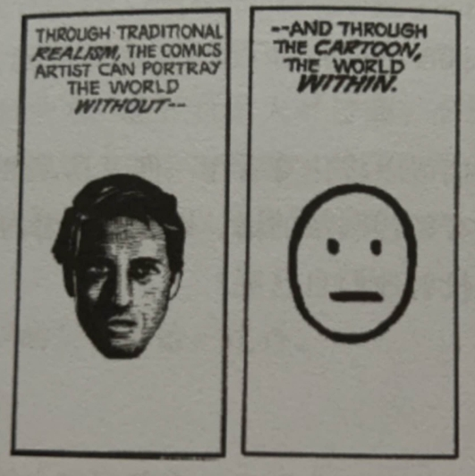
          - 符号化角色：一个角色身上细节越少，读者就可能将自己投射到那个角色上。
          - 上述两者可以混合使用：例如：蜘蛛侠：强大果敢，是一个理想型；但面具又让他 符号化。
        - 游戏的 化身 有没有 符号化 的特性来让玩家投射？
      - **角色功能**：86号反思
        - 为了确保角色完成了 游戏 赋予他们的全部职责。问以下几个问题：
          - 例子：需要把功能和存在的角色匹配起来，可以一个角色有多个功能。
            - 游戏需要的功能：
              - 英雄：玩家控制的角色
              - 导师：提供建议和一些道具的
              - 助手：必要时给一些提示的
              - 教师：解释游戏玩法
              - 最终Boss：最后一战的对手
              - 爪牙：一群坏蛋
              - 3名Boss：需要面对的强敌
              - 人质：需要解救的人
            - 游戏存在的角色：
              - 老鼠公主：美丽、坚强、理性
              - 猫头鹰智者：智慧、健忘
            - ...
        - 我需要的角色是什么？
        - 我已经想了哪些角色？
        - 角色和功能是否匹配？
        - 能否让某个角色行使多个功能？
        - 是否需要修改角色设定，来让它与功能对应的更好？
        - 为了功能我是否需要新角色？
      - **角色特征**：87号反思
        - 为了确保角色特征可以在其言行中表现出来，提出以下问题：
        - 是什么特征定义了我的角色？
        - 这些特征是如何外化的？例如：世界、角色 的举止容貌。
      - **人际关系环状图**：88号反思
        - 人际关系环状图 Interpersonal circumplex by Isbister 
          - 由 Catherine Isbister 社会心理学领域带到游戏设计领域的工具：
            - 目的：用来观察角色间的关系，基于两个象限：友谊 和 支配。
            - 论文：https://gamifique.files.wordpress.com/2011/11/9-better-game-characters-by-design-a-psychilogical-approach.pdf
          - 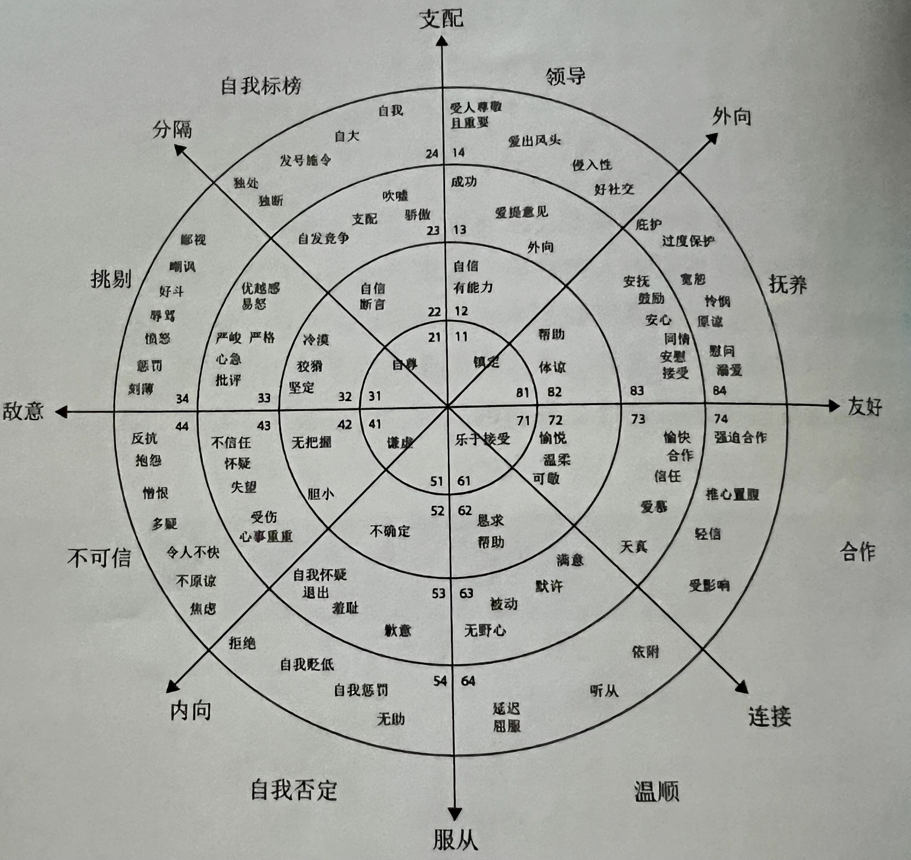
          - 使用方法：选取一名进行分析的角色，放在坐标原点，思考其他角色与该角色的位置。
          - 
          - 上图是 星球大战中 汉索罗 的人际关系图。
          - 距离原点越近说明交流越多。
          - 越极端的位置，说明角色越有趣。
          - 可以帮助团队更好的从各方面塑造角色：
          - 
          - 
        - 图上与原点的距离是否合适？
        - 图上是否有极端角色？加入极端角色会不会有帮助？
        - 被分析角色的同伴都处于一个分区还是不同分区？如果在不同分区会怎么样？
      - **角色网络**：89号反思
        - 为了确保角色之间的关系更加丰满，列出一张所有角色的清单，然后思考以下问题：
        - 角色之间是怎么看待对方的？
        - 是否存在未解释的人际关系？我们如何使用他们？
        - 是否有太多相似的关系？它们怎样才会变得不同？
      - **地位**：90号反思
        - 不同的地位会产生不同的行为。为了让角色之间有相互意识，提出以下问题：
        - 游戏里角色的地位级别是什么？
        - 他们怎么才能展现出符合其地位的行为？
        - 游戏中的角色怎样争取他们的地位？从而演绎精彩的地位冲突
        - 在游戏的哪个环节会发生地位改变？从而演绎精彩的地位转变
        - 游戏如何给玩家一个表达地位的机会？
      - **角色转变**：91号反思
        - 在玩家做出选择后玩家会发生什么样的转变？为了确保角色转变是有趣的，提出以下问题：
        - 例子：以时间变化为横轴，以角色特征为纵轴，制作一个描述角色变化的表格。
        - 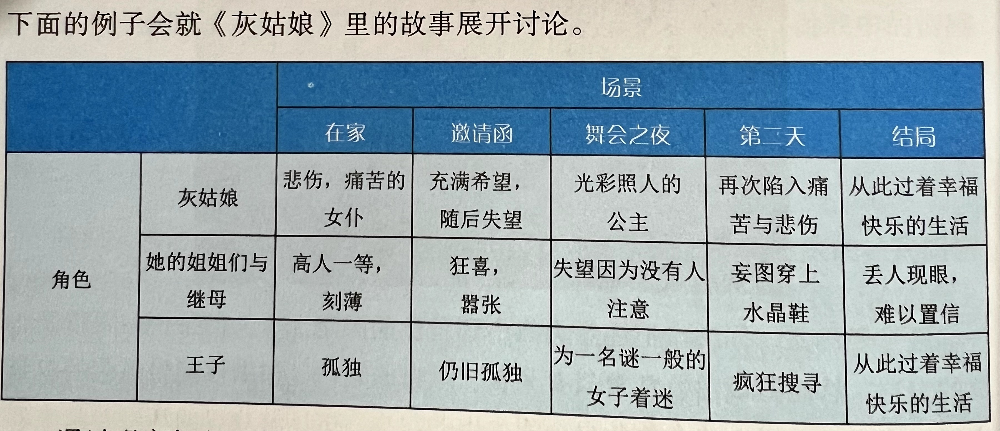
        - 每名角色在游戏中会如何转变？
        - 如何将这些转变以 更清楚 更有力 的方式传达给玩家？
        - 转变足够多吗？
        - 转变出人意料吗？有趣吗？
        - 这些变化是否符合逻辑？
      - 拓展阅读：（待补充）
        - 理解漫画 Understanding Comics —— Scott McCloud
    - **21章：游戏叙事 中的 空间**（待补充）
      - 游戏空间的骨架：
        - 线性
          - 横板卷轴游戏
          - 目的：只能前进或者后退
        - 网格
          - 战棋类游戏（国际象棋）
          - 目的：容易被玩家理解，容易被电脑理解
        - 网络
          - 一些游戏的地图
          - 希望玩家可以探访多个地点，但又希望提供不同路线，旅行可以瞬间完成。
        - 点状分布
          - 目的：营造一种探索的感觉
        - 分割空间
          - 目的：与真实的地图最为相似，常见于希望复制真实地图的游戏。
      - 生动空间的15个特性：（待补充）
        - ref：The Timeless Way of Building 建筑的永恒之道 - Christopher Alexander
        1. 缩放级别
        2. 强力中心
        3. 边际
        4. 交替重复
        5. 正空间
        6. 好的形状
        7. 本地对称
        8. 深度连锁
        9. 对比
        10. 渐变
        11. 粗糙感
        12. 回声
        13. 空虚
        14. 内在平静
        15. 不分离性
      - **空间的内在矛盾**：92号反思
        - 空间与最终目标不能有互相妨碍的内在矛盾，为了扫除矛盾，提出以下问题：
        - 游戏的目的是什么？
        - 每个子系统的目的是什么？
        - 空间中有没有东西妨碍了这些目的？
        - 怎么改善这些矛盾？
      - **空间的活力**：93号反思
        - 空间设计是否有生命力？是否在讲述故事？
      - 拓展阅读：（待补充）
    - **22章：游戏叙事 中的 临场感**
  - 倾听客户（30-32章）
  - 倾听自己（1、7、35章）

# Rule Of Play(Zimmerman Salen)
## 这本书关于什么？
  - 游戏设计的学术框架
  - 如何批判性评价游戏的语言体系
    - 目的：
      - 练习：有助于游戏设计师深入思考
      - 术语定义：方便交流避免重复性的解释研究
      - 批评维度：有助于更复杂客观的评价游戏
      - 应对审查和质疑：更严格的要求自我 有助于抵御攻击
    - 架构：
      - RULES:系统的逻辑组织
      - PLAY：系统的人类体验
      - CULTURE：系统的大文化背景
  - 拓展阅读：
  - The Art of Computer Game Design, by Chris Crawford
    - Chapter 1: What Is a Game?
    - Chapter 3: A Taxonomy of Computer Games
    - Chapter 5: The Game Design Sequence
  - http://www.gamasutra.com/
  - http://www.gamestudies.org/
  - http://www.igda.org/
  - http://www.costik.com/nowords
  - "Rules, Play, and Culture: Checkmate!" by Frank Lantz and Eric Zimmerman
## 设计过程
### 起点：迭代设计 Iterative Design
- 迭代设计 强调**游戏测试**和**原型设计**
- 是一种根据开发过程中**玩游戏的经验**做出设计决策的方法。
- 只有**基本规则**和**核心机制**
- 迭代设计是一个**循环过程**，在**原型设计、游戏测试、评估和改进之间**交替进行。
- 为什么是迭代设计？
  - 回答永远无法完全预测游戏的体验。
  - 例如：
    - 游戏是否实现了其设计目标？
    - 玩家是否了解他们应该做什么？
    - 他们玩得开心吗？
    - 他们想再玩一次吗？
  - 批判性地玩游戏，看看它擅长的地方和停滞不前的地方，并能够实施将游戏推向有意义的游戏的改变。
- 游戏原型 最迟在项目进度的 20% 时创建和测试。
#### 研究其他游戏设计师的流程
##### Sibling Rivalry _ Richard Garfield 《万智牌的设计师》
- 第一阶段：考虑项目的限制
- 第二阶段：思考主题 和 机制
- 第三阶段: 原型 发现规则太多，使游戏变得复杂，数值跟踪痛苦，涉及大量算数。
- 第四阶段：**演变** 将规则（有开始和结束的轨道格）和数值（计分板）可视化
- 过程中 不断缩小轨道格，以使评分更加简介。根据用户习惯调整UI。
- 评分系统的**演变**：设计更加简单的评分系统，以便玩家更容易理解，且还保持兴趣。
- 玩家数量的**演变**：增加玩家数量，以增加游戏的复杂性，和乐趣。
- 人体工程学的**演变**：什么是笨拙的，什么是太复杂的，哪些操作需要太多时间或产生太多错误。
##### Ironclad _ Frank Lantz 《纽约市的自由游戏设计师》
- 第一阶段：抽象概念 多年来，我一直被巨大的未来派哲学家机器人的形象所困扰，它们进行战斗，代表着抽象的观念和信仰的冲突。
- 每个玩家都会对游戏的目标和操纵棋子允许的动作类型有相同的指示，但他们对这些动作所代表的心理形象将完全不同。
- 最初的计划是一套 30 张牌：15 张基础牌或前提牌，以及 15 张攻击牌或辩解牌。每张卡都有一个数值;玩家会以各种方式将牌摆在桌子上，试图以最有效的方式摧毁对手的基础（或使他们的论点无效）。这些卡片的中心将有抽象的符号，并针对每个对手有不同的标题和“风味文本”。
- 经过几个星期的思考，我无法想出一个不同的结构来工作。
- 通常，思考游戏系统的结构与其主题的关系是很有趣的，但试图想出一个可以作为两个对立主题支点的结构并不好玩。它有一些不愉快的东西，一些特别强迫的东西，过于刻意和尴尬的东西。
- 游戏真正有趣的地方是结构、系统、数学、相空间的拓扑卷积，而主题只是那么多的虚构、幻想和假装。这开始看起来像是一个空洞的、有点怪诞的把戏。
- 主题可以给结构添加任意限制，任意限制往往是一件好事。
- 于是，我放弃了铁甲，松了一口气，退回到一个完全不同的想法上，这个想法我一直在胡思乱想。通常，当我看到一个网格时，我会想象一个棋盘游戏同时是两个不同的游戏。一组棋子会像国际象棋一样从一个方块移动到另一个方块，而另一组棋子将沿着线从一个交叉点移动到另一个交叉点。我认为两组作品之间应该很少或没有接触，我想象它们同时占据同一空间的两个维度，以某种微妙和倾斜的方式相互影响。
- 最终的游戏测试使我能够弄清楚剩下的细节。“选择目标”射击方法的开发是为了允许组合射击，而无需在机器人子游戏中为一个回合添加额外的步骤（多个机器人可以一次射击）。在设计的最后阶段，我确定了网格的大小和起始件的数量，并消除了规则中的任何歧义。
### 创建 Creation
  - 目的：限制和集中设计思维
  - 背景：
    - 游戏创作练习包括从头开始制作一个游戏。这里包含的任何游戏创作练习都可以在一堂课、一个周末、两三周或一个学期内进行。
    - 在每个练习中，设计重点都体现为给学生的一组参数，以限制和集中他们的设计思维。
    - 例如，一组学生在设计一款以社交互动为设计重点的游戏时，可能会被赋予指定玩家人数（2、5 或 20 人）和游戏所创建的社交关系类型（如友情、敌意或调情）的参数。
    - 参数还可以涉及所设计游戏的媒介或形式。
    - 这些参数可以在课前创建，写在索引卡上，然后随机分发给学生小组（2-4 人小组通常效果最佳，具体取决于环境和任务）。
    - 或者，学生也可以自己选择参数。通常情况下，两到三个参数就足以集中学生的思维，而不会因为过多的限制而窒息。
  - **17章：信息操控（Information Manipulation）**
    - 信息:（information） 
      - 代表着玩家在玩游戏时的：
      - 操纵的、可摆布的
      - 获得的、已获得的
      - 隐藏的
      - 泄露的, 暴露的, 披露的
    - 完美信息 和 不完美信息:（perfect information and imperfect information）
      - 完美信息：
        - 公开分享游戏中的所有知识。
        - 例如：国际象棋
        - 代表着一种 竞争性的分析
      - 不完美信息：
        - 玩家只能看到部分游戏信息。
        - 例如：扑克牌
        - 代表着一种不确定 和 不信任
    - Celia Pearce 四层信息：
      - 所有玩家都知道的信息
      - 仅一个玩家已知的信息
      - 仅游戏已知的信息
      - 随机生成的信息
    - 信息经济系统:（information economy）
      - 系统中的信息不具有内在价值
      - 而是从其与系统信息经济中其他信息单元的“关系”中获得其价值。
    - 客观信息 和 感知信息:（objective information and perceived information）
      - 信息对游戏具有两种有意义的促进：
      - 客观信息：游戏系统的内部信息结构；
      - 感知信息：即玩家通过游戏观察和获取的信息。
    - 数字游戏的特殊性：
      - 隐藏的游戏规则和机制作为信息，发现他们本身就是游戏体验的一部分。
  - **12章：三个层规则（The Exquisite Corpse Game Game）**
    - 三层规则：three related levels
      - 任何游戏都有
      - 构成规则：Constituative Rules
        - 抽象的核心数学规则。尽管它们包含基本的游戏逻辑。不明示给玩家的。
      - 操作规则：Operational Rules
        - 在玩游戏时才用得到的规则。
      - 隐性规则：Implicit Rules
        - 此类游戏都具有的不成文规定。
      - 关系：
        - 操作规则 都建立在 构成规则之上。
        - 构成规则 可以有很多种 操作规则 来表达。
        - 隐性规则 和 操作规则 界限模糊。隐性规则 可以转化为 操作规则。
        - 游戏的意义 是通过在 三层规则 之间建立桥梁 的过程来实现的。
    - 形式身份：formal identity
      - 是游戏独一无二的身份证。
      - 这种身份是从 构成规则 和 操作规则 之间的关系产生的。
      - 构成规则 和 操作规则 的精确性和明确性 使得游戏规则适用且仅适用于这个游戏。
    - 优雅的规则：Elegant rules
      - 优雅的规则让玩家能够专注于游戏的体验而不是规则的逻辑。
      - 设计有意义规则设计，需要在的每一个 行动 和 结果 之间有 可辨别的、统一的关系。
    - 拓展阅读：
      - <www.gamepuzzles.com/tlog/tlog2.htm>
  - **23章：体验设计（Sensations of Play）**
    - **体验** "一词通常指":
      1. 通过感官或思维对物体、思想或情感的理解；
      2. 积极参与各种事件或活动，从而获得知识或技能；
      3. 参与或经历的事件或一系列事件。
    - **参与**：participation
      - 游戏是通过**参与**来体验的，体验效果决定了游戏好坏。
      - 游戏对玩家的感官输出，玩家的输入能力，引导玩家做出决定的内部认知和心理过程（循环）
      - 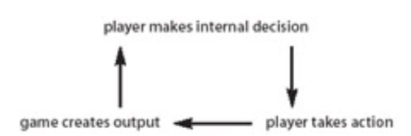
    - 萨顿-史密斯**体验模型**：Sutton-Smith's model
      - 注意力集中度 Concentration：专注：全神贯注于比赛。
      - 视觉扫描 Visual scanning：视觉感知，尤其是同时扫描整个屏幕。
      - 听力辨别 Auditory discriminations：听觉辨别：聆听游戏事件和信号。
      - 动作反应 Motor responses运动反应：玩家使用游戏控制器做出的身体动作。
      - 感知式学习 Perceptual patterns of learning：学习的感知模式：了解游戏本身的结构。
      - 抽象后：
      - input 玩家的输入
      - output 系统的输出
      - internal processes 玩家做出的决策
    - 二阶设计：second-order
      - 游戏设计师只能通过 直接设计 规则 来 间接设计 玩家的体验。
      - 创造有意义的体验，意味着把 一个正儿八经的系统 变成 一种体验。
    - 核心机制： core mechanic
      - 定义：
        - **moment-to-moment**: 核心机制 是玩家每时每刻参与的基础活动。
        - **single activity**: 核心机制 可以是 单一动作，例如：跑、跳、射击。
        - **compound activity**: 核心机制 可以是 复合动作，例如：即时战略游戏的军事战术、资源管理以及鼠标和键盘技能。
        - **Variations**: 核心机制 可以通过 变化的设计 来 扩展和扩大 出许多变体。
        - 核心机制 是当一款游戏玩起来毫无乐趣时的**罪魁祸首**。
      - 意义：一遍一遍的**重复** 让游戏创造**更广阔**的体验模式。
    - 核心机制的变体：Variations on a Core Mechanic
    - 拓展阅读：
      - https://www.gamedeveloper.com/design/formal-abstract-design-tools
      - Man, Play, and Games, by Roger Caillois
        - I. The Definition of Play
        - II. The Classification of Games
      - Pilgrim in the Microworld, by David Sudnow
        - Memory
        - Interface
        - Cathexis
        - Eyeball
        - Coin
  - **28章：社交元游戏（Engendering the Metagame）**
    - 社交游戏：Social Play
      - 定义：游戏中所有元素都为社交而设计。
    - 社交互动出现形式： Social play interactions
      1. internally：游戏规则内部互动产生的。例如：玩家在游戏中扮演不同角色的互动。
      2. externally：游戏规则外部衍生的互动。例如：在玩游戏之前事先就互相认识。
    - 游戏社区：play community 
      - 出现条件：
        - 围绕 单个游戏
        - 围绕 游戏活动 或 系列游戏
        - 围绕 一个大的游戏背景
    - 玩家角色：Player roles
      - 指的是玩家之间互相的关系。
      - 关系并不固定。在游戏过程中会多次转换。
    - 萨顿-史密斯玩家角色模型 Sutton-Smith's model
      - actor 扮演者
      - counteractor 对抗者
      - motive 两者之间的动机。例如：动机是捕获，那么扮演者的动机是捕获，对抗者的动机是不被捕获。
    - 巴特尔 玩家角色模型 Bartle's model：
      - 适用范围：多人地下城游戏 Multi-user dungeon
      1. achievers 成就者:寻求经验和力量提升的玩家。
      2. explorers 探险者:想要探索世界偏远空间的玩家。
      3. socializers 社交者:重视直接社交互动的玩家。
      4. killers 杀手:寻求伤害和挫败他人的“反社会”玩家。
    - 突发社会系统：emergent social systems
      - 简单的游戏行为和社交互动可能会导致极其复杂的游戏体验。
    - 界：bound
      - 有界：基于规则探索的游戏。产生于严格的个人游戏空间。例如：CS（Counter-Strike）
      - 无界：基于社交互动的游戏。产生于开放的社交游戏空间。例如：真心话大冒险。
    - 约定俗成：social contract
      1. 从 规则 中体现出玩家在游戏中彼此互动的方式
      2. 包含玩家通过游戏赋予 生命的 意义和价值观
      3. 确保游戏空间是“安全”空间，玩家可以在其中冒险，但后果比现实世界要少
      4. “安全和信任” 是游戏社会契约的两个要素。它们也是玩家必须感受到的必要心理品质，以便足够舒适地进入游戏的社交空间。
      5. 孩子了解游戏规则时，他也在发展对游戏的社会契约的理解。他们学会将规则可以通过集体共识进行更改。—— Piaget
    - 变革性的社交游戏： transformative social play
      - 玩家通过游戏本身来扩展、改变和操纵现有的社会关系。
      - 玩家不是遵守规则，而是为自己和他人改变规则，从而渗透到游戏中。
    - “理想”和“真实”规则：Ideal rules & Real rules
      - 理想的规则：是指游戏的“官方”规则。
      - 真正的规则：是玩家社区所遵守的准则和惯例。
      - 真正的规则反映了游戏应该如何进行的共识。
    - 游戏中的游戏：gaming the game
      - 博弈游戏的现象，即玩家不仅在游戏中玩游戏，而且还玩弄规则的解释并提出自己的游戏变体。
    - 被禁止的游戏：forbidden play
      - 被禁止的游戏：既违背了游戏的隐含规则，也违背了更大的社会价值观。
    - 元游戏：Metagaming
      - 游戏与游戏外部元素的关系。
      - 加菲元游戏模型 Garfield's model
        - What a player brings **to** a game?
        - What a player takes **from** a game?
        - What happens **between** games?
        - What happens **during** a game other than the game itself?
    - 拓展阅读：
      - 不同的玩家类型：
      - https://mud.co.uk/richard/hcds.htm
  - **32章：游戏作为文化抵抗（Games as Cultural Resistance）**
    - 游戏中的文化抵抗 Games as Cultural Resistance
      - 旨在探索游戏与其文化背景之间的关系。
      - 专注于游戏文化背景的“变味”
    - 文化摩擦 friction
      - 指两种现象同时存在时矛盾的存在。
      - 游戏在被自由讨论和创作时，哪些文化是抵抗的，哪些文化是被接纳的。
      - 可以清晰可见一个游戏的文化接纳边界在哪里。
    - DIY / Do-It-Yourself 
      - 指的是官方或者非官方的Mod
      - Mod修改分为3种：
      1. alteration: 变动，改变游戏的表征或互动结构。
      2. juxtaposition：合并，将不太可能的元素放在同一个游戏空间中。
      3. reinvention：重塑，彻底地重新设计了游戏的结构。
      - 游戏需要为其他设计师或者玩家提供什么样的二创空间。
    - 拓展阅读：
      - 1999年 游戏修改
        - http://switch.sjsu.edu/CrackingtheMaze/
      - 游戏的 性别政治
        - www.gamegirladvance.com
      - Subculture: The Meaning of Style, by Dick Hebdige
        - Introduction: Subculture and Style
        - Chapter 1: From Culture to Hegemony
        - Chapter 7: Style as Intentional Communication
        - Chapter 8: Style as Homology
      - Textual Poachers: Television Fans and Participatory Culture, by Henry Jenkins
        - Chapter 5: Scribbling in the Margins
        - Chapter 7:"Layers of Meaning": Fan Music Videos and the Poetics of Poaching
  - **31章：开源游戏设计（Open Source Game Systems）**
    - 开源游戏的定义 Games as Open Culture
      - 前提1：发生于文化层面；前提2：因为开源会产生新兴文化
      - 社交元游戏是 变革性的社交游戏（transformative social play）的温床。使游戏成为玩家参与的沃土。
      - 符合“软件开源”的定义：
        - 1.代码被编写为开放系统，可供设计者社区修改和交换；
        - 2.源代码始终可用并免费分享。
        - 基本特征：
          - non-hierarchical（无阶级）：强调平等和民主
          - openly accessible（可公开访问）：任何人可以轻松获取和使用
          - non-guided（没有具体使用规则）：没有发展和决策约束。
          - emergent（自发的）：强调自发性和自治
        - 实施方法：
          - 游戏内的组件可以被不同的游戏使用。
          - 可以是数字的 或者 是实体
    - 玩家作为游戏制作人，游戏给玩家开源内置模组。使其在形式、体验或文化层面上对其进行修改。
      - 修改方式：
      1. 由游戏内向游戏外分发
      2. 由游戏外向游戏内拓展
    - 是一种 社交元游戏 界（bound）外的定义。
    - 玩家制作者有潜力创造全新的游戏环境，这是游戏作为开放文化的新兴属性。这些新的环境本身可以鼓励新的游戏体验，创造变革性游戏的实例。
    - Machinima：
      - 可以用游戏引擎制作的电影。
    - 拓展阅读：
      - Game On: The History and Culture of Videogames, Lucien King
        - "Gaming the System: Multi-player Worlds Online," J. C. Herz
        - "Pokémon as Japanese Culture?" Masuyama
      - 一副纸牌的模组文化。
        - http://www.thegamesjour-nal.com/articles/GameSystems1.shtml
      - Textual Poachers: Television Fans and Participatory Culture, by Henry Jenkins
        - Chapter 1:"Get a Life!": Fans, Poachers, and Nomads
        - Chapter 5: Scribbling in the Margins
        - Chapter 7:"Layers of Meaning": Fan Music Videos and the Poetics of Poaching
### 修改 Modification
  - 目的：出发点是通过设计行为改变现有游戏。
  - 设计焦点、谨慎选择设计参数、迭代设计的要点 在这里同样适用。
  - **改变规则_Change the Rules_第 11、12 章：更改规则（Change the Rules）**
    - **练习方式**
      - 改变一些游戏规则,看看变化会如何影响游戏过程。
      - 规则的改变应该有一个概念重点。
      - 例如,可以给学生提供一些简单、稍显乏味的游戏,目的是通过改变规则使游戏玩法更有意义。
      - 这个练习也可以用来理解制定清晰的操作规则的重要性:
      - 每个小组都必须为自己修改后的游戏版本写出完整的规则,并观察其他小组只依据书面说明尝试玩自己的游戏。
    - **第 11 章：定义规则（Defining Rules）**
      - **规则** 构成了游戏的内在形式结构。所有游戏都有规则，规则是游戏的定义特征之一。
      - 改变体验**不一定**要改变规则：
        - 规则并非玩游戏的体验。可以在不改变游戏规则或形式结构的情况下对游戏进行体验性改变（例如更改一副纸牌中四种花色的名称）。
      - 玩家需要经验法则（**操作规则**），设计师游戏规则（**构成规则**）：
        - 在“规则”主要模式下考虑的游戏规则与战略规则是不同的。战略上的“经验法则”能帮助玩家玩游戏，但并不能定义游戏的形式身份。
      - 游戏规则是与日常生活**分离**的。
        - 游戏规则与礼仪、法律、战争或其他社会规则不同。游戏是内在人工的，与“现实世界”的背景分离，而这些规则形式则不与日常生活分离。
      - 游戏规则共有的一般特征：
        - **限制**玩家的行动（Rules limit player action）
        - 明确和**不容置疑**的（Rules are explicit and unambiguous）
        - 所有玩家**共享**的（Rules are shared by all players）
        - **固定**的（Rules are fixed）
        - 有约束力/**绑定**的的（Rules are binding）
        - 是可**重复**的（Rules are repeatable）
      - **拓展阅读：**
    - **第 12 章：三个层规则（The Exquisite Corpse Game Game）**
      - 见 **创建（Creation）** 
  - **调整稳定值_Destabilization_第18章：游戏作为控制论系统（Games as Cybernetic Systems）**
    - **练习方式**
      - 这项练习的起点是一个游戏的平衡。学生们要利用反馈环路的原理来改变规则，引入积极或消极的反馈环路，使游戏状态保持过于静态或者让其失控地摇摆不定。每个小组然后把他们“破损”的游戏交给另一个小组，后者必须解决设计问题，同时保留前一小组对规则的改动作为游戏的一部分。
    - **控制论**研究**自我调节系统**的行为。一个控制系统由以下三个元素组成:
      - 传感器,测量系统的某些方面或其环境
      - 比较器,将这一测量值与设定值进行比较,并决定是否采取行动
      - 执行器,改变系统的状态
      - 例如,在空调系统中,传感器和比较器在温度计里,当温度过高时,它会启动空调的执行器来制冷房间。
      - 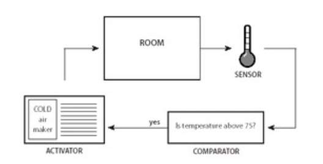
    - 控制反馈系统可分为**正反馈和负反馈**:
      - **负反馈**系统具有稳定作用,会将系统带入固定的稳定状态。空调系统就是一种负反馈系统的例子,它可以防止房间过热,但在房间冷却后会关闭。温度会保持在一个狭窄范围内。
      - **正反馈**系统具有累积作用,会使系统失稳。如果空调在温度低于某个数值时就启动,那房间就会变得越来越冷,远离稳定状态。
    - 一个游戏可以包含**许多反馈系统**，这些系统在游戏的更大系统内相互作用。
    - 许多游戏反馈系统是**负面**的，可以减少玩家或团队的**优势或劣势**。这种现象在数字竞速游戏中很常见。
    - 游戏还利用**正反馈**系统来产生**戏剧性效果或结束游戏**。通常，在游戏中，正反馈系统会受到负反馈系统的制衡。《Powerstone》中的华丽和投掷功能展示了正反馈和负反馈系统共同作用的例子。
    - **动态难度调整**（Dynamic Difficulty Adjustment,DDA）是根据玩家表现调整游戏难度的一种方式。它最常用于复杂的单人数字游戏中。
    - 马克-勒布朗（Marc LeBlanc）**游戏控制论**：
      - 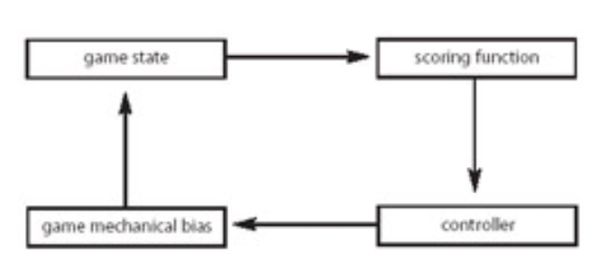
      - 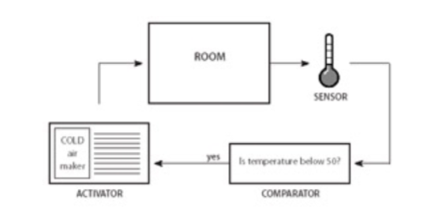
      - 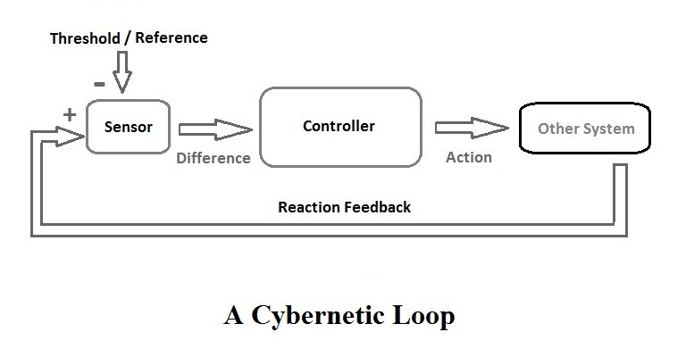
      - **计分功能**(Scoring Function)是系统的**传感器**(Sensor),用于测量**游戏状态**(Game State)的某些方面。
      - **控制器**(Controller)是**比较器**(Comparator)，它查看**传感器**的读数并决定是否采取行动。
      - **游戏机制偏差**(Game Mechanical Bias)是**激活器**(Activator)，是一个游戏事件或一组事件，可根据**比较器**的决定开启或关闭。
    - 游戏设计师**马克·勒布朗** (Marc LeBlanc) 总结了一些**运用控制论到游戏设计**的设计“规则”，其中包括以下几点：
      - **负反馈稳定**游戏。Negative feedback stabilizes the game.
      - **正反馈**使游戏**不稳定**。Positive feedback destabilizes the game.
      - **负反馈**可以**延长游戏时间**。Negative feedback can prolong the game.
      - **正反馈**可以**结束游戏**。Positive feedback can end it.
      - **正反馈**放大**初期成功**。Positive feedback magnifies early successes.
      - **负反馈**放大**后期失败**。Negative feedback magnifies late ones.
      - 反馈系统可能“偶然”从游戏系统中出现，**一定要识别**出它们。Feedback systems can emerge from your game systems "by accident." Be sure to identify them.
      - 反馈系统可能剥夺玩家的**控制权**。Feedback systems can take control away from the players.
      - 在控制论领域，更传统的**第一阶控制论**认为系统是一个**自包含的实体**，而这种观点受到了第二阶控制论的挑战，后者把观察者也作为系统的一部分。在这一正式框架内，我们没有运用第二阶控制论的思维方式。
    - **拓展阅读**
      - How We Become Post-Human, by Katherine Hayles
        - Recommended:
        - Chapter 3: Contesting for the Body of Information: The Macy Conferences on Cybernetics
        - Chapter 4: Liberal Subjectivity Imperiled: Norbert Wiener and Cybernetic Anxiety
        - Chapter 6: The Second Wave of Cybernetics: From Reflexivity to Self-Organization
      - Theories of Human Communication, by Stephen W. Littlejohn (see page 200)
        - Recommended:
        - Chapter 3: System Theory
        - Chapter 18: Games as Cybernetic Systems
  - **保持规则改变体验_A Shift in Scale_第23章：游戏作为游玩体验（Games as the Play of Experience）**
    - **练习方式**
      - 描述：在这个游戏修改练习中，学生们会拿一款现有的游戏，并通过改变游戏材料来进行改动。
      - 游戏的规模或其他物理属性应该得到根本性的改变。
      - 由于游戏规则保持不变，这两个版本之间的差异将体现在每个版本的体验性玩法上。
    - 详见 创建 **23章：体验设计（Sensations of Play）**
  - **运输核心机制_Transporting the Core Mechanic_第24章：游戏是乐趣的游戏（Games as the Play of Pleasure）**
    - **练习方式**
      - 描述：学生首先分析现有游戏，并确定其核心机制。然后他们提取核心机制的概念，并用它来修改另一个现有游戏。这个练习的变种是将其转化为一个游戏创作问题，学生们围绕最初确定的核心机制设计一个游戏。无论哪种情况，这个练习的目的是理解核心机制的中心作用，并观察核心机制是否能够成功地从一个游戏背景移植到另一个游戏中。
    - 简介：
      - 游戏的**乐趣**(Pleasure)在很多方面都是内在的。玩游戏、遵守一套规则本身就是一种乐趣。限制游戏行为所带来的约束会加强玩家的快乐感。
      - 游戏**提供自足**(autotelic)的愉悦，也就是为了自身追求的体验。尽管游戏确实提供了影响玩家游戏之外生活的**外在愉悦**( extrinsic pleasures )，但所有的游戏也都提供**内在的**(intrinsic)、自足的愉悦，这种愉悦只在游戏创造的人为意义内具有重要意义。
      - 游戏必须对玩家进行**双重诱惑**( double seduction)。
        - 首先，玩家必须被诱使进入“魔法圈”。
        - 其次，玩家必须不断被诱使留在游戏的圈内。
      - 已经建立了许多类型学，用于描述游戏提供的乐趣形式。游戏乐趣的类型学通常不太适用于理论化乐趣，而更适用于组织有关游戏**体验的观察**( observations about game experience)。（我的理解：游戏会产生理论化乐趣之外的乐趣）
      - **乐趣**的建模：
      - 心理学家米哈里·奇克森米哈伊描述了最佳体验为**心流**(flow)。"心流"是指当一个人专注于某项活动并且感到能够控制自己的行为时所产生的令人振奋的愉悦感。尽管"心流"并非仅限于游戏，但它是一个有用的思考游戏乐趣产生的方式。
      - 米哈里 提出了八个心流的特征，其中每一个特征都与游戏有很强的联系。其中四个特征描述了心流的**效果**（effects /目标）：
        - 行动和意识的融合 the merging of action and awareness
        - 专注 concentration
        - 自我意识的丧失 the loss of self-consciousness
        - 时间的扭曲 the transformation of time
      - 另外四个特征描述了导致心流的活动类型的**先决条件**(prerequisites)：
        - 一项具有挑战性的活动 a challenging activity
        - 明确的目标 clear goals
        - 清晰的反馈 clear feedback
        - 获得一个带有悖论的控制模拟 the paradox of having control in an uncertain situation
      - 游戏具有一种我们称之为**同样但不同**（same-but-different）的品质。每次玩游戏时，形式结构保持不变，但规则的实施方式却有所不同。游戏的这种品质使玩家愉快地探索可能性空间。由于玩耍经常是具有变革性的，对游戏的持续探索可以改变游戏结构本身，从而导致可能无限的“同样但不同”的愉悦序列。
      - **Entrainment** 一词既意味着"携带"也意味着"束缚"。Entrainment指的是陷入游戏所能提供的愉悦节奏模式的过程。
      - 游戏的**目标**是塑造愉悦体验的关键组成部分。目标是吸引玩家继续游戏的诱惑对象。
      - 悬置在瞬间核心机制和最终目标之间的是**短期目标**（Short-term goals）。短期目标帮助玩家在游戏中制定计划，并在达到这些目标时提供满足感。
      - **行为理论**（Behavior theory）是心理学的一个分支，研究可观察的行为。条件作用是通过奖励和惩罚获得学习行为。奖励和惩罚可以用来教导玩家如何在游戏中行为，同时创造一个奖励玩家长期参与的体验。
      - **强化计划**（Reinforcement schedules）是指玩家接受奖励和惩罚的速度。计划可以根据**时间间隔**（interval）或**行为与结果**的比率而**固定**或**变化**。一般来说，相对于**固定强化**，**变化强化**更有力地塑造行为。
      - **挑战**（Challenge）是塑造玩家愉悦的重要方式。如果游戏的挑战对玩家的技能来说太高，会导致**焦虑**（anxiety）。如果挑战不够，就会感到无聊。理想情况下，游戏应在所有时刻提供平衡的挑战。
        - 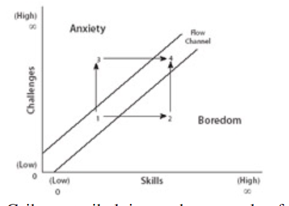
      - 游戏设计师只能通过创建游戏规则来间接设计游戏的愉悦体验。为了提供有意义的游戏体验和乐趣,玩家所采取的行动必须是**可辨识和融合的**（discernable and integrated）。
      - **成瘾**(Addiction) 在医学界和游戏界有不同的含义。对于游戏设计师来说，成瘾是一个积极的特质，意味着玩家与游戏有着有意义的互动。当游戏中出现病态的成瘾行为时，游戏就不再可能进行。（饮食失调 之类的）
    - **实践方法**：
      - **识别 双重诱惑**：
        - **诱使进入“魔法圈”：**
          - 游戏设计师 LeBlanc 的8项**乐趣**识别：
            1. Sensation: Game as sense-pleasure
            - **感觉**：游戏作为感官愉悦
            2. Fantasy: Game as make-believe
            - **幻想**：游戏作为虚构
            3. Narrative: Game as drama
            - **叙事**：游戏作为戏剧
            4. Challenge: Game as obstacle course
            - **挑战**：游戏作为障碍课程
            5. Fellowship: Game as social framework
            - **伙伴**：游戏作为社交框架
            6. Discovery: Game as uncharted territory
            - **探索**：游戏作为未知领域
            7. Expression: Game as self-discovery
            - **表达**：游戏作为自我发现
            8. Submission: Game as masochism
            - **屈从**：游戏作为受虐狂（是指屈从于某种系统的一般快感。）
          - 心理学家 Michael J. Apter 强调**认知的游戏快感**的框架，7项**认知唤醒**：
            1. Exposure to Arousing Stimulation: intense and overwhelming sensation
            - 暴露于**刺激性**刺激：强烈而压倒性的感觉
            2. Fiction and Narrative: emotional arousal from character identification
            - 虚构和**叙事**：通过角色认同产生的情感激动
            3. Challenge: difficulties and frustrations arising from competition
            - **挑战**：来自竞争的困难和挫折
            4. Exploration: moving off the beaten track into new territory
            - **探索**：离开常规进入新领域
            5. Negativism: deliberate and provocative rule-breaking
            - **消极**主义：故意和挑衅性的违规行为
            6. Cognitive Synergy: imaginative play
            - **认知协同**：想象力的发挥
            7. Facing Danger: risk within the "protective frame" of play 
            - **面对危险**：在游戏的“保护框架”内面临风险
          - 人类学 Roger Caillois **体验** 的快乐：
            1. Agôn: competition and competitive struggle
            - **竞争**：竞争和竞争性斗争
            2. Alea: submission to the fortunes of chance
            - **偶然**：顺从于机遇的命运
            3. Mimicry: role-playing and make-believe play
            - **模仿**：角色扮演和虚构游戏
            4. Ilinx: vertigo and physical sensation
            - **眩晕**：眩晕和身体感觉
          - 心理学家 Mihaly Csikszentmihalyi **心流** 的识别：
            - 同时具备以下**效果**：
              - **行动和意识**的融合 the merging of action and awareness
              - **专注** concentration
              - **自我意识的丧失** the loss of self-consciousness
              - **时间的扭曲** the transformation of time
            - 同时具备以下**条件**：
              - 一项具有**挑战性的活动** a challenging activity
              - **明确的目标** clear goals
              - **清晰的反馈** clear feedback
              - 获得一个带有**悖论的控制模拟** the paradox of having control in an uncertain situation
        - **诱使留在“魔法圈”：**
          - 游戏设计师 Brian Moriarty **诱导引擎**
            - 它是游戏中存在**节奏和模式**，并强化它。
            - 这种愉悦既是**结构性的**，也是**体验性的**，既有**数学上的规律性**，也有游戏中的**灵活性**。
            - 玩家会发现自己不仅在玩游戏，而且还**被游戏玩弄**。
            - 它是一种强大的力量，它能带着那些**被它困住的人一起前进**。
          - 识别**目标**
            - **宏观目标：**
              - 识别条件：目标是玩游戏的表面原因，但目标从来不是轻易就能达到的；相反，它是**欲望的模糊对象**，是胡萝卜。
              - 识别条件：目标的重要性仅在于它能**塑造玩家的体验**。
              - 识别条件：目标是一种人为编造的条件，玩家将其作为自己的终极目标。是玩家**克服困难实现目标**。
            - **微观目标：**
              - 与最终获胜条件、宏观目标同样重要的是游戏中的微小瞬间，即玩家在游戏中的**微观互动**。
              - 在游戏过程中，玩家要努力实现短期目标，每一个**短期目标都会带来一种快感**，这种快感不如核心机制带来的即时满足感来得直接，但却比游戏中久拖不决的最终结果来得更快。
              - 玩家可以实现的短期目标种类取决于**游戏的性质**以及将目标悬挂在**核心机制和获胜之间**的方式。
              - 游戏设计师 Doug Church 提出 "鼓励玩家**构思并实现目标**，会让他们在游戏中产生一种控制感"。例如：口袋妖怪》玩家可能会关心如何获得游戏中的每一块道馆奖牌，但也许他会**发明一个不同的短期目标**，比如捕捉每一种口袋妖怪，或者把他的皮格托提升到 50 级。
              - 短期目标是**必要的**，因为如果没有这些目标，玩家就会迷失在游戏中。玩家对下一步该做什么感到困惑。
          - 识别**条件反射**
            - 对于选择时刻的这个方面，每当玩家采取一项行动时，她最终会因此而受到游戏的**奖励或惩罚**。
            - 心理学家  B. F. Skinner: 我们之所以能学会自己的行为方式，是因为**某种行为**在过去得到了**奖励**。
            - 在制定奖惩措施时，游戏设计者**塑造**了**玩家未来可能采取的行为**。
            - 游戏设计师 Neal and Jana Hallford：奖惩不仅会影响玩家行为的好坏，还会影响玩家的**愉悦感**和**整体游戏体验**。
          - 识别**奖励**
            - 游戏设计师 Neal and Jana Hallford **四种游戏奖励分类**的一般类型:
            - **荣耀奖励**（Rewards of Glory）：荣耀奖励是指你将给玩家的所有东西，对游戏玩法本身没有任何影响，但最终会成为他们体验的一部分。这包括通过一路过关斩将赢得游戏、完成特别困难的支线任务，或者击败邪恶怪物的阴谋。
            - **维持奖励**（Rewards of Sustenance）：这种性质的奖励是为了让玩家能够维持他们角色的现状，并保留他们在游戏中迄今所获得的所有东西。这可能包括治愈伤口的健康包、增强玩家魔法能力的法力药水、能够保护玩家免受电磁辐射的高科技盔甲、消除诅咒或疾病的机器人，甚至是储物箱或载重兽，让玩家的角色能够携带更多资源。
            - **访问奖励**(Rewards of Access)访问奖励具有三个关键特征：它们允许玩家进入先前无法进入的新地点或资源，它们通常只能使用一次，并且一旦使用后对玩家没有其他价值。钥匙、撬锁工具和密码是这种奖励的典型例子。
            - **便利奖励**(Rewards of Facility)便利奖励能让玩家的角色做一些之前无法做到的事情，或增强他们已经拥有的能力。如果处理得当，它们应该增加玩家在游戏中的策略和选择数量。便利奖励的一个很好的例子可能是一个魔法球，让角色能够穿过石墙，或者是一个让他们能够远程关闭敌方机枪塔的增强型网络软件。
          - 识别**强化计划**（reinforcement schedules）
            - 强化计划是指随着**时间**的推移，受试者**获得强化的速度**。
            - 这些强化模式以及综合奖惩网络有助于形成任何**游戏体验的结构**。
            - 强化有两种基本类型：**固定强化**和**可变强化**。
              - **固定强化**是指奖励或惩罚以**稳定、持续**的速度出现。固定比率是指行为发生的**次数固定**，例如 玩家每打败五波外星人就能得到一个一次生命奖励。固定间隔是指每次增援之间有**固定的时间间隔**，例如在游戏中，只要玩家还活着，每隔 30 秒就会出现一次增援。
              - 在**可变强化**中，奖励和惩罚会以**不规则的间隔出现**。可变比率是指结果在**不规则的间隔后出现**，就像老虎机的回报率是随机的。在时间间隔可变的情况下，奖励或惩罚会以**随机的时间间隔出现**，就像机械儿童游戏《别叫醒爸爸》一样，爸爸会在随机的时间间隔后醒来（带来负面影响）。
            - 没有**挑战和挫折**，就不会有游戏冲突，也就不会从克服困难的过程中获得乐趣。在积极体验和消极体验--焦虑和愉悦--之间找到难以捉摸的平衡点，是游戏设计最深刻的挑战之一。也使我们识别优秀的**强化计划**变得有意义。
          - 识别**上瘾**（Addiction）
            - 大量玩家上瘾意味着游戏在**商业上**获得成功的可能性更大。
            - 如果你创造了一个可能性的空间，奖励玩家的探索，那么你就很可能会有玩家想要看到更多的**规则变化**。
            - 所有游戏所固有的 **相同但又不同** 的特质，是一款游戏能够吸引玩家并让他们一次又一次重返游戏魔圈的核心所在。
            - **积极成瘾** 和 **消极成隐** 的辨别：
              - **积极成瘾**是指玩家在游戏中**获得的乐趣**，而**消极成瘾**是指玩家在游戏中**避免的痛苦**。
              - 当一种游戏活动变得病态上瘾时，这种活动就会受到谴责：自由活动被关闭，自由 选择的意识消失，**有意义的游戏也就消亡了**。
              - 从这个经验意义上讲，当玩家对某种形式的游戏上瘾时，超出了我们所设计的范畴，**我们所定义的游戏**就不复存在了。
              - 换句话说，医学界所使用的消极意义上的上瘾游戏，**根本就不是真正的游戏**。
      - **改进游戏 的方法**：
        - 搬运**快乐**：哲学家詹姆斯-S-汉斯（James S. Hans）**用差异感染熟悉的事物**，将 识别出的**快乐**融入到不变的**核心机制**中。
        - 搬运**心流**：心理学家（Mihaly Csikszentmihalyi）如何**进入和离开**心流状态。
          - **认知行为理论**与**控制论**存在相似的控制方式，但是两者所研究的现象类型也有所不同。
            - **控制论**关注的是偏离**稳定状态**的问题：负反馈使系统恢复稳定，正反馈则使系统偏离稳定。**行为理论**关注的是**智能学习行为**，即特定行为与结果之间的关联。
            - 在**行为理论**中，"积极 "一词有快乐的含义，比如老师用**表扬来奖励**学生。同样，"消极 "一词也有令人不快的含义，甚至**意味着惩罚**。
            - 但在控制论中，"积极 "和 "消极 "都是**数学术语**，其中任何一个都可能给玩家带来积极或消极的情感体验。
          - 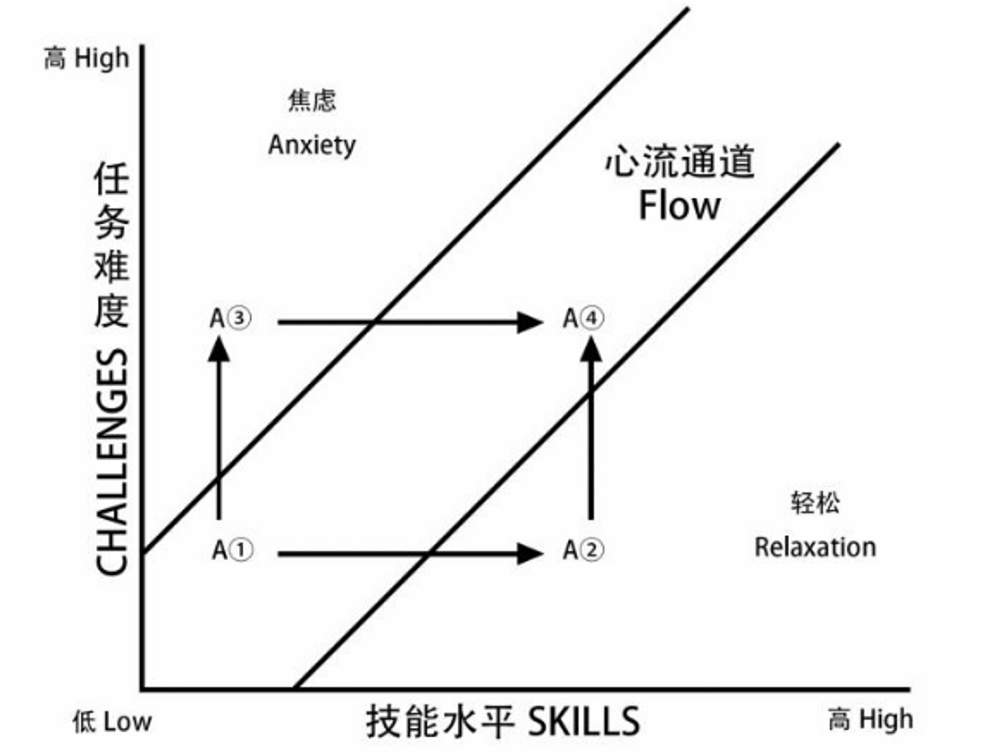
          - 模型并不只是针对游戏中的一个孤立的瞬间，而是追踪玩家在**许多游戏过程中的体验**。
          - 设计拙劣的游戏可能会陷入两个 "陷阱"--**无聊和焦虑**。
          - 心流的迭代设计过程可以让游戏设计者找到游戏中**无聊和焦虑的时刻**，并重新塑造游戏体验，**尽量减少意义不大的游戏时刻**。
        - **有意义快乐**的准则：
          - 有意义游戏的核心在于**行动与结果**之间的关系。
          - 游戏中的每一个选择都必须是**可以辨别和可以整合的**。
          - 游戏对玩家需要给予了极大的关怀。从游戏开始的那一刻起，玩家就有了**明确的方向和目标**。
          - **发现和创造这些乐趣**的过程本身就是一种独特的幸福：游戏设计的无穷乐趣。
    - **拓展阅读**
      - "Designing Interactive Theme Park Rides: Lessons From Disney's Battle for the Buccaneer Gold," by Jesse
        - Schell and Joe Shochet (see page 68)
      - Flow: The Psychology of Optimal Experience, by Mihaly Csikszentmihalyi
        - One of the great pleasures of games is the feeling of being in flow-a state of deep and all-encompassing absorption with the activity at hand. Csikszentmihalyi studies the qualities and conditions that allow for flow,which have many connections to the qualities and conditions of game play.
        - Recommended:
        - Chapter 3: Enjoyment and the Quality of Life
        - Chapter 4: The Conditions of Flow
        - Chapter 7: Work as Flow
    - 
  - **一些新的描述_New Depictions_第27章：游戏作为模拟的玩耍（Games as the Play of Simulation）**
    - **练习方式**
      - 描述：在这个练习中，玩家拿起一款描述某种冲突或活动的游戏，然后修改游戏，使其描述另一种形式的冲突或活动。设计参数可能涉及领土/经济/知识界限的重组（比如让《国际象棋》成为知识冲突，或者让《博物问答》（Trivial Pursuit）成为领土冲突）。另一种可能性是修改游戏，使其描绘通常在游戏中找不到的主题，比如社会或心理冲突。这些游戏应该使用程序性表现技术来描绘它们的主题。
    - **模拟**（simulation）是对**现实**(reality)各方面的**程序化呈现**( procedural representation )。模拟通过程序表示，"模拟现实"其所代表的"现实"之间有着特殊的关系。
    - 有很多种模拟不是游戏。不过，**所有游戏都可以理解为模拟**，即使是非常抽象的游戏或模拟现实世界中不存在的现象的游戏。
    - 游戏模拟通常以**隐喻**(metaphorically)的方式进行：它们并不真实地再现其主题内容。游戏模拟与其参照物之间的**差异**会给玩家带来愉悦。
    - **程序化表现**(procedural representation)是一种基于过程的、动态的描绘形式。程序性表现是模拟游戏模拟其主题的方式。这些表示形式是由游戏的形式系统和玩家与游戏的互动相结合而产生的。
    - 整个游戏可以被视为一个特定主题的**程序化表征**(procedural representation)。此外，游戏还包括更小的程序表征，它们构成了更大的描述。
    - 游戏表现的主题与游戏可以代表的冲突类型相关联。游戏通常代表**领土冲突、经济冲突或知识冲突**(territorial conflict, economic conflict, or conflict over knowledge)。大多数游戏将这三类中的两种或全部结合在一起。也有可能代表其他形式的冲突。
    - 模拟是一种强大的**叙事思维**(thinking about narrative)方式，因为程序化表现是一种直接强调玩家体验的叙事方法。
    - 模拟是**抽象的、数字的、有限的和系统的**(abstract, numerical, limited, and systemic)。模拟不可能既广泛又深入。由于设计模拟意味着从根本上缩小模拟的主题范围，因此游戏设计者必须仔细选择要描绘的现象的哪些方面，以及如何在游戏系统中体现这些方面。
    - 模拟游戏，尤其是数字游戏，可以按照**基于案例的逻辑来构建**(case-based logic)，即预先指定系统中每个元素之间的关系；也可以按照更**通用的逻辑来构建**(generalized logic)，即系统元素共享一组通用属性。通用化结构可以节省工作时间，并带来更多的新兴游戏，让玩家有更多的行动选择。不过，在任何特定游戏中，通常都需要在这两种结构之间取得平衡。
    - **元交流**(metacommunication) 现象意味着游戏玩家意识到游戏的框架，玩家的心理状态体现了一种双重意识，既接受框架，又反驳框架。
    - **身临其境谬误**(immersive fallacy) 认为，媒体体验的乐趣在于它能将玩家带入一个虚幻的现实世界。虽然身临其境谬误在数字游戏产业中很普遍，但它并没有考虑到游戏的元交流性质。
    - 媒体理论家博尔特和格鲁辛（Bolter and Grusin ）认为，所有媒体的运作都经历了**翻新**(remediation)的过程。翻新 的两个对立要素是 **即时性**(immediacy) 和 **超媒介性** (hypermediacy)，前者承诺真实、可靠的再现，后者强调媒体表现的构造性质。
    - 心理学家加里-艾伦-费恩（Gary Allen Fine）指出了**游戏玩家意识**(game player consciousness)的三个层次：
      1. 对游戏角色的直接认同
      2. 作为玩家与游戏程序的互动
      3. 作为个体存在于更广泛的社会背景中
    - **拓展阅读**
      - Narrative as Virtual Reality: Immersion and Interactivity in Literature and Electronic Media, by Marie-Laure Ryan
        - 作为虚拟现实的叙事》雄辩地阐述了文学理论、超文本和虚拟现实之间的关系，重点探讨了莱恩所认为的沉浸感和交互性之间的利益冲突。尽管瑞安的研究方法精深，使她超越了沉浸式谬误的常见陷阱，但她是沉浸式的辩护者，因此她对交互式设计的讨论受到了影响。尽管如此，就这本厚厚的书所涵盖的主题而言，它还是不可或缺的读物。
        - Recommended:
        - Part II: The Poetics of Immersion
        - Part III: The Poetics of Interactivity
      - Remediation: Understanding New Media, by Jay David Bolter and Richard Grusin
        - 博尔特和格鲁辛提出了 "补救"（remediation）的概念，即新媒体形式通过借鉴和改造旧媒体来定义自身的过程。这一过程也是反向的：旧的媒体形式借鉴新的媒体形式，如电视对计算机的窗口世界进行补救。本书中对游戏设计师最有用的概念是即时性（immediacy）和超媒介性（hypermediacy），它们指的是媒体形式既能真实地再现世界，同时又能提醒受众这种再现是建构的、人为的。
        - Recommended:
        - Introduction: The Double Logic of Remediation
        - Chapter 1: Immediacy, Hypermediacy, and Remediation
        - Chapter 2: Mediation and Remediation
        - Chapter 4: Computer Games
      - Shared Fantasy, by Gary Alan Fine (see page 417)
        - Recommended:
        - Chapter 1: FRP
        - Chapter 2: Players
        - Chapter 3: Collective Fantasy
        - Chapter 6: Frames and Games
      - "A Theory of Play and Fantasy" by Gregory Bateson (see page 373)
  - **意识形态反转_At Odds With Existing Rhetori_第 30、32章：作为文化修辞的游戏和作为文化抵抗的游戏(Games as Cultural Rhetoric, and Games as Cultural Resistance)**
    - **练习方式**
      - 每位学生或小组将获得一张现有的彩票刮刮乐游戏票作为起点。
      - 通过分析游戏中隐含的意识形态修辞，学生重新设计票的图形和形式元素，以颠覆修辞。
      - 作为设计练习的一部分，学生还可能重新构思游戏的架构或社会背景。
      - 第三种变体要求学生选择一种与彩票现有修辞相抵触的文化修辞（例如选择“进步”以对抗“命运”）。
      - 学生然后重新设计游戏的信息系统，以在两种竞争意识形态之间制造摩擦。
    - 32章 见 **创建：游戏作为文化抵抗（Cultural Resistance）**
    - **游戏是社会文化学习的环境**(Games are social contexts for cultural learning)。这意味着游戏具有意识形态的维度：游戏是社会传递其价值观的一个环境。
    - **修辞**(Rhetoric)是一种有说服力的话语或隐含的文化叙事。它是一套相互关联的思想，用来说服他人相信自己的信念是真实的。
    - 所有游戏都**反映**(reflect)了其设计或游戏所处的文化背景。历史游戏和当代游戏都是如此。 
    - 文化修辞可以是游戏意识形态中无意识的一部分，也可以有意识地设计到游戏中。当游戏设计者允许文化修辞进入游戏时，他们就是在更为僵化的文化结构中创造了一个自由游戏的实例。
    - Brian Sutton-Smith 确定了游戏的**七种修辞**(rhetorics of play)。其中四种源自古代意识形态，分别是**命运、权力、身份和轻佻**(fate, power, identity, and the frivolous)。另外三种修辞则具有更加当代的起源：**进步、想象和自我**(progress, the imaginary,the self)。当代西方文化中占主导地位的游戏修辞是将游戏视为**进步**(play as progress)：即认为游戏是为了孩子而存在，并且它有价值，因为它有助于他们适当地成长为成年人。
      - 布莱恩-萨顿-史密斯的七种游戏修辞学（文化价值）：
      - 游戏是一种进步 游戏是一种转变的方式：（当代）
      - 儿童成长为成人。游戏的价值在于它能教育和发展人类或动物青少年的认知能力。
      - 作用于：各种形式的儿童游戏和动物游戏
      - 
      - 游戏即命运：（远古）
      - 人的生命和游戏被命运、神灵所控制、原子、神经元或运气，但不是自由意志。
      - 作用于：赌博和机会游戏
      - 
      - 游戏即权力 游戏是冲突的一种形式，也是权力的一种形式。（远古）
      - 一种巩固剧中人或主角地位的方式。
      - 作用于：体育、竞技和竞赛
      - 
      - 游戏即身份 游戏是一种手段。（远古）
      - 确认、维护或提升玩家群体的身份。
      - 作用于：传统和社区庆祝活动和节日
      - 
      - 作为想象的游戏 （当代）
      - 游戏的本质是想象力、灵活性和创造力。游戏是创新的代名词。
      - 作用于：艺术、文学和其他文化形式中的即兴嬉戏
      - 
      - 游戏是自我的修辞（当代）
      - 游戏的存在是为了发展自我、通过游戏本身或通过审美，提供快乐、放松和逃避的内在体验戏剧表演的满意度。
      - 作用于：业余爱好和攀岩等高风险游戏等孤独游戏活动
      - 
      - 游戏是嬉戏 （远古）
      - 游戏是对立的、戏仿的，这种言论与把游戏视为无用活动的 "工作伦理 "观点相对立。
      - 作用于：闲人或愚人的活动，以及历史上捣蛋鬼和愚人的多元文化角色
    - 文化修辞，比如游戏中对**性别的表现**(representation of gender)，是极其复杂的。这样的修辞并不总是能够被解读为单一的意识形态。例如，虽然游戏角色劳拉（古墓丽影）在某些方面挑战了以男孩为基础的游戏修辞，但在其他方面，该角色又遵循着严格的性别刻板印象。
    - 有时，游戏的文化修辞可以改变其所处的文化结构。这就是**变革性文化游戏现象**（transformative cultural play）。
    - **新游戏运动**（The New Games Movement）是游戏设计意识形态的一个范例，它有意识地寻求通过特定形式的社区和游戏设计来改变文化修辞。
    - **拓展阅读**
      - Air Guitar, by Dave Hickey
        - "区域防守的异端 "一文是文化评论家戴夫-希基（Dave Hickey）写给篮球运动的情书，是一篇关于规则民主的批评文章。这篇关于打破规则的乐趣和 J 博士的艺术性的文章既风趣又感人，它清楚地阐明了游戏、文化以及游戏规则所表达和利用的往往是隐藏的意识形态之间的联系。
        - Recommended:
        - "The Heresy of Zone Defense"
      - The Ambiguity of Play, by Brian Sutton-Smith
        - 布莱恩-萨顿-史密斯为游戏研究做出了不朽的贡献。这部著作在某种程度上是他数十年研究的总结，是他对文化中的游戏和游戏进行跨学科研究的一把钥匙。在书中，萨顿-史密斯概述了游戏的七种主要 "修辞 "或意识形态，并探讨了每种修辞如何为我们如何以及为什么游戏提供了不同的理解。
        - Recommended:
        - Chapter 1: Play and Ambiguity
        - Chapters 2–11 focus on the seven rhetorics of play
      - From Barbie to Mortal Kombat: Gender and Computer Games, Justine Cassell and Henry Jenkins, eds.
        - 这是一本论文集，重点探讨女孩与电脑游戏之间的联系，以及这种联系所唤起的文化和性别认同。该运动认为女孩的游戏模式和兴趣与男孩不同。这一运动的意识形态本身也受到了攻击，本书的最后一篇文章就是其代表、建议如下。
        - Recommended:
        - Chapter 1: Chess for Girls? Feminism and Computer Games
        - Chapter 12:"Complete Freedom of Movement": Video Games as Gendered Play Spaces
        - Chapter 14: Voices from the Combat Zone: Game Grrlz Talk Back
      - The Interpretation of Cultures, by Clifford Geertz
        - 人类学家克利福德-格尔茨（Clifford Geertz）在经典论文《深度游戏：巴厘岛斗鸡笔记》中指出，游戏等仪式的功能是解释性的。游戏是一种文化对自身经验的解读，是人们向自己讲述的关于自己的故事。在理解游戏如何作为一种文化修辞形式运作时，不妨从游戏所讲述的文化故事的角度来思考游戏。
        - Recommended:
        - "Deep Play: Notes on the Balinese Cockfight"
      - Testimony Before the U.S. Senate Commerce Committee, May 4, 1999, by Henry Jenkins
        - http://brownback.senate.gov/FinishedDocs/MediaViolence/990504jen.pdf
        - https://web.mit.edu/m-i-t/articles/dc.html
        - 詹金斯是麻省理工学院比较媒体研究项目主任。1999 年 5 月，他应邀在美国参议院委员会就电子游戏和暴力的影响发表演讲。詹金斯针对媒体与行为之间的联系提出了令人信服的论点，揭穿了媒体普遍吹捧的许多神话。詹金斯认为，媒体与暴力之间的关系错综复杂，不能简单地归结为单一的论点。
### 分析 Analysis
  - 背景
    - 除了创作和修改游戏之外，游戏设计专业的学生还必须玩游戏，玩很多很多的游戏。
    - 学生们应该玩各种可能的游戏，数字游戏和非数字游戏，现代游戏和历史游戏，杰作游戏和垃圾游戏。
    - 游戏设计专业的学生玩这些游戏是为了培养历史意识和批判精神，了解已经设计出来的游戏种类，学习游戏是如何创造体验的，并发现特定设计选择的成功与失败之处。
    - 学生每次玩游戏时，都应该对游戏进行分析。
    - 分析的形式可以是非正式的讨论，也可以是正式的书面论文。
    - 书面分析可以是三页纸的短文，也可以是重要的研究论文。
    - 书面分析对提高学生的批判性思维能力特别有用，但在布置书面分析时必须有明确的概念重点，否则就有可能成为对学生最喜欢的游戏的描述性 "影评"。
    - 本书中的每种模式都为指导学生分析提供了一个非常具体的框架。
  - **26章：叙事分析（Narrative Analysis）**
    - 游戏叙事： Narrative play
      - 研究问题：研究游戏的叙事方式是怎样的？
    - JHM 的 “叙事” 框架： J. Hillis Miller defines （佛罗里达大学校长 兼 文学教授）
      - 参考：https://religion.ua.edu/wp-content/uploads/2021/10/Narrative.pdf
      - 目的：不与人类对叙事的期望相悖。故事“活过来”的必要条件。
      - **框架：**
        - 情境 Situation: 一系列随时间变化的事件。
          - 原文：首先，必须有一个**初始情境**，然后是一系列导致情境发生**变化或逆转**的事件，以及由情境逆转可能带来的**启示**。
        - 人物 Character: 叙事通过一套表现系统传达。
          - 原文：其次，必须使用**拟人化**手法创造角色——例如，书面叙述中的文字，口头叙述中的声音。然而情节可能很重要，但如果没有拟人化，就不可能讲述故事
          - 叙事所需的最少人物是三个：**主角**、**对手**和**学习启示的目击者**。（a protagonist, an antagonist, and a witness who learns.）
          - 有时，主角、反派或读者可能是证人。（Sometimcs the protagonist, the antagonist, or thc reader may be the witness.）
        - 形式 Form: 表现由图案和重复构成。
          - 原文：第三，必须对关键元素进行某种图案化或重复。
          - （Third, there must be some patterning or repetition of key elements）
          - 例如：一个比喻或**比喻系统**，或者一个**复杂的单词**。
          - 必须有某种形式的叙事节奏来调节该比喻或词语。
        - 
      - **原文例子1：**
        1. 灰熊 Thc Grizzly Bear
        2. 灰熊体型庞大，性格狂野。The Grizzly Bear is huge and wild
        3. 他已经吞掉了婴儿。He has devoured the infant child.
        4. 婴儿并不知道 The infant child is not aware
        5. 他已经被灰熊吃掉了。 He has bccn eaten by the bear.
      - **例子1分析：**
        - Situation：
          - **初始情境**：灰熊体型庞大，性格狂野。
          - **变化**：他已经吞掉了婴儿。
          - **逆转1**：
            - 婴儿并不知道他已经被灰熊吃掉了。
            - 悬念构造下的逆转
            - 没有悲剧式英雄故事。
            - “好人”（婴儿）也没有机会对抗灰熊形式的“坏人”。
          - **逆转2**：
            - 前两行是单句尾句，让读者可以预期第三行是相同的。
            - 然后他发现第四行实际上是第三行的延续。
          - **启示**：
            - 一种“意料之外”的“喜感”
        - Character：
          - 棕熊用 He 是拟人化。
          - 在这种形式中，目击者叙述者比主角学到的更多。
          - 读者作为**目击者**
          - 婴儿作为**主角**
          - 灰熊作为**对手**
        - Form：
          - 贯穿全文的 Form 是 两个 is 和 两个 has。
          
    - 游戏叙事：
      - 嵌入式元素 Embedded：
        - 是预先生成的叙事组件，例如视频剪辑和剧本场景。等一系列描述性框架。
        - 首先从叙事理论中寻求对嵌入的见解，并建立了一个描述性框架，其中包括水平、垂直和模态嵌入的分类，以及它们的相关特征。然后，本文将该框架应用于游戏叙事，并研究了叙事嵌入如何在游戏中实现，它如何帮助构建叙事内容，以及它如何影响叙事体验。
        - To understand the issues better, this work first seeks insights into embedding from narrative theory and sets up a descriptive framework that includes a categorization of horizontal, vertical and modal embedding, as well as their associated characteristics. The paper then applies the framework to game narratives and examines how narrative embedding is implemented in games, how it helps structure the narrative content, and how it influences the narrative experience.
      - 新兴叙事 Emergent：叙事元素是随着玩家与游戏互动而即兴产生的，是由游戏系统的运作所引发的。
      - 综上：游戏的叙事产生于 新兴和嵌入式叙事元素的结合。
      - 目标 Goals: 使玩家的计划和决策结果在叙事上清晰易懂，帮助构建叙事游戏。
      - 冲突 Conflict：所有游戏叙事的另一个特征，可以塑造叙事性玩法。玩家之间或玩家与游戏系统之间的冲突可以与叙事冲突联系在一起，以产生戏剧效果。
      - 不确定性 Uncertainty：可能导致叙事张力的戏剧性不确定 与 游戏结果的不确定性 性相关联。在叙事性玩法中，游戏（或游戏部分）的未知结果与叙事的未知结果是同义的。
      - 核心机制 Core mechanic：被视为叙事活动时，可以通过让玩家执行叙事行为来创建游戏故事。
      - 空间 Space：
        - 游戏中的空间在塑造叙事框架和体验方面发挥着重要作用。
        - 数字游戏中的表现叙事空间尤为灵活，可以通过精心设计促进叙事玩法。
      - 叙事描述符： Narrative Descriptor
        - 是指游戏中参与游戏表征系统的任何组成部分。
        - 指导文本、游戏内影像、界面元素、游戏物体以及其他视觉和音频元素都属于叙事描述符。
        - 所有这些元素都必须在制作时考虑叙事体验，以最大程度地增强叙事性玩法。
        - 叙事描述符暗示了一种表征逻辑，它限制并约束了可能性空间的设计。
          - 这些限制允许将所有包含在游戏世界中的元素进行叙事整合和可识别化。
        - 叙事描述符在游戏中扮演两种角色，即 虚构世界 和 故事事件：
          - 虚构世界：Fictive worlds
            - 包含游戏世界叙事的更大框架。
          - 故事事件：Story events
            - 是游戏不断推进时生成的个别叙事性玩法时刻。
          - 这两个要素是相互关联的。
          - 虚构世界创造了连贯的叙事空间，故事事件在其中发生并变得有意义。
          - 故事事件有助于扩展和完善虚构世界。
          - 当这两个元素之间存在良好契合时，游戏就会保持一致且易于理解的叙事体验。
      - 叙事系统：Narrative system
        - 玩家的叙事体验源自游戏的整体运作。
        - 与其他类型的复杂系统一样，整体大于部分之和，因为各个元素相互作用形成全局模式。
      - 过场动画：Cutscenes
        - 过场动画是数字游戏中常用的讲故事技术。
        - 它们帮助定义游戏的虚构世界，并实现许多游戏功能。（特别是游戏过程无法表现的 复杂的叙事）
        - 以确保他们没有错过任何重要的内容。
      - 复述游戏：Retelling play
        - 一种游戏叙事 强调体验 的手段。
        - 重播 The Replay
          - 为玩家再次播放游戏体验
        - 重录 Recamming
          - 一种特殊的重播，玩家可以通过电影方式操纵重播中包含的信息。
          - 演示、回忆和其他形式的复述是由游戏设计的一个或多个元素支持的叙事游戏形式。
          - 作为游戏正式系统的一部分而创建的重播功能等功能有可能在各个层面上增强玩家体验。
    - 拓展阅读：
      - Computer Games and Digital Cultures Conference Proceedings, Frans Mäyrä, editor
        - 关注叙事、涌现、交互性和社区之间关系的文章。
      - Cybertext: Perspectives on Ergodic Literature, by Espen J. Aarseth
        - 描述需要读者进行交互以生成文学序列的开放系统。
      - GAME ON: The History and Culture of Videogames, Lucien King, editor
        - 作者身份、沉浸感、代理性和电子表现美学的想法。
      - Shared Fantasy, by Gary Alan Fine
        - 幻想和富有想象力的游戏在社交和互动叙事小说的构建中的作用提供了许多见解。
# 我的评价：

  - 这篇笔记的目的旨在 设计开发过程中遇到的困难 可以快速检索到书中的解决方案。
  ## Jesse Schell 游戏设计艺术
    - 全书和JesseSchell演讲风格一样，属于话痨型。
    - 但我在第一次读的时候非常鼓舞我，让我有发现宝藏和找到了值得践行的践行的真理的感觉。
    - 在按照他的理论践行了第一款游戏后，我发现按照他的理论会碰到很多情感上很浓烈但实操起来又比较模糊的感觉。导致我的第一款游戏制作的比较松散。
    - 我现在回想来应该也有我没有把书读透的原因。
    - 所以我开始重新读这本书，希望能够把这本书读透。
    - 我做笔记的标准是：根据我的经验 书中提到，感觉会碰到的问题,能最快速的翻找到。
    - 尽管可能依然会因为自己的理解不够深刻 或者 笔记可以唤起的记忆不够多，导致有所遗漏。
    - 但好过完全在记忆中翻找，我是属于需要一些提示才能回想起一些技巧和方案的人。
    - 关于倾听团队，在第二个游戏，我就踩过坑团队成员失去热情的坑，当时我明明读到并且深知每个成员对游戏热情的重要性。但我说服不了 认为自己经验丰富的 亚非 强推的方案。虽然 亚非 大多数对设计的敏感度是很高的，但就这一点我依然相信Jesse Shall的观点。因为 最终导致项目做完，团队也散了。
    - 这很像人类早期部落的民主制，即：“凡接触到众人之事，应由众人同意。”但在我看来这个只适用于小团队，至于大团队30人以上，是否可以拆分成小团队来实行这样的民主制，以及会不会造成分裂？这是一个有待讨论和实践的问题。书中也提到了，大团队的游戏设计，需要有核心设计团队和二级设计团队。所以我认为为了保证游戏紧凑而高品质，游戏团队层级最好不要超过2级，层级越多越容易出现被动的“打工人”。
    - 团队交流中 诚实的作用非常显著。鉴于我在无锡做的MMO项目，就是因为成员之间太多的秘密而形成了对立，导致项目失败。
  ## Rule Of Play
    - 与 Jesse的书讨论的是“人的制作过程”不同，感觉整本书更多的是在讨论“游戏本身”。
    - 第12章的规则的独特性的定义，让我想到了为什么第二款游戏的普遍评价比第一款游戏低，甚至我都有些不好意思拿出手，有一定的原因就是身份模糊。这套设计组合可以适用于很多场景，缺乏独特性的游戏，很难被人记住，也很难让人提起兴趣。
    - 第12章的优雅设计，可以很好的反映出第一款游戏的设计问题。第一款游戏的行动和结果之间的关系链条太长，辨识度过低。
    - 第23章，关于核心机制，我的两款游戏都是其他游戏的变体，所以玩家会非常主观的带入，他们对那些游戏核心机制的感受。
    - 18章 用正负反馈调整稳定值 在前两个项目是缺失的。
# 实操
- 网站阅读：
  - www.gamedeveloper.com
- 技术实现功能图：
  - 流程图（Flowchart）：
  - 用例图（Use Case Diagram）：
      - https://github.com/JackChan1999/DesignPattern/blob/master/design-pattern/UML%E5%BB%BA%E6%A8%A1%E6%8A%80%E6%9C%AF.md
      - https://zhuanlan.zhihu.com/p/628741228
  - 例子：
      - https://gitmind.com/use-case-diagram.html
  - 类图（Class Diagram）：