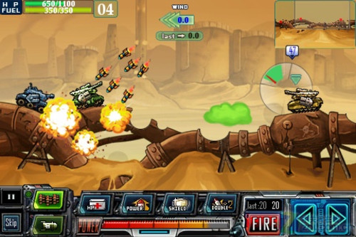
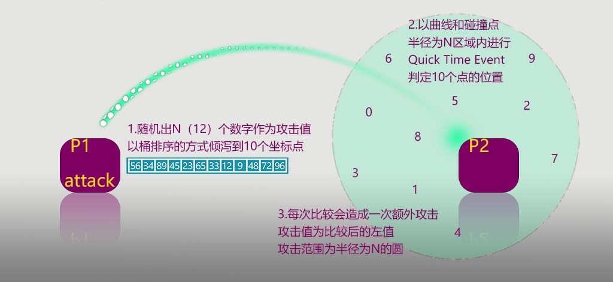
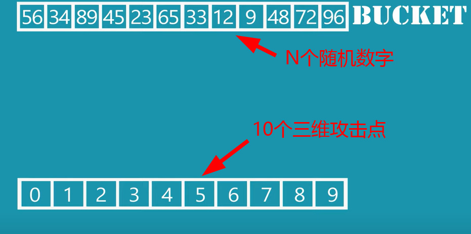
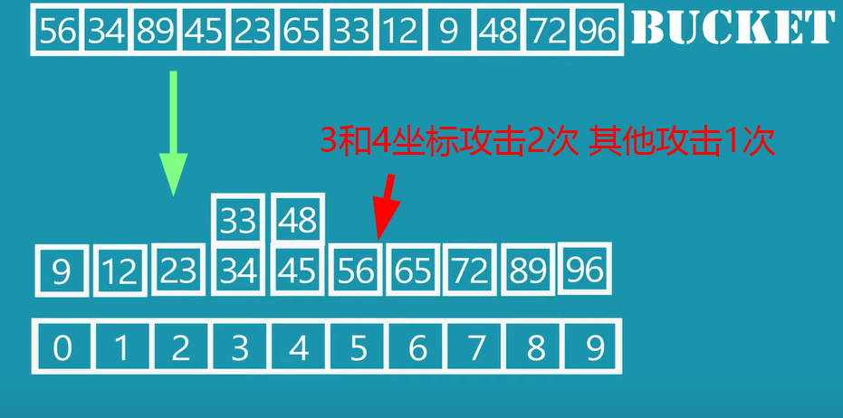
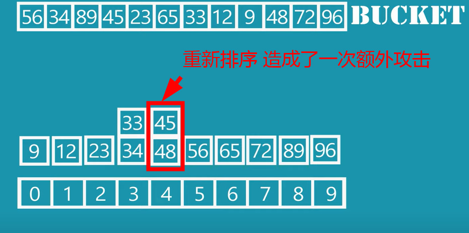
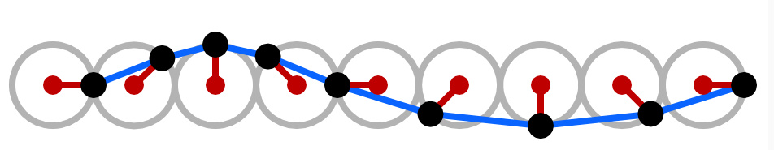
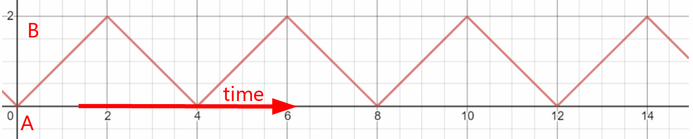

# 算法大战
## 游戏信息
- 游戏名称：算法大战
- 游戏类型：3D回合制策略游戏
- 游戏系统：windows
- 分级：E10+
- 受众：喜欢耳目一新的玩家
- 游戏模式：多人对战游戏
- 竞品：百战天虫，疯狂坦克，弹弹堂
## 游戏大纲  
  

  
玩家被困计算机中，必须通过战斗才能逃离。  
玩家通过使用：内排序，设计模式，图形学公式，CPU/GPU的特性...来进行战斗。   
根据玩家所使用电脑的显示器、操作系统、显卡、GPU型号...会使得角色拥有不同的特性（例如：Windows 98 的特性是可以使攻击对所有敌人造成连锁反应，对应windows 98 的“一個程式出錯就會連帶造成整個系統崩潰的問題”）  
玩家将发挥自己的电脑特性 以及 使用算法技能的组合 应对其他敌对的玩家以及AI。
### 游戏故事
玩家被困在0和1的世界中，同样被困的还有别的玩家，游戏创世人在这里展开了一场又一场的大逃杀。
### 游戏流程
配置技能-训练技能-联机战斗-结算
## 角色
### 角色的组成：
- 根据玩家的电脑特性生成一些角色固有属性（是常量不可变换）
- 形象：可以DIY，根据一些电脑特性会对形象有影响（“比如：设备类型是手持那么角色的体积就一定比PC体积小一些”）
- 角色姓名：是用户定义的机器设备名称
- 角色技能插槽数量：由机器的算力决定
- 技能强度：玩家对该技能的熟练度决定
- 熟练度：是玩家在游戏对战后结算获得
### 角色的操作：
- 鼠标点击UI操作
## 游戏玩法
### 玩家的攻击/防御方式 例如：
#### 桶排序攻击:
玩家通过行动力可以选择 移动/攻击 如果选择算法进行攻击（例如：利用 桶排序 在范围内通过玩家决定10个点，再随机N个数字，对比个位数攻击到10个点的位置，不断升级可以进入下一轮排序，就10个位置根据数字再进行一轮攻击）  
   
  
  
  

#### 格斯纳特波浪防御:
地形在接下来的N轮 别的玩家回合时 施放玩家选定区合域地形会出现格斯纳特波浪。
玩家通过上下起伏左右移动 达成让其他玩家难以命中，或其他目的。

#### ...等拓展（一定与 某算法/某算法的改进 沾边）

## 游戏世界
二进制的球形三维世界中：  
时间是线性的回合；  
环境存在：风力，重力；  
空间最基础的构成单位是“顶点结构体”，“顶点结构体”中存储着：法线，与其他最多8个点的连接，三维空间的位置，顶点色（用于计算偏移，着色...）  
“顶点结构体”决定了世界的碰撞。  
空间、环境因素、都是可由玩家在自己回合通过技能控制的。  
战场为球体，玩家人数越少球体越小。  
随着回合推移球体会成平面最终变成一个点。  

## 游戏体验
玩家因为强弱身份转换而带来了情绪波动，从而达成心流体验。

## 游戏机制
1. 配置技能
   - 尝试一些新的技能组合。
2. 训练技能
   - 与木桩进行训练。
3. 联机战斗：  
   - 双方阵营共同对战AI敌人们，此时玩家不可互相攻击（站队：玩家联盟 对战：强大的无情AI）-->   
   - AI敌人完全消灭后，寻找敌对玩家/玩家们的阵营，与队友合作消灭敌方阵营，当双方阵营剩余人数比为1:0.618时，弱者阵营会获得额外加成。可以通过“替换指针内容”的方式替换血条，帮助其他玩家抵挡致命一击，双方均获得额外加成，“替换指针内容”仅限于致命一击发生时（站队：友方玩家联盟 对战：敌对玩家联盟）-->  
   - 与队友较量成为最后胜者，血量较低获得额外加成（站队：自己 对战：其他玩家）-->  
   - 最后胜者对战由系统生成的强大定制化AI敌人，血量较低获得额外加成，支撑回合越久玩家加成越强（站队：自己 对战：强大的定制化AI）--> 
   - 对战自己的镜像。（站队：自己 对战：强大版AI自己）
4. 结算
   - 玩家人数越多时间越长排名越靠前，获得的奖励越多。根据使用频率自动分配。