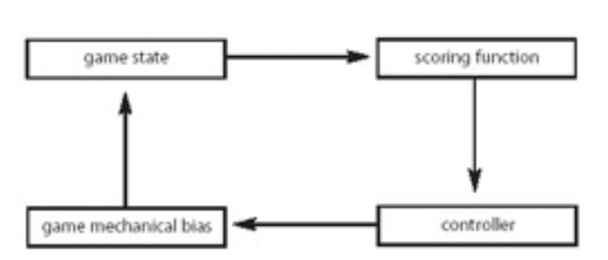
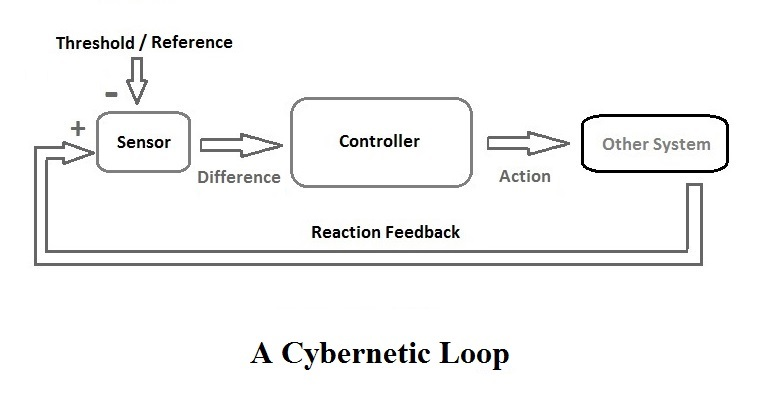
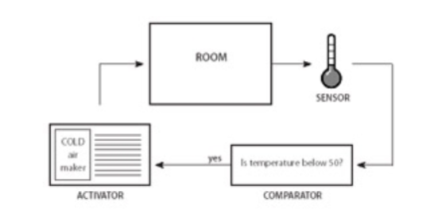

# 1：改变规则

- 在这个简单明了的练习中，改变 **13机兵** 的一些规则，看看这些改变会对游戏产生怎样的影响。
- 规则的改变应该以概念为重点。
- 例如，可以找出13机兵 简单的、有些不令人满意的部分/系统，规则的改变必须带来更有意义的游戏。
- 很重要的一点，需要制定明确的操作规则：必须为**13机兵**的游戏变体（繁星）编写完整的规则，并给其他策划组成员，以书面说明为指导尝试玩自己的游戏。

# 2：破坏稳定

- 本方向的起点是一个**平衡良好的游戏**。
- 
- 
- 
- 利用**反馈回路的原理**，必须改变之前定好的规则，引入正反馈回路，使游戏状态不要保持过度静止，或者使其疯狂摇摆，失去控制。
- 然后，并给其他策划组成员，其他策划组成员找出反馈回路上的问题，并必须给出解决，但要保留上一个小组修改的规则作为游戏的一部分。

# 3：改变体验

- 接着上一步之后，要通过改变游戏材料，对现有游戏进行改编。
- 
- 游戏的感官输出、玩家的输入能力、引导玩家做出决定的内部认知和心理过程 **应根据故事彻底改变**。
- 由于游戏规则保持不变，两个版本之间的区别将在于各自的游戏体验。

# 4：优点合并

- 首先分析一款现有游戏，确定其核心机制。
- 分析出系统的优点，提取核心概念，看能否成功地从一种游戏环境**移植**到另一种游戏环境，并给出理由。

# 5：采用新描述

- 对现在的游戏进行修改，使规则成为另一种冲突或活动形式的游戏。
- 设计参数可能是对领土/经济/知识之间的区别进行调整（将国际象棋变成知识冲突，或领土冲突）。
- 另一种可能描绘故事（繁星）中的主题，如社会或心理冲突。游戏应使用程序表述技术来描述其主题。

# 6：文化修辞

- 通过分析游戏中隐含的**意识形态修辞**，重新设计游戏的图形和形式元素设计，以颠覆/明确这些修辞。
- 作为设计工作的一部分，还可以重新构思游戏所处的建筑或社会环境。
- 第三种变式要求选择一种与我们游戏（繁星）现有修辞相悖的文化修辞（例如选择 "进步 "而不是 "命运"）。
- 然后，学生重新设计游戏的信息系统，在两种相互竞争的意识形态之间制造摩擦。看看会有什么结果。