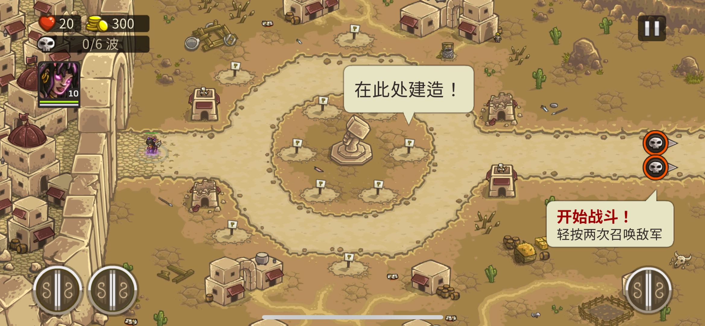

# 修改方法1：改变规则

## "规则"换皮分析:
- 参考 Rule Of Play 第 11、12 章
### 操作规则
- 游戏在带有**路径** 和 **边界** 的**连续空间** 中进行。
- 一群由电脑控制的**敌人**会攻击 机兵 或 **基地**。
- 一名玩家一次控制一个机兵 **移动** 或 **行动**。
- 如果玩家在控制机兵 全场单位**行动暂停**，否则**行动继续**。
- 如果 **基地** 被摧毁，玩家失败。
- 如果 **敌人** 被全部消灭，玩家胜利。

### 构成规则
- 单位的**属性**：
  - 生命值、攻击力、防御力、冷却、暴击
- **空间**：
  - 所有单位的 移动 行动 都作用于一个**2维平面**。
  - 设计师 利用平面空间的 **点 线 面** 构成各种几何形状 并赋予 独特逻辑 影响 单位的移动 和 行动 和 属性。
- **时间**：
  - 时间是连续的时间，最大时间为1：30秒。
- **博弈**：
  - 设计师 操纵的 **点 线 面** 与 玩家 操纵 **点 线 面** 在 设计师 制定的 空间 和 时间中 进行博弈。
  - 当生命值为 0 单位销毁。

### 隐性规则
- 地形影响
  - 躲避攻击
- 单位特性
  - 类型：
    - 近身格斗型
    - 万能型
    - 远距离型
    - 飞行支援型
- 敌人行为模式
  - 地面/空中区别
  - 背身位1.5倍伤害
  - 带护甲的敌人
  - 范围提示
- 战术优劣

### 评分：独特性
- 独特性 = (构成规则 与 操作规则 的紧密度)
- 我的评分 5 分。

## 改变规则 练习

- 根据上述**构成规则** 推出新的 **操作规则**：
- 

### 操作规则1：

- 玩家控制角色 **移动范围** 由技能释放后的范围决定。
- 玩家控制有两种角色 **哨兵** 和 **杀手**。
  - 哨兵 伤害较低 但技能面积较大，主要用于打开行动范围。
  - 杀手 伤害较高 但技能面积较小，主要用于消灭敌人。
- 在操作时 时间会**缓慢流逝**，正常时间的 0.2倍。
- 如果在规定时间内，**找到并消灭** 所有敌人，游戏胜利。
- 如果**全员死亡**，游戏失败。

### 操作规则1 评分：
- 我的评分 6 分。
  
### 操作规则2：

- 每个少女有自己特殊的攻击方式 并且会**自动进行攻击**。
- 玩家可以拖动少女 **改变位置**，少女根据 浮空少女 和 地面少女，决定是否可以移动到目标地形。
- 玩家可以决定少女是否 **产生连线**。
- 如果超过一个少女被决定产生连线，那么少女之间会根据距离自动 **产生连线**。
- 地形可以**改变连线** 和 少女可以移动的区域 以及 敌人移动的区域。
- **少女连线** 对单位 **属性** 的影响 受 连线双方的 **属性** 影响。
- **少女连线** 组成的 **面积** 会持续对范围内单位的 **属性** 影响，面积越小 效果越好。
- 在操作时 时间会**缓慢流逝**，正常时间的 0.2倍。
- 敌人 会攻击 最近的 少女。可能会**破坏连线**。
- 如果少女**全员死亡**，游戏**失败**。
- 如果**所有敌人**被消灭，游戏**胜利**。

### 操作规则2 评分：
- 我的评分 8 分。

# 修改方法2：控制论优化

## 基于"控制论"分析：
- 参考 Rule Of Play 第 18 章
- 
- 
- 
### 计分功能（传感器）
- 计分2：meta gauge 元测量仪
- 计分3：敌人与“基地”的距离
- 计分4：机兵血量
- 计分5：基地血量
- 计分6：场上的敌人
- 计分7：敌人波次
- 计分8：战场上的主要敌人
- 计分9：游戏胜利条件
- --- 需要基于对机兵的了解 ---
- 计分1：城市摧毁度
- 计分10：机兵周围敌人数量
- 计分11：机兵周围友军数量
- 计分12：女性伙伴数量
- 计分13：机兵技能使用次数
- 计分14：机兵血量

### 控制器（比较器）
- 控制器1：城市摧毁度是否高于50%？
- 控制器2：基地被入侵？
- 控制器2：是否释放大招？
- 控制器3：敌人与“基地”的距离是否小于10米？
- 控制器4：血量是否低于10%？Y N
- 控制器4：血量是否低于0%？
- 控制器5：基地血量是否低于20%/10%？
- 控制器6：场上的敌人是否为0？
- 控制器7：敌人的波次是否变化？
- 控制器8：战场上的主要敌人是否被歼灭？
- 控制器9：游戏胜利条件是否达成？
- 控制器10：机兵周围敌人数量是否大于3？

### 游戏机制偏差（激活器）
- 城市摧毁度是否高于50%？
  - yes = 激活正反馈1：某些机兵技能激活
  - no = 不变
- 基地被入侵？
  - yes = 激活正反馈2：meta gauge 元测量仪 增加
  - no = 不变
  
- 是否释放大招？
  - yes = 激活负反馈2：meta gauge 元测量仪 减少
  - no = 不变
  
- 敌人与“基地”的距离是否小于10米？
  - yes = 激活正反馈3：减少敌人血量
  - no = 激活负反馈3：增加敌人攻击我方单位

- 血量是否低于10%？
  - yes = 激活正反馈4：演出提醒事件
  - no = 激活负反馈4：持续接受伤害

- 血量是否低于0%？
  - yes = 激活正反馈5：自动进入修复环节
  - no = 不变

- 基地血量是否低于20%/10%？
  - yes = 激活正反馈5：演出提醒事件
  - no = 激活负反馈5：持续接受伤害
  
- 场上的敌人是否为0？
  - yes = 激活负反馈6：新一波敌人出现
  - no = 不变

- 敌人的波次是否变化？
  - yes = 激活正反馈7：演出
  - no = 不变

- 战场上的主要敌人是否被歼灭？
  - yes = 激活正反馈8：演出
  - no = 不变

- 游戏胜利条件是否达成？
  - yes = 激活正反馈9：演出，评分结算货币
  - no = 不变
- 机兵周围敌人数量是否大于3？
  - yes = 激活正反馈10：某些机兵技能激活
  - no = 不变

## 诊断与优化

- 基于 Marc LeBlanc **游戏控制论** 的设计“规则”：
    - **负反馈稳定**游戏。Negative feedback stabilizes the game.
    - **正反馈**使游戏**不稳定**。Positive feedback destabilizes the game.
    - **负反馈**可以**延长游戏时间**。Negative feedback can prolong the game.
    - **正反馈**可以**结束游戏**。Positive feedback can end it.
    - **正反馈**放大**初期成功**。Positive feedback magnifies early successes.
    - **负反馈**放大**后期失败**。Negative feedback magnifies late ones.
    - 反馈系统可能“偶然”从游戏系统中出现，**一定要识别**出它们。Feedback systems can emerge from your game systems "by accident." Be sure to identify them.
    - 反馈系统可能剥夺玩家的**控制权**。Feedback systems can take control away from the players.
    - 在控制论领域，更传统的**第一阶控制论**认为系统是一个**自包含的实体**，而这种观点受到了第二阶控制论的挑战，后者把观察者也作为系统的一部分。在这一正式框架内，我们没有运用第二阶控制论的思维方式。
- 得出**失稳**的部分 和 可能解决方案：
    - 密集操作游戏结束过快（过于不稳定）
      - **原因分析：**
        - “增加敌方数量”这一负反馈，以波次结束为触发条件，导致一个波次到后期 “技能释放”这一正反馈过多，导致游戏快速结束。
      - **解决方法：**
        - “增加敌方数量”这一负反馈， 由波次触发 改为“实时敌人强度”触发，由此维持一个恰当的稳定性，来延长游戏时长。利用DDA（动态难度调整）技术。
    - 无操作失败过于平淡（过于稳定）
      - **原因分析：**
        - 多数和失败条件相关的正反馈多是演出
      - **解决方法：**
        - 除了演出 这样的心理缓冲，增加一些数值上的 正反馈 如机兵进入失控狂暴状态。
    - 策略过程过于线性（过于稳定）
      - **原因分析：**
        - 机兵正反馈的激活条件过于苛刻（需要记住13个人的特性），导致一些正反馈设计无法体现。
      - **解决方法：**
        - 机兵正反馈的部分激活条件由 “不同角色触发” 改为 “不同机兵类型触发”。

# 修改方法3：改变体验

## "体验"换皮分析：
- 参考 Rule Of Play 第 23 章
- **核心机制**
  - 战术安排

- 核心机制 渗透 **三个环节**
  - 
  - **游戏对玩家的感官输出：**
  - 一大群敌人，铺天盖地的袭来
  - 整个城市的建筑和道路成为了战场
  - 所过之处 敌人对城市进行大肆破坏
  - 人数众多的敌人们正在快速向基地移动
  
  - **玩家的输入能力**
  - 利用 确认/取消键 + 方向键
  - 移动 和 部署技能
  
  - **引导玩家做出决定的内部认知和心理过程**
  - 作为正义的一方需要保护城市不受侵袭，又要保证人数不占优势的"好人"不被伤害,所以要合理的指挥机兵进行作战。 

- 核心机制 渗透 **感官**
  - **视觉扫描**
  - 战场的形式如火如荼，屏幕因为攻击而发生剧烈震动，雷达上的敌人非常密集，并有规律的向基地方向移动，作为少数的防守方，英俊帅气的少男少女们不得不面对。
  - **听力辨别**
  - 少男少女不断汇报情报和状态，音乐急迫且激扬，敌人的攻击声音不断传来。
  - **运动反应**
  - 利用手柄快速选择机兵，移动，释放技能，以及切换视角。
  - **专注**
  - 可以让焦灼的情绪得到释放的就是进入战术安排阶段，而战术安排结束进入行动冷却阶段，情绪再次变得焦灼。
  - **学习的感知模式**
  - 从时间上 游戏分为两个阶段，战术安排和行动冷却，玩家需要在这两个阶段中不断的学习和调整。
  - 从空间上 考验的是玩家如何用战术安排在有限的空间中保护城市和基地。
  - 从资源上 由于机兵人数不占优势，玩家需要不断的学习如何合理的利用机兵的技能，以及如何合理的分配机兵的位置。

- 核心机制 带来 **体验**
  - 紧迫感

## "体验"变体 练习：

- **期待的体验**：幽默感
- 核心机制的 **感官设计**
  - **视觉扫描**
  - 场景是女生宿舍，宿舍内零散的分布着一些新旧垃圾，其中一堆垃圾堆中被得知住着一只巨大的蟑螂，少女们为了请它离开，制定了这次行动，并选举你作为这次行动的指挥。为了这次行动 她们经过了长期的讨论，并列出了超级详细的战术方案，除了一堆解释说明外，还自导自演了“消灭蟑螂”的过程并录制了视频，还有人缝了带有团队Logo的T恤。为了迎接蟑螂的到来，他们改变了宿舍的布局。倒计时秒表跳动着，场上的少女们有的在补妆，有的在压子弹，有的在盯着时钟焦虑，有的还在最后的时间赶着论文...
  - **听力辨别**
  - 少女之间偶尔互相讨论，偶尔自言自语。时不时会听到塑料袋被拨动的声音，和触角颤动发出的声音，这些都会引发少女们的一整骚动。背景音乐富有使命感。
  - **运动反应**
  - 利用手柄快速选择少女，移动，释放技能，以及切换视角。
  - **专注**
  - 在行动阶段，少女距离蟑螂过近时，会有夸张的表情特写演出。
  - **学习的感知模式**
  - 从时间上，战术安排阶段会进入0.2倍的子弹时间。
  - 从行为上，蟑螂会循着垃圾堆的气味靠近，少女们会在垃圾堆周围布置陷阱。
  - 从空间上，有一些垃圾堆，有路径.
  - 从资源上，每个少女会有呕吐值，当呕吐值达到一定值时，少女会自动退出战斗。距离蟑螂或者垃圾堆太近也会增加呕吐值。每个垃圾堆会有臭味度，当臭味度达到一定值时，蟑螂会加速靠近，否则会减速。
- 结论 核心机制的 **三个环节**
  - **游戏对玩家的感官输出：**
    - 一群少女，为了消灭宿舍里的蟑螂，制定了详细的战术方案，进行了一场自导自演的夸张离奇的战斗。
  - **玩家的输入能力：**
    - 利用手柄快速选择少女，移动，释放技能，以及切换视角。
  - **引导玩家做出决定的内部认知和心理过程：**
    - 作为少女的指挥官，要带领一堆看似不靠谱但很认真的少女们展开消灭蟑螂的事业，为了不辜负少女们的期待，以及得到客户的好评，所以必须做好每一次决策。
- 

# 修改方法4：机制迁移

- **拆分目标**：Kindom Rush
- **迁移目标**：13机兵

## 识别 Kindom Rush 的双重诱惑
### 进入“魔法圈” 的诱惑
#### 游戏设计层面
- **感觉**：游戏作为感官愉悦
  - 
  - 宣传页 看起来有高山 焦土 河流 森林，画面有很多内容 **易于理解**，但又有很多内容可以 **激发想象**，让我感觉游戏 **内容丰富**，很多道路让我觉得 **可以探索**。
  - https://cdn.akamai.steamstatic.com/steam/apps/2030545/movie480.webm?t=1447360000
  - 宣传页视频 **动画简单可爱**，易于理解，**视觉负担小**。
  - 操作看起来简单，并且有**很多变种**，感觉**简单学习**，就可以享受到很多不同的操作乐趣。
- **幻想**：游戏作为虚构
  - 
  - 微缩的战场，可以满足我有成为掌控战场的 **指挥官的幻想**。
- **叙事**：游戏作为戏剧
  - 
  - **美术的特效** 和 **人物夸张的表情**，看起来似乎游戏角色 **性格特征明显**。
  - **武器 和 UI** 的一些软装饰，让我似乎能感觉到游戏的 **时代背景**，像是融入魔法元素的石器时代。
- **挑战**：游戏作为障碍课程
  - 
  - 敌人之间体型的差异，让我感到挑战是有**递进的**。
- **伙伴**：游戏作为社交框架
  - 攻击时的**朝向**有效的分辨了敌我。
- **探索**：游戏作为未知领域
  - 
  - **密集的插旗**以及有趣的地貌，让我感觉游戏 **有很多未知内容** 可以探索。
- **表达**：游戏作为自我发现
  - 单位被召唤会说出一些 **口号**，比如：Freedom,For the Kindom 让我感觉 置身在伟大的事业中。
- **屈从**：游戏作为受虐狂（是指屈从于某种系统的一般快感。）
  - 看到自己铺设的建筑在运作良好，**自动化系统** 让我挺上头。
#### 认知心理层面
- 暴露于**刺激性**刺激：强烈而压倒性的感觉
  - https://cdn.akamai.steamstatic.com/steam/apps/2030545/movie480.webm?t=1447360000
  - 介绍短片 **开头** 短暂的宁静而宏大的音乐，配合宏大的地图，忽然转向战争的交响曲，然后打出标语“展开一场保卫你的王国的战役”。可能是领土意识，和庞大的信息量，让我感觉到某种生物本能上的刺激。
  - 介绍短片 **结尾** 这些字样随着音乐越来越激扬，一条一条排在屏幕上，而且速度越来越快：“游戏时间长达 50 多个小时、30项全局升级、超过40种敌人、游戏挑战、彩蛋、美丽的风景、不止如此。”最后门关上，打出kindong rush的标志。这种**信息量**和**速度**的结合，让我感觉到某种生物本能上的刺激。同时 游戏的画风让我觉得内容量和想象中具有一些正面的反差，让我感觉不错。
  - 顺带一提 这个短片完全符合 **兴趣曲线**。
- 虚构和**叙事**：通过角色认同产生的情感激动
  - 在这里所有介绍中始终没有出现玩家扮演的国王的形象展示，而是通过一些 **口号** 和 **标语** 让我感觉到自己是国王。这种**留白**反而让我感觉更好带入角色。当然游戏还提供了**性格特征**明显的英雄角色，供玩家产生 角色认同。在玩之前我是有很喜欢的英雄的，但在深度游玩之后，有些关卡的设计，对英雄的技能有着最优解的需求，导致不得不切换自己不那么喜欢的角色（这点我觉得十三机兵做的更好）。
- **挑战**：来自竞争的困难和挫折
  - 视频中的大号敌人 和它厚厚的血条 让我感知到了明显的 **挑战**。
- **探索**：离开常规进入新领域
  - 最让我觉得离开常规的是 赋予我的身份 和 古代与魔法 元素的融合。
- **消极**主义：故意和挑衅性的违规行为
  - 为了保护王国，可以**肆无忌惮**的用各种手法，虐杀各种坏人。
  - 可以用正面或负面**Buff叠加**出惊人的指数级效果。
- **认知协同**：想象力的发挥
  - 角色 和 敌人 的动画 让我感觉到角色的 **心智** 也可以很好的想象他们的 **意图**。
- **面对危险**：在游戏的“保护框架”内面临风险
  - 城堡被攻占，士兵被杀死，各种爆炸，溅血。
#### 人类学层面
- **竞争**：竞争和竞争性斗争
  - **保护王国**，竞争的合理性，是可以吸引我的。
- **偶然**：顺从于机遇的命运
  - 虽然我知道会有有时打不中单位的设计，但并没有“偶然”可以让我想进入魔法圈。
- **模仿**：角色扮演和虚构游戏
  - **扮演国王**，保护王国，这种模仿是可以吸引我的。
- **眩晕**：眩晕和身体感觉
  - 满屏密密麻麻敌人和我方单位作战的眩晕感，可以吸引我。
#### 正心理学层面
- **心流**识别：
  - 视频的23秒-32秒。
  - https://cdn.akamai.steamstatic.com/steam/apps/2030545/movie480.webm?t=1447360000
  - 同时具备以下**效果**：
    - **行动和意识**的融合：
      - “塔”似乎变成了我身体的一部分。
    - **专注** 
      - 精力完全被放在了对敌人行动以及移动轨迹的预测，和策略制定上。
    - **自我意识的丧失**
      - 在游戏过程中，“我”似乎整个军队就是我，而“我”在这个过程中被消解了。
    - **时间的扭曲**
      - 最终我无法阻止敌人，使其通过我的防线时，我还有最后的 **主动技能** 的机会，时间似乎变得很慢。
  - 同时具备以下**条件**：
    - 一项具有**挑战性的活动**
    - **明确的目标**
    - **清晰的反馈**
    - 获得一个带有**悖论的控制模拟**

### 留在“魔法圈” 的诱惑
#### **节奏和模式（诱导引擎）**：
- **战术外**：
  - 
  - 选关 和 配置 => 
  - 
  - 预览 关卡信息 => 
  - 
  - 关卡的故事（如果有）=> 
  - 
  - 关卡 的特殊条件/教程
- **战术内**：
  - 
  - 分配战术资源 后 手动开始波次 =>  
  - 
  - 观察信息 思考需要做哪些战术资源调整？并调整 之后 等待或手动开启下一波次  => 
  - （循环直到所有波次结束，或者有新的事件）
  - 
  - 剧情(如果有)=>
  - 
  - 评分结算=>
  - 回到**战术外**
#### 识别“目标”
- **宏观目标**：
  - 作为国王 **保护王国**。
- **微观目标**：
  - 构思**整个战役中的战术策略** 来保护城堡不受侵袭。
  - 构思战术资源 以应对 战役中**单个敌人波次** 来保护城堡不受侵袭。
  - 在战术外，构思升级**各项持久化数值** 从而 增强战术资源 以应对 整个战役。
#### 识别“条件反射”
- 
- 提前召唤下一波敌人的**奖励**会随着剩余的召唤时间减少而减少。

- 英雄死亡的**惩罚**是**无法使用**，并且**复活**需要**时间**。
- 普通单位的死亡的**惩罚**是**无法使用**，并且**复活**需要**时间**。
#### 识别“奖励”
- **荣耀奖励**：
  - 
  - 解锁更多支线的章节。
  - 
  - 解锁同一章节的不同规则和难度。
  - 
  - 成就系统。
- **维持奖励**：
- 
- 游戏内默认的两个保护支援。
- **访问奖励**：
- 
- 获得一定的评分星星，才可解锁后续关卡。
- **便利奖励**：
- 
- 有专门的“快速通关”商店售卖。
#### 识别“强化计划”
- **固定强化**
  - **战术内**
    
    - **每击杀一个敌人** ，都会获得 **一定的金币**（固定奖励），可以用来升级/建造战术资源。
    - 每**建造一个建筑**，都减少 **一定的金币**（固定惩罚）。
    - 每**售出一个建筑**，都增加 **售卖的金额**（固定奖励）。
    - 每**赢得一场战役**，都会获得 **一定的参战英雄经验**（固定奖励）。
    - 每提前N秒召唤下一波敌人，都会获得 **提前N秒 X 一定的金币**（固定奖励）。
  - **战术外**
    - 
    - 每购买一个装备，都会减少 **一定的宝石**（固定惩罚）。
    - 
    - 每个英雄技能的升级，都会减少 **一定的英雄专属经验**（固定惩罚）。
- **可变强化**
  - **战术内**
    - 每隔N秒，会固定出现 **一波敌人**（可变惩罚）。
    - 每波敌人的排列是 **随机的**（可变惩罚）。
    - 每次攻击的命中率是 **随机的**（可变惩罚）。
    - 
    - 每关出现的增援是 **随机的**（可变奖励）**紫圈内**。
  - **战术外**
    - 
    - 
    - 英雄购买打折的力度是 **随机的**（可变奖励）。
#### 识别“上瘾”
- 想要看到更多的**规则变化**：
- 
- 期待看到更多的**支线章节**。

## 改进方案
### 快乐融入核心机制
#### 十三机兵 **核心机制 三个环节**：

- **游戏对玩家的感官输出：**
  - 一大群敌人，铺天盖地的袭来
  - 整个城市的建筑和道路成为了战场
  - 所过之处 敌人对城市进行大肆破坏
  - 人数众多的敌人们正在快速向基地移动
  - Kindom Rush **感官** 融入：
    - 
    - 我们需要一个类似上图：以时间线为连线的**游戏外的地图**，目的是为了让玩家 **激发想象**，感觉游戏 **内容丰富**，让玩家觉得 **可以探索**。
  - Kindom Rush **幻想** 融入：
    - 
    - 在13机兵的战场，可以删除雷达小地图，但增加缩放，以更好更具体的满足玩家掌控战场的 **指挥官的幻想**。
  - Kindom Rush **叙事** 融入：
    - 
    - **美术的特效** 可以给每个角色独立制作，从而让游戏角色 **性格特征明显**。
    - **武器 和 UI** 可以根据 **时代背景** 来改变。
  - Kindom Rush **探索** 融入：
    - 
    - 需要一个可视化进度的表现，让玩家感觉游戏 **有很多未知内容** 可以探索。
  - Kindom Rush **屈从** 融入：
    - 或许可以加长 部署后自主行动的时间，以及种类更加多样的 自动化单位，并简化行动，用 **自动化系统** 让玩家上头。
  - Kindom Rush **消极** 融入：
    - 敌人看起来没有什么心智，代表着可以**肆无忌惮**的用各种手法，虐杀各种坏人。
  - Kindom Rush **认知协同** 融入：
    - 在作战时，很难通过画面和动画看出角色或者敌人的意图，或许可以加入一些更夸张的动画，让玩家感觉到角色的 **心智** ，也可以很好的想象他们的 **意图**。
  - Kindom Rush **面对危险** 融入：
    - 目前战斗中的危险表现的比较抽象，可以加入一些更具体的危险表现，比如：爆炸时零件飞溅，溅血，破损...

- **玩家的输入能力**
  - 利用 确认/取消键 + 方向键
  - 移动 和 部署技能
  
- **引导玩家做出决定的内部认知和心理过程**
  - 作为正义的一方需要保护城市不受侵袭，又要保证人数不占优势的"好人"不被伤害,所以要合理的指挥机兵进行作战。 
  - Kindom Rush **消极** 融入：
    - 可以增强Buff系统，用正面或负面**Buff叠加**出惊人的指数级效果。
    
#### 十三机兵 **体验**：
- 因为暴露于**刺激性**刺激：强烈而压倒性的感觉
  1. 可以在游戏开头加上一段反差，让玩家感觉到某种生物本能上的刺激。
  2. 可以在退出游戏时快速闪过一些数据，并打出Logo，来一点和本体风格反差的刺激。
  3. 如此无论游戏何时退出，都能让玩家在生物本能的刺激上感受到一个模糊的兴趣曲线。
- Kindom Rush **挑战** 融入：
  - 突出数值上的差异点，或许可以更好了让玩家理解挑战，比如血条的样式 **挑战**。
- Kindom Rush **模仿** 融入：
  - **玩家扮演角色** 在游戏中是缺失的，我们可以讨论加入玩家扮演角色的利弊。

# 修改方法5：改变描述
## 寻找模拟手段
- 为什么要**定义模拟**？
  - 我们研究了 表征 与 游戏外世界（现实）的**关系**。
  - 我们之所以知道某件事情是模拟，部分原因是我们**熟悉**它所模拟的事物。
  - 认知框架是一种组织或理解世界的方式，是一种影响解释的框架，因此也**影响我们对事物的理解**。
  - 不仅要考虑游戏是如何模拟的，还要考虑它模拟了什么，这就提出了游戏的 **人工世界与它所交织的 "现实生活 "背景之间的关系** 问题。
- **定义模拟**
  - 作家 Eddington, Addinall, Percival：使**表象成为模拟**的两个要素。
    1. 模拟具有**参照性**：
      - 模拟代表了某种事物：一种 "实际情况"，它可以是**现实生活**中的一种情况，也可以是可以想象为真实的一种**想象情况**。
      - 模拟不可能描述事物的方方面面；它必须选择极少数的**特征子集**来构建其**表征**。
    2. 模拟是一个**动态系统**：
      - 模拟是一种非常特殊的表征类型，作者称之为 **可操作的**。
      - 在游戏的语境下：我们用 **程序化** 取代 **操作性** 一词。
      - 模拟是一种以 **持续过程** 为形式的表征，而不是图表或流程图等**静态表征**。
- **游戏的模拟**和**现实模拟**的区别？
  - **现实模拟**
    - 模拟中有现实世界的参照物（经济和政治现实），模拟通过一套程序处理数据来发挥作用。
    - 这个过程可能只是一个数学公式，但它同样是一个过程。玩起来是**无聊的**。
    - 经济模拟很少具有明确的交互性。具有交互性的模拟的表征通常是**复杂的**。
  - **游戏模拟**
    - 任何游戏都可以被视为**模拟游戏**。
    - 游戏可能是抽象的或奇幻的，所以可以指我们**生活经验之外的事物**。
    - 有些游戏 指代更为**模拟**，但这并不意味着它们不是一种模拟。
    - 模拟之所以有意义，是因为作为一种模拟，它为玩家提供了一种**深入和引人入胜的**游戏环境。
- **有意义模拟？** 
  - 把游戏设计成**模拟游戏**对设计有意义的游戏有什么帮助？
    - 为有意义的游戏，的贡献源自一种**意想不到的实现方式**。
    - 即便没有复杂的图形表现。作为一种表征，模拟通常以**隐喻的方式**进行表征，这意味着它们可以以非文字的方式创造表征。
    - 模拟与参照物之间的这种**隐喻差异**正是游戏乐趣的来源之一。
- **如何构建模拟？**
  - 例如一个**中世纪战争游戏**：
    - 骑兵单位在游戏中的移动速度比步兵单位**快**，这是一种**符号行为**。
    - 与游戏符号的视觉美感有着本质区别。
    - 其表现形式是程序性的，基于单位的**形式特征**及其在游戏系统中的**交互能力**。
    - 结合不同地形上的移动优势和劣势。以及其他的各种作战单位的**特征模拟**。
    - 随着游戏的进行，这些形式上的特性变成了系统关系，构成了**动态的、程序化的**战争表现形式。
  - **两个层面** 将游戏视为 **程序表征**：
    - 整个游戏都可以用来描述某些事物，作为一个 **宏观表征**。
      - 例如：
      - 乒乓》是乒乓球的程序表征；
      - 职业滑手》是滑板运动的程序表征。
    - 通过找出构成整体的程序表征，我们可以审视这一层面的 **微观表征**。
      - 例如：
      - 乒乓球的程序表征是由球拍、球、球桌、球拍的移动、球的移动、球桌的移动等构成的。
      - 滑板运动的程序表征是由滑板、滑板手、滑板手的动作、滑板的动作等构成的。
    - **宏观和微观** 层面的程序表征可以 **相互嵌入**
- **模拟这个“动态系统”可以描绘哪些现象？（描绘的边界在哪里）**
  - 寻找**冲突点**以确立**模拟**的边界：
    - 根据我们对游戏的定义，游戏是指玩家参与人为**冲突的系统**。
    - 通过规则，产生可量化的结果。该定义中与我们现在讨论的**模拟和表现**就是冲突。
    - 三大类**冲突范围**（非充分必要条件）：
      - **领土冲突**
        - **争夺地盘**的冲突也许是这三类冲突中最直观的一类。
        - 这类冲突是**战争的抽象表现**：棋子代表军事单位，而游戏区域则动态地代表了发生战斗的领土。
      - **经济冲突**
        - 经济冲突是游戏中另一种常见的冲突形式。
        - 在模拟经济冲突中，争夺的是**价值单位**。
        - 例如：在弹球游戏中，你要努力获得高分。
      - **知识冲突**
        - 提出和回答琐碎问题的过程。
        - 知识冲突本质上是**文化冲突**，因为游戏冲突本身涉及到游戏之外的文化空间。
        - 在知识冲突游戏中，游戏行动的结果取决于玩家是否知道**某个问题**的**正确答案**。
        - 与表现领土或经济冲突处于“魔法圈内”的状态 截然不同，以事实知识作为冲突系统**越过了魔法阵的边界**，创造出一种从外部带入游戏的信息的条件。
      - 三个相当抽象的类别并没有确切地告诉我们游戏能够模拟什么，但却描述了游戏**最常模拟的一般过程**。确定这三个类别也有助于理解游戏冲突中的共性。
      - 对于今天的游戏设计师来说，一个重要的问题是：游戏还能模拟哪些冲突？是否可以突破这一**历史边界**？
  - **模拟角色**
    - 积极利用**角色的特质**。
    - 形式特征、外表、背景故事和新出现的个性之间经过**精心设计的协同作用**。
    - 一连串的动作并不是预先设定好的，而是从角色的**模拟行为**中产生的。
- **创建模拟游戏所涉及的一些关键设计问题？** 
  - **如何组合？**沃伦-罗宾内特（Warren Robinett）
    - 模拟的现象的**组成部分**
    - 这些部分如何**量化**（用数值表示）
    - 组成部分之间的**互相影响的关系**是什么？
    - 模拟是一个**抽象的过程**，承认模拟模型都有**局限性**，从复杂的真实现象中选择哪些实体和属性用于模拟程序。
    - 每一个选择都会开启一些可能性，同时也会关闭另一些可能性。在特定的模拟环境中，什么是**有意义的**？
    - 当你在游戏系统中**精心设计表象**时，你也同时创造了玩家将体验到的意义。
    - 模拟的创造就是**可能性空间的创造**。通过定义游戏模拟的确切性质，你就在塑造游戏的**有意义玩法**。
  - 为什么游戏不能**高度细致地模拟**一切？为什么游戏模拟不能**既广又深**呢？
    1. 有限的**开发资源**要求游戏设计者决定将这些资源用在何处。
    2. 游戏设计因素。有意义的游戏源于玩家从有限的可知选项中做出有意义选择的能力。如果玩家难以识别模拟的所有内容，那么对**可知选项的理解**就会减少，压缩其他好设计的心智算力空间。
- 案例：**战争游戏**
  - 画板：
    - https://miro.com/welcomeonboard/emZ0QXg3Y0FqZ2t3NUpIRzZ6dUk4MXRVOEJMWDd2dVQxWGtDUmJVbERoZXhSZEpNaVQxQmFyRUpnZEZMakNqbnwzNDU4NzY0NTg4NjMzOTQxNzY3fDI=?share_link_id=613384752863
  - 围绕推导出的**模拟设计的关键问题**：
    1. 你要在游戏中模拟什么？
       - 历史战争游戏真正模拟的是**冲突的起始条件**。
       - **冲突发生的方式**才是游戏的趣味所在。
    2. 如何进行抽象？
       - **单位特征的抽象化**，例如攻击：
         - 攻击部队的攻击力
         - 防守单位的防御力量
         - 两支部队是否已在战斗中负伤
         - 可能对任何一方有利和不利的地形
         - 可提供支持的附近单位
         - 附近是否有将军或其他领导人
         - 部队或团队的士气
         - 随机掷骰子（模拟实战的不确定性）
       - 攻击的**结果**：
         - 一个或两个单位被淘汰
         - 一个或两个单位的兵力减少
         - 一个或两个单位被迫撤退
         - 一个单位取代另一个单位的位置
       - 地图：
         - 地图的形式特质使玩家的某些行动成为可能，这些行动构成了游戏的持续时刻。
         - 如何简化地理？六边形网格
         - 在基于网格的战争游戏中，单位只能在叠加在地图上的六边形或方格内移动。因此，网格与地形之间存在着非常特殊的关系。
         - 地图元素是否向玩家传达了它们的意义？
         - 它们是否在游戏体验中以有意义的方式影响游戏玩法？
         - 
         - 
    3. 你将包含和忽略现象的哪些特征？
       - 信息 **无助于人们理解** 正在发生的事情，通常会被认为是糟糕的设计。
       - 抽象化强调了对理解地形至关重要的特征，同时将不太重要的元素造成的 **噪音** 降到最低。
       - 就游戏设计而言，**消除形式模糊性** 的抽象化是必不可少的。
       - 如果某样东西在地图上很 **显眼**，玩家就会希望它能对游戏产生影响：对规则的运作没有贡献的可见特征就是糟糕的设计。
    4. 模拟的深度和广度如何？
       - 战略复杂性 - 历史参照物的忠实性
    5. 如何将模拟的每个方面与更广泛的玩家体验联系起来？
  - **战场**
    - 
  - **情境模拟**
    - 
  - **方法的平衡**
    - 
  - **模拟与现实的关系**
    - 
  - **构建模拟**
    - 

# 修改方法6：反转意识形态
