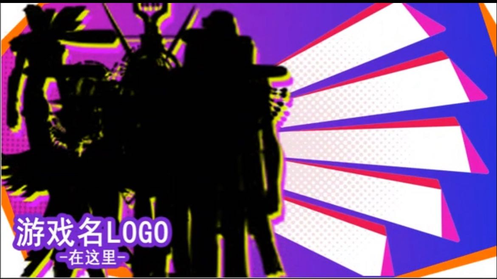
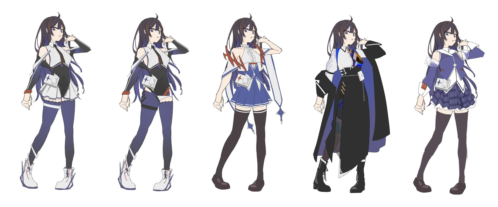
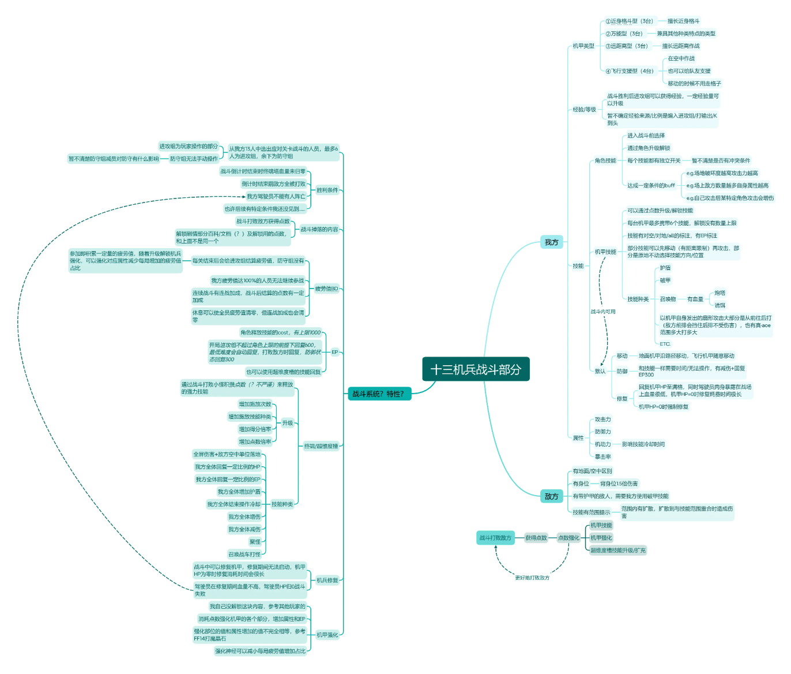
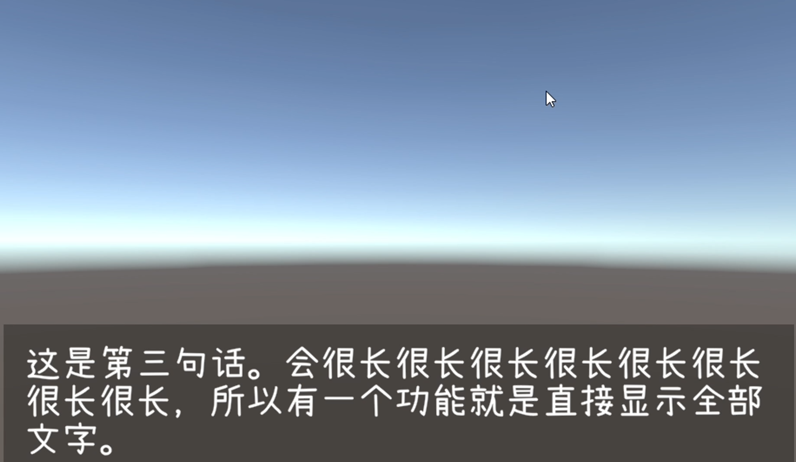
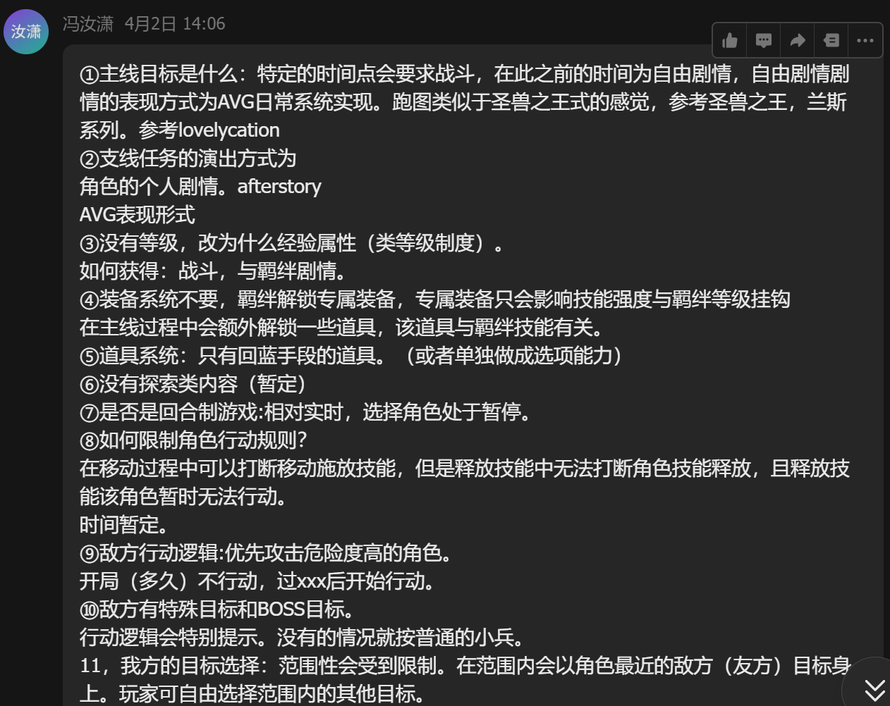
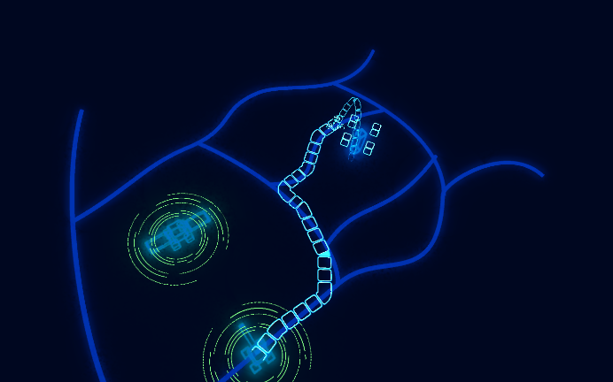

4月7号：
# 安理：
- 等待音乐试听，跟踪音乐进度。
- 推动团队管理。

# 苏钊：
- 讲人设:
- 世界：
    - 死前世界 死后世界。
    - 死前世界的特质 影响死后世界
    - 死后世界有筛选机制 
    - 创造者是一个高纬度的神。
    - 可以改变一切物质本质，包括长相、性别...但需要得到神的允许。
    - 死后世界造物主的造物思路是：基于科学来表现人类艺术。
- 佐仓：（女）
    - 艺术家 被选入。
    - 生于1860-
    - 人物架空 世界现实
    - 不擅长使用电子设备
    - 一点点艺术家的神经质
    - 作为新朋友出现。
- 井上：（女）
    - 人设 科学家 被选入。
    - 计算器专家
    - 帮助伊吕波做礼物
    - 作为老朋友出现。
- 草稚：（男）
    - 伊吕波老师的身份出现 
    - 为了完善 山鹿乃乃
    - 伊吕波的老师
- 大家的提问：
- 问题1：玩家带入 角色 和 摄像头 的矛盾，决定了工作的优先级是怎样？
- 解决方案：
  1. 关于带入镜头：羁绊和贴贴够精彩 玩家不需要了解太多深厚的背景故事，就可以带入。
  2. 关于带入角色：角色不能一开始就太过复杂，不然观众很难共情，或者需要一个循序渐进的过程，例如一开始是一个普通人，然后逐渐发现自己的特质...
  3. 解决方案：个人剧情 和 主线剧情 分离。

- 问题2：对于故事的 评分标准是什么？
  - 为了可以更好的设计“兴趣曲线”,和让团队成员提出有效的改善建议。需要完整的成品（即使是一个小片段），并给出评分标准。
  - 目前给出的评分标准：角色之间的羁绊：百合性，故事性，即时战术性。

# 吴林辑：
- 上周比较忙。
- 如何为伊吕波营造达芬奇的感觉。
# 魏佳：
- 主界面UI尝试。
- 正在确定各个UI的气氛所以好确定风格。
 

# 陈汉锴：
- 5个角色的立绘尝试。
- 希望在做人物设计时，可以给到百合关系的描述。（攻受关系是什么样的？）
 

# 杜可心：
- 介绍了十三机兵的构成规则
- 沈捷翔提问：攻击力是什么？
- 苏钊：攻击力：基础 * 技能词条百分比
 

# 曹爽：
- 正在推进AVG的制作。
- 并期待普通AVG的定义。
 

# 冯汝萧：
- 对战斗部分的构成规则进行了讨论。
- 对剧情部分的侧重点给出建议：贴贴权重最高，才能符合观众的第一印象。
 

# 沈捷翔：
- 展示战斗场景进度。（详细见：飞书量化君）
- 展示量化君的用法。
 

