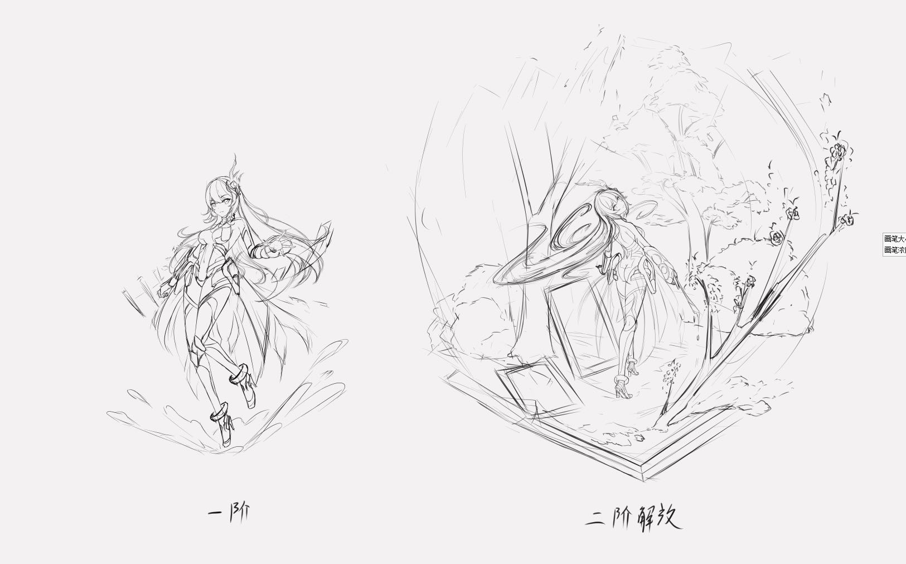
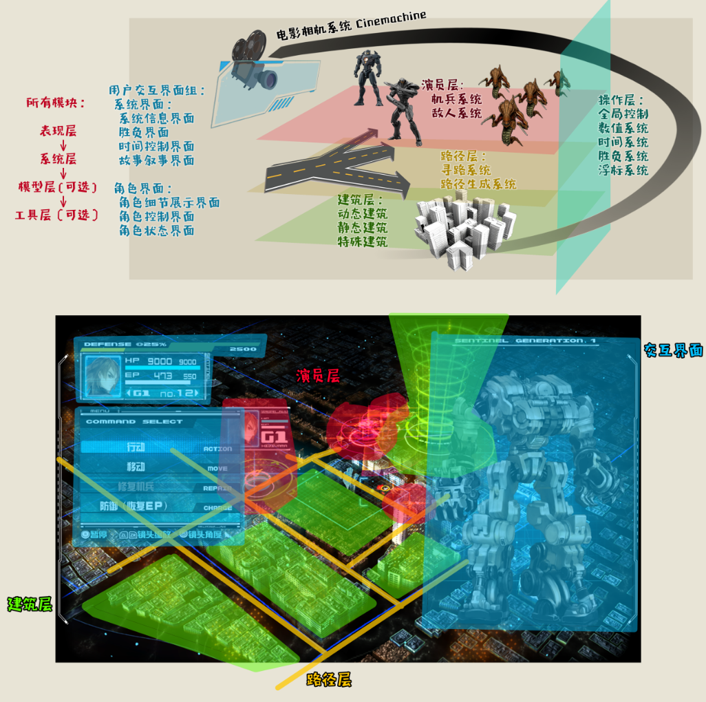

3月31日
# 吴林辑：
- UI工作在进行。
- 左仓图在完善。 

- 展示伊吕波变身立绘,大家对伊吕波立绘草稿满意。

- 期待其他美术组员可以及时回复消息。

# 苏钊：
- 音乐方面在积极寻找外包
- 剧本方面，找了一些游戏剧本参考，对现有剧本进行了一些修改
- 安利：关于之前的图需要继续细化。

# 安理：
- 向大家阐述了周四做了啥：苏钊就核心玩法做了一些纸上原型的演示。
- 期待策划组可以就角色成长体系进行数值设计。
- 期待沈进行任务表教学，从而使大家都开始任务填写
- 如果不能参加会议，期待至少提前一天告知会议主持人：安理，这样不会造成无法安排的困扰。

# 曹爽：
- 关于演出方面的demo有些功能需要和策划线下确认。
- 周一和沈对一下技术问题。

# 沈捷翔：
- 思路核心机制作为最大的风险应当最优先排除。
- 拆解13机兵的技术特征，准备以它为base。

- 17天出3个demo来完全排除核心机制的风险。
- 3个demo分别是：以羁绊为主题进行 机兵系统的操控、机兵系统的战斗、达成目标的条件。
- 期待有更强的游戏身份特征，虽然目前是以故事为核心，但作为以游戏为表达形式进行互动叙事，目前身份特征和十三机兵拉不开，但同时期待不要动到13机兵的设计根基，不然对于新团队制作风险会急剧增加。
- 为了让有戏玩起来更紧凑，期待有一个设计修改的评分系统：例如评分依据之一：是否贴合“羁绊”的主题？
- 苏钊：看到移动预示的视频后，期待有更强的建筑/地形利用，和比13机兵更密集的网状地图，对于这一修改评分为6/10。
- 同意 但期待更详细的评分依据。
- 冯汝萧：目前的描述都是操作规则，期待更多构成规则的描述，让技术更容易在脑中建模。
- 游戏规则可以分为三层：操作规则（玩家玩游戏需要知道的），构成规则（游戏核心的数学逻辑），隐性规则（这一品类的约定俗成）。目前所有对设计的描述都属于操作规则范畴，我们需要用构成规则让自己更具象规则的设计，也让方便技术在脑中建模，从而更高效的迭代。关于隐性规则同样期待重视，这是玩家在玩这类游戏的普遍心理预期，例如我对RTT的心理预期是：实时性、战术强调、多单位管理、环境利用。可以参考之前叙事的多视角，多方位描述，或许也可以利用安利的细节整理的方式，达到理清构建规则的思路的目的。
- 吴林辑疑问：关于修改需求或者不明确需求，时间是否会造成浪费？
- 谢谢为技术思考 非常好的问题 答案是：不会，例如移动预示的花费时间是一天。我不会非常规范的书写Demo，而是用最快的方式让大家看到效果，然后再进行修改。就如之前所说的风险螺线模型，这是迭代过程。目的只有一个，就是削弱和消除风险。风险包括：由于语言的局限造成脑中形成不了统一图景。可能没有想到的技术风险。

# 冯汝萧：
- 建议融合多个参考来打造核心机制。

# 杜可心：
- “点彩”等艺术工具绘画参考什么时候要？
- 吴林辑：不着急，可以带着收集。
- 安理：可以就13机兵进行一些结构分析。