# 修改方法1：改变规则

## "规则"换皮分析:
- 参考 Rule Of Play 第 11、12 章
### 操作规则
- 游戏在带有**路径** 和 **边界** 的**连续空间** 中进行。
- 一群由电脑控制的**敌人**会攻击 机兵 或 **基地**。
- 一名玩家一次控制一个机兵 **移动** 或 **行动**。
- 如果玩家在控制机兵 全场单位**行动暂停**，否则**行动继续**。
- 如果 **基地** 被摧毁，玩家失败。
- 如果 **敌人** 被全部消灭，玩家胜利。

### 构成规则
- 单位的**属性**：
  - 生命值、攻击力、防御力、冷却、暴击
- **空间**：
  - 所有单位的 移动 行动 都作用于一个**2维平面**。
  - 设计师 利用平面空间的 **点 线 面** 构成各种几何形状 并赋予 独特逻辑 影响 单位的移动 和 行动 和 属性。
- **时间**：
  - 时间是连续的时间，最大时间为1：30秒。
- **博弈**：
  - 设计师 操纵的 **点 线 面** 与 玩家 操纵 **点 线 面** 在 设计师 制定的 空间 和 时间中 进行博弈。
  - 当生命值为 0 单位销毁。

### 隐性规则
- 地形影响
  - 躲避攻击
- 单位特性
  - 类型：
    - 近身格斗型
    - 万能型
    - 远距离型
    - 飞行支援型
- 敌人行为模式
  - 地面/空中区别
  - 背身位1.5倍伤害
  - 带护甲的敌人
  - 范围提示
- 战术优劣

### 评分：独特性
- 独特性 = (构成规则（现实） 与 操作规则（抽象） 的紧密度)
- 我的评分 5 分。

## 改变规则 练习

- 根据上述**构成规则** 推出新的 **操作规则**：
- 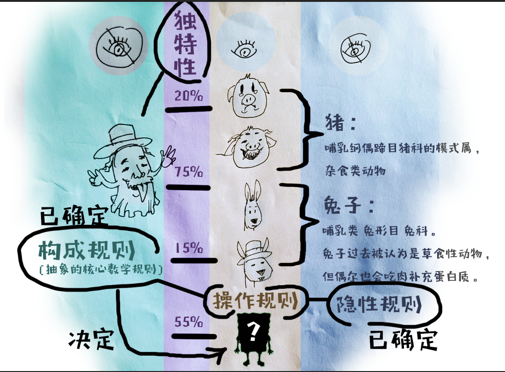

### 操作规则1：
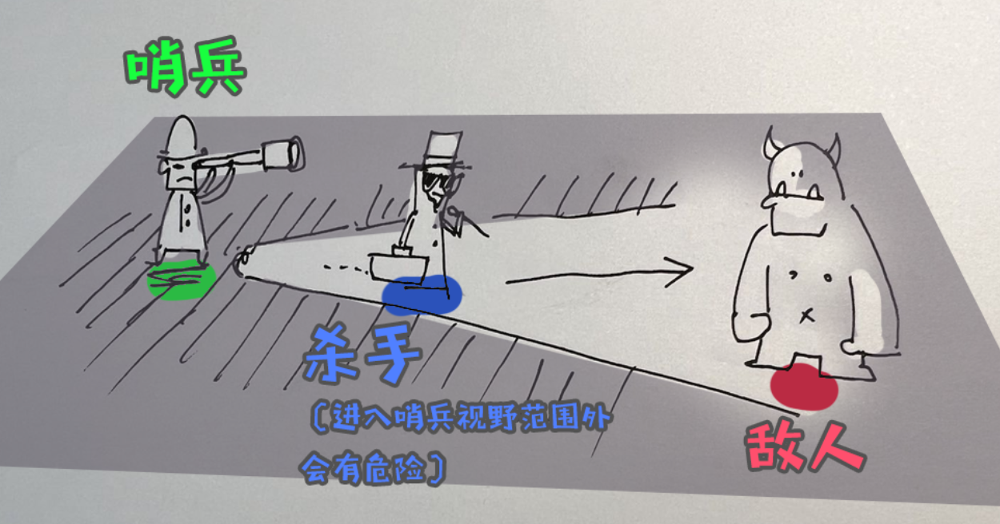
- 玩家控制角色 **移动范围** 由技能释放后的范围决定。
- 玩家控制有两种角色 **哨兵** 和 **杀手**。
  - 哨兵 伤害较低 但技能面积较大，主要用于打开行动范围。
  - 杀手 伤害较高 但技能面积较小，主要用于消灭敌人。
- 在操作时 时间会**缓慢流逝**，正常时间的 0.2倍。
- 如果在规定时间内，**找到并消灭** 所有敌人，游戏胜利。
- 如果**全员死亡**，游戏失败。

### 操作规则1 评分：
- 我的评分 6 分。
  
### 操作规则2：
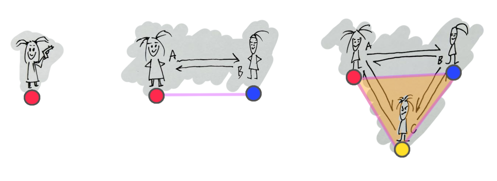
- 每个少女有自己特殊的攻击方式 并且会**自动进行攻击**。
- 玩家可以拖动少女 **改变位置**，少女根据 浮空少女 和 地面少女，决定是否可以移动到目标地形。
- 玩家可以决定少女是否 **产生连线**。
- 如果超过一个少女被决定产生连线，那么少女之间会根据距离自动 **产生连线**。
- 地形可以**改变连线** 和 少女可以移动的区域 以及 敌人移动的区域。
- **少女连线** 对单位 **属性** 的影响 受 连线双方的 **属性** 影响。
- **少女连线** 组成的 **面积** 会持续对范围内单位的 **属性** 影响，面积越小 效果越好。
- 在操作时 时间会**缓慢流逝**，正常时间的 0.2倍。
- 敌人 会攻击 最近的 少女。可能会**破坏连线**。
- 如果少女**全员死亡**，游戏**失败**。
- 如果**所有敌人**被消灭，游戏**胜利**。
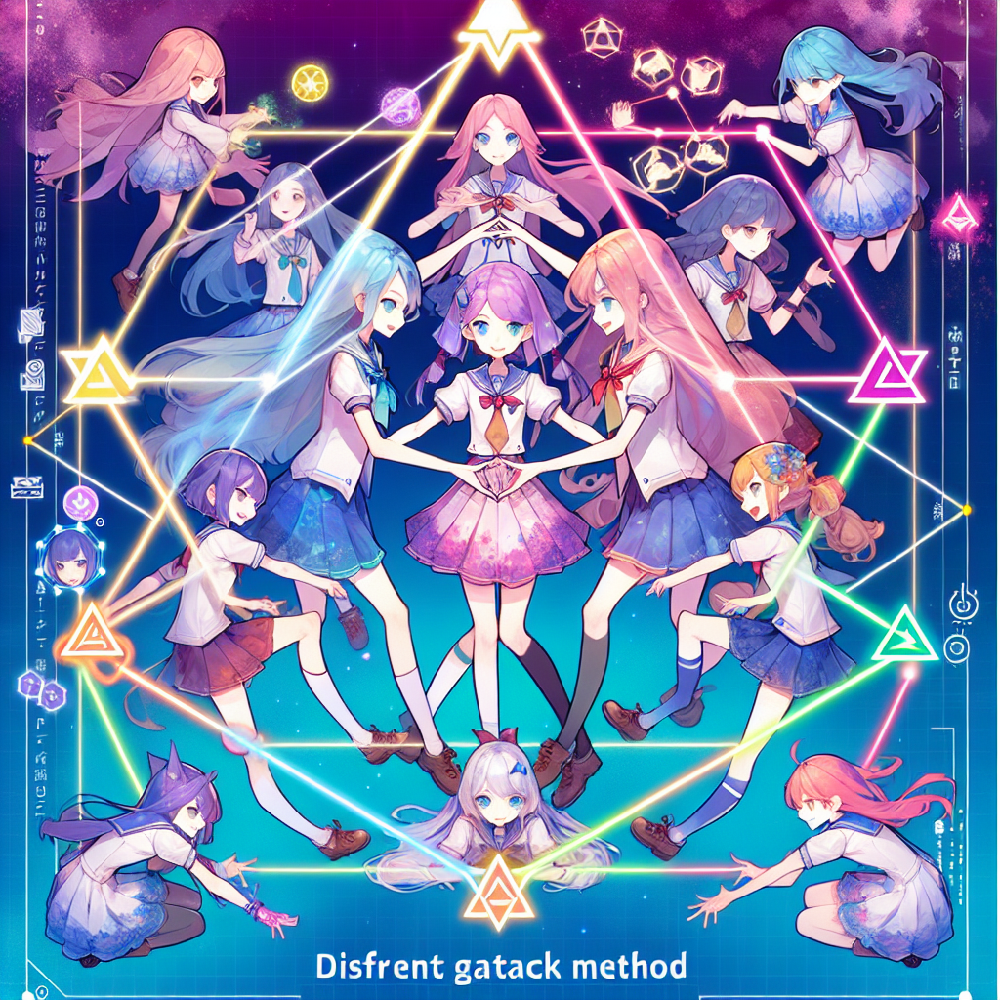

### 操作规则2 评分：
- 我的评分 8 分。

# 修改方法2：控制论优化

## 基于"控制论"分析：
- 参考 Rule Of Play 第 18 章
- 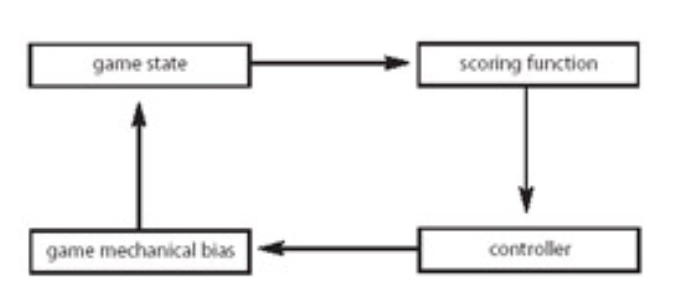
- 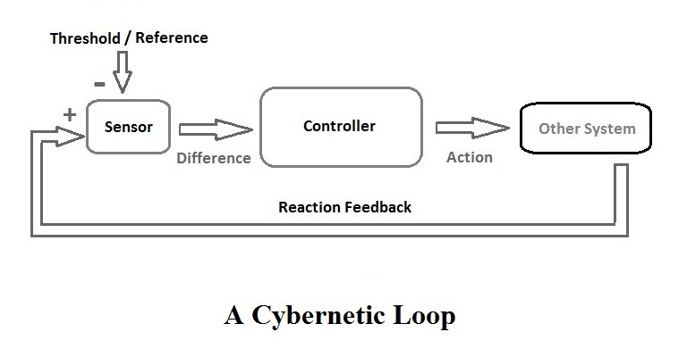
- 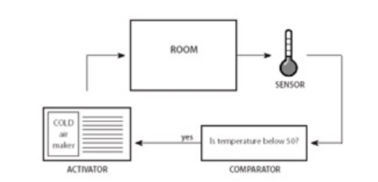
### 计分功能（传感器）
- 计分2：meta gauge 元测量仪
- 计分3：敌人与“基地”的距离
- 计分4：机兵血量
- 计分5：基地血量
- 计分6：场上的敌人
- 计分7：敌人波次
- 计分8：战场上的主要敌人
- 计分9：游戏胜利条件
- --- 需要基于对机兵的了解 ---
- 计分1：城市摧毁度
- 计分10：机兵周围敌人数量
- 计分11：机兵周围友军数量
- 计分12：女性伙伴数量
- 计分13：机兵技能使用次数
- 计分14：机兵血量
### 控制器（比较器）
- 控制器1：城市摧毁度是否高于50%？
- 控制器2：基地被入侵？
- 控制器2：是否释放大招？
- 控制器3：敌人与“基地”的距离是否小于10米？
- 控制器4：血量是否低于10%？
- 控制器4：血量是否低于0%？
- 控制器5：基地血量是否低于20%/10%？
- 控制器6：场上的敌人是否为0？
- 控制器7：敌人的波次是否变化？
- 控制器8：战场上的主要敌人是否被歼灭？
- 控制器9：游戏胜利条件是否达成？
- 控制器10：机兵周围敌人数量是否大于3？
### 游戏机制偏差（激活器）
- 城市摧毁度是否高于50%？
  - yes = 激活正反馈1：某些机兵技能激活
  - no = 不变
- 基地被入侵？
  - yes = 激活正反馈2：meta gauge 元测量仪 增加
  - no = 不变
  
- 是否释放大招？
  - yes = 激活负反馈2：meta gauge 元测量仪 减少
  - no = 不变
  
- 敌人与“基地”的距离是否小于10米？
  - yes = 激活正反馈3：减少敌人血量
  - no = 激活负反馈3：增加敌人攻击我方单位

- 血量是否低于10%？
  - yes = 激活正反馈4：演出提醒事件
  - no = 激活负反馈4：持续接受伤害

- 血量是否低于0%？
  - yes = 激活正反馈5：自动进入修复环节
  - no = 不变

- 基地血量是否低于20%/10%？
  - yes = 激活正反馈5：演出提醒事件
  - no = 激活负反馈5：持续接受伤害
  
- 场上的敌人是否为0？
  - yes = 激活负反馈6：新一波敌人出现
  - no = 不变

- 敌人的波次是否变化？
  - yes = 激活正反馈7：演出
  - no = 不变

- 战场上的主要敌人是否被歼灭？
  - yes = 激活正反馈8：演出
  - no = 不变

- 游戏胜利条件是否达成？
  - yes = 激活正反馈9：演出，评分结算货币
  - no = 不变
- 机兵周围敌人数量是否大于3？
  - yes = 激活正反馈10：某些机兵技能激活
  - no = 不变

## 诊断与优化
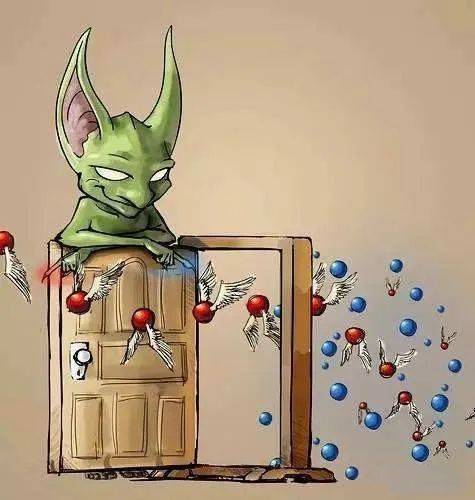
- 基于 Marc LeBlanc **游戏控制论** 的设计“规则”：
    - **负反馈稳定**游戏。Negative feedback stabilizes the game.
    - **正反馈**使游戏**不稳定**。Positive feedback destabilizes the game.
    - **负反馈**可以**延长游戏时间**。Negative feedback can prolong the game.
    - **正反馈**可以**结束游戏**。Positive feedback can end it.
    - **正反馈**放大**初期成功**。Positive feedback magnifies early successes.
    - **负反馈**放大**后期失败**。Negative feedback magnifies late ones.
    - 反馈系统可能“偶然”从游戏系统中出现，**一定要识别**出它们。Feedback systems can emerge from your game systems "by accident." Be sure to identify them.
    - 反馈系统可能剥夺玩家的**控制权**。Feedback systems can take control away from the players.
    - 在控制论领域，更传统的**第一阶控制论**认为系统是一个**自包含的实体**，而这种观点受到了第二阶控制论的挑战，后者把观察者也作为系统的一部分。在这一正式框架内，我们没有运用第二阶控制论的思维方式。
- 得出**失稳**的部分 和 可能解决方案：
    - 密集操作游戏结束过快（过于不稳定）
      - **原因分析：**
        - “增加敌方数量”这一负反馈，以波次结束为触发条件，导致一个波次到后期 “技能释放”这一正反馈过多，导致游戏快速结束。
      - **解决方法：**
        - “增加敌方数量”这一负反馈， 由波次触发 改为“实时敌人强度”触发，由此维持一个恰当的稳定性，来延长游戏时长。利用DDA（动态难度调整）技术。
    - 无操作失败过于平淡（过于稳定）
      - **原因分析：**
        - 多数和失败条件相关的正反馈多是演出
      - **解决方法：**
        - 除了演出 这样的心理缓冲，增加一些数值上的 正反馈 如机兵进入失控狂暴状态。
    - 策略过程过于线性（过于稳定）
      - **原因分析：**
        - 机兵正反馈的激活条件过于苛刻（需要记住13个人的特性），导致一些正反馈设计无法体现。
      - **解决方法：**
        - 机兵正反馈的部分激活条件由 “不同角色触发” 改为 “不同机兵类型触发”。

# 修改方法3：改变体验

## "体验"换皮分析：
- 参考 Rule Of Play 第 23 章
- **核心机制**
  - 战术安排

- 核心机制 渗透 **三个环节**
  - 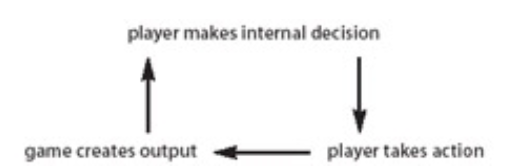
  - **游戏对玩家的感官输出：**
  - 一大群敌人，铺天盖地的袭来
  - 整个城市的建筑和道路成为了战场
  - 所过之处 敌人对城市进行大肆破坏
  - 人数众多的敌人们正在快速向基地移动
  
  - **玩家的输入能力**
  - 利用 确认/取消键 + 方向键
  - 移动 和 部署技能
  
  - **引导玩家做出决定的内部认知和心理过程**
  - 作为正义的一方需要保护城市不受侵袭，又要保证人数不占优势的"好人"不被伤害,所以要合理的指挥机兵进行作战。 

- 核心机制 渗透 **感官**
  - **视觉扫描**
  - 战场的形式如火如荼，屏幕因为攻击而发生剧烈震动，雷达上的敌人非常密集，并有规律的向基地方向移动，作为少数的防守方，英俊帅气的少男少女们不得不面对。
  - **听力辨别**
  - 少男少女不断汇报情报和状态，音乐急迫且激扬，敌人的攻击声音不断传来。
  - **运动反应**
  - 利用手柄快速选择机兵，移动，释放技能，以及切换视角。
  - **专注**
  - 可以让焦灼的情绪得到释放的就是进入战术安排阶段，而战术安排结束进入行动冷却阶段，情绪再次变得焦灼。
  - **学习的感知模式**
  - 从时间上 游戏分为两个阶段，战术安排和行动冷却，玩家需要在这两个阶段中不断的学习和调整。
  - 从空间上 考验的是玩家如何用战术安排在有限的空间中保护城市和基地。
  - 从资源上 由于机兵人数不占优势，玩家需要不断的学习如何合理的利用机兵的技能，以及如何合理的分配机兵的位置。

- 核心机制 带来 **体验**
  - 紧迫感

## "体验"变体 练习：
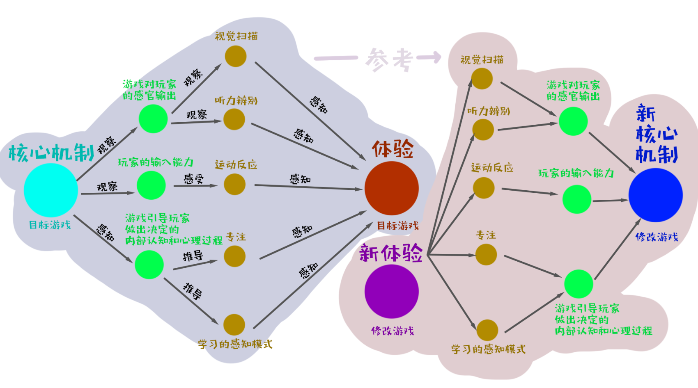
- **期待的体验**：幽默感
- 核心机制的 **感官设计**
  - **视觉扫描**
  - 场景是女生宿舍，宿舍内零散的分布着一些新旧垃圾，其中一堆垃圾堆中被得知住着一只巨大的蟑螂，少女们为了请它离开，制定了这次行动，并选举你作为这次行动的指挥。为了这次行动 她们经过了长期的讨论，并列出了超级详细的战术方案，除了一堆解释说明外，还自导自演了“消灭蟑螂”的过程并录制了视频，还有人缝了带有团队Logo的T恤。为了迎接蟑螂的到来，他们改变了宿舍的布局。倒计时秒表跳动着，场上的少女们有的在补妆，有的在压子弹，有的在盯着时钟焦虑，有的还在最后的时间赶着论文...
  - **听力辨别**
  - 少女之间偶尔互相讨论，偶尔自言自语。时不时会听到塑料袋被拨动的声音，和触角颤动发出的声音，这些都会引发少女们的一整骚动。背景音乐富有使命感。
  - **运动反应**
  - 利用手柄快速选择少女，移动，释放技能，以及切换视角。
  - **专注**
  - 在行动阶段，少女距离蟑螂过近时，会有夸张的表情特写演出。
  - **学习的感知模式**
  - 从时间上，战术安排阶段会进入0.2倍的子弹时间。
  - 从行为上，蟑螂会循着垃圾堆的气味靠近，少女们会在垃圾堆周围布置陷阱。
  - 从空间上，有一些垃圾堆，有路径.
  - 从资源上，每个少女会有呕吐值，当呕吐值达到一定值时，少女会自动退出战斗。距离蟑螂或者垃圾堆太近也会增加呕吐值。每个垃圾堆会有臭味度，当臭味度达到一定值时，蟑螂会加速靠近，否则会减速。
- 结论 核心机制的 **三个环节**
  - **游戏对玩家的感官输出：**
    - 一群少女，为了消灭宿舍里的蟑螂，制定了详细的战术方案，进行了一场自导自演的夸张离奇的战斗。
  - **玩家的输入能力：**
    - 利用手柄快速选择少女，移动，释放技能，以及切换视角。
  - **引导玩家做出决定的内部认知和心理过程：**
    - 作为少女的指挥官，要带领一堆看似不靠谱但很认真的少女们展开消灭蟑螂的事业，为了不辜负少女们的期待，以及得到客户的好评，所以必须做好每一次决策。
- 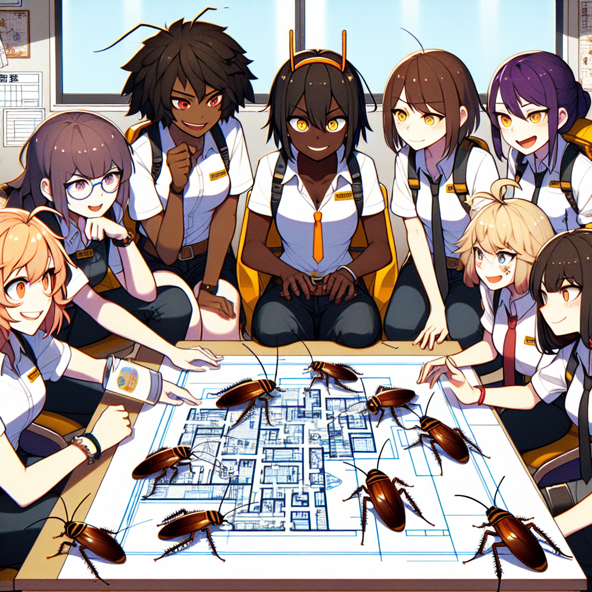

# 修改方法4：机制迁移

## 识别 双重诱惑
### 诱使进入“魔法圈”
- 游戏设计师 LeBlanc 的8项**乐趣**识别：
    1. Sensation: Game as sense-pleasure
    - **感觉**：游戏作为感官愉悦
    2. Fantasy: Game as make-believe
    - **幻想**：游戏作为虚构
    3. Narrative: Game as drama
    - **叙事**：游戏作为戏剧
    4. Challenge: Game as obstacle course
    - **挑战**：游戏作为障碍课程
    5. Fellowship: Game as social framework
    - **伙伴**：游戏作为社交框架
    6. Discovery: Game as uncharted territory
    - **探索**：游戏作为未知领域
    7. Expression: Game as self-discovery
    - **表达**：游戏作为自我发现
    8. Submission: Game as masochism
    - **屈从**：游戏作为受虐狂（是指屈从于某种系统的一般快感。）
- 心理学家 Michael J. Apter 强调**认知的游戏快感**的框架，7项**认知唤醒**：
    1. Exposure to Arousing Stimulation: intense and overwhelming sensation
    - 暴露于**刺激性**刺激：强烈而压倒性的感觉
    2. Fiction and Narrative: emotional arousal from character identification
    - 虚构和**叙事**：通过角色认同产生的情感激动
    3. Challenge: difficulties and frustrations arising from competition
    - **挑战**：来自竞争的困难和挫折
    4. Exploration: moving off the beaten track into new territory
    - **探索**：离开常规进入新领域
    5. Negativism: deliberate and provocative rule-breaking
    - **消极**主义：故意和挑衅性的违规行为
    6. Cognitive Synergy: imaginative play
    - **认知协同**：想象力的发挥
    7. Facing Danger: risk within the "protective frame" of play 
    - **面对危险**：在游戏的“保护框架”内面临风险
- 人类学 Roger Caillois **体验** 的快乐：
    1. Agôn: competition and competitive struggle
    - **竞争**：竞争和竞争性斗争
    2. Alea: submission to the fortunes of chance
    - **偶然**：顺从于机遇的命运
    3. Mimicry: role-playing and make-believe play
    - **模仿**：角色扮演和虚构游戏
    4. Ilinx: vertigo and physical sensation
    - **眩晕**：眩晕和身体感觉
- 心理学家 Mihaly Csikszentmihalyi **心流** 的识别：
  - 同时具备以下**效果**：
    - **行动和意识**的融合 the merging of action and awareness
    - **专注** concentration
    - **自我意识的丧失** the loss of self-consciousness
    - **时间的扭曲** the transformation of time
  - 同时具备以下**条件**：
    - 一项具有**挑战性的活动** a challenging activity
    - **明确的目标** clear goals
    - **清晰的反馈** clear feedback
    - 获得一个带有**悖论的控制模拟** the paradox of having control in an uncertain situation
### 诱使留在“魔法圈”
- 游戏设计师 Brian Moriarty **诱导引擎**
  - 它是游戏中存在**节奏和模式**，并强化它。
  - 这种愉悦既是**结构性的**，也是**体验性的**，既有**数学上的规律性**，也有游戏中的**灵活性**。
  - 玩家会发现自己不仅在玩游戏，而且还**被游戏玩弄**。
  - 它是一种强大的力量，它能带着那些**被它困住的人一起前进**。

- 识别**目标**
  - **宏观目标：**
    - 识别条件：目标是玩游戏的表面原因，但目标从来不是轻易就能达到的；相反，它是**欲望的模糊对象**，是胡萝卜。
    - 识别条件：目标的重要性仅在于它能**塑造玩家的体验**。
    - 识别条件：目标是一种人为编造的条件，玩家将其作为自己的终极目标。是玩家**克服困难实现目标**。
  - **微观目标：**
    - 与最终获胜条件、宏观目标同样重要的是游戏中的微小瞬间，即玩家在游戏中的**微观互动**。
    - 在游戏过程中，玩家要努力实现短期目标，每一个**短期目标都会带来一种快感**，这种快感不如核心机制带来的即时满足感来得直接，但却比游戏中久拖不决的最终结果来得更快。
    - 玩家可以实现的短期目标种类取决于**游戏的性质**以及将目标悬挂在**核心机制和获胜之间**的方式。
    - 游戏设计师 Doug Church 提出 "鼓励玩家**构思并实现目标**，会让他们在游戏中产生一种控制感"。例如：口袋妖怪》玩家可能会关心如何获得游戏中的每一块道馆奖牌，但也许他会**发明一个不同的短期目标**，比如捕捉每一种口袋妖怪，或者把他的皮格托提升到 50 级。
    - 短期目标是**必要的**，因为如果没有这些目标，玩家就会迷失在游戏中。玩家对下一步该做什么感到困惑。

- 识别**条件反射**
  - 对于选择时刻的这个方面，每当玩家采取一项行动时，她最终会因此而受到游戏的**奖励或惩罚**。
  - 心理学家  B. F. Skinner: 我们之所以能学会自己的行为方式，是因为**某种行为**在过去得到了**奖励**。
  - 在制定奖惩措施时，游戏设计者**塑造**了**玩家未来可能采取的行为**。
  - 游戏设计师 Neal and Jana Hallford：奖惩不仅会影响玩家行为的好坏，还会影响玩家的**愉悦感**和**整体游戏体验**。
  
- 识别**奖励**
  - 游戏设计师 Neal and Jana Hallford **四种游戏奖励分类**的一般类型:
    - **荣耀奖励**（Rewards of Glory）：荣耀奖励是指你将给玩家的所有东西，对游戏玩法本身没有任何影响，但最终会成为他们体验的一部分。这包括通过一路过关斩将赢得游戏、完成特别困难的支线任务，或者击败邪恶怪物的阴谋。
    - **维持奖励**（Rewards of Sustenance）：这种性质的奖励是为了让玩家能够维持他们角色的现状，并保留他们在游戏中迄今所获得的所有东西。这可能包括治愈伤口的健康包、增强玩家魔法能力的法力药水、能够保护玩家免受电磁辐射的高科技盔甲、消除诅咒或疾病的机器人，甚至是储物箱或载重兽，让玩家的角色能够携带更多资源。
    - **访问奖励**(Rewards of Access)访问奖励具有三个关键特征：它们允许玩家进入先前无法进入的新地点或资源，它们通常只能使用一次，并且一旦使用后对玩家没有其他价值。钥匙、撬锁工具和密码是这种奖励的典型例子。
    - **便利奖励**(Rewards of Facility)便利奖励能让玩家的角色做一些之前无法做到的事情，或增强他们已经拥有的能力。如果处理得当，它们应该增加玩家在游戏中的策略和选择数量。便利奖励的一个很好的例子可能是一个魔法球，让角色能够穿过石墙，或者是一个让他们能够远程关闭敌方机枪塔的增强型网络软件。

- 识别**强化计划**（reinforcement schedules）
  - 强化计划是指随着**时间**的推移，受试者**获得强化的速度**。
  - 这些强化模式以及综合奖惩网络有助于形成任何**游戏体验的结构**。
  - 强化有两种基本类型：**固定强化**和**可变强化**。
    - **固定强化**是指奖励或惩罚以**稳定、持续**的速度出现。固定比率是指行为发生的**次数固定**，例如 玩家每打败五波外星人就能得到一个一次生命奖励。固定间隔是指每次增援之间有**固定的时间间隔**，例如在游戏中，只要玩家还活着，每隔 30 秒就会出现一次增援。
    - 在**可变强化**中，奖励和惩罚会以**不规则的间隔出现**。可变比率是指结果在**不规则的间隔后出现**，就像老虎机的回报率是随机的。在时间间隔可变的情况下，奖励或惩罚会以**随机的时间间隔出现**，就像机械儿童游戏《别叫醒爸爸》一样，爸爸会在随机的时间间隔后醒来（带来负面影响）。
  - 没有**挑战和挫折**，就不会有游戏冲突，也就不会从克服困难的过程中获得乐趣。在积极体验和消极体验--焦虑和愉悦--之间找到难以捉摸的平衡点，是游戏设计最深刻的挑战之一。也使我们识别优秀的**强化计划**变得有意义。

- 识别**上瘾**（Addiction）：
  - 大量玩家上瘾意味着游戏在**商业上**获得成功的可能性更大。
  - 如果你创造了一个可能性的空间，奖励玩家的探索，那么你就很可能会有玩家想要看到更多的**规则变化**。
  - 所有游戏所固有的 **相同但又不同** 的特质，是一款游戏能够吸引玩家并让他们一次又一次重返游戏魔圈的核心所在。
  - **积极成瘾** 和 **消极成隐** 的辨别：
    - **积极成瘾**是指玩家在游戏中**获得的乐趣**，而**消极成瘾**是指玩家在游戏中**避免的痛苦**。
    - 当一种游戏活动变得病态上瘾时，这种活动就会受到谴责：自由活动被关闭，自由 选择的意识消失，**有意义的游戏也就消亡了**。
    - 从这个经验意义上讲，当玩家对某种形式的游戏上瘾时，超出了我们所设计的范畴，**我们所定义的游戏**就不复存在了。
    - 换句话说，医学界所使用的消极意义上的上瘾游戏，**根本就不是真正的游戏**。

## 改进方法：
- 搬运**快乐**：哲学家詹姆斯-S-汉斯（James S. Hans）**用差异感染熟悉的事物**，将 识别出的**快乐**融入到不变的核心机制中。
- 搬运**心流**：心理学家（Mihaly Csikszentmihalyi）如何**进入和离开**心流状态。
  - **认知行为理论**与**控制论**存在相似的控制方式，但是两者所研究的现象类型也有所不同。
    - **控制论**关注的是偏离**稳定状态**的问题：负反馈使系统恢复稳定，正反馈则使系统偏离稳定。**行为理论**关注的是**智能学习行为**，即特定行为与结果之间的关联。
    - 在**行为理论**中，"积极 "一词有快乐的含义，比如老师用**表扬来奖励**学生。同样，"消极 "一词也有令人不快的含义，甚至**意味着惩罚**。
    - 但在控制论中，"积极 "和 "消极 "都是**数学术语**，其中任何一个都可能给玩家带来积极或消极的情感体验。
  - 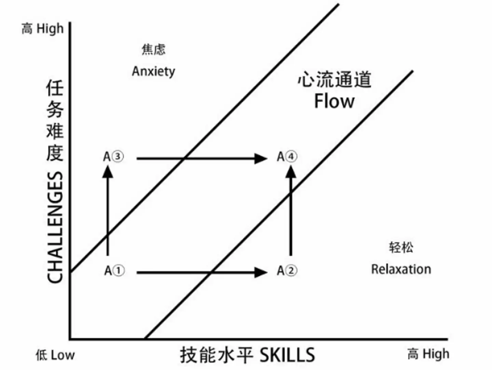
  - 模型并不只是针对游戏中的一个孤立的瞬间，而是追踪玩家在**许多游戏过程中的体验**。
  - 设计拙劣的游戏可能会陷入两个 "陷阱"--**无聊和焦虑**。
  - 心流的迭代设计过程可以让游戏设计者找到游戏中**无聊和焦虑的时刻**，并重新塑造游戏体验，**尽量减少意义不大的游戏时刻**。
- **有意义的快乐**准则：
  - 有意义游戏的核心在于**行动与结果**之间的关系。
  - 游戏中的每一个选择都必须是**可以辨别和可以整合的**。
  - 游戏对玩家需要给予了极大的关怀。从游戏开始的那一刻起，玩家就有了**明确的方向和目标**。
  - **发现和创造这些乐趣**的过程本身就是一种独特的幸福：游戏设计的无穷乐趣。

# 修改方法5：改变描述

# 修改方法6：反转意识形态
