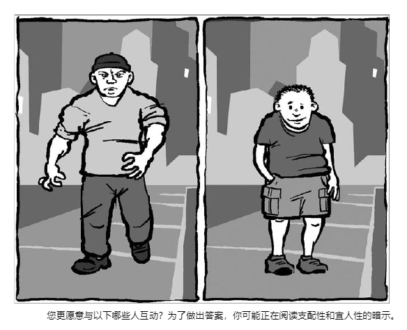

# 故事反馈_沈捷翔：
# 分析背景
- **底层工具**：
- 故事的批判性评价语言体系建立于：Rule Of Play(Zimmerman Salen) + The Art of Game Design(Jesse Schell)
- **反馈思路**：
1. **多维分析**：
  - 因为存在哲学中的“他心问题”
  - 在描述一个抽象概念时，只有从多角度描摹它。
  - 才能让他者，尤其是协作者真正理解它。
  - 从而达成 客观 清晰 的目的。
2. **防微杜渐**：
  - 防止“小坑”在未来开发过程中成为“大坑”。
  - 根据经验，警惕“蝴蝶效应”
  - 指的是一些早期的小问题可能在未来开发过程中成为大问题。
3. **开源共享**：
  - 共享一些觉得在叙事设计中有用的工具。
# 分析结果：
- ```范围仅第一章，和企划书，选择性接纳```
## 问题：
- **传统叙事角度**
---
- 基于 **J.Hillis 框架** 提出问题：
- 关于情境：平均13分钟描述一个“变化或逆转”是是否可以接受？
- 关于情境：在具体的“逆转”中想要给观众传达一种什么样的“启示”？
- 关于角色：如果“目击者”的角色穿插着切换成 读者以外 故事会不会更加有趣？
- 关于形式：对于一章2.5个小时的互动叙事“形式”是否过多？是否需要拆分新的章节去建立“形式”？
---
- 基于 **Henning 兴趣曲线** 提出问题：
- 目前的故事是否可以更加符合兴趣曲线？
- 例如：
1. 片段：伊吕波 以“这是我自己的决断”为由拦下某个 神秘人，决定与 佐仓美野里 做决断。
2. 数年后：伊吕波 遇到了意想不到的故人，当年的 神秘人 诸葛昕妍。
3. 伊吕波 与 诸葛昕妍 叙旧后，相约一同参加了一场 特殊的宴会。
4. 在宴会上 两人竟然遇到了 另一位熟人 佐仓美野里。
5. 佐仓美野里 早就知道 伊吕波 会参加宴会，还创作了画作《星空的誓约》表达对于 伊吕波 的爱恋。
6. 数月间：伊吕波 外交官任期结束,回到了 想象力世界,随后便被安排到了 想象力大学 担任 教授。
7. 这天 伊吕波 得知消息 山鹿奈奈 通过自己的“人之美”打败了 佐仓美野里
8. 同一天 诸葛昕妍 找到伊吕波 决定和 佐仓美野里 争夺 伊吕波 的爱意
9. 其间 诸葛昕妍 为了 伊吕波 制作了 “世界机”。
10. 但 伊吕波 却去找了 佐仓美野里。 为了让 佐仓美野里 振作起来用 佐仓美野里 的“樱花”展示另一种“人之美”。
11. 没想到，由于其间的 赌注 涉及 想象力世界的秘密 造成 虫族入侵。所以所有人都被要求在特定的时间防守 “伊甸”行星系。
- 这样排序会不会更加精彩？为了让曲线更加完美，能不能让9号片段更加精彩？
---
- 基于 **Isbister人际关系环状图** 提出问题：
- 用 Word Embedding 算法 基于坐标系之间的距离 可以让 自然语言神经网络模型 知道词语之间的差别。
- 同样的 基于二维坐标系的人际关系环状图来 表现人物关系 是否可以帮助制作团队对角色的理解和刻画角色特征？
## 建议：
- 既然是游戏，那么最终是要将 **传统叙事** 用**互动叙事**的语言体系来表达。为了让项目推进，下一步是否需要开始思考如何将 **传统叙事** 用 **互动叙事** 的语言体系来表达。
# 分析过程：
``` 可以忽略，如果对 分析结果 有 疑问再根据关键词看 ```
## 传统叙事角度
### J.Hillis 框架
- 框架目的：不与人类对叙事的期望相悖。故事“活过来”的必要条件。
- 三个序列维度：情境 Situation => 人物 Character => 形式 Form
- 参考：J. Hillis Miller defines （佛罗里达大学校长 兼 文学教授）
#### 解释：
- （如果知道可以跳到“反馈”）
- **情境 Situation**
- 一系列随时间变化的事件。
- 必须有一个**初始情境**。
- 然后是一系列导致情境发生**变化**或**逆转**的事件。
- 以及由情境逆转可能带来的**启示**。
- **人物 Character**
- 必须使用拟人化手法创造角色。
- 例如：书面叙述中的文字，口头叙述中的声音。
- 情节可能很重要，但如果没有拟人化，就不可能讲述故事。
- 叙事所需的最少人物是三个：**主角**、**对手**和**学习启示的目击者**。
- 有时，主角、反派 或读者可能是 目击者。
- **形式 Form**
- 必须对关键元素进行某种图案化或重复。
- 例如：一个**比喻**或**比喻系统**，或者一个**复杂的单词**。
- 必须有某种形式的叙事节奏来调节该比喻或词语。
- **原文例子**
1. 灰熊 Thc Grizzly Bear
2. 灰熊体型庞大，性格狂野。The Grizzly Bear is huge and wild。
3. 他已经吞掉了婴儿。He has devoured the infant child.
4. 婴儿并不知道 The infant child is not aware
5. 他已经被灰熊吃掉了。 He has bccn eaten by the bear.
- **分析**
- **情境 Situation**
  - **初始情境**：灰熊体型庞大，性格狂野。
  - **变化**：他已经吞掉了婴儿。
  - **逆转1**：
  - 婴儿并不知道他已经被灰熊吃掉了。
  - 悬念构造下的逆转
  - 没有悲剧式英雄故事。
  - “好人”（婴儿）也没有机会对抗灰熊形式的“坏人”。
  - **逆转2**：
  - 前两行是单句尾句，让读者可以预期第三行是相同的。
  - 然后他发现第四行实际上是第三行的延续。
  - **启示**：
  - 一种“意料之外”的“喜感”
- **人物 Character**
  - 棕熊用 He 是拟人化。
  - 在这种形式中，目击者叙述者比主角学到的更多。
  - 读者作为**目击者**
  - 婴儿作为**主角**
  - 灰熊作为**对手**
- **形式 Form**
  - 贯穿全文的 Form 是 两个 is 和 两个 has。
#### 回归 繁星：

**情境 Situation**：
1. **初始情景**：伊吕波 外交官 任期结束,回到了 想象力世界,随后便被安排到了 想象力大学 担任 教授。
2. **变化**：伊吕波 遇到了意想不到的故人，与 诸葛昕妍 再会。
3. **变化**：伊吕波 与 诸葛昕妍 一同参加了一场 特殊的宴会。
4. **变化**：又一位老友 佐仓美野里 再会了。
5. **逆转**：佐仓美野里 表达对于 伊吕波 的爱恋。
   - **启示**：伊吕波 和 佐仓美野里 文档中的启示：天才便是拥有名为“勇气”的才能。
6. **逆转**：诸葛昕妍 决定和 佐仓美野里 争夺 伊吕波
   - **启示**：伊吕波 和 诸葛昕妍 文档中的启示：快乐王子与小燕子。
7. **逆转**：伊吕波 以“这是我自己的决断”为由拦下,决定自己与 佐仓美野里 做决断。
8. **逆转**：山鹿奈奈 通过自己的“人之美”打败了 佐仓美野里
   - **启示**：伊吕波 和 山鹿奈奈 文档中的启示：人与人羁绊的传承。
9.  **逆转**：伊吕波 为了让 佐仓美野里 振作起来只好用 佐仓美野里 的“樱花”展示另一种“人之美”。
    - **启示**：伊吕波 和 佐仓美野里 文档中的启示：天才便是拥有名为“勇气”的才能。
10. **变化**：由于其间的 赌注 涉及 想象力世界的秘密 所以所有人都被要求在特定的时间防守 “伊甸”行星系 的 虫族入侵。
11. **变化**：其间 诸葛昕妍 制作了 “世界机” 并和 伊吕波 约好事件结束后要在一起。

- 就 情境 而言，有没有什么问题？
  - 需要明确每个“逆转”中的“启示”（如果有的话）。作为 协同开发者 知道这些启示很关键。
  - 虽然文档中有每个角色和主角“羁绊”的主题启示，但是这些启示目前是模糊的，是否有必要在每章中都揭示一些。
  - 另外，文档中的角色羁绊 是否需要更详细的说明？比如
  - 5号逆转中对应的人物关系是 伊吕波 和 佐仓美野里。文档中关系描述是：天才便是拥有名为“勇气”的才能。“勇气”具体指的是什么？
  - 6号逆转中对应的人物关系是 伊吕波 和 诸葛欣妍。 文档中关系描述是：快乐王子与小燕子，这是 王尔德 的童话故事吗？
  - 以上的启示会在第一章的情境中会得到多大程度的体现？
  - 文档中预计游戏时长20小时，主线最长有8个章节，每个章节2.5个小时。以第一章为例：11个 变化或逆转，平均每个 变化或逆转 有 0.22个小时（13分钟），平均13分钟描述一个变化或逆转是是否可以接受？

**人物 Character**：
- 1 - 7
- **目击者**：读者
- **主角**：伊吕波 诸葛昕妍
- **对手**：佐仓美野里
- 8 - 9
- **目击者**：读者
- **主角**：伊吕波 诸葛昕妍 佐仓美野里
- **对手**：山鹿奈奈
- 10 - 11
- **目击者**：读者
- **主角**：伊吕波 诸葛昕妍 佐仓美野里 山鹿奈奈 “伊甸”行星系
- **对手**：虫族

- 就 人物 而言，有没有什么问题？
  - 如果 目击者 穿插着切换成 读者以外 故事之中的角色会不会更加有趣？
  
**形式 Form**：
- “伊吕波”出现8次。
- “佐仓美野里”出现7次。
- “诸葛昕妍”出现4次。
- “想象力”出现3次。
- “人之美”出现2次。
- “山鹿奈奈”出现1次。
- “樱花”出现1次。
- “赌注”出现1次。
- “伊甸”行星系出现1次。
- “虫族”出现1次。
- “世界机”出现1次。
-  就 形式 而言，有没有什么问题？
   -  对于2.5个小时的互动叙事
   -  形式是否过多？ 
   -  是否都会立即在第一章中得到解释？
   -  为了减少读者的学习成本，一些出现次数较少的词语，是否需要建立新的章节？
#### 综上反馈：
- **问题**：
- 平均13分钟描述一个“变化或逆转”是是否可以接受？
- 在具体的“逆转”中想要给观众传达一种什么样的“启示”？
- 如果“目击者”的角色穿插着切换成 读者以外 故事之中的角色会不会更加有趣？
- 对于一章2.5个小时的互动叙事“形式”是否过多？是否需要建立新的章节去建立“形式”？

### Henning 兴趣曲线
- 参考：Henning Nelms 1900-1986 （律师、戏剧导演、业余魔术师和小说家） 《Magic and Showmanship : a Handbook for Conjurers 》1969 年
- 原文：As a dramatist, Nelms includes practical and useful advice about structure, blocking, and managing the attention curve so that it peaks at just the right time. 
- 作为一名剧作家，内姆斯提供了有关结构、阻塞和管理注意力曲线的实用建议，以便它在适当的时间达到峰值。
#### 解释：
**兴趣曲线**


- 作用：这是大多数成功的娱乐体验所遵循的秘诀。
- A点：表示用户怀着某种心情进入故事，如果A点过高，用户会因为期望过高而失望。
- B点：是勾起用户兴趣的关键点，如果B点过低，用户会失去兴趣。B点结束用户兴趣下落。
- C点 - F点：用户兴趣会有起伏，但是整体上是需要设计成上升的。
- G点：是用户兴趣的最高点，整个体验达到高潮。
- H点：解开谜团，表演结束 或 阶段性结束。
- 注意：同一个娱乐体验针对**人群**是不同的。

**碎片化兴趣曲线**


- 将整个叙事作为一个整体的兴趣曲线，然后将其分解成若干个小的兴趣曲线。
#### 回归 繁星：
- **针对人群**：
- 16岁+ ：
  - 16+：尝试新的体验，男孩女孩的兴趣出现重要的分化。
  - 18+：娱乐方式有了特定的偏好。
  - 25+：会购买很多游戏，经常表达他们的喜好与厌恶。
  - 35+：会做出购买昂贵游戏的决定。他们会寻求家庭玩游戏的机会。
  - 50+（1）：怀旧游戏。
  - 50+（2）：转向新的游戏体验，寻求改变。
  - 数据来自：Art of Game Design 9章
- 百合
- JRPG
- 故事性
- **评分**
- 评分方法：
  - 综上人群标准。
  - 尽量客观的为 A-H点 兴趣值评分（很难完全客观）
  - 百合10分，JRPG10分，故事性10分，满分30分。
  - 就第一章来看：
  - 按照 变化或逆转 共11个点。
  - 每个点为 3秒 阅读时长。
  - 总共第一章游戏时长为：33秒。
0. A点：从 主题 和 封面 结合人群喜好来看，（二次元封面 = 百合:5 + JRPG:3 + 故事:3 = 14分）
1. 伊吕波 外交官 任期结束,回到了 想象力世界,随后便被安排到了 想象力大学 担任 教授。（百合:1 + JRPG:5 + 故事:5 = 11分）
2. 伊吕波 遇到了意想不到的故人，与 诸葛昕妍 再会。（百合:3 + JRPG:3 + 故事:1 = 7分）
3. 伊吕波 与 诸葛昕妍 一同参加了一场 特殊的宴会。（百合:3 + JRPG:3 + 故事:1 = 7分）
4. 又一位老友 佐仓美野里 再会了。（百合:3 + JRPG:3 + 故事:1 = 7分）
5. 佐仓美野里 创作了画作《星空的誓约》表达对于 伊吕波 的爱恋。（百合:6 + JRPG:3 + 故事:3 = 12分）
6. 诸葛昕妍 决定和 佐仓美野里 争夺 伊吕波（百合:8 + JRPG:2 + 故事:3 = 12分）
7. 伊吕波 以“这是我自己的决断”为由拦下,决定自己与 佐仓美野里 做决断。（百合:9 + JRPG:2 + 故事:5 = 16分）
8. 山鹿奈奈 通过自己的“人之美”打败了 佐仓美野里（百合:3 + JRPG:6 + 故事:5 = 14分）
9.  伊吕波 为了让 佐仓美野里 振作起来只好用 佐仓美野里 的“樱花”展示另一种“人之美”。（百合:6 + JRPG:6 + 故事:5 = 17分）
10. 由于其间的 赌注 涉及 想象力世界的秘密 所以所有人都被要求在特定的时间防守 “伊甸”行星系 的 虫族入侵。（百合:1 + JRPG:6 + 故事:5 = 14分）
11. 其间 诸葛昕妍 制作了 “世界机” 并和 伊吕波 约好事件结束后要在一起。（百合:7 + JRPG:6 + 故事:3 = 14分）
- 曲线是这样：
- 
#### 综上反馈：
- 如果按照我的个人喜好来看应该是这样更符合兴趣曲线：
- 7 2 3 4 5 1 8 6 11 9 10
- 
- 重排序后的故事：
7. 伊吕波 以“这是我自己的决断”为由拦下,决定自己与 佐仓美野里 做决断。
2. 伊吕波 遇到了意想不到的故人，与 诸葛昕妍 再会。
3. 伊吕波 与 诸葛昕妍 一同参加了一场 特殊的宴会。
4. 又一位老友 佐仓美野里 再会了。
5. 佐仓美野里 创作了画作《星空的誓约》表达对于 伊吕波 的爱恋。
1. 伊吕波 外交官 任期结束,回到了 想象力世界,随后便被安排到了 想象力大学 担任 教授。
8. 山鹿奈奈 通过自己的“人之美”打败了 佐仓美野里
6. 诸葛昕妍 决定和 佐仓美野里 争夺 伊吕波
11. 其间 诸葛昕妍 制作了 “世界机” 并和 伊吕波 约好事件结束后要在一起。
9. 伊吕波 为了让 佐仓美野里 振作起来只好用 佐仓美野里 的“樱花”展示另一种“人之美”。
10. 由于其间的 赌注 涉及 想象力世界的秘密 所以所有人都被要求在特定的时间防守 “伊甸”行星系 的 虫族入侵。
- **整理**
1. 片段：伊吕波 以“这是我自己的决断”为由拦下某个 神秘人，决定与 佐仓美野里 做决断。
2. 数年后：伊吕波 遇到了意想不到的故人，当年的 神秘人 诸葛昕妍。
3. 伊吕波 与 诸葛昕妍 叙旧后，相约一同参加了一场 特殊的宴会。
4. 在宴会上 两人竟然遇到了 另一位熟人 佐仓美野里。
5. 佐仓美野里 早就知道 伊吕波 会参加宴会，还创作了画作《星空的誓约》表达对于 伊吕波 的爱恋。
6. 数月间：伊吕波 外交官任期结束,回到了 想象力世界,随后便被安排到了 想象力大学 担任 教授。
7. 这天 伊吕波 得知消息 山鹿奈奈 通过自己的“人之美”打败了 佐仓美野里
8. 同一天 诸葛昕妍 找到伊吕波 决定和 佐仓美野里 争夺 伊吕波 的爱意
9. 其间 诸葛昕妍 为了 伊吕波 制作了 “世界机”。
10. 但 伊吕波 却去找了 佐仓美野里。 为了让 佐仓美野里 振作起来用 佐仓美野里 的“樱花”展示另一种“人之美”。
11. 没想到，由于其间的 赌注 涉及 想象力世界的秘密 造成 虫族入侵。所以所有人都被要求在特定的时间防守 “伊甸”行星系。
- **总结**
- 经过整理的片段，整体上是符合兴趣曲线。所以故事从我的视角也变得精彩。
- 并且事实告诉我们 宣传时调子别起太高 否则 后面的品质得持续抬高 能获得好评。
---

### Isbister人际关系环状图
- 参考：Interpersonal circumplex by Isbister 由 Catherine Isbister 社会心理学领域带到游戏设计领域的工具。
- 论文：https://gamifique.files.wordpress.com/2011/11/9-better-game-characters-by-design-a-psychilogical-approach.pdf
#### 解释：
- 
- 作用：基于两个象限：友谊 和 支配。用来观察角色间的关系。
- 使用方法：选取一名进行分析的角色，放在坐标原点，从其他角色的角度，思考其他角色与该角色的位置。
- 
- 上图是 星球大战中 汉索罗 的人际关系图。
- 距离原点越近说明交流越多。
- 越极端的位置，说明角色越有趣。
- 
- 
- 利用上述方法，可以有助于制作团队对角色的理解和刻画角色特征。
#### 回归 繁星：
- 
#### 综上反馈：
- 用 Word Embedding 算法 可以让自然语言神经网络模型 知道 词语之间的差别可以通过坐标之间的距离来体现。
- 同样用 二维坐标系表现人物关系是不是更好的选择？
# 推理框架：
- 哲学的演绎推理