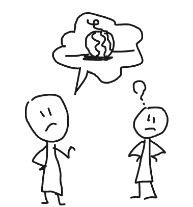
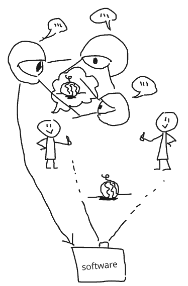
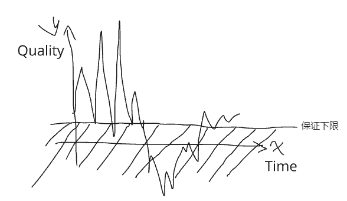

# 一种针对文创类作品评价自动化的技术
## 技术背景与参考文献
### 技术背景: 过度依赖现有理论有什么危险？
- 近年来，文学、电影和超文本等电子叙事形式的学者和学生开始倾向于对电脑游戏的研究。
- 随着游戏设计之外的学科的发展人们从各自领域的角度来研究游戏，谁有权对游戏和叙事做出陈述，以及到底如何做出这样的陈述，引发了争论。
- 这些地盘之争体现了在自己学科的背景下研究外部媒体所固有的困难。 
- Jesper Juul 正确地提醒我们过度依赖现有理论，特别是从其他领域借用的理论的危险。
- 例如，使用文学理论来论证所有游戏都是（或不是）叙事最终并不能提供太多实用性。
- 所以一个多维度的自动化评价软件，可以帮助我们更好的理解和改进文创类作品，并提供一种客观的评价维度。
### 技术背景: 为什么需要这个工具？
#### 理由1: 信息不对称

- 在团队合作中存在 主体间性，即不同主体之间的信息不对称，导致合作效率低下。

- 创作者 在描述一个概念时，往往会需要使用多种形式的表达，并且这些表达形式之间需要存在一定的关联性。
- 团队中的其他成员, 由于对创作者的概念理解不同，导致了对概念的理解不同。
- 需要从更多维度的交叉验证, 才可以更全面的侧写 创作者的概念, 从而提高团队合作效率。
#### 理由2: 保证创作质量

- 用软件中科学的创作类方法论和小工具，可以保证即便是没有什么创作经验的人也可以做出思路表达清晰的作品。
为创作团队保护创作质量的下限。
从而可以让创作者更好的发挥才能和天赋。
### 技术的关键思路
1. 叙事框架拆解：
J. Hillis Miller defines (佛罗里达大学校长 兼 文学教授)
2. 叙事排序依据 Henning 兴趣曲线：
Henning Nelms 1900-1986 (律师、戏剧导演、业余魔术师和小说家) 《Magic and Showmanship : a Handbook for Conjurers 》 1969 年
3. 利用 Isbister人际关系环状图 检查人物关系的合理性：
Interpersonal circumplex by Isbister 由 Catherine Isbister 社会心理学领域带到游戏设计领域的工具。
4. 按照输入权重进行评分和建议。
### 参考文献
- [The Art of Game Design-Jesse Schell](https://book.douban.com/subject/25830795/)
- [Rule Of Play-Zimmerman Salen](https://book.douban.com/subject/25830795/)
- [Games Telling Stories?-Jesper Juul](https://www.gamestudies.org/0101/juul-gts/)
- [Game Design + Game Culture. Online conference. 2000](https://eyebeam.org/replay)