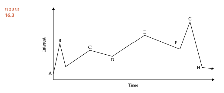
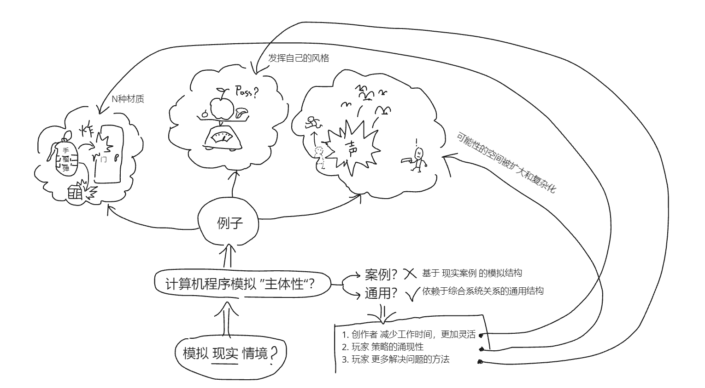
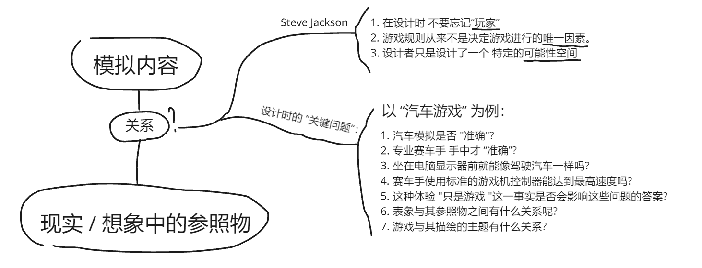

# 一种针对文创类作品评价自动化的技术
## 技术背景与参考文献
### 技术背景: 过度单一的依赖现有理论有什么危险？
- 近年来，文学、电影和超文本等电子叙事形式的学者和学生开始倾向于对电脑游戏的研究。
- 随着游戏设计之外的学科的发展人们从各自领域的角度来研究游戏，谁有权对游戏和叙事做出陈述，以及到底如何做出这样的陈述，引发了争论。
- 这些地盘之争体现了在 **自己学科的背景下研究外部媒体所固有的困难**。 
- Jesper Juul 正确地提醒我们过度依赖现有理论，特别是从其他领域借用的理论的危险。
- 例如，使用文学理论来论证所有游戏都是（或不是）叙事最终并不能提供太多实用性。
- 所以**一个多维度的自动化评价软件**，可以帮助我们有效的降低学习曲线，更好的理解和改进文创类作品，并提供一种客观的评价维度。

### 参考文献
- [The Art of Game Design-Jesse Schell](https://book.douban.com/subject/25830795/)
- [Rule Of Play-Zimmerman Salen](https://book.douban.com/subject/25830795/)
- [Games Telling Stories?-Jesper Juul](https://www.gamestudies.org/0101/juul-gts/)
- [Game Design + Game Culture. Online conference. 2000](https://eyebeam.org/replay)

## 技术的关键思路
(技术总结)
1. **叙事框架拆解** JHM 的 “叙事” 框架：
J. Hillis Miller defines (佛罗里达大学校长 兼 文学教授)
2. **叙事排序依据** Henning 兴趣曲线：
Henning Nelms 1900-1986 (律师、戏剧导演、业余魔术师和小说家) 《Magic and Showmanship : a Handbook for Conjurers 》 1969 年
3. **检查人物关系的合理性** 利用 Isbister人际关系环状图 ：
Interpersonal circumplex by Isbister 由 Catherine Isbister 社会心理学领域带到游戏设计领域的工具。
4. 找到关键字对应的 **评分模块** 进行 **自动化分析**。
5. 按照输入权重进行 **评分** 和 **建议**。

(综上解决了问题xxx)
## 技术方案的详细阐述
### JHM 的 “叙事” 框架：
  - 参考：https://religion.ua.edu/wp-content/uploads/2021/10/Narrative.pdf
  - 目的：不与人类对叙事的期望相悖。故事“活过来”的必要条件。
  - **框架：**
    - 情境 Situation: 一系列随时间变化的事件。
      - 原文：首先，必须有一个**初始情境**，然后是一系列导致情境发生**变化或逆转**的事件，以及由情境**逆转**可能带来的**启示**。
    - 人物 Character: 叙事通过一套表现系统传达。
      - 原文：其次，必须使用**拟人化**手法创造角色——例如，书面叙述中的文字，口头叙述中的声音。然而情节可能很重要，但如果没有拟人化，就不可能讲述故事
      - 叙事所需的最少人物是三个：**主角**、**对手**和**学习启示的目击者**。（a protagonist, an antagonist, and a witness who learns.）
      - 有时，主角、反派或读者可能是证人。（Sometimcs the protagonist, the antagonist, or thc reader may be the witness.）
    - 形式 Form: 表现由图案和重复构成。
      - 原文：第三，必须对关键元素进行某种图案化或重复。
      - （Third, there must be some patterning or repetition of key elements）
      - 例如：一个比喻或**比喻系统**，或者一个**复杂的单词**。
      - 必须有某种形式的叙事节奏来调节该比喻或词语。
  - **原文例子1：**
    1. 灰熊 Thc Grizzly Bear
    2. 灰熊体型庞大，性格狂野。The Grizzly Bear is huge and wild
    3. 他已经吞掉了婴儿。He has devoured the infant child.
    4. 婴儿并不知道 The infant child is not aware
    5. 他已经被灰熊吃掉了。 He has bccn eaten by the bear.
  - **例子1分析：**
    - Situation：
      - **初始情境**：灰熊体型庞大，性格狂野。
      - **变化**：他已经吞掉了婴儿。
      - **逆转1**：
        - 婴儿并不知道他已经被灰熊吃掉了。
        - 悬念构造下的逆转
        - 没有悲剧式英雄故事。
        - “好人”（婴儿）也没有机会对抗灰熊形式的“坏人”。
      - **逆转2**：
        - 前两行是单句尾句，让读者可以预期第三行是相同的。
        - 然后他发现第四行实际上是第三行的延续。
      - **启示**：
        - 一种“意料之外”的“喜感”
    - Character：
      - 棕熊用 He 是拟人化。
      - 在这种形式中，目击者叙述者比主角学到的更多。
      - 读者作为**目击者**
      - 婴儿作为**主角**
      - 灰熊作为**对手**
    - Form：
      - 贯穿全文的 Form 是 两个 is 和 两个 has。
### 兴趣曲线

- 作用：这是大多数成功的娱乐体验所遵循的秘诀。
- A点：表示用户怀着某种心情进入故事，如果A点过高，用户会因为期望过高而失望。
- B点：是勾起用户兴趣的关键点，如果B点过低，用户会失去兴趣。B点结束用户兴趣下落。
- C点 - F点：用户兴趣会有起伏，但是整体上是需要设计成上升的。
- G点：是用户兴趣的最高点，整个体验达到高潮。
- H点：解开谜团，表演结束 或 阶段性结束。
- 注意：同一个娱乐体验针对**人群**是不同的。

**碎片化兴趣曲线**

- 将整个叙事作为一个整体的兴趣曲线，然后将其分解成若干个小的兴趣曲线。
  
### Isbister人际关系环状图
- 参考：Interpersonal circumplex by Isbister 由 Catherine Isbister 社会心理学领域带到游戏设计领域的工具。
- 论文：https://gamifique.files.wordpress.com/2011/11/9-better-game-characters-by-design-a-psychilogical-approach.pdf
#### 解释：
- 
- 作用：基于两个象限：友谊 和 支配。用来观察角色间的关系。
- 使用方法：选取一名进行分析的角色，放在坐标原点，从其他角色的角度，思考其他角色与该角色的位置。
- 
- 上图是 星球大战中 汉索罗 的人际关系图。
- 距离原点越近说明交流越多。
- 越极端的位置，说明角色越有趣。
- 
- 
- 利用上述方法，可以有助于制作团队对角色的理解和刻画角色特征。
### 补充
(架构图)
(方法名)
(流程时序，以及解释)
(用户分类)
(涉及的技术范围)
## 产品的有益效果？
#### 理由1: 信息不对称

- 在团队合作中存在 主体间性，即不同主体之间的信息不对称，导致合作效率低下。

- 创作者 在描述一个概念时，往往会需要使用多种形式的表达，并且这些表达形式之间需要存在一定的关联性。
- 团队中的其他成员, 由于对创作者的概念理解不同，导致了对概念的理解不同。
- 需要从更多维度的交叉验证, 才可以更全面的侧写 创作者的概念, 从而提高团队合作效率。
#### 理由2: 保证创作质量

- 用软件中科学的创作类方法论和小工具，可以保证即便是没有什么创作经验的人也可以做出思路表达清晰的作品。
为创作团队保护创作质量的下限。
从而可以让创作者更好的发挥才能和天赋。

## 专利保护点在哪？
- 1. **自动化** 的关键点？
  - 为了模型可以识别文学作品中的语义。
  - 在传统的 NLP(natural language processing) 
  - 神经网络算法基础上进行 Fine-tuning 训练
- 2. 如何 **评分**？
  - 以 **游戏模拟** 为例，
  会遵照以下模块 **进行架构设计** 和 **作为评分依据**：
  - **情境模拟** 程式设计思路：
  
  - **模拟方法的权衡** 程式设计思路：
  
  - **模拟与现实的关系** 程式设计思路：
  
  - **构建模拟的流程** 程式设计思路：
  
  - **身临其境谬误分析** 程式设计思路：
  
- 3. 如何 **建议** ？
  - 会根据 自动化分析的 **作品风格** 和 作者自己匹配的 **关键字**
  自动匹配相应的已经获得市场成功的知名制作人 给出建议
  例如：匹配到的是 游戏领域的专业制作人 **小岛秀夫**：
  