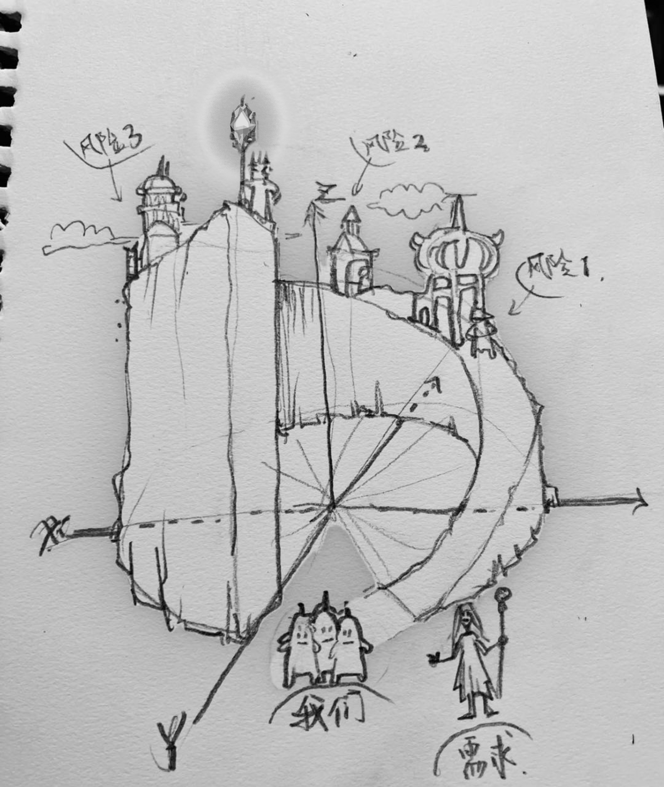
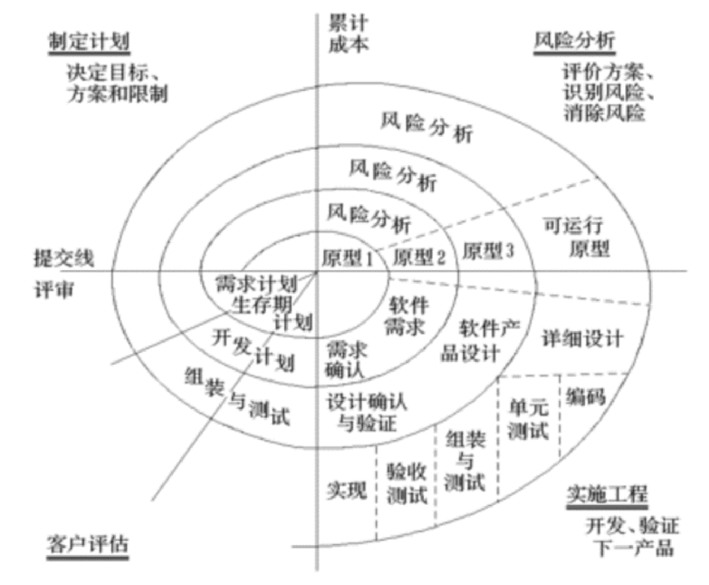
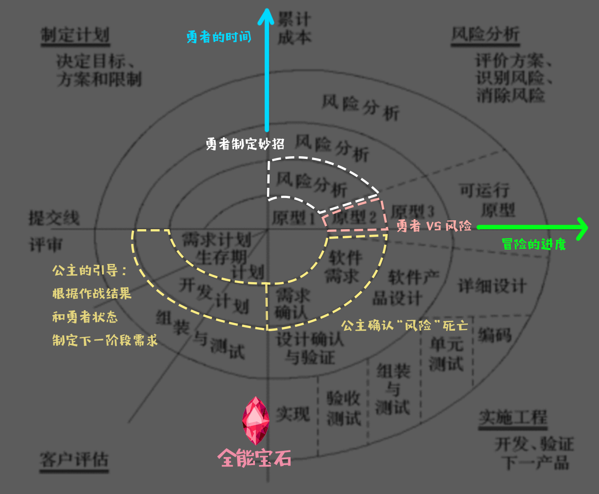
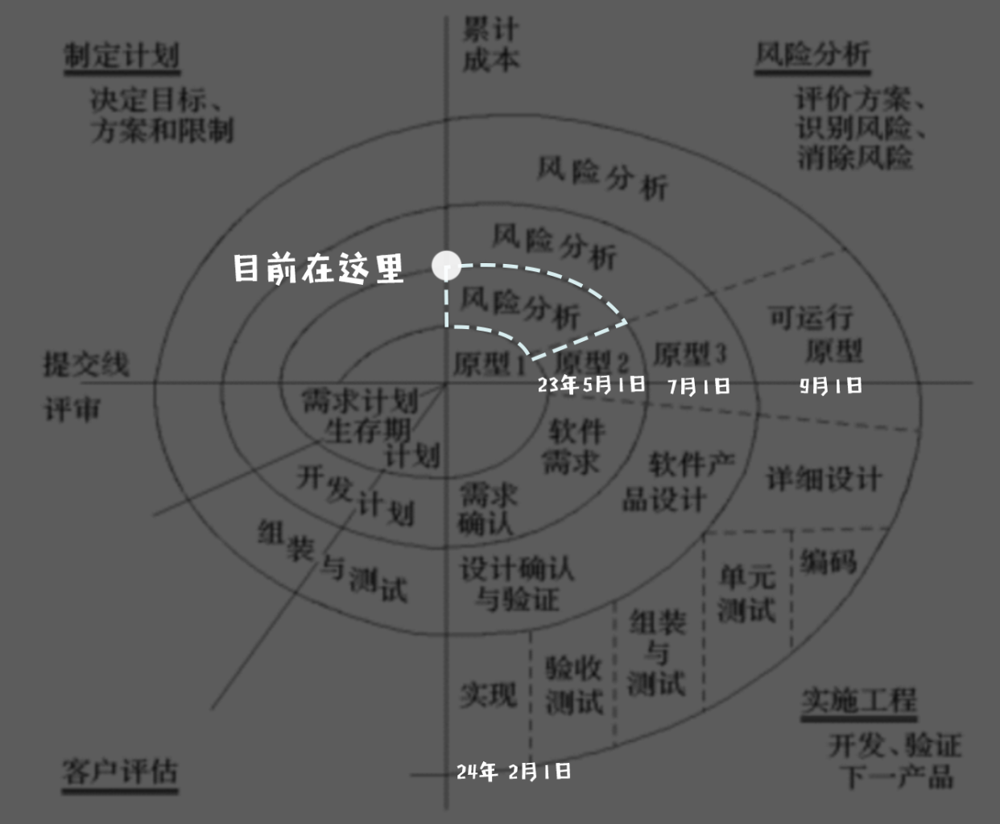

# 风险螺线模型

<br> **勇者闯宫的故事**：<br>

1. 传说有一群 **勇者** 前往了一座散发着神秘和憎恨气息的宫殿 最终获得了一颗 **全能宝石** 而你就是他们中的一员。<br><br>
2. 我作为故事的讲述着，亲眼见证了他们 如何通过协商找到 **妙招**，众人按计划通力合作 的全过程。<br><br>
3. 这群**勇者** 他们各有所长并且都怀抱自己的理想，是一群 不甘平庸的人。<br><br>
4. **勇者** 面对的敌人叫做 **"风险"军团** 他们人数众多且各个强力是 **勇者** 根本无法面对的存在。<br><br>
5. 我是一位作战经验丰富的 **公主** 喜好社交 保护人民是我的职责。我为他们在迷雾中指引方向，在每次战斗后 提供分析 和 引导。<br><br>
6. 通过一次次的引导，和协作 **勇者军团** 最终战胜了憎恨人类的 **"风险"军团**。<br><br>
7. 故事的最后善良的 **勇者们** 也获得了可以实现任何理想的 **全能宝石**。<br><br>



<br> **抽象公式**：

<br>**成功**（不变） = **需求** * **风险** * **N** <br>
# Boehm 螺旋模型


[Spiral_model 论文](https://insights.sei.cmu.edu/documents/5439/2000_003_001_13655.pdf)<br>

[Spiral_model 维基](https://en.wikipedia.org/wiki/Spiral_model)<br>

**模型特点**（面向“风险”军团）<br>
- 反复迭代一组基本 开发过程 并 管理风险，从而积极 **降低风险**。
- **风险** 是可能导致项目无法实现其目标的情况或可能的事件。
- **风险** 决定了工作量
- **风险** 决定了设计的细节程度
- **风险** 根据风险的重要性可以对工作进行优先级排序
<br>

**推行前提：**（公主 和 勇者军团）<br>
1. 在实施模型之前，就已经有明确的 **需求**。
2. **需求** 没有未解决的风险。
3. 在开发或演化过程中，**需求** 的性质不会有太大变化。
4. 这些 **需求** 符合所有关键系统利益相关者的期望，包括用户、客户、开发人员、维护者 和 投资者。
5. 实现 **需求** 的正确架构是众所周知的。
6. 有足够的 **时间** 按顺序进行。

**基本原则：**（全能宝石）<br>
1. 符合所有利益相关者的 **期望**。
2. 为了确保满足 **期望** ，而 确定和评估 达成条件的 替代方案。
3. 识别并解决 **所选方法** 带来的风险。
4. 获得 **所有利益相关者** 的批准，并承诺追求下一个周期。

**进度指标：** （检查“风险”是否会死灰复燃）<br>
1. 生命周期目标：Life Cycle Objectives
   - 是否有 足够的技术 和 管理方法 来满足每个人对“赢的定义”？
   - 如果利益相关者同意答案为
   - “是” 则通过 LCO 里程碑。
   - 否则，项目可能会被放弃，或者利益相关者可以承诺进入另一个周期以尝试获得“是”。
   
2. 生命周期架构：Life Cycle Architecture
   - 是所有 **重要风险** 被消除或减轻了吗，并且有没有充分定义满足每个人胜利条件的首选方法？
   - 如果利益相关者同意答案为
   - “是”，则该项目已通过此 LCA 里程碑。
   - 否则，项目可能会被放弃，或者利益相关者可以承诺进入另一个周期以尝试获得“是”。

3. 初始操作能力：Initial Operational Capability
   - 是否有足够的准备来满足每个人的胜利条件，以启动系统？包括推进项目所需的各个环节
   - “是”，则该项目已通过此 IOC 里程碑。
   - 否则，项目可能会被放弃，或者利益相关者可以承诺进入另一个周期以尝试获得“是”。
   
**带入故事:**<br>


**推荐原因:** 风险友好 适合独游团队

# “繁星”螺旋模型

``` 
    风险迭代过程：
    1. 描述一个问题（公主的 观察与引导）
    2. 头脑风暴出几种可能的解决方案（勇者+公主 提出 妙招）
    3. 选择一个解决方案（勇者+公主 提出 妙招）
    4. 列出使用这个方案的风险（勇者+公主 提出 妙招）
    5. 构建原型来消除这些风险（勇者+公主 大战 风险）
    6. 测试原型直到足够好（勇者+公主 大战 风险）
    7. 描述一个新问题 然后回到第2步（公主 观察与引导）
```
目前我们处在 **第一次迭代** 的 **第四阶段** <br>
对应图中的位置：<br>



## 问题/需求：（全能宝石）
- 现阶段的问题/需求是：
- 主题是：人与人之间的羁绊
- 制作一个以 **故事为核心** 的 **高品质游戏**
- 从而 **拉到投资** 获得物质奖励 
- 并且可以获得好的 **课业分数** 
- 并且在推进项目时 **获得经验**

## 方案：（公主）
- 目前我们的解决方案是：传统演出 + 即时战术 = IP经济
- 传统演出参考：[AVG演出](http://player.bilibili.com/player.html?aid=352083453&bvid=BV1rR4y1e7oZ&cid=1012813159&p=1)
- 即时战术参考：[13机兵](http://player.bilibili.com/player.html?aid=1151175801&bvid=BV1hZ421y7es&cid=1455340140&p=1)
## 风险：（勇者的技术分析）
### 产品风险 26 条
1. 会采用哪些工具/模型来帮助 构建互动叙事？<br>优先级：中<br>我们需要一个段落，用一些模型来帮助我们 明确并构建 互动叙事。<br><br>
应对者：苏钊<br>


2. 演出部分 随着游戏进度推进 分支选项会在哪里发生？<br>优先级：中<br>需要在故事中标注，才好设计数据结构<br><br>
战斗失败：必须要过<br>
好感度持久存储<br>
不一样结局<br>
应对者：苏钊<br>

3. 演出部分 分支选项的结果会影响哪些内容？<br>优先级：中<br>需要有文档来详细说明，才好设计游戏逻辑<br><br>
应对者：苏钊<br>

4. 战术部分 战斗的结果 会怎样影响叙事？<br>优先级：中<br>需要有文档来详细说明，逻辑和数值，才好设计游戏逻辑<br><br>
应对者：苏钊<br>

5. 演出部分 和 战术部分 人物之间的羁绊会怎样在游戏中体现？<br>优先级：高<br>需要将这种羁绊具象化在 规则 和 信息 中<br><br>
故事解锁战斗地图<br>
战斗不过无法看故事<br>
应对者：苏钊<br>

5.1. 日常区域 怎么和主线相连接？<br>
日常区域：提升角色好感<br>
以现实生活的日期为基础 推 日常。<br>
应对者：苏钊<br>

6. 参考中的演出 和 战术 的系统 是否足够 将我们故事中的冲突 表现出来？<br>优先级：高<br>我们需要制作一个故事中的冲突来测试这个系统。<br><br>
应对者：苏钊<br>

8. 战术部分 造成伤害的浮动区间 应该参考故事中的哪一部分？<br>优先级：低<br>需要有说明，才好贴合故事。<br><br>
以时间难度体验为基础来设计。<br>
根据故事描写。<br>
符合用户群体的直觉。<br>
应对者：苏钊<br>

9. 战术部分 演出部分 涉及到故事中没有描述的部分，人物状态 应该如何处理？<br>优先级：低<br>需要有说明，才好贴合故事。<br><br>
应对者：苏钊<br>

10. 一个角色的整套设计包含哪些？<br>优先级：高<br> 需要告知，才好做资源管理和资产导入规则。<br><br>
应对者：吴 + 苏 + 冯

11.  战术部分 的地图需求量是什么样的，是否需要一个战斗场景的编辑器 来制作地图？<br>优先级：中<br> 如果存在需求，那么需要Demo来排除编辑器的制作风险。<br><br>
应对者：苏 + 冯<br>

12.  在战斗场景 除了参考展示的组件，还需要哪些组件来帮助 叙事？<br>优先级：高<br>需要明确需求之外的系统 并且确定哪些不必要的系统 才好完成编码设计的评估和分工。<br><br>
应对者：苏 + 冯<br>

13.  一共有多少个可解锁的角色？角色的数值是怎样的？<br>优先级：中<br>需要明确 才好完成编码设计的评估和分工。<br><br>
应对者：苏 + 冯<br>

14.  游戏中的信息经济系统是什么样的？<br>优先级：高<br>需要明确 才好完成编码设计的评估和分工。<br><br>
应对者：苏 + 冯<br>

15.  每个场景的 客观信息 和 感知信息 是什么样的？<br>优先级：高<br>需要明确 才好完成编码设计的评估和分工。<br><br>
应对者：苏 + 冯<br>

16.  是否存在一些 隐藏的信息 来给玩家探索？<br>优先级：低<br>需要明确 才好完成编码设计的评估和分工。<br><br>
应对者：苏

17.  在规则设计中 有哪些 行动 会导致 哪些 结果？<br>优先级：高<br>需要明确 才好完成编码设计的评估和分工。<br><br>
应对者：苏 + 安

### 制作风险
1. 单句语音的需求有多少？制作时间 以及 成本是什么样的？<br>优先级：中<br>需要量化才好确定是否可以在周期内完成。<br><br>
应对者：安

2. 一个角色的整套设计需要多久？<br>优先级：高<br>依赖**产品风险**的第9条，应当完成一次，从绘制到导入的流程，才好确定是否可以在周期内完成。<br><br>
程序时间预估：1-2天 * 复杂度评估（1-3）= 1-6天（取决设计复杂度）<br>
应对者：美术 + 苏钊 + 冯 + 程序<br>

3. 一个章节大概需要绘制多少个场景？每个场景制作需要多长时间？<br>优先级：高<br>需要量化才好确定是否可以在周期内完成。<br><br>
程序时间预估：1-2天 * 复杂度评估（1-5）= 1-10天（取决于演出组件）<br>
应对者：美术 + 苏钊 + 冯 + 程序

4. 在战斗场景 有3D部分 需要制作团队是否可以Hold住？<br>优先级：高<br>需要做一个原型来验证以下技术可行性<br><br>
程序时间预估：2-3天 * 复杂度评估（1-2）= 2-6天（取决于参考选择）<br>
应对者：程序

1. 特效 从效果图到实际制作完成需要多久？<br>优先级：高<br>需要做一个原型来验证以下技术可行性<br><br>
程序时间预估：1-2天 * 复杂度评估（1-3）= 1-6天（取决于设计复杂度）<br>
应对者：美术 + 苏钊 + 冯 + 程序

1. 有多少剧情需要过场动画来展示的？过场动画制作周期是什么样的？<br>优先级：中<br>需要做一个测试故事片段，以及原型来验证以下技术可行性，确定是否可以在周期内完成。<br><br>
程序时间预估：1-2天 * 复杂度评估（1-3）= 1-6天（取决于设计复杂度）<br>
应对者：美术 + 苏钊 + 冯 + 程序

1. 是否需要 回放/收藏 的功能？比如 故事 角色立绘等等<br>优先级：低<br>需要明确的文档 并做一个原型来验证以下技术可行性。<br><br>
程序时间预估：3-5天 * 复杂度评估（1-6）= 3-18天（取决于设计复杂度）<br>
应对者：苏钊 + 冯 + 程序

### 团队风险
1. DeadLine是什么时候？是否可以确保在50%的制作周期内 完成 3 次的风险迭代？<br>优先级：高<br>依赖上述风险，需要评估<br><br>
应对者：@所有人

2. 有没有角色缺失？缺失角色怎么弥补，需要多少资金或者时间成本？<br>优先级：高<br>依赖上述风险，需要评估<br><br>
应对者：苏钊 + 冯 + 安 

3. 如果没有拉到投资我们有什么策略可以 补足 物质奖励？<br>优先级：高<br>需要评估<br><br>
问 苏钊 每个人的利益分配。<br>
应对者：苏钊 @所有人<br>


4. 怎么让每个成员玩到 参考游戏？<br>优先级：高<br>需要一个统一的技术解决方案<br><br>
应对者：杜 沈 

## 原型：
会上讨论<br>
