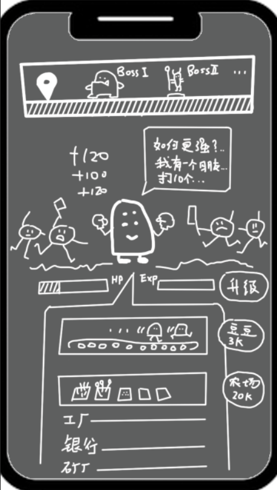
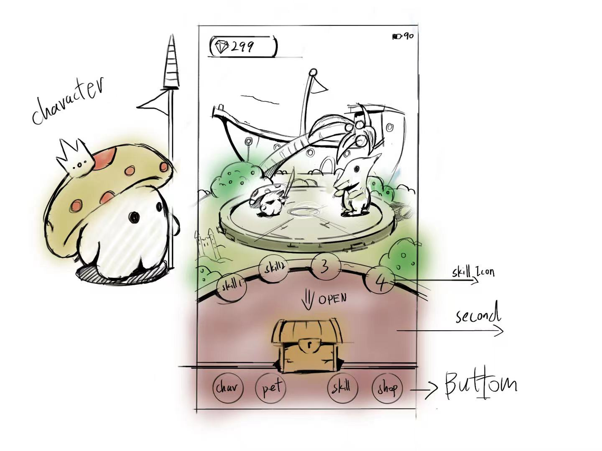

### 规则修改动机/前提：
- 资源最优化：最好依靠现有资源（终极细胞资源）
- 快速搭建（一个月内，走完 6个设计Demo流程 需要平均1周走一个 流程）
- 不能脱离“挂机类”游戏范畴
- 手机游戏
- “成长感,惊喜感,策略感”

### 评价标准：
- 优雅度 = 需要在的每一个 行动 和 结果 之间有 可辨别的、统一的关系。
- 独特性 = 构成规则 与 操作规则 的紧密度。
- 独特性 越高越好。

### 参考的构成规则：
- 参考游戏：冒险大作战（AppleStore）
- **自动模块**：
  - 战斗表现
- **手动模块**：
  - 单位数值变化
- **资源模块**：
  - 购买/出售
  - 装备
  - 战场
  - 任务
  - 成长值

### 操作规则(第一版)：
- 
- 首先你需要等待 **主角成长**。
- 你也可以 **通过点击** 主角，来帮助 **主角成长**。
- 成长过程中 会有 **敌人** 来进攻主角。
- **主角成长** 程度越高，越有可能击败 **敌人**。
- 击败 **敌人** 会产出 **货币**。
- 你可以用 **货币** 解锁/升级 **自动成长设施** 来帮助 主角成长。
- 你可以选择 **关卡冒险** 进行挑战。
- 当主角 **生命值** 为 0 ，**关卡冒险** 失败。
- 当主角 **所有敌人** **生命值** 为 0 ，**关卡冒险** 成功。
- **关卡冒险** 失败：
  - 将保留 **货币 、设施**、
  - 损失本关获得的 **主角成长**
- **关卡冒险** 成功：
  - 将解锁更难的 **关卡冒险**

### 操作规则(第二版)：
- 
- 你将带领 **你的角色** 进入 **擂台** 进行挑战。（自动）完成
- **你的角色** 会进行 **自动战斗** 。（自动）完成
- **你的角色** 在 打败 **擂台** 上的 **擂主** 后会获得成长。（自动）完成
- **你** 可以通过打开 **宝箱**，来 帮助 **你的角色** 成长。（手动）完成
- **宝箱**中 
  - 大概率 会获得少量用于 角色成长的 **成长值**。（资源）完成
  - 有时 会出现三件 **装备** 供你选择，放弃的 **装备** 会 **出售** 并转成 **成长值**。（资源）完成
  - 小概率 会出现 **极品装备** 你可以选择 **装备** 或者 **出售**。（资源）完成
- **装备** 分为很多类型，每个类型会暂时大幅提升角色的 **属性**。（资源）
- **极品装备** 除了会大幅提升角色的 **属性**，还有额外的 **词缀**。（资源）
- 如果 **你的角色** **生命值** 为 0 ，则 挑战 **擂台** 失败。（自动）完成
- 如果 **你的角色** **打败擂主** ，则 挑战 **擂台** 成功。（手动）完成
- 挑战 **擂台** 失败：（自动）
  - 将保留 **装备**
  - 保留点击 **成长值**
  - 重新开启此 **擂台** 的挑战
- 挑战 **擂台** 成功：（手动）
  - 获得此 **擂台** 的 **成长值**
  - 包含失败的 **奖励**
  - 并解锁更难的 **擂台**
- 已经解锁的 **擂台** 会有 **自动挑战** 功能，你可以选择 **自动挑战** 来获得 **成长值**。（手动）

### 操作规则(第三版)：（加入“技能”，明确 策略感 惊喜感 成长感 的分割）
- 
- 你将带领 **你的角色** 进入 **擂台** 进行挑战。（自动）完成
- **你的角色** 会进行 **自动战斗** 。（自动、成长感）完成
- **你的角色** 通过 **进度条** 决定是否可以释放 **特殊技能**。（自动、策略感）完成
- 有些 **特殊技能** 会在 **进度条** 跑完 N轮 后释放。（自动、策略感）完成
- **你的角色** 在 打败 **擂台** 上的 **擂主** 后会获得成长。（自动、成长感）完成
- **你** 可以通过打开 **宝箱**，来 帮助 **你的角色** 成长。（手动、成长感）完成
- **你** 可以通过 收集 **装备** 来强化 5 种角色 **属性** 或 **特殊技能**。（资源、策略感）完成部分
  - **装备** 由两部分构成：**永久性的属性增加** 和 **词缀**。（资源、策略感、成长感） 完成部分
  - **永久性的属性增加** 会在选中后 永久性的增加角色的某一 **属性**，从而增加击败 **擂主** 的可能。（资源、成长感）完成_缺暴击
  - **词缀** 会在装备后 暂时的大幅 增加某些 **属性** 或 造成一些 **特殊技能**。这个 **词缀** 可以被新 **词缀** 顶替（资源、策略感）完成_缺实际伤害数值
- **宝箱**中 
  - 大概率 会获得少量用于 角色成长的 **成长值**。（资源、成长感）完成
  - 有时 会出现三件 **装备** 供你选择，放弃的 **装备** 会 **出售** 并转成 **成长值**。（资源、成长感、策略感）完成
  - 小概率 会出现 **大幅永久性的属性增加** 你可以选择 **获取** 或者 **出售**。（资源、惊喜感）完成
- 如果 **你的角色** **生命值** 为 0 ，则 挑战 **擂台** 失败。（自动）完成
- 如果 **你的角色** **打败擂主** ，则 挑战 **擂台** 成功。（手动）完成  
- 挑战 **擂台** 失败：（自动）
  - 将保留 **点击操作中** 获取的一切 **装备**、**成长值**
  - 随后会 重新开启此 **擂台** 的挑战
- 挑战 **擂台** 成功：（手动）
  - 获得此 **擂台** 的 **成长值** 以及失败的 **奖励**
  - 并解锁更难的 **擂台**
- 已经解锁的 **擂台** 会有 **自动挑战** 功能，你可以选择 **自动挑战** 来获得 **成长值**。（手动）