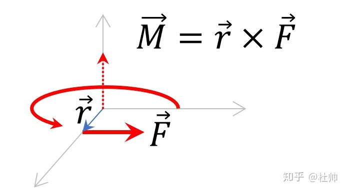
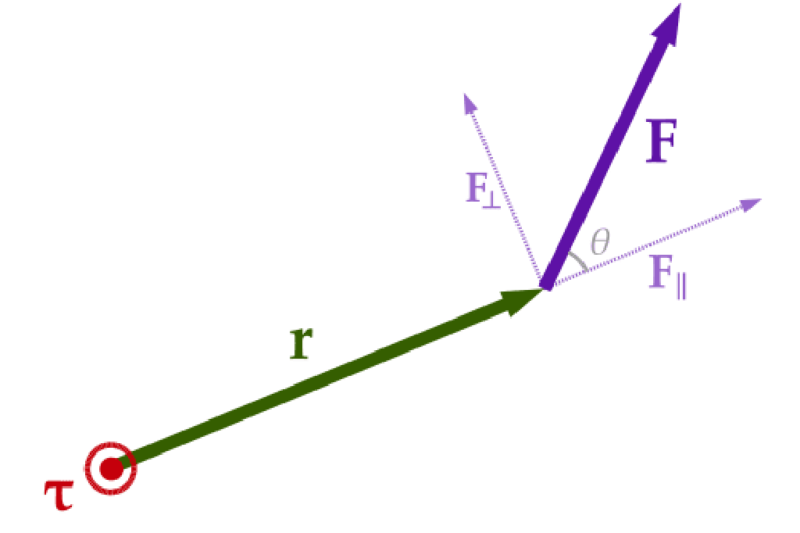
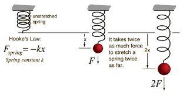

- 牛顿力学：
    - 力矩：
        - 
        - 其中 向量力 M 为 向量半径：r 与 施加力向量 F 的叉积
        - 例如：直升机（空气动力+力矩转向），竹蜻蜓
    - 扭矩：
        - 
        - 向量作用力 F
        - 施加位置为半径为 r 的向量
        -  F⊥ 表示F与r的垂直分量 只有这个力 才产生力矩
            - 综上所述：
            - 力矩 = │r││F⊥│  = │r││F│sin(theta) 
    - 胡克定律 Hooke's law
      -  
      - F = k △x
      - F(弹力，单位：牛) = k (劲度系数，单位：牛每米/厘米)* △(delta)x(弹簧伸缩量：x起始值-x结束值，单位：米、厘米)
      
    - 理想气体状态方程
- 广义相对论：
  - 速度与质量的关系

- 宇宙
  - 费米悖论
  - 等离子体
  - 重力和时间的关系
  - 核聚变
  - 放射性定年法
    - 稳定
      - 相对准确
    - 非稳定
      - 相对不准确
  - 太阳系结构
    - 太阳：
      - 太阳黑子 与 地震的正相关
    - 内四行星
    - 小行星带
    - 外四行星
    - 柯伊伯带
    - 离散盘
    - 太阳圈/日鞘
    - 奥尔特云