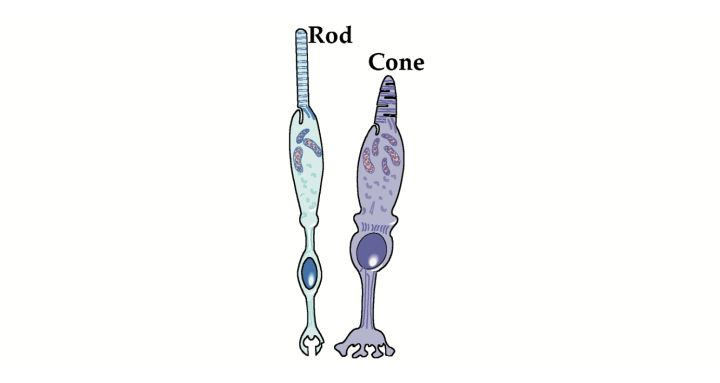
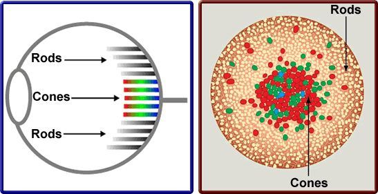
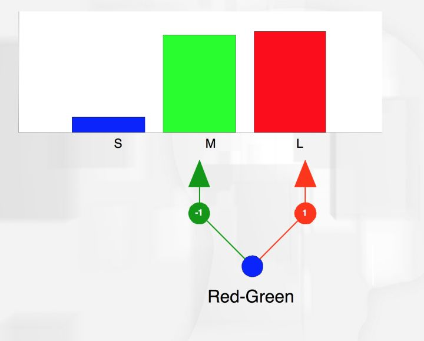
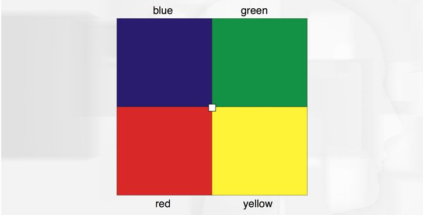
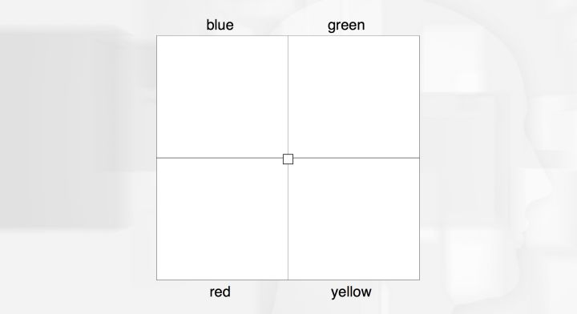
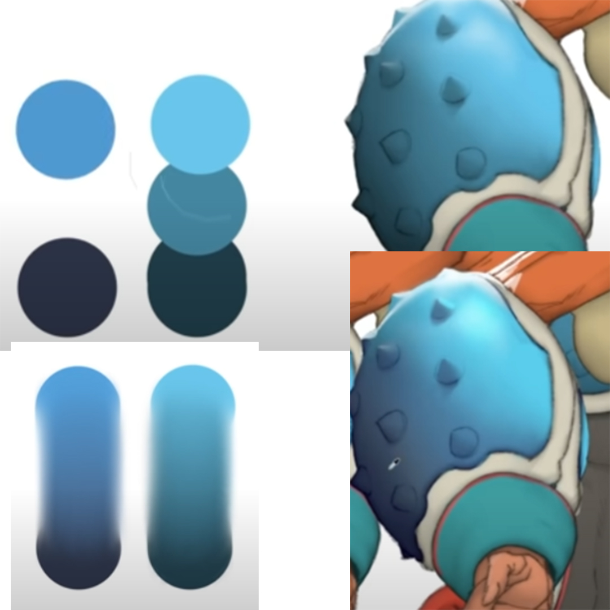
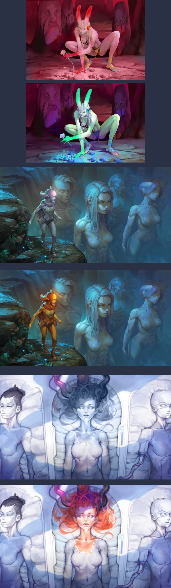
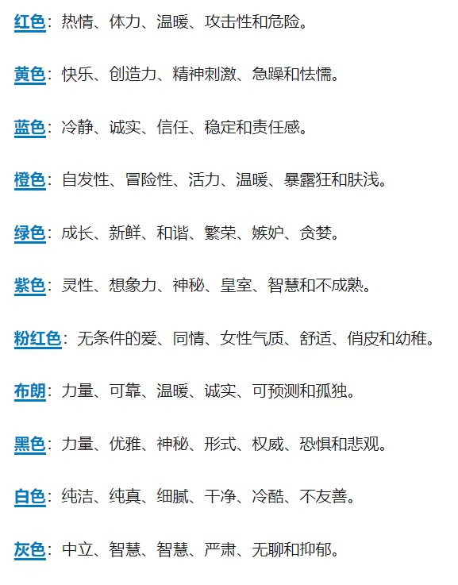
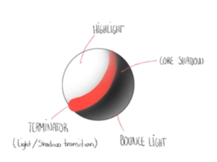

# [前置知识](https://youtu.be/7Apx-mTeLQE) 
## 抗色原理（Opponent Process Theory） 
 
 
`红色能产生兴奋反应` 
`绿色产生会抑制反应` 
 
`红色的感光器因为长时间收到刺激而疲劳（敏感度降低）` 
`而言绿色感光器的敏感度会急剧上升` 
 
## 验证 
 
 
`找到对色` 
# [渲染中用配色小技巧留住客户的芳心](https://youtu.be/2xZArgjlhO4) 
##  丢失芳心1：用 纯黑色 给暗部 着色 
 
`原理：现实世界的光存在不同色相` 
##  丢失芳心2：饱和度的误用 
 
`原理：因为Cone视觉神经优先接收有颜色的对象，所以饱和度引导视觉` 
##  丢失芳心3：冷暖平衡的误用 
 
`原理：冷暖不平衡造成Cone视觉神经疲劳` 
##  [丢失芳心4：颜色不和谐 color harmonies](https://www.colorsexplained.com/color-theory/) 
 
 
 
 
[尝试生成自己的和谐表达](https://color.adobe.com/zh/trends) 
##  丢失芳心3：明暗交界线不够精彩 
 
 
 
 
 
`原理：Rod视觉神经刺激不够` 