# 游戏艺术的必备条件
# Carftmanship
- 意思：工艺技术：通常指艺术家对 材料、工具和技术的精通，以及对细节、构图、比例和质感等方面的准确处理。
- 一次搞一个，集中精力搞：
- 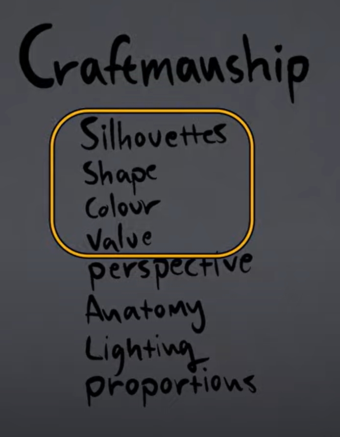
  - Silhovertte(轮廓)*
  - Shape(形状)*
  - Color(颜色)*
  - Value(明暗)*
  - Perspective(透视)
  - Anatomy(解剖)
  - Lighting(光照)
  - Proportion(比例)
- 标星的是最容易出效果 但多新手忽略的。
- Abstract piece of art 抽象艺术作品
  - 抽象的无非是 形状 和 颜色
## 三板斧推荐：（优先级 有先后顺序）
### Silhovertte and Shape (轮廓和形状)
- 形状需要有趣
  - 无聊的例子：
  - 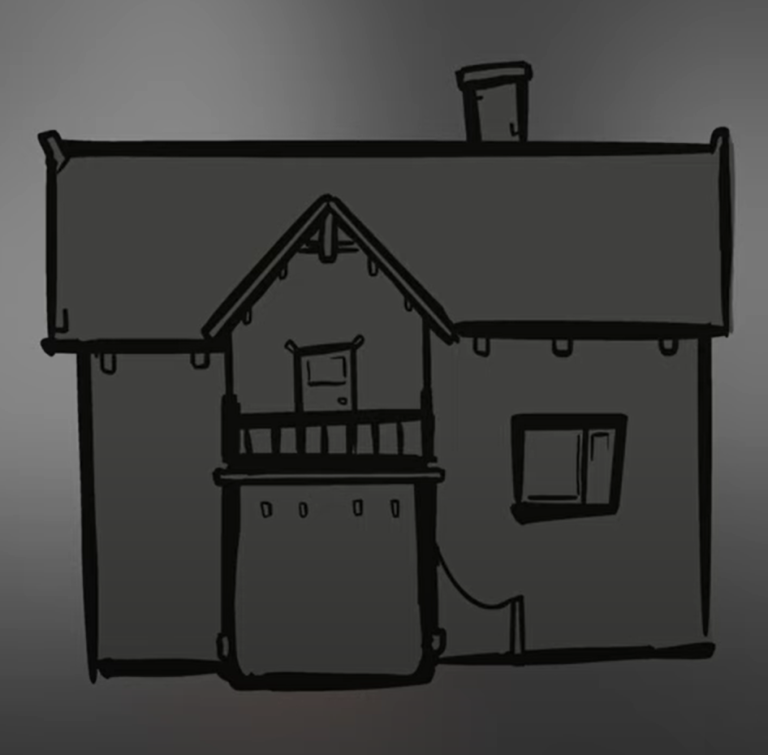
  - 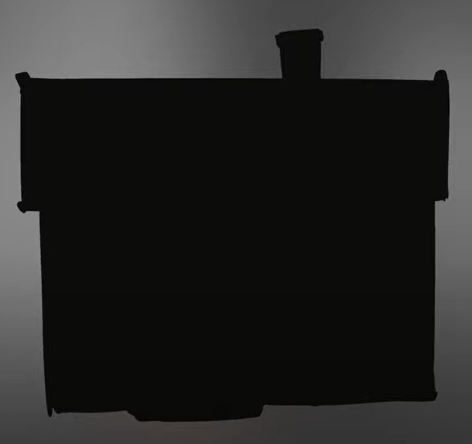
  - 有趣的例子：
  - 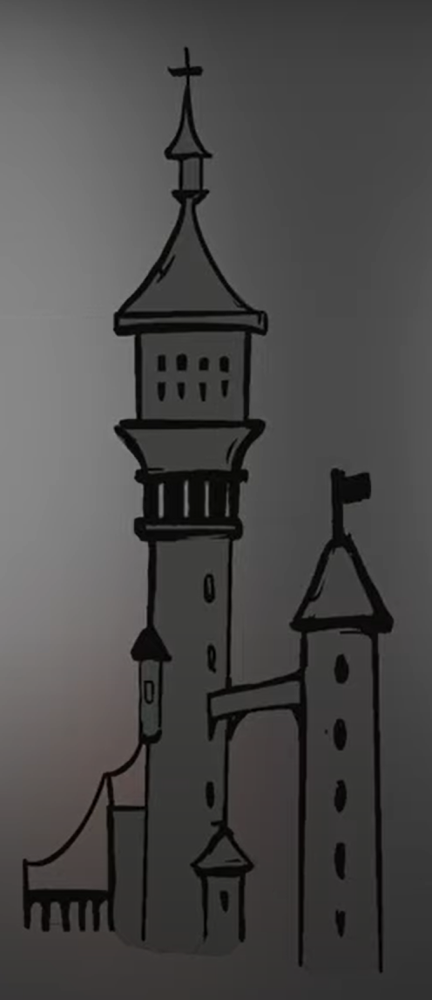
  - 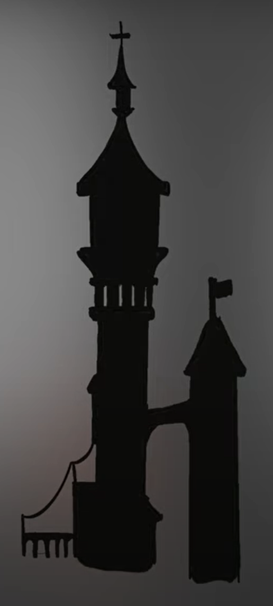
  - 练习曲线：
  - 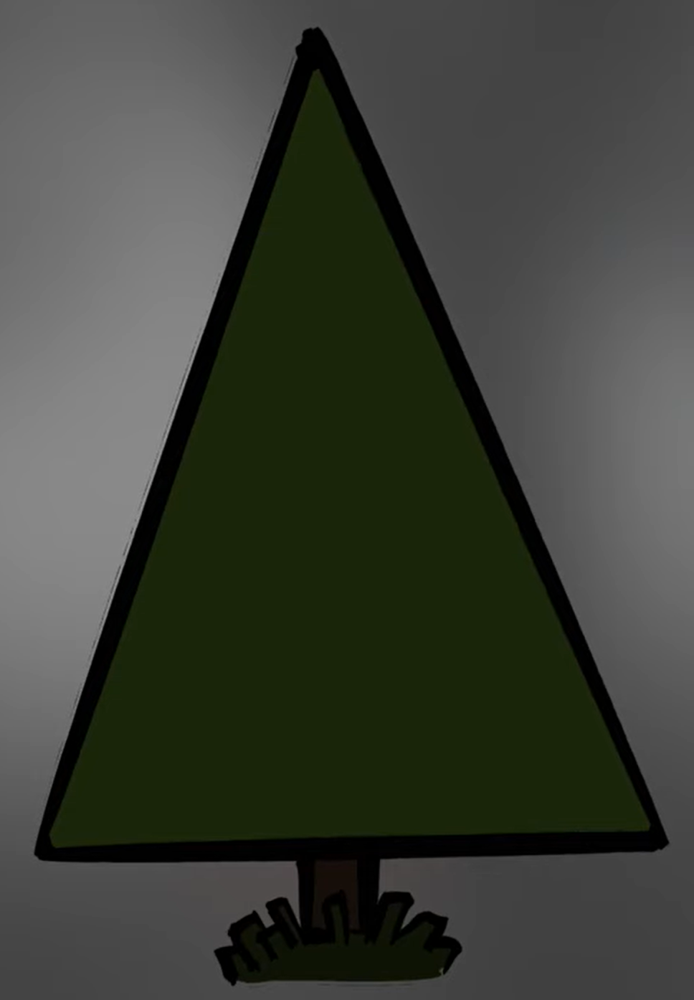
  - 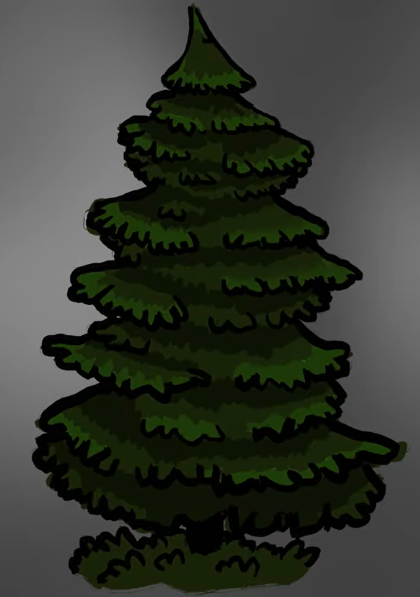
  - 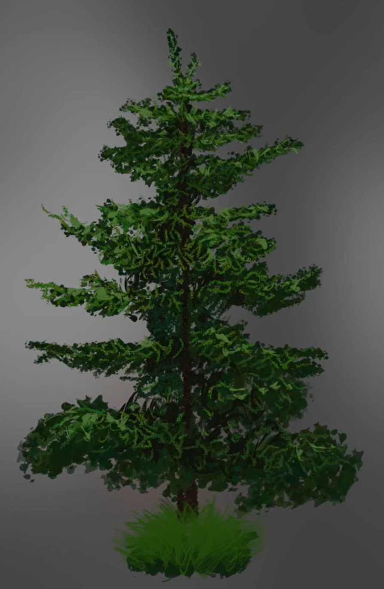
- REF: https://drawabox.com/
### Value Contrast and Color (明暗和颜色)
- Analogous Color(类似色)
  - 
  - "Analogous Color"是指紧邻、相邻的颜色组合，在艺术中被用于创造和谐、统一的色彩方案，并通过选择主色调和次要颜色来强调特定的元素或实现色彩的渐变与过渡效果。
  - 不好的例子：
  - 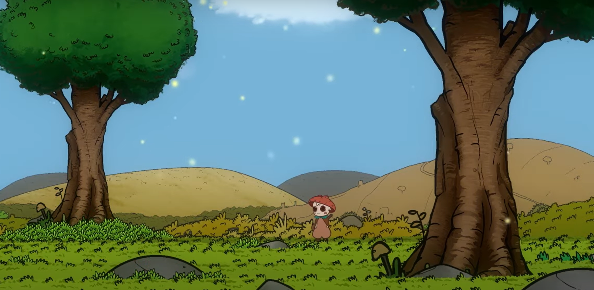
  - 好的例子：
  - 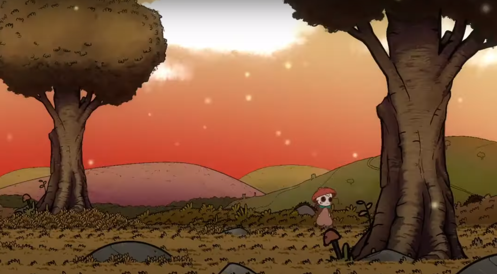
- 用 色相 明暗 饱和度 突出重点（更多原理可以参考：我的“抗色原理”文章）
  - 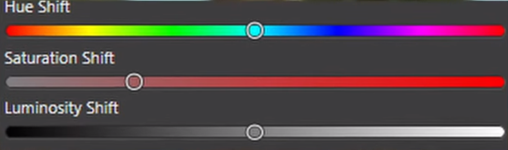
- REF: https://www.marcobucci.com/
### Use Reference (使用参考)
- 关注对比 抓住特征
  - 适用于 形状 和 颜色 和 比例
  - 颜色的参考对比：
  - 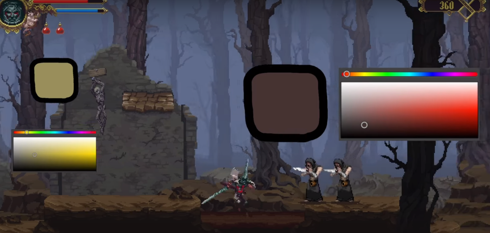
  - 形状的参考对比：
  - 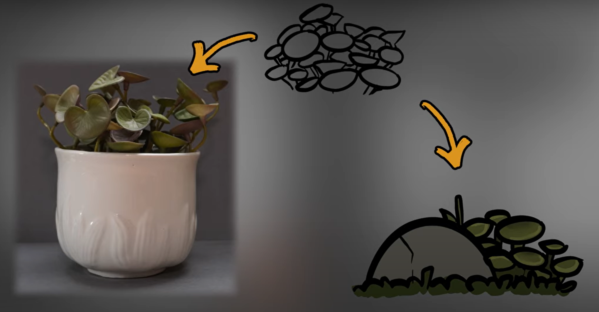
# Meaning & Style
- 添加有趣的信息和意义
- 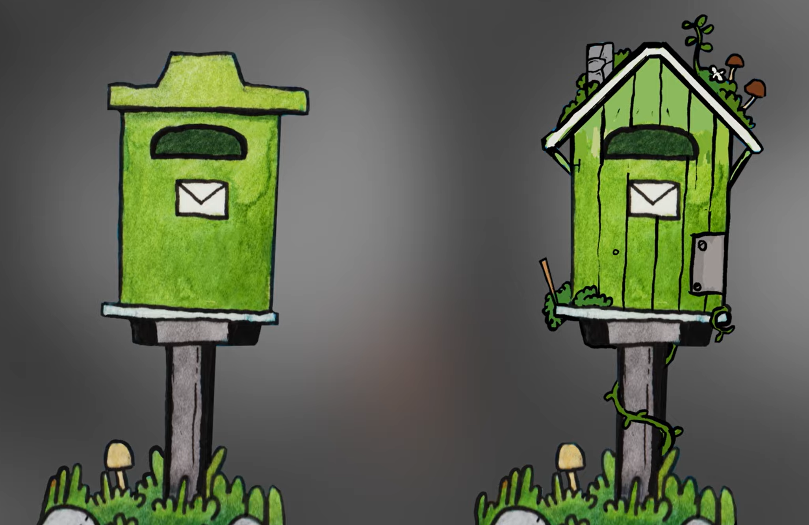
- 灵魂拷问：
- 画的东西是否在讨论它是什么吗？
- 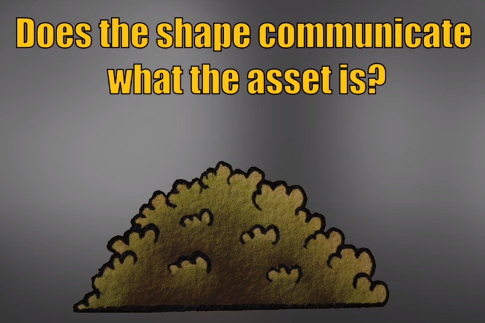
- 是否优雅且合适？
- 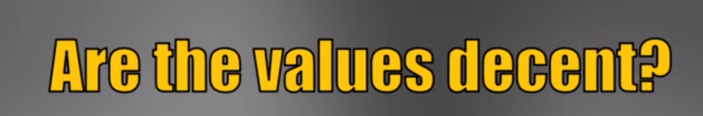
- 是否符合我风格的限制条件？
- 
- 我的作品是否在讨论什么？
- 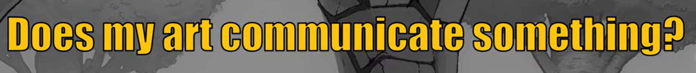

REF: https://youtu.be/r-MXbGX1IxI?si=kSCIBU31KMNAOYJQ
