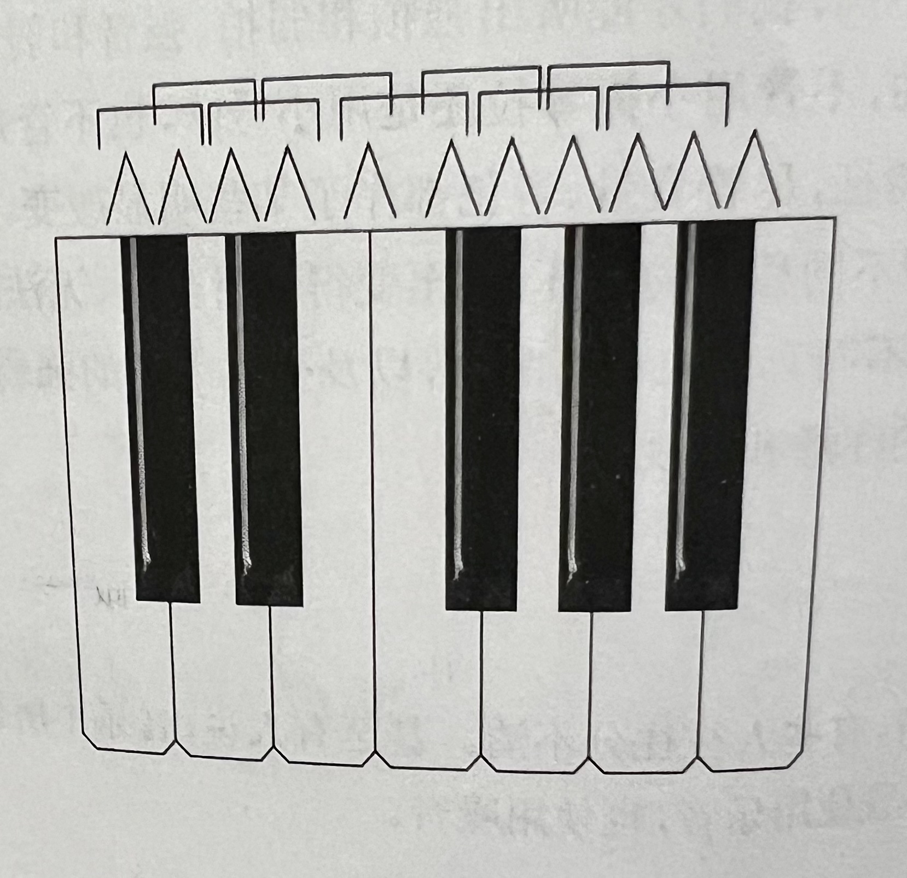
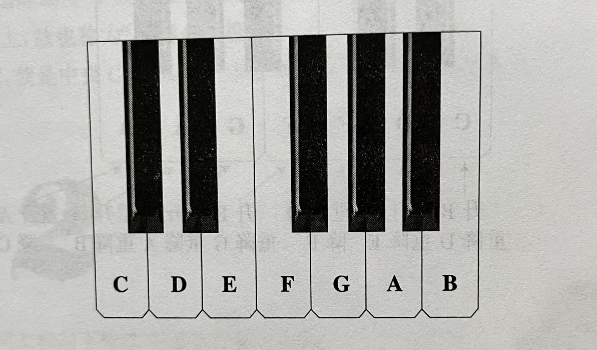
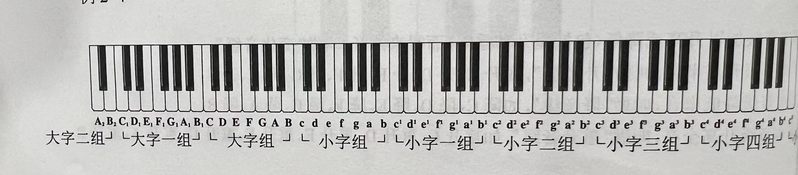
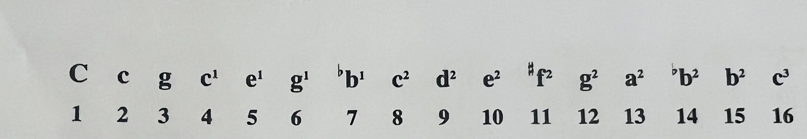
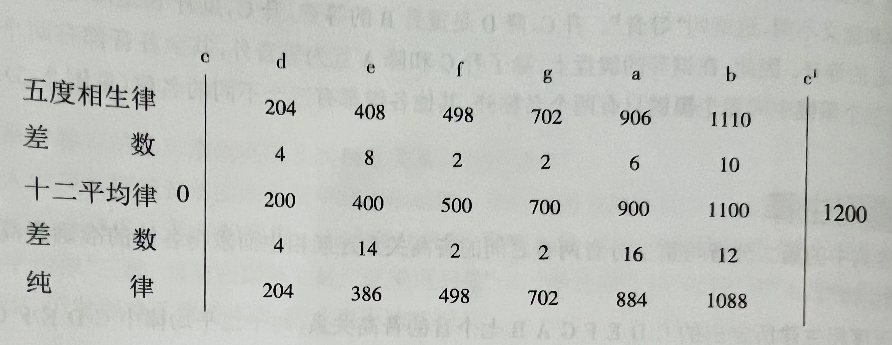

# 基本乐理——李重光：
## 音及音名：
1. 产生：
  - 人耳可以接收 20-2万次/秒的震动
2. 性质：
  - 音高、音值、音色、音量
  - 音高：频率
  - 音值：持续时间
  - 音色：乐器
  - 音量：强弱
3. 乐音与噪音：
  - 乐音：有规律的振动
  - 噪音：无规律的振动
4. 乐音体系：
  - 全音：︹
  - 半音：⌃
  - 
5. 音名：
  - 7个音名：A B C D E F G
  - 
6. 音组：
  - 
7. 标准音 和 中央C：
  - 标准音：a^1 音高: 440Hz
  - 中央C：c^1 
## 音律
1. 概念：
   - 各 音 的绝对准确 音高 和 相互关系。  
2. 复合音 和 分音列：
   - 复合音 由 分音 构成。
   - 例如：一根弦的振动 是复合音，弦的各部分振动 是 分音。
   - 
   - 上图是 由全弦振动形成最响的 复合音 分成 15 个分音。 
3. 十二平均律：
   - 将纯八度（如：c^1 - c^2 或 e^1 - e^2）分成12个等分。
   - 虽然不那么纯正和谐，但使用最广泛的音律。
4. 五度相生律：
   - 五个不同的音程，每个音程都是上一个音程推出。
   - 适合单音音乐，多声部音乐则会缺乏协调感。 
5. 纯律：
   - 适合多声部音乐，但对单音不足。
   - 数学计算得出，参差不齐的弦长比例
6. 各律法的音分值
   - 概念：
     - 將一個八度音程分為12個半音。 
     - 每一個半音的音程等於100音分。
   - 用于计算不同調律系統中可比音程的大小差異。
   - 三大律法的音分值：
   - 
## 记谱法

# 杂
- 杂记：
  - Notes:
    - 白色：
      - 7个音阶
      - low(A-G)
      - A-G
      - high(A-G)
    - 黑色：
      - 5个音阶
      - Db(flat)/C# D#/Eb
      - Gb G#/Ab A#/Bb

      Chord 和弦：
            大调小调穿插排列

            大调
                  3个一组为大调
            小调
                  3个一组为小调
            属

            数字和弦编号系统
                  ？
      转音：
            临近的和弦听起来更自然

      模型：
            和弦 + Notes：
                  和弦稳定 + Notes
      节奏：
            西方节奏体系：
                  4下为一个note
                  2下为半个note
                  1下为四分之一note
                  8拍：包括1&2&3&4&
                  &夹在中间
      
      音阶：
            G大调

- 江豪笔记未整理：
      节奏：
      拍
      速度 bpm    -->beats per minute
      小节 一定数量的拍构成小节
      节拍4/4 前面4表示每小节有四拍 后面4表示以四分音符（1/4的小节）为一拍
      音符时值

      钢琴键盘：
      黑+白 = 88
      相邻琴键距离为半音（包括黑白）
      一组白键CDEFGAB

      音的分组：
      从右边-->左边
      小字五组（c5） 
      小字四组（c4） 
      小字三组（c3） 
      小字二组（c2） 
      小字一组（c1）（中央C）（软件C5） 
      小字组（c） 
      大字组（C） 
      大字一组（C1） 
      大字二组（A2）
      小字组小写 大字组大写

      黑键：
      C#（升C C sharp） = Db（降D D flat）
      D# = Eb
      F# = Gb
      G# = Ab
      A# = Bb

      调：
      C大调：CDEFGABC（1234567）
      D大调：DEF#GABC#D
      C大调音差：全全半全全全半qqbqqqb（大调式）
      升号调和降号调的使用：
      升号调：G D A E B F# C#
      降号调：F Bb Eb Ab Db Gb Cb

      音的稳定：
      一个大调主音最稳定：
      稳定性（大-->小）
      1 5 3（稳定音）6 2 4 7（不稳定音）
      1536247

      音的倾向性：
      不稳定的音往稳定的音运动：
      2-->1
      4-->3
      6-->5
      7-->1
      总结：高往低跑

      音程：两个音之间的高低关系
      半音数量：0          1          2          3         4          5                6               7          8         9         10        11        12
      音程：   纯一度  小二度  大二度  小三度  大三度  纯四度  增四度/减五度  纯五度  小六度  大六度  小七度  大七度  纯八度
      记忆：1845无大小
      半音少的叫小
      半音大的叫大
      B-->F 三全音
      半音从0数
      度数从1数

      音程转位：度数相加等于9 大小增减是互换 纯不变
      协和音程：
      完全协和：纯一度、纯八度
      协和：纯四度、纯五度
      不完全协和音程：大小三度、大小七度
      不协和：大小二度、大小七度、增四减五度

      和弦：
      三度叠置：
      大三和弦 简写C  Cmajor
      小三和弦 简写Cm Cminor
      第一个音叫根音
      小三度在前为小三和弦
      大三度在前为大三和弦
      三度：根音、三音、五音 如一级：C E G
      C大调和弦：
      一级 C CEG
      二级 Dm DFA
      三级 Em EGB
      四级 F FAC
      五级 G GBD
      六级 Am ACE

      4 5 3 6 2 5 1

      减三和弦：Bdim diminished
      如： B° BDF

      和弦转位：
      CEG 原位 C
      EGC 第一转位 C/E（三音放最下面）（降八度E）
      GCE 第二转位 C/G（五音放最下面）（降八度G）
      大七和弦(大大七和弦)（Cmaj7 / CM7 / M7）：
      CEGB（大三和弦后加一个大三度音）
      小七和弦（Amin7 / Am7 / m7）：
      ACEG（小三和弦后加一个小三度音）

      FM7：根音为F的大七和弦

      大三和弦+小七度 属七和弦(Gdom7 / dominant / G7)
      例如：GBDF
      小三和弦+大七度 小大七和弦（Emin[Maj7] / Em[M7]）（右上角）
      例如：EGBD#

      七和弦转位：
      CEGB 原位 CM7
      EGBC 第一转位 CM7/E
      GBCE 第二转位 CM7/G
      BCEG 第三转位 CM7/B

      五度循环圈 Circle of Fifths

      F-C-G-D-A-E-B-Gb-Db-Ab-Eb-Bb-F

      AV4125801

      调式音级名称：
      C 1 主音
      D 2 上方相邻 上主音
      E 3 主属之间 中音
      F 4 下方纯五度 下属音
      G 5 上方纯五度 属音
      A 6 主音和下属音之间 下中音
      B 7 下方小二度 导音
      C 1 主音

      自然小调：

      大调：欢快、明朗（normal）
      小调：悲伤、情感重（normal）

      C大调：C D E F G A B C（qqbqqqb）
      c小调：C D Eb F G Ab Bb C（大调367EAB降号）（qbqqbqq）
      主要区别 3级音E Eb（调式特性音级）
      C大调和a小调构成相同

      关系大小调：
      如果一个大调和一个小调构成音相同、叫做关系大小调。

- 软件：
      VOCALSYNTH