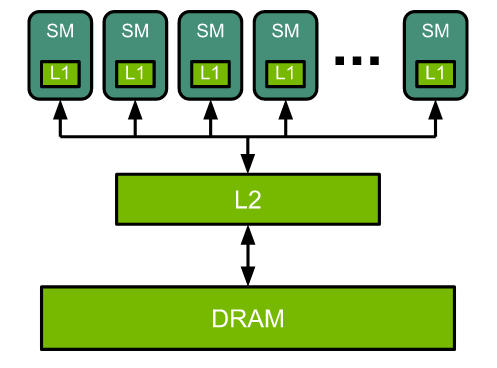
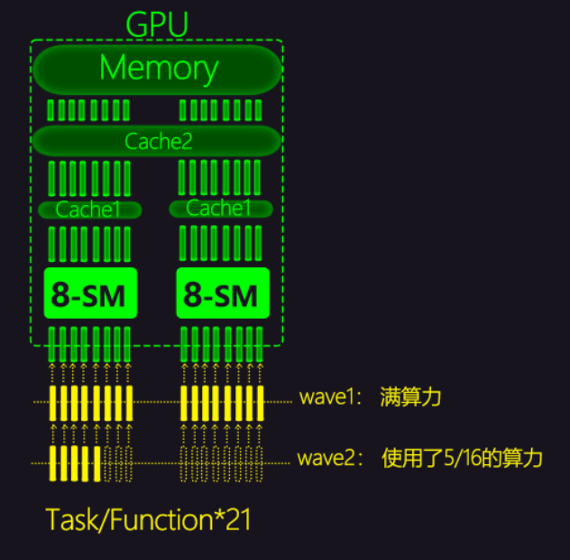

# 计算机概论：
## 计算机本质：
`接受“使用者”輸入“指令/資料”，經由“中央處理器”的“數學/邏輯單元”運算處理後 以“產生/儲存”成有用的資訊`
### 计算机 三大部分 五个单元：
#### 三大部分：
`输入单元，输出单元，主机部分`
#### 五个单元：
- 输入单元
- 输出单元
- 主机部分：
  - 系统单元
    - cpu:
      - 控制单元
      - 算数逻辑单元
    - 记忆主体：（输入，输出，cpu的缓存，基本上所有资料都是要通过记忆主体流转出去）+ 外部存储设备
### 设计的起点：
- 精简指令集（Reduced Instruction Set Computer, RISC）
- 复杂指令集（Complex Instruction Set Computer, CISC）
### 常用计量单位：
#### 容量单位：
`通常使用2进制`  
`bit：0/1`  
`1 Byte = 8 bit    `   
`1 Kilo = 1024 Byte`  
`1 Mega = 1024 Kilo`  
`1 Giga = 1024 Mega`  
`1 Tera = 1024 Giga`  
`1 Peta = 1024 Tera`  
`1 Exa = 1024 Peta `  
`1 Zetta = 1024 Exa`  
                        
#### 速度单位：
`通常使用10进制`
- 运算速度：  
`Hz：每秒事件发生次数`  
`kHz:10^3`  
`MHz:10^6`  
`GHz:10^9`  
`THz:10^12`  
- 传输速度：  
`Mbps:`
`Mega Bit per second 每秒 1 Mega 的传输量`  
## 个人电脑架构：
### X86 电脑的 Intel 架构：
#### 北桥：
`新型设备的北桥被整合到cpu中了`
`负责连接速度较快的设备：`
##### cpu:
- 工作时脉：
  - 主频：  
    - CPU Clock Speed：  
`cup内核工作的时钟频率 主频 = 外频 * 倍频`  
  - 外频：  
`内存与主板之间的时钟频率`  
  - 倍频：  
`厂商：外部设备可以工作在一个较低外频上,使得工作频率增倍通常倍频是被锁死的.`  
  - 超频：  
`使得cpu过热运转，达到cpu超出过热工作`  
  - 睿频：  
`动态的调节cpu运算的频率`  
- intel：  
  - QPI Intel QuickPath Interconnect:   
` 由英特尔开发并使用的点对点处理器互联架构，用来实现CPU之间的互联。`  
   - QPI的5层结构：  
     - 物理层  
`20个通道，每个通道1 bit， 通常只是用10-5个通道`
`其余作为遇到 失效/传输失败 会重新分配传输通道`
     - 链路层  
`负责接收 80 bit 的数据包`  
`流量控制 和 流量控制 `  
     - 路由层  
`包含 8bit 头文件 用于检查是否到达目的地`  
`64bit 资料文件`
     - 发送层  
`校验资料完整性，不完整会要求重新发送`  
     - 协议层  
`用于维持缓存一致性,2017年被UPI取代`  
##### ram：
`通電時才能記錄與使用，斷電後資料就消失，具有挥发性`
- Dynamic Random Access Memory
- DRAM
##### gpu：
- [nvidia](https://docs.nvidia.com/deeplearning/performance/dl-performance-gpu-background/index.html#:~:text=2.-,GPU%20Architecture%20Fundamentals,%2C%20and%20high%2Dbandwidth%20DRAM.)  
 - GPU的基本结构：  
    
   `GPU 是一种高度并行的处理器架构，由 processing elements 和 memory hierarchy 组成。`  
   `最上层由Streaming Multiprocessors (SMs)以及一级缓存构成。算术和其他指令由 SM 执行。`  
   `下一层：是整块的二级缓存和DRAM(动态随机存取存储器)的通信层。`  
   `每个 SM 都有自己的指令调度器和各种指令执行流水线。`  

   `乘加硬件加速：每个乘加包括两个操作，因此将表中的吞吐量乘以 2 以获得每个时钟的 FLOP 计数。 为了获得 GPU 的 FLOPS 速率，然后将这些乘以 SM 的数量和 SM 时钟速率。`
 - 给GPU的指令是如何划分和并行执行的：  
`举例：当 21 个线程块每次占用 2 个 8 条管线的 SM 计算单元被执行时， GPU 的利用率。 在这里，块在 2 波中执行，第 1 波使用了 100% 的 GPU，而第 2 波仅使用了 31%。`
   
 `理解 多线程并行 的重要概念：`    
 `由于一个 SM 可以同时执行多个线程块，因此通常希望线程块的数量比 SM 的管线数量*N倍。 这样做的原因是为了最大限度地减少“尾部”效应，在函数执行结束时，只剩下几个活动线程块，因此在这段时间内没有充分利用 GPU，`

 - 如何用算术强度估计性能限制：  
 - 深度学习相关：  

 `...`
#### 南桥：  
`负责连接速度较慢的设备：`
- 光驱
- usb
- 网卡

`...`
#### 南北连接：
- 直接媒体接口（Direct Media Interface，DMI）：
 - 1.0:  
`传输速度：`  
` 10 Giga*bit/s or 1.16 Giga*Byte/s or 1.16 GHz`   
 - 2.0:  
`传输速度：`  
`2 Giga*Byte/s or 2GB/s`  
 - 3.0:  
`传输速度：`  
`8 Giga*Byte/s or 8GB/s`
                                    
- 视频连接器（flexible_display_interface，FDI）：  
`CPU 与 HD Graphics 的南北桥通信渠道`  
 - 2010:  
`传输速度：`
`2.7Gbit/s`
## 计算机概念名词
### FLOPS, flops or flop/s
`在计算中，每秒浮点运算次数（FLOPS、flops 或 flop/s 或 Floating-point arithmetic）是衡量计算机性能的指标，在需要浮点计算的科学计算领域非常有用。 对于这种情况，它比每秒测量指令更准确。`
### DRAM
`动态随机存取存储器`